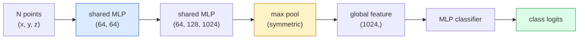

# 3D Vision — Point Clouds & NeRFs

> 3D visionには2つの流儀があります。point cloudはsensorの生の出力です。NeRFは学習されたvolumetric fieldです。どちらも「空間のどこに何があるか」に答えます。

**種別:** 学習 + 構築
**言語:** Python
**前提条件:** Phase 4 Lesson 03 (CNNs), Phase 1 Lesson 12 (Tensor Operations)
**所要時間:** 約45分

## 学習目標

- 明示的な3D表現（point cloud、mesh、voxel）と暗黙的な3D表現（signed distance field、NeRF）を区別し、それぞれがいつ使われるか理解する
- 順序を持たない点集合に対してneural networkをpermutation-invariantにする、PointNetのsymmetric-function trickを理解する
- NeRFのforward passを追う: ray casting、volumetric rendering、positional encoding、MLP density+colour head
- `nerfstudio` または `instant-ngp` を使い、少数の姿勢付き画像から事前学習済み3D reconstructionを行う

## 問題

cameraは2D画像を生成します。LIDARは順序のない3D点集合を生成します。structure-from-motion pipelineは疎な3D keypoint cloudを生成します。NeRFは少数の姿勢付き画像から3D scene全体を再構成します。これらはすべて「vision」ですが、どれもCNNが欲しがるdense tensorには見えません。

3D visionが重要なのは、価値の高いrobot taskのほとんどが3Dで動くからです。grasping、obstacle avoidance、navigation、AR occlusion、3D content captureなどです。2D画像しか理解していないvision engineerは、AR/VR content、robotics、autonomous driving stack、不動産や建設向けのNeRFベース3D reconstructionといった、急成長している領域に入れません。

2つの表現は、異なる理由で支配的です。point cloudはsensorがそのまま無料で返してくれるものです。NeRFとその後継（3D Gaussian splatting、neural SDF）は、neural networkにsceneを学習させたときに得られるものです。

## コンセプト

### Point clouds

point cloudはR^3内のN点からなる順序なし集合で、任意で各点にfeature（colour、intensity、normal）を持ちます。

```
cloud = [
  (x1, y1, z1, r1, g1, b1),
  (x2, y2, z2, r2, g2, b2),
  ...
  (xN, yN, zN, rN, gN, bN),
]
```

gridもconnectivityもありません。この2つの性質がneural networkにとって難題になります。

- **Permutation invariance** — 出力が点の順序に依存してはいけない。
- **Variable N** — 1つのmodelが異なるサイズのcloudを扱えなければならない。

PointNet（Qi et al., 2017）は、1つのideaで両方を解決しました。各点にshared MLPを適用し、その後にsymmetric function（max pool）で集約します。結果は順序に依存しない固定長vectorです。

```
f(P) = max_{p in P} MLP(p)
```

これがPointNetの中核のすべてです。より深い派生（PointNet++、Point Transformer）はhierarchical samplingやlocal aggregationを追加しますが、symmetric-function trickは変わりません。

### PointNetのarchitecture



"Shared MLP" は、同じMLPを各点に独立に実行するという意味です。効率のため、点の次元に対する1x1 convとして実装されます。

### Neural Radiance Fields (NeRFs)

NeRF（Mildenhall et al., 2020）は、「N枚の写真から3D sceneを再構成できるか」という問いに、sceneそのものになるneural networkで答えました。networkは `(x, y, z, viewing_direction)` を `(density, colour)` へ写像します。新しいviewのrenderingは、このnetwork上のray-casting loopです。

```
NeRF MLP:  (x, y, z, theta, phi) -> (sigma, r, g, b)

To render a pixel (u, v) of a new view:
  1. Cast a ray from the camera through pixel (u, v)
  2. Sample points along the ray at distances t_1, t_2, ..., t_N
  3. Query the MLP at each point
  4. Composite the colours weighted by (1 - exp(-sigma * dt))
  5. The sum is the rendered pixel colour
```

lossはrendered pixelとtraining写真のground-truth pixelを比較します。rendering stepを通るbackpropがMLPを更新します。3D ground truthも明示的geometryも不要で、sceneはMLP weightsに保存されます。

### Positional encoding in NeRF

`(x, y, z)` をそのまま受け取るvanilla MLPは、高周波のdetailを表現できません。MLPは低周波へspectral biasを持つためです。NeRFは、MLPの前に各座標をFourier feature vectorへencodingしてこれを修正します。

```
gamma(p) = (sin(2^0 pi p), cos(2^0 pi p), sin(2^1 pi p), cos(2^1 pi p), ...)
```

最大L=10のfrequency levelを使います。これはtransformerがpositionに使うのと同じtrickで、diffusionのtime conditioning（Lesson 10）にも再登場します。これがないとNeRFはぼやけます。

### Volumetric rendering

```
C(r) = sum_i T_i * (1 - exp(-sigma_i * delta_i)) * c_i

T_i  = exp(- sum_{j<i} sigma_j * delta_j)
delta_i = t_{i+1} - t_i
```

`T_i` はtransmittance、つまり光が点iまでどれだけ残るかです。`(1 - exp(-sigma_i * delta_i))` は点iのopacityです。`c_i` はcolourです。最終pixelはray上の重み付き和になります。

### NeRFを置き換えたもの

純粋なNeRFは学習が遅く（数時間）、renderingも遅い（画像1枚に数秒）です。その後の系譜は次の通りです。

- **Instant-NGP** (2022) — MLPのposition inputをhash-grid encodingで置き換え、数秒で学習する。
- **Mip-NeRF 360** — 非有界sceneとanti-aliasingを扱う。
- **3D Gaussian Splatting** (2023) — volumetric fieldを数百万個の3D Gaussianで置き換える。数分で学習し、リアルタイムにrenderingする。現在のproduction default。

2026年の実際のNeRF productのほとんどは、実態として3D Gaussian splattingです。ただしmental modelは今もNeRFです。

### Datasetsとbenchmarks

- **ShapeNet** — 3D CAD modelをpoint cloudとして分類・segmentationする。
- **ScanNet** — segmentation用の実世界indoor scan。
- **KITTI** — autonomous driving向けoutdoor LIDAR point cloud。
- **NeRF Synthetic** / **Blended MVS** — view synthesis用の姿勢付き画像dataset。
- **Mip-NeRF 360** dataset — 非有界な実世界scene。

## 作ってみる

### Step 1: PointNet classifier

```python
import torch
import torch.nn as nn

class PointNet(nn.Module):
    def __init__(self, num_classes=10):
        super().__init__()
        self.mlp1 = nn.Sequential(
            nn.Conv1d(3, 64, 1),    nn.BatchNorm1d(64),   nn.ReLU(inplace=True),
            nn.Conv1d(64, 64, 1),   nn.BatchNorm1d(64),   nn.ReLU(inplace=True),
        )
        self.mlp2 = nn.Sequential(
            nn.Conv1d(64, 128, 1),  nn.BatchNorm1d(128),  nn.ReLU(inplace=True),
            nn.Conv1d(128, 1024, 1), nn.BatchNorm1d(1024), nn.ReLU(inplace=True),
        )
        self.head = nn.Sequential(
            nn.Linear(1024, 512),   nn.BatchNorm1d(512),  nn.ReLU(inplace=True),
            nn.Dropout(0.3),
            nn.Linear(512, 256),    nn.BatchNorm1d(256),  nn.ReLU(inplace=True),
            nn.Dropout(0.3),
            nn.Linear(256, num_classes),
        )

    def forward(self, x):
        # x: (N, 3, num_points) — transposed for Conv1d
        x = self.mlp1(x)
        x = self.mlp2(x)
        x = torch.max(x, dim=-1)[0]       # (N, 1024)
        return self.head(x)

pts = torch.randn(4, 3, 1024)
net = PointNet(num_classes=10)
print(f"output: {net(pts).shape}")
print(f"params: {sum(p.numel() for p in net.parameters()):,}")
```

約1.6M parametersです。cloudあたり1,024点で動きます。

### Step 2: Positional encoding

```python
def positional_encoding(x, L=10):
    """
    x: (..., D) -> (..., D * 2 * L)
    """
    freqs = 2.0 ** torch.arange(L, dtype=x.dtype, device=x.device)
    args = x.unsqueeze(-1) * freqs * 3.141592653589793
    sinc = torch.cat([args.sin(), args.cos()], dim=-1)
    return sinc.reshape(*x.shape[:-1], -1)

x = torch.randn(5, 3)
y = positional_encoding(x, L=10)
print(f"input:  {x.shape}")
print(f"encoded: {y.shape}     # (5, 60)")
```

`2^l * pi` を掛けることで、段階的に高いfrequencyが得られます。

### Step 3: Tiny NeRF MLP

```python
class TinyNeRF(nn.Module):
    def __init__(self, L_pos=10, L_dir=4, hidden=128):
        super().__init__()
        self.L_pos = L_pos
        self.L_dir = L_dir
        pos_dim = 3 * 2 * L_pos
        dir_dim = 3 * 2 * L_dir
        self.trunk = nn.Sequential(
            nn.Linear(pos_dim, hidden), nn.ReLU(inplace=True),
            nn.Linear(hidden, hidden),  nn.ReLU(inplace=True),
            nn.Linear(hidden, hidden),  nn.ReLU(inplace=True),
            nn.Linear(hidden, hidden),  nn.ReLU(inplace=True),
        )
        self.sigma = nn.Linear(hidden, 1)
        self.color = nn.Sequential(
            nn.Linear(hidden + dir_dim, hidden // 2), nn.ReLU(inplace=True),
            nn.Linear(hidden // 2, 3), nn.Sigmoid(),
        )

    def forward(self, x, d):
        x_enc = positional_encoding(x, self.L_pos)
        d_enc = positional_encoding(d, self.L_dir)
        h = self.trunk(x_enc)
        sigma = torch.relu(self.sigma(h)).squeeze(-1)
        rgb = self.color(torch.cat([h, d_enc], dim=-1))
        return sigma, rgb

nerf = TinyNeRF()
x = torch.randn(128, 3)
d = torch.randn(128, 3)
s, c = nerf(x, d)
print(f"sigma: {s.shape}   rgb: {c.shape}")
```

元のNeRF（depth 8のMLP trunkを2つ持つ）に比べると非常に小さいですが、architectureを示すには十分です。

### Step 4: Volumetric rendering along a ray

```python
def volumetric_render(sigma, rgb, t_vals):
    """
    sigma: (..., N_samples)
    rgb:   (..., N_samples, 3)
    t_vals: (N_samples,) distances along the ray
    """
    delta = torch.cat([t_vals[1:] - t_vals[:-1], torch.full_like(t_vals[:1], 1e10)])
    alpha = 1.0 - torch.exp(-sigma * delta)
    trans = torch.cumprod(torch.cat([torch.ones_like(alpha[..., :1]), 1.0 - alpha + 1e-10], dim=-1), dim=-1)[..., :-1]
    weights = alpha * trans
    rendered = (weights.unsqueeze(-1) * rgb).sum(dim=-2)
    depth = (weights * t_vals).sum(dim=-1)
    return rendered, depth, weights


N = 64
t_vals = torch.linspace(2.0, 6.0, N)
sigma = torch.rand(N) * 0.5
rgb = torch.rand(N, 3)
rendered, depth, weights = volumetric_render(sigma, rgb, t_vals)
print(f"rendered colour: {rendered.tolist()}")
print(f"depth:           {depth.item():.2f}")
```

1本のray、64 samplesを、1つのRGB pixelとdepthへ合成します。

## 使ってみる

実務では次を使います。

- `nerfstudio` (Tancik et al.) — NeRF / Instant-NGP / Gaussian Splattingの現在のreference library。command-lineとweb viewerを備える。
- `pytorch3d` (Meta) — differentiable rendering、point-cloud utility、mesh operation。
- `open3d` — point cloud processing、registration、visualisation。

deploymentでは、3D Gaussian splattingが純粋なNeRFを大きく置き換えました。renderingが100倍高速だからです。reconstruction品質は同等です。

## 出荷する

このlessonが生成するもの:

- `outputs/prompt-3d-task-router.md` — taskとinput dataに基づいて適切な3D表現（point cloud、mesh、voxel、NeRF、Gaussian splat）へ振り分けるprompt。
- `outputs/skill-point-cloud-loader.md` — 正しいnormalisation、centring、point samplingを備えた.ply / .pcd / .xyzファイル用PyTorch `Dataset` を書くskill。

## 演習

1. **(Easy)** PointNetがpermutation-invariantであることを示してください。同じcloudを2回通し、片方は点をshuffleします。出力がfloating-point noiseの範囲で一致することを確認してください。
2. **(Medium)** camera intrinsicsとposeから、H x W画像の全pixelについてray originとdirectionを生成する最小限のray-generation functionを実装してください。
3. **(Hard)** 色付きcubeのrendered viewからなるsynthetic dataset（differentiable renderingまたは単純なray tracerで生成）でTinyNeRFを学習してください。epoch 1、10、100のrendering lossを報告してください。どのepochでmodelが認識可能なviewを生成しますか？

## 重要用語

| 用語 | よく言われること | 実際の意味 |
|------|----------------|----------------------|
| Point cloud | "LIDARからの3D点" | (x, y, z) と任意の点ごとのfeatureからなる順序なし集合 |
| PointNet | "point cloud上の最初のneural net" | 各点へのshared MLP + symmetric（max）pool。構造上permutation-invariant |
| NeRF | "sceneそのもののMLP" | (x, y, z, dir)を(density, colour)へ写像し、ray castingでrenderingするnetwork |
| Positional encoding | "Fourier features" | MLPの低周波biasを克服するため、各座標を複数frequencyのsin/cosへencodingする |
| Volumetric rendering | "Ray integration" | transmittanceとalphaを使い、ray上のsampleを1つのpixelへ合成する |
| Instant-NGP | "Hash-grid NeRF" | NeRFのcoordinate MLPをmulti-resolution hash gridで置き換える。100-1000倍高速 |
| 3D Gaussian splatting | "数百万個のGaussian" | scene = 3D Gaussianの集合。リアルタイムrenderingし、数分で学習する |
| SDF | "Signed distance field" | 最も近いsurfaceまでのsigned distanceを返す関数。別のimplicit representation |

## 参考文献

- [PointNet (Qi et al., 2017)](https://arxiv.org/abs/1612.00593) — permutation-invariant classifier
- [NeRF (Mildenhall et al., 2020)](https://arxiv.org/abs/2003.08934) — 写真からの3D reconstructionをneural-net問題にした論文
- [Instant-NGP (Müller et al., 2022)](https://arxiv.org/abs/2201.05989) — hash grid、1000倍speedup
- [3D Gaussian Splatting (Kerbl et al., 2023)](https://arxiv.org/abs/2308.04079) — productionでNeRFを置き換えたarchitecture
