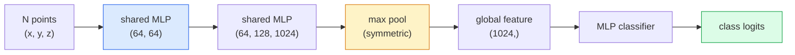

# 3D Görme — Nokta Bulutları ve NeRF'ler

> 3D görmenin iki çeşidi vardır. Nokta bulutları sensörün ham çıktısıdır. NeRF'ler öğrenilmiş hacimsel alandır. Her ikisi de "uzayda nerede?" sorusunu yanıtlıyor.

**Tür:** Öğren + Oluştur
**Diller:** Python
**Önkoşullar:** Aşama 4 Ders 03 (CNN'ler), Aşama 1 Ders 12 (Tensör İşlemleri)
**Süre:** ~45 dakika

## Öğrenme Hedefleri

- Açık (nokta bulutu, ağ, voksel) ve örtülü (işaretli mesafe alanı, NeRF) 3 boyutlu gösterimleri ve her birinin ne zaman kullanıldığını ayırt edin
- PointNet'in, neural network'yi sırasız bir nokta kümesi üzerinde permütasyonla değişmez hale getiren simetrik fonksiyon numarasını anlayın
- Bir NeRF ileri geçişini izleyin: ışın dökümü, hacimsel oluşturma, konumsal kodlama, MLP yoğunluğu+renk kafası
- Küçük bir pozlanmış görüntü kümesinden önceden eğitilmiş 3D yeniden yapılandırma için `nerfstudio` veya `instant-ngp` kullanın

## Sorun

Bir kamera 2 boyutlu bir görüntü üretir. LIDAR, herhangi bir sıralama olmaksızın bir dizi 3 boyutlu nokta üretir. Hareketten yapı boru hattı, 3 boyutlu anahtar noktalardan oluşan seyrek bir bulut üretir. Bir NeRF, bir avuç pozlanmış görüntüden bütün bir 3D sahneyi yeniden oluşturur. Bunların hepsi "görüntü" ama hiçbiri CNN'in istediği yoğun tensöre benzemiyor.

3D görme önemlidir çünkü neredeyse her yüksek değerli robot görevi 3D'de yürütülür: kavrama, engellerden kaçınma, navigasyon, AR engelleme, 3D içerik yakalama. Yalnızca 2D görüntüleri anlayan bir görüntü mühendisi, alanın en hızlı büyüyen bölümünün (AR/VR içeriği, robot teknolojisi, otonom sürüş yığınları, gayrimenkul veya inşaat için NeRF tabanlı 3D yeniden yapılandırma) dışında kalır.

İki temsil farklı nedenlerden dolayı hakimdir. Nokta bulutları, sensörlerin size ücretsiz olarak sağladığı şeydir. NeRF'ler ve onların ardılları (3D Gauss sıçraması, sinirsel SDF'ler), bir neural network'den bir sahneyi öğrenmesini istediğinizde elde ettiğiniz şeylerdir.

## Konsept

### Nokta bulutları

Bir nokta bulutu, isteğe bağlı olarak her biri özelliklere (renk, yoğunluk, normal) sahip, R^3'teki sırasız bir N nokta kümesidir.

```
cloud = [
  (x1, y1, z1, r1, g1, b1),
  (x2, y2, z2, r2, g2, b2),
  ...
  (xN, yN, zN, rN, gN, bN),
]
```

Şebeke yok, bağlantı yok. İki özellik bunu neural network'ler için zorlaştırıyor:

- **Permütasyon değişmezliği** — çıktı, nokta sırasına bağlı olmamalıdır.
- **Değişken N** — tek bir modelin farklı boyutlardaki bulutları işlemesi gerekir.

PointNet (Qi ve diğerleri, 2017) her ikisini de tek bir fikirle çözdü: her noktaya paylaşılan bir MLP uygulayın, ardından simetrik bir fonksiyonla (maksimum havuz) toplayın. Sonuç, sıraya bağlı olmayan sabit boyutlu bir vektördür.

```
f(P) = max_{p in P} MLP(p)
```

PointNet'in tüm özü budur. Daha derin değişkenler (PointNet++, Point Transformer) hiyerarşik örnekleme ve yerel toplama ekler ancak simetrik işlev hilesi değişmez.

### PointNet mimarisi



"Paylaşılan MLP" aynı MLP'nin her noktada bağımsız olarak çalıştığı anlamına gelir. Verimlilik için nokta boyutu üzerinde 1x1 dönüşüm olarak uygulandı.

### Nöral Parlaklık Alanları (NeRF'ler)

NeRF'ler (Mildenhall ve diğerleri, 2020) "N fotoğraftan 3 boyutlu bir sahneyi yeniden oluşturabilir miyiz?" sorusunu yöneltti. ve sahne olan neural network ile cevap verdi. Ağ, `(x, y, z, viewing_direction)`'yi `(density, colour)` ile eşler. Yeni bir görünümün oluşturulması, bu ağ üzerinden bir ışın yayınlama döngüsüdür.

```
NeRF MLP:  (x, y, z, theta, phi) -> (sigma, r, g, b)

To render a pixel (u, v) of a new view:
  1. Cast a ray from the camera through pixel (u, v)
  2. Sample points along the ray at distances t_1, t_2, ..., t_N
  3. Query the MLP at each point
  4. Composite the colours weighted by (1 - exp(-sigma * dt))
  5. The sum is the rendered pixel colour
```

Kayıp, oluşturulan pikseli eğitim fotoğraflarındaki gerçek pikselle karşılaştırır. Oluşturma adımı aracılığıyla backprop, MLP'yi günceller. 3 boyutlu temel gerçek yok, açık bir geometri yok; sahne MLP ağırlıklarında depolanıyor.

### NeRF'de konumsal kodlama

`(x, y, z)` üzerindeki vanilya MLP'si yüksek frekanslı ayrıntıları temsil edemez çünkü MLP'ler spektral olarak düşük frekanslara eğilimlidir. NeRF, her koordinatı MLP'den önce bir Fourier özellik vektörüne kodlayarak bu sorunu düzeltir:

```
gamma(p) = (sin(2^0 pi p), cos(2^0 pi p), sin(2^1 pi p), cos(2^1 pi p), ...)
```

L=10'a kadar frekans seviyesi. Bu, transformer'lerin konumlar için kullandıkları hilenin aynısıdır ve yayılma zamanı koşullandırmasında tekrar ortaya çıkar (Ders 10). Bu olmadan NeRF'ler bulanık görünür.

### Hacimsel oluşturma

```
C(r) = sum_i T_i * (1 - exp(-sigma_i * delta_i)) * c_i

T_i  = exp(- sum_{j<i} sigma_j * delta_j)
delta_i = t_{i+1} - t_i
```

`T_i` geçirgenliktir - i noktasına kadar ne kadar ışığın hayatta kaldığı. `(1 - exp(-sigma_i * delta_i))` i noktasındaki opaklıktır. `c_i` renktir. Son piksel ışın boyunca ağırlıklı bir toplamdır.

### NeRF'lerin yerini ne aldı?

Saf NeRF'lerin eğitilmesi yavaştır (saat) ve oluşturulması yavaştır (görüntü başına saniye). O zamandan beri soy:

- **Instant-NGP** (2022) — karma ızgara kodlaması, MLP'nin konum girişinin yerini alır; saniyeler içinde trenler.
- **Mip-NeRF 360** — sınırsız sahneleri ve kenar yumuşatmayı yönetir.
- **3D Gaussian Splatting** (2023) — hacimsel alanı milyonlarca 3D Gaussian ile değiştirir; dakikalar içinde trenlenir, gerçek zamanlı olarak oluşturulur. Mevcut üretim varsayılanı.

2026'daki neredeyse her gerçek NeRF ürünü aslında 3D Gauss sıçramasıdır. Zihinsel model hala NeRF'dir.

### Dataset'ler ve benchmark'ler

- **ShapeNet** — 3D CAD modellerinin nokta bulutları olarak sınıflandırılması ve segmentlere ayrılması.
- **ScanNet** — segmentasyon için gerçek iç mekan taramaları.
- **KITTI** — otonom sürüş için dış mekan LIDAR nokta bulutları.
- **NeRF Synthetic** / **Harmanlanmış MVS** — görüntü sentezi için pozlanmış görüntü dataset'ler.
- **Mip-NeRF 360** dataset — sınırsız gerçek sahneler.

## İnşa Et

### Adım 1: PointNet sınıflandırıcısı

```python
import torch
import torch.nn as nn

class PointNet(nn.Module):
    def __init__(self, num_classes=10):
        super().__init__()
        self.mlp1 = nn.Sequential(
            nn.Conv1d(3, 64, 1),    nn.BatchNorm1d(64),   nn.ReLU(inplace=True),
            nn.Conv1d(64, 64, 1),   nn.BatchNorm1d(64),   nn.ReLU(inplace=True),
        )
        self.mlp2 = nn.Sequential(
            nn.Conv1d(64, 128, 1),  nn.BatchNorm1d(128),  nn.ReLU(inplace=True),
            nn.Conv1d(128, 1024, 1), nn.BatchNorm1d(1024), nn.ReLU(inplace=True),
        )
        self.head = nn.Sequential(
            nn.Linear(1024, 512),   nn.BatchNorm1d(512),  nn.ReLU(inplace=True),
            nn.Dropout(0.3),
            nn.Linear(512, 256),    nn.BatchNorm1d(256),  nn.ReLU(inplace=True),
            nn.Dropout(0.3),
            nn.Linear(256, num_classes),
        )

    def forward(self, x):
        # x: (N, 3, num_points) — transposed for Conv1d
        x = self.mlp1(x)
        x = self.mlp2(x)
        x = torch.max(x, dim=-1)[0]       # (N, 1024)
        return self.head(x)

pts = torch.randn(4, 3, 1024)
net = PointNet(num_classes=10)
print(f"output: {net(pts).shape}")
print(f"params: {sum(p.numel() for p in net.parameters()):,}")
```

Yaklaşık 1,6M parametre. Bulut başına 1.024 noktada çalışır.

### Adım 2: Konumsal kodlama

```python
def positional_encoding(x, L=10):
    """
    x: (..., D) -> (..., D * 2 * L)
    """
    freqs = 2.0 ** torch.arange(L, dtype=x.dtype, device=x.device)
    args = x.unsqueeze(-1) * freqs * 3.141592653589793
    sinc = torch.cat([args.sin(), args.cos()], dim=-1)
    return sinc.reshape(*x.shape[:-1], -1)

x = torch.randn(5, 3)
y = positional_encoding(x, L=10)
print(f"input:  {x.shape}")
print(f"encoded: {y.shape}     # (5, 60)")
```

`2^l * pi` ile çarpılması giderek daha yüksek frekanslar verir.

### Adım 3: Minik NeRF MLP

```python
class TinyNeRF(nn.Module):
    def __init__(self, L_pos=10, L_dir=4, hidden=128):
        super().__init__()
        self.L_pos = L_pos
        self.L_dir = L_dir
        pos_dim = 3 * 2 * L_pos
        dir_dim = 3 * 2 * L_dir
        self.trunk = nn.Sequential(
            nn.Linear(pos_dim, hidden), nn.ReLU(inplace=True),
            nn.Linear(hidden, hidden),  nn.ReLU(inplace=True),
            nn.Linear(hidden, hidden),  nn.ReLU(inplace=True),
            nn.Linear(hidden, hidden),  nn.ReLU(inplace=True),
        )
        self.sigma = nn.Linear(hidden, 1)
        self.color = nn.Sequential(
            nn.Linear(hidden + dir_dim, hidden // 2), nn.ReLU(inplace=True),
            nn.Linear(hidden // 2, 3), nn.Sigmoid(),
        )

    def forward(self, x, d):
        x_enc = positional_encoding(x, self.L_pos)
        d_enc = positional_encoding(d, self.L_dir)
        h = self.trunk(x_enc)
        sigma = torch.relu(self.sigma(h)).squeeze(-1)
        rgb = self.color(torch.cat([h, d_enc], dim=-1))
        return sigma, rgb

nerf = TinyNeRF()
x = torch.randn(128, 3)
d = torch.randn(128, 3)
s, c = nerf(x, d)
print(f"sigma: {s.shape}   rgb: {c.shape}")
```

Orijinal NeRF'ye (8 derinlikte 2 MLP gövdesine sahip) kıyasla çok küçük. Mimariyi göstermek için yeterli.

### Adım 4: Bir ışın boyunca hacimsel oluşturma

```python
def volumetric_render(sigma, rgb, t_vals):
    """
    sigma: (..., N_samples)
    rgb:   (..., N_samples, 3)
    t_vals: (N_samples,) distances along the ray
    """
    delta = torch.cat([t_vals[1:] - t_vals[:-1], torch.full_like(t_vals[:1], 1e10)])
    alpha = 1.0 - torch.exp(-sigma * delta)
    trans = torch.cumprod(torch.cat([torch.ones_like(alpha[..., :1]), 1.0 - alpha + 1e-10], dim=-1), dim=-1)[..., :-1]
    weights = alpha * trans
    rendered = (weights.unsqueeze(-1) * rgb).sum(dim=-2)
    depth = (weights * t_vals).sum(dim=-1)
    return rendered, depth, weights


N = 64
t_vals = torch.linspace(2.0, 6.0, N)
sigma = torch.rand(N) * 0.5
rgb = torch.rand(N, 3)
rendered, depth, weights = volumetric_render(sigma, rgb, t_vals)
print(f"rendered colour: {rendered.tolist()}")
print(f"depth:           {depth.item():.2f}")
```

Bir ışın, 64 örnek, tek bir RGB pikseli ve bir derinlikle birleştirilir.

## Kullan onu

Gerçek iş için:

- `nerfstudio` (Tancik ve diğerleri) — NeRF / Instant-NGP / Gaussian Splatting için mevcut referans kitaplığı. Komut satırı artı bir web görüntüleyici.
- `pytorch3d` (Meta) — farklılaştırılabilir oluşturma, nokta bulutu yardımcı programları, ağ işlemleri.
- `open3d` — nokta bulutu işleme, kayıt, görselleştirme.

deployment için 3D Gauss sıçraması, 100 kat daha hızlı görüntü sağladığı için büyük ölçüde saf NeRF'lerin yerini aldı. Yeniden yapılanma kalitesi karşılaştırılabilir.

## Gönderin

Bu ders şunları üretir:

- `outputs/prompt-3d-task-router.md` — görev ve giriş verilerine dayalı olarak doğru 3D temsile (nokta bulutu, ağ, voksel, NeRF, Gauss uyarısı) yönlendiren bir prompt.
- `outputs/skill-point-cloud-loader.md` — doğru normalleştirme, ortalama ve nokta örneklemeyle .ply / .pcd / .xyz dosyaları için PyTorch `Dataset` yazan bir beceri.

## Egzersizler

1. **(Kolay)** PointNet'in permütasyonla değişmez olduğunu gösterin: aynı bulutu iki kez, bir kez noktaları karıştırılmış olarak çalıştırın. Çıkışların kayan nokta gürültüsüne kadar aynı olduğunu doğrulayın.
2. **(Orta)** Kameranın özellikleri ve pozu göz önüne alındığında, Y x G bir görüntünün her pikseli için ışın kökenleri ve yönleri üreten minimal bir ışın oluşturma işlevi uygulayın.
3. **(Zor)** Renkli bir küpün (diferansiyellenebilir oluşturma veya basit bir ışın izleyici aracılığıyla oluşturulan) işlenmiş görünümlerinin sentetik dataset üzerinde bir TinyNeRF'yi eğitin. 1, 10 ve 100. çağdaki oluşturma kaybını rapor edin. Model hangi çağda tanınabilir görünümler üretiyor?

## Anahtar Terimler

| Dönem | İnsanlar ne diyor | Aslında ne anlama geliyor |
|------|----------------|----------------------|
| Nokta bulutu | "LIDAR'dan 3 boyutlu noktalar" | Sırasız (x, y, z) kümesi + nokta başına isteğe bağlı özellikler |
| PointNet | "Nokta bulutlarındaki ilk sinir ağı" | Nokta başına paylaşılan MLP + simetrik (maks.) havuz; yapıya göre permütasyonla değişmez |
| NeRF | "MLP işte sahne" | Ağ eşlemesi (x, y, z, yön) ile (yoğunluk, renk); ışın dökümüyle render |
| Konumsal kodlama | "Fourier özellikleri" | MLP düşük frekans önyargısının üstesinden gelmek için her koordinatı birden fazla frekansta sin/cos olarak kodlayın |
| Hacimsel oluşturma | "Işın entegrasyonu" | Geçirgenlik ve alfa kullanarak bir ışın boyunca tek bir piksele kompozit örnekler |
| Anında-NGP | "Karma ızgara NeRF" | NeRF'nin koordinat MLP'sini çok çözünürlüklü bir karma ızgarayla değiştirir; 100-1000 kat daha hızlı |
| 3D Gauss sıçraması | "Milyonlarca Gausslu" | Sahne = 3 boyutlu Gaussianların koleksiyonu; gerçek zamanlı olarak işlenir, dakikalar içinde trenler |
| SDF | "İmzalı mesafe alanı" | En yakın yüzeye işaretli mesafeyi döndüren işlev; başka bir örtülü temsil |

## Daha Fazla Okuma

- [PointNet (Qi ve diğerleri, 2017)](https://arxiv.org/abs/1612.00593) — permütasyonla değişmez sınıflandırıcı
- [NeRF (Mildenhall ve diğerleri, 2020)](https://arxiv.org/abs/2003.08934) — fotoğraflardan 3 boyutlu yeniden yapılandırmayı sinir ağı sorunu haline getiren makale
- [Instant-NGP (Müller ve diğerleri, 2022)](https://arxiv.org/abs/2201.05989) — karma ızgaralar, 1000x hızlandırma
- [3D Gaussian Splatting (Kerbl ve diğerleri, 2023)](https://arxiv.org/abs/2308.04079) — üretimde NeRF'lerin yerini alan mimari
