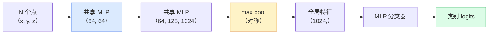

# 3D 视觉 —— 点云与 NeRF（3D Vision — Point Clouds & NeRFs）

> 译注：本文译自同目录 [`en.md`](./en.md)。术语遵循仓根 [TRANSLATION_GUIDE.md](../../../../TRANSLATION_GUIDE.md)。

> 3D 视觉有两种风味。点云是传感器吐出的原始数据，NeRF 是学出来的体积场（volumetric field）。两者回答的是同一个问题：「什么东西在空间的哪里」。

**Type:** Learn + Build
**Languages:** Python
**Prerequisites:** Phase 4 Lesson 03 (CNNs), Phase 1 Lesson 12 (Tensor Operations)
**Time:** ~45 minutes

## 学习目标（Learning Objectives）

- 区分显式（点云、网格 mesh、体素 voxel）与隐式（带符号距离场 SDF、NeRF）的 3D 表示，并知道各自的适用场景
- 理解 PointNet 用对称函数（symmetric function）的小技巧，让神经网络在无序点集上保持置换不变（permutation-invariant）
- 走通一次 NeRF 前向传播：射线投射、体积渲染（volumetric rendering）、位置编码、MLP 密度+颜色头
- 用 `nerfstudio` 或 `instant-ngp`，从一小批带姿态的图片做出预训练的 3D 重建

## 问题（The Problem）

相机给你一张 2D 图像。LIDAR 给你一堆毫无顺序的 3D 点。SfM（structure-from-motion）流水线给你一团稀疏的 3D 关键点。NeRF 则能从寥寥几张带姿态的照片里重建一整个 3D 场景。这些都叫「视觉」，但没有一个长得像 CNN 想要的那种稠密张量。

3D 视觉之所以重要，是因为几乎所有高价值的机器人任务都跑在 3D 里：抓取、避障、导航、AR 遮挡、3D 内容捕捉。一个只懂 2D 图像的视觉工程师，等于把自己挡在这个领域增长最快的那一片之外（AR/VR 内容、机器人、自动驾驶栈、面向房产或建筑工地的 NeRF 三维重建）。

这两种表示各有不同的统治理由。点云是传感器免费送你的；NeRF 及其后续（3D Gaussian splatting、neural SDF）则是你让神经网络去学一个场景时得到的产物。

## 概念（The Concept）

### 点云（Point clouds）

点云是 R^3 中由 N 个点组成的无序集合，每个点可以可选地带有特征（颜色、强度、法向量）。

```
cloud = [
  (x1, y1, z1, r1, g1, b1),
  (x2, y2, z2, r2, g2, b2),
  ...
  (xN, yN, zN, rN, gN, bN),
]
```

没有网格、没有连接关系。这有两点让神经网络很难处理：

- **置换不变性（Permutation invariance）** —— 输出不能依赖点的顺序。
- **可变 N** —— 同一个模型必须能吃下不同大小的点云。

PointNet（Qi et al., 2017）用一个想法同时解决了两件事：对每个点跑一个共享的 MLP，然后用对称函数（max pool）做聚合。结果是一个固定大小、与点序无关的向量。

```
f(P) = max_{p in P} MLP(p)
```

这就是 PointNet 全部的核心。更深的变体（PointNet++、Point Transformer）加了层次采样和局部聚合，但对称函数这个小技巧没变。

### PointNet 架构（The PointNet architecture）



「Shared MLP」的意思是同一个 MLP 独立地跑在每个点上。实现时用一维卷积（1x1 Conv）在点维度上扫一遍，效率最高。

### 神经辐射场（Neural Radiance Fields, NeRFs）

NeRF（Mildenhall et al., 2020）把「我们能不能从 N 张照片重建一个 3D 场景？」这个问题，回答成了一句话：神经网络本身就是这个场景。网络把 `(x, y, z, viewing_direction)` 映射到 `(density, colour)`。渲染一个新视角，就是在这个网络上跑一轮射线投射循环。

```
NeRF MLP:  (x, y, z, theta, phi) -> (sigma, r, g, b)

To render a pixel (u, v) of a new view:
  1. Cast a ray from the camera through pixel (u, v)
  2. Sample points along the ray at distances t_1, t_2, ..., t_N
  3. Query the MLP at each point
  4. Composite the colours weighted by (1 - exp(-sigma * dt))
  5. The sum is the rendered pixel colour
```

损失函数比较渲染出来的像素和训练照片里对应的真值像素。反向传播穿过渲染步骤来更新 MLP。没有 3D 真值标注，也没有显式几何 —— 整个场景就存在 MLP 的权重里。

### NeRF 的位置编码（Positional encoding in NeRF）

直接用 `(x, y, z)` 喂给一个普通 MLP，是表达不出高频细节的，因为 MLP 在频谱上偏向低频。NeRF 的解法是先把每个坐标编码成傅里叶特征向量再送进 MLP：

```
gamma(p) = (sin(2^0 pi p), cos(2^0 pi p), sin(2^1 pi p), cos(2^1 pi p), ...)
```

最多到 L=10 个频率档。这个套路和 transformer 给位置编码用的是同一个，到了 diffusion 的时间步条件里（第 10 课）你又会见到一次。少了它，NeRF 看上去就是糊的。

### 体积渲染（Volumetric rendering）

```
C(r) = sum_i T_i * (1 - exp(-sigma_i * delta_i)) * c_i

T_i  = exp(- sum_{j<i} sigma_j * delta_j)
delta_i = t_{i+1} - t_i
```

`T_i` 是透射率（transmittance）—— 光线能存活到第 i 个点的比例。`(1 - exp(-sigma_i * delta_i))` 是第 i 个点的不透明度。`c_i` 是颜色。最终像素就是沿射线的加权和。

### NeRF 的接班人（What replaced NeRFs）

纯 NeRF 训练慢（数小时）、渲染也慢（一张图要几秒）。后续的演进路线：

- **Instant-NGP**（2022）—— 哈希网格编码（hash-grid encoding）替代了 MLP 的位置输入；几秒就能训练完。
- **Mip-NeRF 360** —— 处理无界场景和抗锯齿。
- **3D Gaussian Splatting**（2023）—— 用几百万个 3D 高斯函数替换体积场；几分钟训完，实时渲染。这是当下生产环境的默认选择。

2026 年几乎所有真正落地的 NeRF 产品其实都是 3D Gaussian splatting。但脑里的概念模型还是 NeRF。

### 数据集与基准（Datasets and benchmarks）

- **ShapeNet** —— 把 3D CAD 模型当作点云，做分类与分割。
- **ScanNet** —— 真实室内扫描，用于分割。
- **KITTI** —— 自动驾驶用的户外 LIDAR 点云。
- **NeRF Synthetic** / **Blended MVS** —— 视角合成用的带姿态图像数据集。
- **Mip-NeRF 360** dataset —— 无界的真实场景。

## 动手实现（Build It）

### 第 1 步：PointNet 分类器（Step 1: PointNet classifier）

```python
import torch
import torch.nn as nn

class PointNet(nn.Module):
    def __init__(self, num_classes=10):
        super().__init__()
        self.mlp1 = nn.Sequential(
            nn.Conv1d(3, 64, 1),    nn.BatchNorm1d(64),   nn.ReLU(inplace=True),
            nn.Conv1d(64, 64, 1),   nn.BatchNorm1d(64),   nn.ReLU(inplace=True),
        )
        self.mlp2 = nn.Sequential(
            nn.Conv1d(64, 128, 1),  nn.BatchNorm1d(128),  nn.ReLU(inplace=True),
            nn.Conv1d(128, 1024, 1), nn.BatchNorm1d(1024), nn.ReLU(inplace=True),
        )
        self.head = nn.Sequential(
            nn.Linear(1024, 512),   nn.BatchNorm1d(512),  nn.ReLU(inplace=True),
            nn.Dropout(0.3),
            nn.Linear(512, 256),    nn.BatchNorm1d(256),  nn.ReLU(inplace=True),
            nn.Dropout(0.3),
            nn.Linear(256, num_classes),
        )

    def forward(self, x):
        # x: (N, 3, num_points) — transposed for Conv1d
        x = self.mlp1(x)
        x = self.mlp2(x)
        x = torch.max(x, dim=-1)[0]       # (N, 1024)
        return self.head(x)

pts = torch.randn(4, 3, 1024)
net = PointNet(num_classes=10)
print(f"output: {net(pts).shape}")
print(f"params: {sum(p.numel() for p in net.parameters()):,}")
```

约 160 万参数。每片点云吃 1024 个点。

### 第 2 步：位置编码（Step 2: Positional encoding）

```python
def positional_encoding(x, L=10):
    """
    x: (..., D) -> (..., D * 2 * L)
    """
    freqs = 2.0 ** torch.arange(L, dtype=x.dtype, device=x.device)
    args = x.unsqueeze(-1) * freqs * 3.141592653589793
    sinc = torch.cat([args.sin(), args.cos()], dim=-1)
    return sinc.reshape(*x.shape[:-1], -1)

x = torch.randn(5, 3)
y = positional_encoding(x, L=10)
print(f"input:  {x.shape}")
print(f"encoded: {y.shape}     # (5, 60)")
```

乘以 `2^l * pi` 就能拿到逐档升高的频率。

### 第 3 步：极简 NeRF MLP（Step 3: Tiny NeRF MLP）

```python
class TinyNeRF(nn.Module):
    def __init__(self, L_pos=10, L_dir=4, hidden=128):
        super().__init__()
        self.L_pos = L_pos
        self.L_dir = L_dir
        pos_dim = 3 * 2 * L_pos
        dir_dim = 3 * 2 * L_dir
        self.trunk = nn.Sequential(
            nn.Linear(pos_dim, hidden), nn.ReLU(inplace=True),
            nn.Linear(hidden, hidden),  nn.ReLU(inplace=True),
            nn.Linear(hidden, hidden),  nn.ReLU(inplace=True),
            nn.Linear(hidden, hidden),  nn.ReLU(inplace=True),
        )
        self.sigma = nn.Linear(hidden, 1)
        self.color = nn.Sequential(
            nn.Linear(hidden + dir_dim, hidden // 2), nn.ReLU(inplace=True),
            nn.Linear(hidden // 2, 3), nn.Sigmoid(),
        )

    def forward(self, x, d):
        x_enc = positional_encoding(x, self.L_pos)
        d_enc = positional_encoding(d, self.L_dir)
        h = self.trunk(x_enc)
        sigma = torch.relu(self.sigma(h)).squeeze(-1)
        rgb = self.color(torch.cat([h, d_enc], dim=-1))
        return sigma, rgb

nerf = TinyNeRF()
x = torch.randn(128, 3)
d = torch.randn(128, 3)
s, c = nerf(x, d)
print(f"sigma: {s.shape}   rgb: {c.shape}")
```

跟原版 NeRF（两个深度 8 的 MLP 主干）相比袖珍很多，但足以演示架构。

### 第 4 步：沿射线做体积渲染（Step 4: Volumetric rendering along a ray）

```python
def volumetric_render(sigma, rgb, t_vals):
    """
    sigma: (..., N_samples)
    rgb:   (..., N_samples, 3)
    t_vals: (N_samples,) distances along the ray
    """
    delta = torch.cat([t_vals[1:] - t_vals[:-1], torch.full_like(t_vals[:1], 1e10)])
    alpha = 1.0 - torch.exp(-sigma * delta)
    trans = torch.cumprod(torch.cat([torch.ones_like(alpha[..., :1]), 1.0 - alpha + 1e-10], dim=-1), dim=-1)[..., :-1]
    weights = alpha * trans
    rendered = (weights.unsqueeze(-1) * rgb).sum(dim=-2)
    depth = (weights * t_vals).sum(dim=-1)
    return rendered, depth, weights


N = 64
t_vals = torch.linspace(2.0, 6.0, N)
sigma = torch.rand(N) * 0.5
rgb = torch.rand(N, 3)
rendered, depth, weights = volumetric_render(sigma, rgb, t_vals)
print(f"rendered colour: {rendered.tolist()}")
print(f"depth:           {depth.item():.2f}")
```

一条射线，64 个采样点，合成成一个 RGB 像素加一个深度值。

## 用起来（Use It）

真上手干活时：

- `nerfstudio`（Tancik 等人）—— 当下的参考实现库，覆盖 NeRF / Instant-NGP / Gaussian Splatting。命令行 + 网页 viewer。
- `pytorch3d`（Meta）—— 可微渲染、点云工具、网格操作。
- `open3d` —— 点云处理、配准、可视化。

部署阶段，3D Gaussian splatting 已经基本取代了纯 NeRF，因为渲染速度快上百倍，重建质量却差不多。

## 上线部署（Ship It）

本课产出：

- `outputs/prompt-3d-task-router.md` —— 一个 prompt，根据任务和输入数据，路由到合适的 3D 表示（点云、mesh、voxel、NeRF、Gaussian splat）。
- `outputs/skill-point-cloud-loader.md` —— 一个 skill，写一个 PyTorch `Dataset`，读取 .ply / .pcd / .xyz 文件，正确做归一化、居中和点采样。

## 练习（Exercises）

1. **（简单）** 证明 PointNet 是置换不变的：把同一片点云跑两次，第二次先打乱点序，验证两次输出在浮点噪声范围内一致。
2. **（中等）** 实现一个最简射线生成函数：给定相机内参和位姿，为 H x W 图像的每个像素产出射线的起点和方向。
3. **（困难）** 在一个合成数据集上训练 TinyNeRF，数据是一个彩色立方体的多视角渲染图（用可微渲染或简单光线追踪生成）。报告 epoch 1、10、100 时的渲染损失。在第几个 epoch 模型开始能产出可辨识的视图？

## 关键术语（Key Terms）

| Term | What people say | What it actually means |
|------|----------------|----------------------|
| Point cloud | 「LIDAR 来的 3D 点」 | 无序的 (x, y, z) 集合，每个点可选附带特征 |
| PointNet | 「第一个跑在点云上的神经网络」 | 每点一个共享 MLP，再做对称（max）池化；天生置换不变 |
| NeRF | 「网络就是场景」 | 把 (x, y, z, dir) 映射到 (密度, 颜色) 的网络；用射线投射来渲染 |
| Positional encoding | 「傅里叶特征」 | 把每个坐标编码成多个频率的 sin/cos，克服 MLP 偏低频的毛病 |
| Volumetric rendering | 「射线积分」 | 用透射率和 alpha 把沿射线的若干采样点合成成一个像素 |
| Instant-NGP | 「哈希网格 NeRF」 | 用多分辨率哈希网格替换 NeRF 的坐标 MLP；快 100~1000 倍 |
| 3D Gaussian splatting | 「几百万个高斯」 | 场景 = 一堆 3D 高斯函数；实时渲染、几分钟训完 |
| SDF | 「带符号距离场」 | 函数返回到最近表面的带符号距离；另一种隐式表示 |

## 延伸阅读（Further Reading）

- [PointNet (Qi et al., 2017)](https://arxiv.org/abs/1612.00593) —— 那个置换不变的分类器
- [NeRF (Mildenhall et al., 2020)](https://arxiv.org/abs/2003.08934) —— 把「从照片重建 3D」变成神经网络问题的论文
- [Instant-NGP (Müller et al., 2022)](https://arxiv.org/abs/2201.05989) —— 哈希网格，1000 倍提速
- [3D Gaussian Splatting (Kerbl et al., 2023)](https://arxiv.org/abs/2308.04079) —— 在生产中取代 NeRF 的架构
