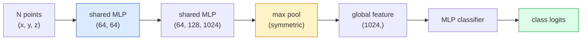

# 13 · 三维视觉——点云与 NeRF

> 三维视觉分两大流派。点云是传感器的原始输出，NeRF 则是学习得到的体积场。两者都在回答「空间中何处有何物」。

**类型：** 学习 + 实践
**语言：** Python
**前置：** 第 4 阶段第 03 课（卷积神经网络），第 1 阶段第 12 课（张量运算）
**时长：** 约 45 分钟

## 学习目标

- 区分显式（点云、网格、体素）与隐式（有符号距离场、NeRF）三维表示，并理解各自的适用场景
- 理解 PointNet 的对称函数技巧——它使神经网络对无序点集具备置换不变性（permutation invariance）
- 梳理一次 NeRF 前向传播：光线投射、体积渲染、位置编码、MLP 密度+颜色头
- 使用 `nerfstudio` 或 `instant-ngp`，从一小组带位姿的图像中完成基于预训练的三维重建

## 问题所在

相机产生一张二维图像。激光雷达（LIDAR）产生一组没有顺序的三维点。运动恢复结构（structure-from-motion）流水线产生一团稀疏的三维关键点。NeRF 则从少量带位姿的图像中重建出整个三维场景。这些全都属于「视觉」，但没有一个长得像卷积神经网络（CNN）想要的那种稠密张量。

三维视觉之所以重要，是因为几乎所有高价值的机器人任务都运行在三维空间中：抓取、避障、导航、AR 遮挡处理、三维内容采集。一名只懂二维图像的视觉工程师，就被挡在了这个领域增长最快的板块之外（AR/VR 内容、机器人、自动驾驶技术栈、用于房产或建筑行业的基于 NeRF 的三维重建）。

这两种表示分别因不同的原因占据主导地位。点云是传感器免费送给你的东西。而 NeRF 及其后继者（三维高斯泼溅、神经 SDF）则是你让神经网络去学习一个场景时所得到的产物。

## 核心概念

### 点云

点云是 R^3 中的一个无序点集，包含 N 个点，每个点可选地带有特征（颜色、强度、法向量）。

```
cloud = [
  (x1, y1, z1, r1, g1, b1),
  (x2, y2, z2, r2, g2, b2),
  ...
  (xN, yN, zN, rN, gN, bN),
]
```

没有网格，没有连接关系。有两个性质使得神经网络很难处理它：

- **置换不变性（permutation invariance）**——输出不能依赖于点的顺序。
- **可变的 N**——同一个模型必须能处理不同规模的点云。

PointNet（Qi 等人，2017）用一个想法同时解决了这两个问题：对每个点应用一个共享的 MLP，然后用一个对称函数（最大池化）进行聚合。其结果是一个不依赖于顺序的固定长度向量。

```
f(P) = max_{p in P} MLP(p)
```

这就是 PointNet 的全部核心。更深的变体（PointNet++、Point Transformer）增加了分层采样和局部聚合，但对称函数这个技巧始终未变。

### PointNet 架构



「共享 MLP」是指同一个 MLP 独立地在每个点上运行。为了提高效率，它被实现为沿点维度的 1x1 卷积。

### 神经辐射场（Neural Radiance Fields，NeRF）

NeRF（Mildenhall 等人，2020）把「我们能否从 N 张照片中重建一个三维场景？」这个问题，用一个本身就是该场景的神经网络给出了回答。该网络将 `(x, y, z, viewing_direction)` 映射到 `(density, colour)`。渲染一个新视角，就是围绕这个网络做的一次光线投射循环。

```
NeRF MLP:  (x, y, z, theta, phi) -> (sigma, r, g, b)

To render a pixel (u, v) of a new view:
  1. Cast a ray from the camera through pixel (u, v)
  2. Sample points along the ray at distances t_1, t_2, ..., t_N
  3. Query the MLP at each point
  4. Composite the colours weighted by (1 - exp(-sigma * dt))
  5. The sum is the rendered pixel colour
```

损失函数将渲染出的像素与训练照片中的真值像素进行比较。通过渲染步骤的反向传播来更新 MLP。没有三维真值，也没有显式几何——场景被存储在 MLP 的权重里。

### NeRF 中的位置编码

在 `(x, y, z)` 上直接套用一个朴素 MLP 无法表示高频细节，因为 MLP 存在朝向低频的频谱偏置（spectral bias）。NeRF 通过在送入 MLP 之前，将每个坐标编码为一个傅里叶特征向量来解决这个问题：

```
gamma(p) = (sin(2^0 pi p), cos(2^0 pi p), sin(2^1 pi p), cos(2^1 pi p), ...)
```

最高到 L=10 个频率级别。这与 Transformer 用于位置编码的技巧相同，并且在扩散模型的时间条件化中再次出现（第 10 课）。没有它，NeRF 看起来会很模糊。

### 体积渲染

```
C(r) = sum_i T_i * (1 - exp(-sigma_i * delta_i)) * c_i

T_i  = exp(- sum_{j<i} sigma_j * delta_j)
delta_i = t_{i+1} - t_i
```

`T_i` 是透射率（transmittance）——有多少光能存活到达点 i。`(1 - exp(-sigma_i * delta_i))` 是点 i 处的不透明度。`c_i` 是颜色。最终像素是沿光线的一个加权和。

### 取代 NeRF 的技术

纯粹的 NeRF 训练慢（数小时），渲染也慢（每张图像数秒）。此后的演进谱系如下：

- **Instant-NGP**（2022）——用哈希网格（hash-grid）编码替代 MLP 的位置输入；几秒内即可训练完成。
- **Mip-NeRF 360**——处理无界场景与抗锯齿。
- **三维高斯泼溅（3D Gaussian Splatting）**（2023）——用数百万个三维高斯分布替代体积场；几分钟内训练完成，实时渲染。这是当前生产环境的默认选择。

在 2026 年，几乎所有真正落地的 NeRF 产品实际上都是三维高斯泼溅。但思维模型依然是 NeRF。

### 数据集与基准

- **ShapeNet**——以点云形式对三维 CAD 模型进行分类与分割。
- **ScanNet**——用于分割的真实室内扫描数据。
- **KITTI**——用于自动驾驶的室外激光雷达点云。
- **NeRF Synthetic** / **Blended MVS**——用于视角合成的带位姿图像数据集。
- **Mip-NeRF 360** 数据集——无界的真实场景。

## 动手构建

### 第 1 步：PointNet 分类器

```python
import torch
import torch.nn as nn

class PointNet(nn.Module):
    def __init__(self, num_classes=10):
        super().__init__()
        self.mlp1 = nn.Sequential(
            nn.Conv1d(3, 64, 1),    nn.BatchNorm1d(64),   nn.ReLU(inplace=True),
            nn.Conv1d(64, 64, 1),   nn.BatchNorm1d(64),   nn.ReLU(inplace=True),
        )
        self.mlp2 = nn.Sequential(
            nn.Conv1d(64, 128, 1),  nn.BatchNorm1d(128),  nn.ReLU(inplace=True),
            nn.Conv1d(128, 1024, 1), nn.BatchNorm1d(1024), nn.ReLU(inplace=True),
        )
        self.head = nn.Sequential(
            nn.Linear(1024, 512),   nn.BatchNorm1d(512),  nn.ReLU(inplace=True),
            nn.Dropout(0.3),
            nn.Linear(512, 256),    nn.BatchNorm1d(256),  nn.ReLU(inplace=True),
            nn.Dropout(0.3),
            nn.Linear(256, num_classes),
        )

    def forward(self, x):
        # x: (N, 3, num_points) —— 已为 Conv1d 转置
        x = self.mlp1(x)
        x = self.mlp2(x)
        x = torch.max(x, dim=-1)[0]       # (N, 1024)
        return self.head(x)

pts = torch.randn(4, 3, 1024)
net = PointNet(num_classes=10)
print(f"output: {net(pts).shape}")
print(f"params: {sum(p.numel() for p in net.parameters()):,}")
```

约 160 万个参数。每片点云处理 1,024 个点。

### 第 2 步：位置编码

```python
def positional_encoding(x, L=10):
    """
    x: (..., D) -> (..., D * 2 * L)
    """
    freqs = 2.0 ** torch.arange(L, dtype=x.dtype, device=x.device)
    args = x.unsqueeze(-1) * freqs * 3.141592653589793
    sinc = torch.cat([args.sin(), args.cos()], dim=-1)
    return sinc.reshape(*x.shape[:-1], -1)

x = torch.randn(5, 3)
y = positional_encoding(x, L=10)
print(f"input:  {x.shape}")
print(f"encoded: {y.shape}     # (5, 60)")
```

乘以 `2^l * pi` 会得到逐级递增的更高频率。

### 第 3 步：迷你 NeRF MLP

```python
class TinyNeRF(nn.Module):
    def __init__(self, L_pos=10, L_dir=4, hidden=128):
        super().__init__()
        self.L_pos = L_pos
        self.L_dir = L_dir
        pos_dim = 3 * 2 * L_pos
        dir_dim = 3 * 2 * L_dir
        self.trunk = nn.Sequential(
            nn.Linear(pos_dim, hidden), nn.ReLU(inplace=True),
            nn.Linear(hidden, hidden),  nn.ReLU(inplace=True),
            nn.Linear(hidden, hidden),  nn.ReLU(inplace=True),
            nn.Linear(hidden, hidden),  nn.ReLU(inplace=True),
        )
        self.sigma = nn.Linear(hidden, 1)
        self.color = nn.Sequential(
            nn.Linear(hidden + dir_dim, hidden // 2), nn.ReLU(inplace=True),
            nn.Linear(hidden // 2, 3), nn.Sigmoid(),
        )

    def forward(self, x, d):
        x_enc = positional_encoding(x, self.L_pos)
        d_enc = positional_encoding(d, self.L_dir)
        h = self.trunk(x_enc)
        sigma = torch.relu(self.sigma(h)).squeeze(-1)
        rgb = self.color(torch.cat([h, d_enc], dim=-1))
        return sigma, rgb

nerf = TinyNeRF()
x = torch.randn(128, 3)
d = torch.randn(128, 3)
s, c = nerf(x, d)
print(f"sigma: {s.shape}   rgb: {c.shape}")
```

与原始 NeRF（其包含 2 个深度为 8 的 MLP 主干）相比，这个版本非常迷你。但已经足够演示其架构。

### 第 4 步：沿光线的体积渲染

```python
def volumetric_render(sigma, rgb, t_vals):
    """
    sigma: (..., N_samples)
    rgb:   (..., N_samples, 3)
    t_vals: (N_samples,) distances along the ray
    """
    delta = torch.cat([t_vals[1:] - t_vals[:-1], torch.full_like(t_vals[:1], 1e10)])
    alpha = 1.0 - torch.exp(-sigma * delta)
    trans = torch.cumprod(torch.cat([torch.ones_like(alpha[..., :1]), 1.0 - alpha + 1e-10], dim=-1), dim=-1)[..., :-1]
    weights = alpha * trans
    rendered = (weights.unsqueeze(-1) * rgb).sum(dim=-2)
    depth = (weights * t_vals).sum(dim=-1)
    return rendered, depth, weights


N = 64
t_vals = torch.linspace(2.0, 6.0, N)
sigma = torch.rand(N) * 0.5
rgb = torch.rand(N, 3)
rendered, depth, weights = volumetric_render(sigma, rgb, t_vals)
print(f"rendered colour: {rendered.tolist()}")
print(f"depth:           {depth.item():.2f}")
```

一条光线，64 个采样点，合成为单个 RGB 像素及一个深度值。

## 实际运用

在实际工作中：

- `nerfstudio`（Tancik 等人）——当前 NeRF / Instant-NGP / 高斯泼溅的参考库。提供命令行加一个网页查看器。
- `pytorch3d`（Meta）——可微渲染、点云工具、网格运算。
- `open3d`——点云处理、配准、可视化。

在部署层面，三维高斯泼溅已基本取代了纯粹的 NeRF，因为它的渲染速度快 100 倍，而重建质量相当。

## 交付成果

本课产出：

- `outputs/prompt-3d-task-router.md`——一个根据任务和输入数据将其路由到合适三维表示（点云、网格、体素、NeRF、高斯泼溅）的提示词。
- `outputs/skill-point-cloud-loader.md`——一个技能，为 .ply / .pcd / .xyz 文件编写一个 PyTorch `Dataset`，具备正确的归一化、居中和点采样。

## 练习

1. **（简单）** 证明 PointNet 具备置换不变性：把同一片点云跑两次，其中一次打乱点的顺序。验证两次输出在浮点噪声范围内完全一致。
2. **（中等）** 实现一个最小的光线生成函数：给定相机内参和位姿，为一张 H x W 图像的每个像素生成光线起点和方向。
3. **（困难）** 在一个合成数据集（由可微渲染或简单光线追踪器生成的彩色立方体的多个渲染视角）上训练一个 TinyNeRF。报告第 1、10、100 个 epoch 的渲染损失。模型在第几个 epoch 能产出可辨认的视角？

## 关键术语

| 术语 | 人们怎么说 | 实际含义 |
|------|----------------|----------------------|
| 点云（Point cloud） | 「来自 LIDAR 的三维点」 | 由 (x, y, z) 加上每点可选特征构成的无序集合 |
| PointNet | 「首个作用于点云的神经网络」 | 对每个点用共享 MLP + 对称（最大）池化；在结构上天生具备置换不变性 |
| NeRF | 「本身即场景的 MLP」 | 将 (x, y, z, dir) 映射到 (density, colour) 的网络；通过光线投射渲染 |
| 位置编码（Positional encoding） | 「傅里叶特征」 | 将每个坐标在多个频率上编码为 sin/cos，以克服 MLP 的低频偏置 |
| 体积渲染（Volumetric rendering） | 「光线积分」 | 用透射率和 alpha 把沿光线的采样点合成为单个像素 |
| Instant-NGP | 「哈希网格 NeRF」 | 用多分辨率哈希网格替代 NeRF 的坐标 MLP；快 100 至 1000 倍 |
| 三维高斯泼溅（3D Gaussian splatting） | 「数百万个高斯」 | 场景 = 一组三维高斯分布；实时渲染，几分钟训练完成 |
| SDF | 「有符号距离场」 | 返回到最近表面的有符号距离的函数；另一种隐式表示 |

## 延伸阅读

- [PointNet (Qi et al., 2017)](https://arxiv.org/abs/1612.00593)——置换不变的分类器
- [NeRF (Mildenhall et al., 2020)](https://arxiv.org/abs/2003.08934)——让从照片重建三维成为神经网络问题的论文
- [Instant-NGP (Müller et al., 2022)](https://arxiv.org/abs/2201.05989)——哈希网格，1000 倍提速
- [3D Gaussian Splatting (Kerbl et al., 2023)](https://arxiv.org/abs/2308.04079)——在生产环境中取代 NeRF 的架构
