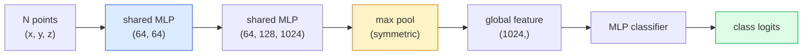

# 3D Vision — Point Clouds & NeRFs

> 3D视觉有两种风格。点云是传感器的原始输出。NeRF是习得的体积场。两者都回答“太空中的位置是什么。"

** 类型：** 学习+构建
** 语言：** Python
** 先决条件：** 阶段4第03课（CNN），阶段1第12课（张量运算）
** 时间：** ~45分钟

## Learning Objectives

- 区分显式（点云、网格、体素）和隐式（带符号距离场、NeRF）3D表示以及使用时间
- 了解PointNet的算术函数技巧，该技巧使神经网络在无序点集上保持排列不变
- 跟踪NeRF正向传递：光线投射、体积渲染、位置编码、MLP密度+彩色头
- 使用`nerfstudio`或`instant-ngp`从一小组已设定的图像进行预训练的3D重建

## The Problem

相机产生2D图像。LIDAR生成一组没有排序的3D点。运动结构管道产生3D关键点的稀疏云。NeRF从少数已摆好的图像重建整个3D场景。所有这些都是“视觉”，但没有一个看起来像CNN想要的稠密张量。

3D 视觉很重要，因为几乎所有高价值机器人任务都以3D方式运行：抓取、避障、导航、AR遮挡、3D内容捕获。只理解2D图像的视觉工程师被排除在该领域增长最快的领域（AR/VR内容、机器人技术、自动驾驶堆栈、基于NeRF的房地产或建筑3D重建）之外。

这两种代表出于不同的原因占据主导地位。点云是传感器免费为您提供的。当您要求神经网络学习场景时，您会得到NeRF及其后续版本（3D高斯飞溅、神经SDF）。

## The Concept

### Point clouds

点云是R ' 3中由N个点组成的无序集合，每个点可选地具有特征（颜色、强度、法向）。

```
cloud = [
  (x1, y1, z1, r1, g1, b1),
  (x2, y2, z2, r2, g2, b2),
  ...
  (xN, yN, zN, rN, gN, bN),
]
```

没有电网，没有连接。有两个属性使得神经网络很难做到这一点：

- ** 排列不变性 ** -输出必须不取决于点顺序。
- ** 变量N** -单个模型必须处理不同大小的云。

PointNet（Qi等人，2017）用一个想法解决了这两个问题：对每个点应用共享MLP，然后用对称函数（最大池）进行聚合。结果是一个固定大小的载体，不取决于顺序。

```
f(P) = max_{p in P} MLP(p)
```

这是PointNet的全部核心。更深层次的变体（PointNet++、Point Transformer）添加了分层采样和本地聚合，但逻辑函数技巧没有改变。

### The PointNet architecture



“共享MLP”意味着相同的MLP在每个点上独立运行。为了提高效率，在点维度上实现为1x 1 conv。

### Neural Radiance Fields (NeRFs)

NeRF（Mildenhall等人，2020年）回答了“我们可以从N张照片中重建3D场景吗？”并用场景的神经网络进行回答。网络将“（x，y，z，viewing_Direction）”映射到“（密度，颜色）”。渲染新视图是该网络上的光线投射循环。

```
NeRF MLP:  (x, y, z, theta, phi) -> (sigma, r, g, b)

To render a pixel (u, v) of a new view:
  1. Cast a ray from the camera through pixel (u, v)
  2. Sample points along the ray at distances t_1, t_2, ..., t_N
  3. Query the MLP at each point
  4. Composite the colours weighted by (1 - exp(-sigma * dt))
  5. The sum is the rendered pixel colour
```

损失将渲染像素与训练照片中的地面真实像素进行比较。整个渲染步骤的Backprop会更新MLP。没有3D地面真相，没有显式几何-场景存储在MLP权重中。

### Positional encoding in NeRF

“（x，y，z）”上的普通MLP无法表示高频细节，因为MLP在频谱上偏向低频。NeRF通过在MLP之前将每个坐标编码为傅里叶特征载体来修复这一点：

```
gamma(p) = (sin(2^0 pi p), cos(2^0 pi p), sin(2^1 pi p), cos(2^1 pi p), ...)
```

高达L=10个频率级别。这与变形器用于位置的技巧相同，并且在扩散时间条件下再次出现（第10课）。如果没有它，NeRF看起来很模糊。

### Volumetric rendering

```
C(r) = sum_i T_i * (1 - exp(-sigma_i * delta_i)) * c_i

T_i  = exp(- sum_{j<i} sigma_j * delta_j)
delta_i = t_{i+1} - t_i
```

' T_i '是透过率--有多少光残留到点i。“（1 -BEP（-西格玛_i * delta_i））”是点i处的不透明度。' c_i '是颜色。最后一个像素是沿着光线的加权和。

### What replaced NeRFs

纯NeRF训练速度慢（数小时），渲染速度慢（每张图像秒）。血统自：

- **Instant-NGP**（2022）-哈希网格编码取代MLP的位置输入;以秒为单位训练。
- **Mip-NeRF 360** -处理无界场景和抗锯齿。
- **3D高斯飞溅 **（2023）-用数百万3D高斯取代体积场;几分钟内训练，实时渲染。当前生产默认值。

2026年几乎所有真正的NeRF产品实际上都是3D高斯飞溅。心理模型仍然是NeRF。

### Datasets and benchmarks

- **ShapeNet** -将3D CAD模型分类和分割为点云。
- **ScanNet** -用于分割的真实室内扫描。
- **KITTI** -用于自动驾驶的户外激光雷达点云。
- **NeRF合成 ** / ** 混合MVS** -用于视图合成的摆好图像数据集。
- **Mip-NeRF 360** 数据集-无界真实场景。

## Build It

### Step 1: PointNet classifier

```python
import torch
import torch.nn as nn

class PointNet(nn.Module):
    def __init__(self, num_classes=10):
        super().__init__()
        self.mlp1 = nn.Sequential(
            nn.Conv1d(3, 64, 1),    nn.BatchNorm1d(64),   nn.ReLU(inplace=True),
            nn.Conv1d(64, 64, 1),   nn.BatchNorm1d(64),   nn.ReLU(inplace=True),
        )
        self.mlp2 = nn.Sequential(
            nn.Conv1d(64, 128, 1),  nn.BatchNorm1d(128),  nn.ReLU(inplace=True),
            nn.Conv1d(128, 1024, 1), nn.BatchNorm1d(1024), nn.ReLU(inplace=True),
        )
        self.head = nn.Sequential(
            nn.Linear(1024, 512),   nn.BatchNorm1d(512),  nn.ReLU(inplace=True),
            nn.Dropout(0.3),
            nn.Linear(512, 256),    nn.BatchNorm1d(256),  nn.ReLU(inplace=True),
            nn.Dropout(0.3),
            nn.Linear(256, num_classes),
        )

    def forward(self, x):
        # x: (N, 3, num_points) — transposed for Conv1d
        x = self.mlp1(x)
        x = self.mlp2(x)
        x = torch.max(x, dim=-1)[0]       # (N, 1024)
        return self.head(x)

pts = torch.randn(4, 3, 1024)
net = PointNet(num_classes=10)
print(f"output: {net(pts).shape}")
print(f"params: {sum(p.numel() for p in net.parameters()):,}")
```

约160万个参数。每个云计算1，024个点。

### Step 2: Positional encoding

```python
def positional_encoding(x, L=10):
    """
    x: (..., D) -> (..., D * 2 * L)
    """
    freqs = 2.0 ** torch.arange(L, dtype=x.dtype, device=x.device)
    args = x.unsqueeze(-1) * freqs * 3.141592653589793
    sinc = torch.cat([args.sin(), args.cos()], dim=-1)
    return sinc.reshape(*x.shape[:-1], -1)

x = torch.randn(5, 3)
y = positional_encoding(x, L=10)
print(f"input:  {x.shape}")
print(f"encoded: {y.shape}     # (5, 60)")
```

乘以“2 ' l * pi”会产生逐渐更高的频率。

### Step 3: Tiny NeRF MLP

```python
class TinyNeRF(nn.Module):
    def __init__(self, L_pos=10, L_dir=4, hidden=128):
        super().__init__()
        self.L_pos = L_pos
        self.L_dir = L_dir
        pos_dim = 3 * 2 * L_pos
        dir_dim = 3 * 2 * L_dir
        self.trunk = nn.Sequential(
            nn.Linear(pos_dim, hidden), nn.ReLU(inplace=True),
            nn.Linear(hidden, hidden),  nn.ReLU(inplace=True),
            nn.Linear(hidden, hidden),  nn.ReLU(inplace=True),
            nn.Linear(hidden, hidden),  nn.ReLU(inplace=True),
        )
        self.sigma = nn.Linear(hidden, 1)
        self.color = nn.Sequential(
            nn.Linear(hidden + dir_dim, hidden // 2), nn.ReLU(inplace=True),
            nn.Linear(hidden // 2, 3), nn.Sigmoid(),
        )

    def forward(self, x, d):
        x_enc = positional_encoding(x, self.L_pos)
        d_enc = positional_encoding(d, self.L_dir)
        h = self.trunk(x_enc)
        sigma = torch.relu(self.sigma(h)).squeeze(-1)
        rgb = self.color(torch.cat([h, d_enc], dim=-1))
        return sigma, rgb

nerf = TinyNeRF()
x = torch.randn(128, 3)
d = torch.randn(128, 3)
s, c = nerf(x, d)
print(f"sigma: {s.shape}   rgb: {c.shape}")
```

与原始NeRF（具有2个深度8的MLP主干）相比，体积很小。足以展示架构。

### Step 4: Volumetric rendering along a ray

```python
def volumetric_render(sigma, rgb, t_vals):
    """
    sigma: (..., N_samples)
    rgb:   (..., N_samples, 3)
    t_vals: (N_samples,) distances along the ray
    """
    delta = torch.cat([t_vals[1:] - t_vals[:-1], torch.full_like(t_vals[:1], 1e10)])
    alpha = 1.0 - torch.exp(-sigma * delta)
    trans = torch.cumprod(torch.cat([torch.ones_like(alpha[..., :1]), 1.0 - alpha + 1e-10], dim=-1), dim=-1)[..., :-1]
    weights = alpha * trans
    rendered = (weights.unsqueeze(-1) * rgb).sum(dim=-2)
    depth = (weights * t_vals).sum(dim=-1)
    return rendered, depth, weights


N = 64
t_vals = torch.linspace(2.0, 6.0, N)
sigma = torch.rand(N) * 0.5
rgb = torch.rand(N, 3)
rendered, depth, weights = volumetric_render(sigma, rgb, t_vals)
print(f"rendered colour: {rendered.tolist()}")
print(f"depth:           {depth.item():.2f}")
```

一条光线、64个样本，合成为单个Ruby像素和深度。

## Use It

对于实际工作：

- “nerfstudio”（Tancik等人）- NeRF / Instant-NGP / Gaussian Splatting的当前参考库。命令行加上网络查看器。
- ' pytorch 3d '（Meta）-可区分渲染、点云实用程序、网格操作。
- “open 3d”-点云处理、注册、可视化。

对于部署来说，3D高斯飞溅在很大程度上取代了纯NeRF，因为它的渲染速度快了100倍。重建质量相当。

## Ship It

本课产生：

- ' outputes/prompt-3d-task-router.md '-一个提示，根据任务和输入数据路由到正确的3D表示（点云、网格、体素、NeRF、高斯样条）。
- '输出/skill-point-cloud-loader.md '-一种为.ply / .pCD / .xyz文件编写PyTorch '数据集'的技能，具有正确的规范化、定中心和点采样。

## Exercises

1. **（简单）** 表明PointNet是置换不变的：将同一个云运行两次，一次是对点进行洗牌。验证输出在浮点噪音范围内是否相同。
2. **（中等）** 实现最小射线生成功能，在给定相机本质和姿态的情况下，该功能为H x W图像的每个像素生成射线起源和方向。
3. **（硬）** 在彩色立方体渲染视图的合成数据集上训练TinyNeRF（通过可微渲染或简单光线追踪器生成）。报告纪元1、10和100时的渲染丢失。该模型在哪个时期产生可识别的视图？

## Key Terms

| Term | 别人怎么说 | 它实际上意味着什么 |
|------|----------------|----------------------|
| 点云 | “来自LIDAR的3D点” | 无序的（x，y，z）集+每个点的可选功能 |
| PointNet | “第一个关于点云的神经网络” | 每点共享MLP+对称（最大）池;通过构造排列不变 |
| NeRF | “MLP就是现场” | 网络映射（x，y，z，dir）到（密度，颜色）;通过光线投射渲染 |
| 位置编码 | “傅里叶特征” | 将每个坐标编码为多个频率的sin/cos，以克服MLP低频偏差 |
| 体积渲染 | “雷整合” | 使用透过率和阿尔法将样本沿着光线合成为单个像素 |
| 即时NGP | “哈希网格NeRF” | 用多分辨率哈希网格取代NeRF的坐标MLP;速度快100- 1000倍 |
| 3D高斯飞溅 | “数百万高斯人” | 场景= 3D高斯集合;实时渲染，几分钟内训练 |
| SDF | “符号距离场” | 返回到最近表面的带符号距离的函数;另一种隐式表示 |

## Further Reading

- [PointNet（Qi等人，2017）]（https：//arxiv.org/ab/1612.00593）-置换不变分类器
- [NeRF（米尔登霍尔等人，2020）]（https：//arxiv.org/ab/2003.08934）-使照片3D重建成为神经网络问题的论文
- [Instant-NGP（穆勒等人，2022）]（https：//arxiv.org/ab/2201.05989）-哈希网格，1000倍加速
- [3D高斯飞溅（Kerbll等人，2023）]（https：//arxiv.org/ab/2308.04079）-在生产中取代NeRF的架构
