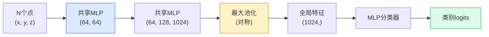

# 3D视觉 — 点云与神经辐射场（NeRFs）

> 3D视觉有两种形式。点云是传感器的原始输出。神经辐射场是学习到的体积场。两者都回答"空间中有什么、在哪里"的问题。

**类型：** 学习 + 构建
**语言：** Python
**前置条件：** 阶段4 第03课（卷积神经网络CNN）、阶段1 第12课（张量运算）
**时间：** 约45分钟

## 学习目标

- 区分显式（点云、网格、体素）和隐式（符号距离场、神经辐射场NeRF）的3D表示方法及其各自的使用场景
- 理解PointNet的对称函数技巧，该技巧使神经网络对无序点集具有置换不变性
- 追溯神经辐射场的前向传播过程：光线投射、体积渲染、位置编码、多层感知机（MLP）密度+颜色头
- 使用 `nerfstudio` 或 `instant-ngp` 从少量带姿态的图像中进行预训练3D重建

## 问题

相机生成2D图像。激光雷达生成无序的3D点集。运动恢复结构（Structure-from-Motion）管线生成稀疏的3D关键点云。神经辐射场从几张带姿态的图像重建整个3D场景。所有这些都属于"视觉"，但没有一种看起来像卷积神经网络期望的稠密张量。

3D视觉之所以重要，是因为几乎所有高价值的机器人任务都在3D环境中进行：抓取、避障、导航、AR遮挡、3D内容捕获。只理解2D图像的视觉工程师将无法进入该领域增长最快的部分（AR/VR内容、机器人技术、自动驾驶堆栈、基于神经辐射场的地产或建筑3D重建）。

两种表示方法因不同原因而占据主导地位。点云是传感器免费提供给你的。神经辐射场及其后继者（3D高斯散射、神经符号距离场）则是你让神经网络学习场景所得到的结果。

## 概念

### 点云

点云是R^3中N个点的无序集合，每个点可选地附带特征（颜色、强度、法线）。

```
cloud = [
  (x1, y1, z1, r1, g1, b1),
  (x2, y2, z2, r2, g2, b2),
  ...
  (xN, yN, zN, rN, gN, bN),
]
```

无网格，无连接性。两个特性使得神经网络难以处理：

- **置换不变性** —— 输出不能依赖于点的顺序。
- **可变N** —— 单个模型必须处理不同大小的点云。

PointNet（Qi等人，2017）用一个想法同时解决了这两个问题：对每个点应用共享的多层感知机（MLP），然后通过对称函数（最大池化）进行聚合。结果得到一个固定大小的向量，不依赖于顺序。

```
f(P) = max_{p in P} MLP(p)
```

这就是PointNet的全部核心。更深的变体（PointNet++、Point Transformer）增加了层次采样和局部聚合，但对称函数技巧保持不变。

### PointNet架构



"共享MLP"表示相同的多层感知机独立地作用于每个点。为了提高效率，实现上使用点维度的1x1卷积。

### 神经辐射场（NeRFs）

神经辐射场（Mildenhall等人，2020）提出了一个问题："能否从N张照片重建3D场景？"并用一个神经网络作为场景来回答。该网络将`(x, y, z, 视角方向)`映射到`(密度, 颜色)`。渲染新视角是在该网络上进行光线投射循环。

```
NeRF MLP:  (x, y, z, theta, phi) -> (sigma, r, g, b)

要渲染新视角的像素 (u, v)：
  1. 从相机通过像素 (u, v) 投射一条光线
  2. 沿光线在距离 t_1, t_2, ..., t_N 处采样点
  3. 在每个点查询MLP
  4. 用权重 (1 - exp(-sigma * dt)) 组合颜色
  5. 求和得到渲染的像素颜色
```

损失函数将渲染的像素与训练照片中的真实像素进行比较。通过渲染步骤的反向传播（Backpropagation）更新MLP。没有3D真实值，没有显式几何 —— 场景存储在MLP权重中。

### 神经辐射场中的位置编码

在`(x, y, z)`上的普通多层感知机无法表示高频细节，因为MLP在频谱上偏向低频。神经辐射场通过在MLP之前将每个坐标编码为傅里叶特征向量来解决这个问题：

```
gamma(p) = (sin(2^0 pi p), cos(2^0 pi p), sin(2^1 pi p), cos(2^1 pi p), ...)
```

最高到L=10个频率级别。这与Transformer用于位置的技巧相同，并且再次出现在扩散时间条件（第10课）中。没有它，神经辐射场看起来会模糊。

### 体积渲染

```
C(r) = sum_i T_i * (1 - exp(-sigma_i * delta_i)) * c_i

T_i  = exp(- sum_{j<i} sigma_j * delta_j)
delta_i = t_{i+1} - t_i
```

`T_i` 是透射率 —— 有多少光线存活到了点i。`(1 - exp(-sigma_i * delta_i))` 是点i的不透明度。`c_i` 是颜色。最终像素是沿光线方向的加权和。

### 什么取代了神经辐射场

纯神经辐射场训练慢（数小时），渲染慢（每图像数秒）。后续发展：

- **Instant-NGP** (2022) —— 哈希网格编码取代MLP的位置输入；训练时间缩短至秒级。
- **Mip-NeRF 360** —— 处理无边界场景和抗锯齿。
- **3D高斯散射（3D Gaussian Splatting）** (2023) —— 用数百万个3D高斯代替体积场；训练几分钟，实时渲染。当前生产环境默认选择。

2026年几乎每个真实的神经辐射场产品实际上都是3D高斯散射。但思想模型仍然是神经辐射场。

### 数据集与基准

- **ShapeNet** —— 用于点云的3D CAD模型分类与分割。
- **ScanNet** —— 用于分割的真实室内扫描。
- **KITTI** —— 用于自动驾驶的室外激光雷达点云。
- **NeRF Synthetic** / **Blended MVS** —— 用于视图合成的带姿态图像数据集。
- **Mip-NeRF 360** 数据集 —— 无边界真实场景。

## 动手构建

### 步骤1：PointNet分类器

```python
import torch
import torch.nn as nn

class PointNet(nn.Module):
    def __init__(self, num_classes=10):
        super().__init__()
        self.mlp1 = nn.Sequential(
            nn.Conv1d(3, 64, 1),    nn.BatchNorm1d(64),   nn.ReLU(inplace=True),
            nn.Conv1d(64, 64, 1),   nn.BatchNorm1d(64),   nn.ReLU(inplace=True),
        )
        self.mlp2 = nn.Sequential(
            nn.Conv1d(64, 128, 1),  nn.BatchNorm1d(128),  nn.ReLU(inplace=True),
            nn.Conv1d(128, 1024, 1), nn.BatchNorm1d(1024), nn.ReLU(inplace=True),
        )
        self.head = nn.Sequential(
            nn.Linear(1024, 512),   nn.BatchNorm1d(512),  nn.ReLU(inplace=True),
            nn.Dropout(0.3),
            nn.Linear(512, 256),    nn.BatchNorm1d(256),  nn.ReLU(inplace=True),
            nn.Dropout(0.3),
            nn.Linear(256, num_classes),
        )

    def forward(self, x):
        # x: (N, 3, num_points) — 为Conv1d转置后的形状
        x = self.mlp1(x)
        x = self.mlp2(x)
        x = torch.max(x, dim=-1)[0]       # (N, 1024)
        return self.head(x)

pts = torch.randn(4, 3, 1024)
net = PointNet(num_classes=10)
print(f"输出: {net(pts).shape}")
print(f"参数量: {sum(p.numel() for p in net.parameters()):,}")
```

约160万参数。每个点云处理1024个点。

### 步骤2：位置编码

```python
def positional_encoding(x, L=10):
    """
    x: (..., D) -> (..., D * 2 * L)
    """
    freqs = 2.0 ** torch.arange(L, dtype=x.dtype, device=x.device)
    args = x.unsqueeze(-1) * freqs * 3.141592653589793
    sinc = torch.cat([args.sin(), args.cos()], dim=-1)
    return sinc.reshape(*x.shape[:-1], -1)

x = torch.randn(5, 3)
y = positional_encoding(x, L=10)
print(f"输入:  {x.shape}")
print(f"编码后: {y.shape}     # (5, 60)")
```

乘以 `2^l * pi` 产生逐步升高的频率。

### 步骤3：小型NeRF MLP

```python
class TinyNeRF(nn.Module):
    def __init__(self, L_pos=10, L_dir=4, hidden=128):
        super().__init__()
        self.L_pos = L_pos
        self.L_dir = L_dir
        pos_dim = 3 * 2 * L_pos
        dir_dim = 3 * 2 * L_dir
        self.trunk = nn.Sequential(
            nn.Linear(pos_dim, hidden), nn.ReLU(inplace=True),
            nn.Linear(hidden, hidden),  nn.ReLU(inplace=True),
            nn.Linear(hidden, hidden),  nn.ReLU(inplace=True),
            nn.Linear(hidden, hidden),  nn.ReLU(inplace=True),
        )
        self.sigma = nn.Linear(hidden, 1)
        self.color = nn.Sequential(
            nn.Linear(hidden + dir_dim, hidden // 2), nn.ReLU(inplace=True),
            nn.Linear(hidden // 2, 3), nn.Sigmoid(),
        )

    def forward(self, x, d):
        x_enc = positional_encoding(x, self.L_pos)
        d_enc = positional_encoding(d, self.L_dir)
        h = self.trunk(x_enc)
        sigma = torch.relu(self.sigma(h)).squeeze(-1)
        rgb = self.color(torch.cat([h, d_enc], dim=-1))
        return sigma, rgb

nerf = TinyNeRF()
x = torch.randn(128, 3)
d = torch.randn(128, 3)
s, c = nerf(x, d)
print(f"sigma: {s.shape}   rgb: {c.shape}")
```

相比原始NeRF（深度为8的两个MLP主干）更小。足以演示架构。

### 步骤4：沿光线进行体积渲染

```python
def volumetric_render(sigma, rgb, t_vals):
    """
    sigma: (..., N_samples)
    rgb:   (..., N_samples, 3)
    t_vals: (N_samples,) 沿光线的距离
    """
    delta = torch.cat([t_vals[1:] - t_vals[:-1], torch.full_like(t_vals[:1], 1e10)])
    alpha = 1.0 - torch.exp(-sigma * delta)
    trans = torch.cumprod(torch.cat([torch.ones_like(alpha[..., :1]), 1.0 - alpha + 1e-10], dim=-1), dim=-1)[..., :-1]
    weights = alpha * trans
    rendered = (weights.unsqueeze(-1) * rgb).sum(dim=-2)
    depth = (weights * t_vals).sum(dim=-1)
    return rendered, depth, weights


N = 64
t_vals = torch.linspace(2.0, 6.0, N)
sigma = torch.rand(N) * 0.5
rgb = torch.rand(N, 3)
rendered, depth, weights = volumetric_render(sigma, rgb, t_vals)
print(f"渲染颜色: {rendered.tolist()}")
print(f"深度:     {depth.item():.2f}")
```

一根光线，64个采样点，合成为单个RGB像素和深度。

## 实际使用

对于实际工作：

- `nerfstudio`（Tancik等人）—— 当前的NeRF / Instant-NGP / 高斯散点参考库。命令行加Web查看器。
- `pytorch3d`（Meta）—— 可微分渲染、点云工具、网格操作。
- `open3d` —— 点云处理、配准、可视化。

对于部署，3D高斯散点已在很大程度上取代了纯NeRF，因为它的渲染速度快100倍。重建质量相当。

## 交付物

本课产生：

- `outputs/prompt-3d-task-router.md` —— 一个提示词，根据任务和输入数据路由到正确的3D表示方法（点云、网格、体素、NeRF、高斯散点）。
- `outputs/skill-point-cloud-loader.md` —— 一个技能，编写一个PyTorch `Dataset`，用于 .ply / .pcd / .xyz 文件，包含正确的归一化、中心化和点采样。

## 练习

1. **(简单)** 证明PointNet具有置换不变性：将同一个点云运行两次，一次打乱点的顺序。验证输出在浮点误差范围内相同。
2. **(中等)** 实现一个最小化的光线生成函数，给定相机内参和姿态，为H x W图像的每个像素生成光线起点和方向。
3. **(困难)** 在彩色立方体的合成渲染视图数据集上训练TinyNeRF（通过可微分渲染或简单光线追踪生成）。报告第1、10、100个epoch的渲染损失。模型在哪个epoch能产生可识别的视图？

## 关键术语

| 术语 | 人们常说的 | 实际含义 |
|------|-----------|----------|
| 点云（Point cloud） | "来自激光雷达的3D点" | 无序的 (x, y, z) + 每个点可选特征集合 |
| PointNet | "第一个处理点云的神经网络" | 每个点子共享MLP + 对称（最大）池化；构造上具有置换不变性 |
| 神经辐射场（NeRF） | "作为场景的MLP" | 将 (x, y, z, 方向) 映射到 (密度, 颜色) 的网络；通过光线投射渲染 |
| 位置编码（Positional encoding） | "傅里叶特征" | 将每个坐标编码为多个频率的正弦/余弦，以克服MLP低频偏置 |
| 体积渲染（Volumetric rendering） | "光线积分" | 使用透射率和alpha将沿光线的采样点合成为单个像素 |
| Instant-NGP | "哈希网格NeRF" | 用多分辨率哈希网格替换NeRF的坐标MLP；速度快100-1000倍 |
| 3D高斯散点（3D Gaussian splatting） | "数百万个高斯" | 场景 = 3D高斯集合；实时渲染，几分钟训练 |
| 符号距离场（SDF） | "有符号距离场" | 返回到最近表面有符号距离的函数；另一种隐式表示 |

## 延伸阅读

- [PointNet (Qi et al., 2017)](https://arxiv.org/abs/1612.00593) —— 置换不变分类器
- [NeRF (Mildenhall et al., 2020)](https://arxiv.org/abs/2003.08934) —— 使从照片进行3D重建成为神经网络问题的论文
- [Instant-NGP (Müller et al., 2022)](https://arxiv.org/abs/2201.05989) —— 哈希网格，1000倍加速
- [3D Gaussian Splatting (Kerbl et al., 2023)](https://arxiv.org/abs/2308.04079) —— 在生产中取代NeRF的架构