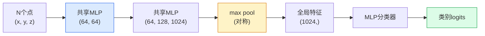

# 3D视觉 — 点云与NeRF

> 3D视觉有两种风格。点云是传感器的原始输出。NeRF是学习到的体积场。两者都回答"空间中什么东西在哪里"。

**类型：** 学习+构建
**语言：** Python
**前置条件：** 阶段4 第03课（CNN），阶段1 第12课（张量操作）
**时间：** ~45分钟

## 学习目标

- 区分显式（点云、网格、体素）和隐式（符号距离场、NeRF）3D表示，以及各自何时使用
- 理解PointNet的对称函数技巧，使神经网络在无序点集上具有排列不变性
- 追溯NeRF前向传播：光线投射、体积渲染、位置编码、MLP密度+颜色头
- 使用`nerfstudio`或`instant-ngp`从一小组带位姿的图像进行预训练3D重建

## 问题

相机产生2D图像。LIDAR产生一组无序的3D点。运动恢复结构（SfM）pipeline产生稀疏的3D关键点云。NeRF从少量带位姿的图像重建整个3D场景。所有这些都是"视觉"，但它们没有一个看起来像CNN想要的密集张量。

3D视觉重要，因为几乎每个高价值的机器人任务都在3D中运行：抓取、避障、导航、AR遮挡、3D内容捕获。一个只理解2D图像的视觉工程师被排除在领域增长最快的部分之外（AR/VR内容、机器人、自动驾驶堆栈、用于房地产或建筑的基于NeRF的3D重建）。

两种表示因不同原因占据主导地位。点云是传感器免费提供给你的。NeRF及其后继者（3D Gaussian splatting、神经SDF）是你让神经网络学习场景时得到的结果。

## 概念

### 点云

点云是R^3中N个点的无序集合，可选地每个点带有特征（颜色、强度、法线）。

```
cloud = [
  (x1, y1, z1, r1, g1, b1),
  (x2, y2, z2, r2, g2, b2),
  ...
  (xN, yN, zN, rN, gN, bN),
]
```

没有网格，没有连接性。两个属性使得这对神经网络很难：

- **排列不变性** — 输出不能依赖于点的顺序。
- **变长N** — 单个模型必须处理不同大小的点云。

PointNet（Qi等人，2017）用一个想法解决了这两个问题：对每个点应用共享MLP，然后用对称函数（max pool）聚合。结果是一个不依赖于顺序的固定大小向量。

```
f(P) = max_{p in P} MLP(p)
```

这就是PointNet的全部核心。更深的变体（PointNet++、Point Transformer）增加了层次化采样和局部聚合，但对称函数技巧不变。

### PointNet架构


```mermaid
flowchart LR
    PTS["N个点<br/>(x, y, z)"] --> MLP1["共享MLP<br/>(64, 64)"]
    MLP1 --> MLP2["共享MLP<br/>(64, 128, 1024)"]
    MLP2 --> MAX["max pool<br/>(对称)"]
    MAX --> FEAT["全局特征<br/>(1024,)"]
    FEAT --> FC["MLP分类器"]
    FC --> CLS["类别logits"]

    style MLP1 fill:#dbeafe,stroke:#2563eb
    style MAX fill:#fef3c7,stroke:#d97706
    style CLS fill:#dcfce7,stroke:#16a34a
```

"共享MLP"意味着相同的MLP独立运行在每个点上。为了效率，实现为在点维度上的1x1 conv。

### 神经辐射场（NeRF）

NeRF（Mildenhall等人，2020）提出了"我们可以从N张照片重建3D场景吗？"的问题，并用一个作为场景本身的神经网络来回答。网络将`(x, y, z, 视角方向)`映射到`(密度, 颜色)`。渲染新视角是在这个网络上的光线投射循环。

```
NeRF MLP:  (x, y, z, theta, phi) -> (sigma, r, g, b)

要渲染新视角的像素(u, v)：
  1. 从相机通过像素(u, v)投射一条光线
  2. 沿光线在距离t_1, t_2, ..., t_N处采样点
  3. 在每个点查询MLP
  4. 按(1 - exp(-sigma * dt))加权合成颜色
  5. 总和就是渲染的像素颜色
```

损失将渲染像素与训练照片中的ground-truth像素进行比较。通过渲染步骤的反向传播更新MLP。没有3D ground-truth，没有显式几何——场景存储在MLP权重中。

### NeRF中的位置编码

在`(x, y, z)`上的原始MLP无法表示高频细节，因为MLP在频谱上偏向低频。NeRF通过在MLP之前将每个坐标编码为傅里叶特征向量来修复这个问题：

```
gamma(p) = (sin(2^0 pi p), cos(2^0 pi p), sin(2^1 pi p), cos(2^1 pi p), ...)
```

最高L=10个频率级别。这与transformer用于位置的技巧相同，并且它在扩散时间条件中再次出现（第10课）。没有它，NeRF看起来模糊。

### 体积渲染

```
C(r) = sum_i T_i * (1 - exp(-sigma_i * delta_i)) * c_i

T_i  = exp(- sum_{j<i} sigma_j * delta_j)
delta_i = t_{i+1} - t_i
```

`T_i`是透射率——有多少光线存活到点i。`(1 - exp(-sigma_i * delta_i))`是点i的不透明度。`c_i`是颜色。最终的像素是沿光线的加权和。

### 什么取代了NeRF

纯NeRF训练慢（小时级）且渲染慢（每张图像秒级）。此后的发展谱系：

- **Instant-NGP**（2022）— 哈希网格编码取代MLP的位置输入；秒级训练。
- **Mip-NeRF 360** — 处理无界场景和抗锯齿。
- **3D Gaussian Splatting**（2023）— 用数百万个3D高斯替换体积场；分钟级训练，实时渲染。当前的生产默认选择。

2026年几乎每个真实的NeRF产品实际上都是3D Gaussian splatting。心智模型仍然是NeRF。

### 数据集和基准

- **ShapeNet** — 作为点云的3D CAD模型的分类和分割。
- **ScanNet** — 用于分割的真实室内扫描。
- **KITTI** — 用于自动驾驶的室外LIDAR点云。
- **NeRF Synthetic** / **Blended MVS** — 用于视角合成的带位姿图像数据集。
- **Mip-NeRF 360数据集** — 无界真实场景。

## 构建

### 第1步：PointNet分类器

```python
import torch
import torch.nn as nn

class PointNet(nn.Module):
    def __init__(self, num_classes=10):
        super().__init__()
        self.mlp1 = nn.Sequential(
            nn.Conv1d(3, 64, 1),    nn.BatchNorm1d(64),   nn.ReLU(inplace=True),
            nn.Conv1d(64, 64, 1),   nn.BatchNorm1d(64),   nn.ReLU(inplace=True),
        )
        self.mlp2 = nn.Sequential(
            nn.Conv1d(64, 128, 1),  nn.BatchNorm1d(128),  nn.ReLU(inplace=True),
            nn.Conv1d(128, 1024, 1), nn.BatchNorm1d(1024), nn.ReLU(inplace=True),
        )
        self.head = nn.Sequential(
            nn.Linear(1024, 512),   nn.BatchNorm1d(512),  nn.ReLU(inplace=True),
            nn.Dropout(0.3),
            nn.Linear(512, 256),    nn.BatchNorm1d(256),  nn.ReLU(inplace=True),
            nn.Dropout(0.3),
            nn.Linear(256, num_classes),
        )

    def forward(self, x):
        # x: (N, 3, num_points) — 为Conv1d转置
        x = self.mlp1(x)
        x = self.mlp2(x)
        x = torch.max(x, dim=-1)[0]       # (N, 1024)
        return self.head(x)

pts = torch.randn(4, 3, 1024)
net = PointNet(num_classes=10)
print(f"output: {net(pts).shape}")
print(f"params: {sum(p.numel() for p in net.parameters()):,}")
```

约160万个参数。每个点云处理1,024个点。

### 第2步：位置编码

```python
def positional_encoding(x, L=10):
    """
    x: (..., D) -> (..., D * 2 * L)
    """
    freqs = 2.0 ** torch.arange(L, dtype=x.dtype, device=x.device)
    args = x.unsqueeze(-1) * freqs * 3.141592653589793
    sinc = torch.cat([args.sin(), args.cos()], dim=-1)
    return sinc.reshape(*x.shape[:-1], -1)

x = torch.randn(5, 3)
y = positional_encoding(x, L=10)
print(f"input:  {x.shape}")
print(f"encoded: {y.shape}     # (5, 60)")
```

乘以`2^l * pi`给出逐步更高频率。

### 第3步：微型NeRF MLP

```python
class TinyNeRF(nn.Module):
    def __init__(self, L_pos=10, L_dir=4, hidden=128):
        super().__init__()
        self.L_pos = L_pos
        self.L_dir = L_dir
        pos_dim = 3 * 2 * L_pos
        dir_dim = 3 * 2 * L_dir
        self.trunk = nn.Sequential(
            nn.Linear(pos_dim, hidden), nn.ReLU(inplace=True),
            nn.Linear(hidden, hidden),  nn.ReLU(inplace=True),
            nn.Linear(hidden, hidden),  nn.ReLU(inplace=True),
            nn.Linear(hidden, hidden),  nn.ReLU(inplace=True),
        )
        self.sigma = nn.Linear(hidden, 1)
        self.color = nn.Sequential(
            nn.Linear(hidden + dir_dim, hidden // 2), nn.ReLU(inplace=True),
            nn.Linear(hidden // 2, 3), nn.Sigmoid(),
        )

    def forward(self, x, d):
        x_enc = positional_encoding(x, self.L_pos)
        d_enc = positional_encoding(d, self.L_dir)
        h = self.trunk(x_enc)
        sigma = torch.relu(self.sigma(h)).squeeze(-1)
        rgb = self.color(torch.cat([h, d_enc], dim=-1))
        return sigma, rgb

nerf = TinyNeRF()
x = torch.randn(128, 3)
d = torch.randn(128, 3)
s, c = nerf(x, d)
print(f"sigma: {s.shape}   rgb: {c.shape}")
```

与原始NeRF（有2个深度为8的MLP主干）相比是微型的。足以演示架构。

### 第4步：沿光线的体积渲染

```python
def volumetric_render(sigma, rgb, t_vals):
    """
    sigma: (..., N_samples)
    rgb:   (..., N_samples, 3)
    t_vals: (N_samples,) 沿光线的距离
    """
    delta = torch.cat([t_vals[1:] - t_vals[:-1], torch.full_like(t_vals[:1], 1e10)])
    alpha = 1.0 - torch.exp(-sigma * delta)
    trans = torch.cumprod(torch.cat([torch.ones_like(alpha[..., :1]), 1.0 - alpha + 1e-10], dim=-1), dim=-1)[..., :-1]
    weights = alpha * trans
    rendered = (weights.unsqueeze(-1) * rgb).sum(dim=-2)
    depth = (weights * t_vals).sum(dim=-1)
    return rendered, depth, weights


N = 64
t_vals = torch.linspace(2.0, 6.0, N)
sigma = torch.rand(N) * 0.5
rgb = torch.rand(N, 3)
rendered, depth, weights = volumetric_render(sigma, rgb, t_vals)
print(f"rendered colour: {rendered.tolist()}")
print(f"depth:           {depth.item():.2f}")
```

一条光线，64个样本，合成到单个RGB像素和一个深度值。

## 使用

对于实际工作：

- `nerfstudio`（Tancik等人）— 当前NeRF / Instant-NGP / Gaussian Splatting的参考库。命令行加web查看器。
- `pytorch3d`（Meta）— 可微渲染、点云工具、网格操作。
- `open3d` — 点云处理、配准、可视化。

对于部署，3D Gaussian splatting已基本取代纯NeRF，因为它的渲染速度快100倍。重建质量相当。

## 交付物

本课产出：

- `outputs/prompt-3d-task-router.md` — 一个prompt，根据任务和输入数据路由到正确的3D表示（点云、网格、体素、NeRF、Gaussian splat）。
- `outputs/skill-point-cloud-loader.md` — 一个技能，为.ply / .pcd / .xyz文件编写PyTorch `Dataset`，具有正确的归一化、居中和点采样。

## 练习

1. **(简单)** 展示PointNet是排列不变的：将同一批点云运行两次，一次打乱点的顺序。验证输出在浮点噪声范围内完全相同。
2. **(中等)** 实现一个最小的光线生成函数，给定相机内参和位姿，为H x W图像的每个像素生成光线起点和方向。
3. **(困难)** 在彩色立方体的合成视图数据集（通过可微渲染或简单光线追踪器生成）上训练TinyNeRF。报告epoch 1、10和100的渲染损失。在哪个epoch模型产生可识别的视图？

## 关键术语

| 术语 | 人们的说法 | 实际含义 |
|------|----------------|----------------------|
| Point cloud | "来自LIDAR的3D点" | N个(x, y, z) + 每个点可选特征的无序集合 |
| PointNet | "第一个点云神经网络" | 每个点共享MLP + 对称(max)池化；通过构造实现排列不变性 |
| NeRF | "作为场景的MLP" | 网络映射(x, y, z, dir)到(密度, 颜色)；通过光线投射渲染 |
| Positional encoding | "傅里叶特征" | 将每个坐标编码为多个频率的sin/cos，以克服MLP低频偏置 |
| Volumetric rendering | "光线积分" | 使用透射率和alpha将沿光线的样本合成为单个像素 |
| Instant-NGP | "哈希网格NeRF" | 用多分辨率哈希网格替换NeRF的坐标MLP；快100-1000倍 |
| 3D Gaussian splatting | "数百万个高斯" | 场景 = 3D高斯的集合；实时渲染，分钟级训练 |
| SDF | "符号距离场" | 返回到最近表面的符号距离的函数；另一种隐式表示 |

## 延伸阅读

- [PointNet (Qi et al., 2017)](https://arxiv.org/abs/1612.00593) — 排列不变分类器
- [NeRF (Mildenhall et al., 2020)](https://arxiv.org/abs/2003.08934) — 使从照片进行3D重建成为神经网络问题的论文
- [Instant-NGP (Müller et al., 2022)](https://arxiv.org/abs/2201.05989) — 哈希网格，1000倍加速
- [3D Gaussian Splatting (Kerbl et al., 2023)](https://arxiv.org/abs/2308.04079) — 在生产中取代NeRF的架构
