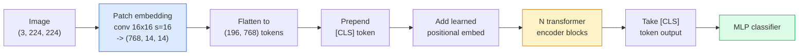

# Vision Transformers (ViT)

> 画像をpatchに切り分け、各patchをwordとして扱い、standard transformerに通します。もう後戻りは不要です。

**種別:** 構築
**言語:** Python
**前提条件:** Phase 7 Lesson 02 (Self-Attention), Phase 4 Lesson 04 (Image Classification)
**所要時間:** 約45分

## 学習目標

- patch embedding、learned positional embedding、class token、transformer encoder blockをscratchから実装し、最小ViTを作る
- DeiTとMAEが覆すまで、ViTには巨大なpretraining dataが必要だと考えられていた理由を説明する
- ViT、Swin、ConvNeXtをarchitectural prior（なし、local window attention、conv backbone）の観点で比較する
- `timm` と標準的なlinear-probe / fine-tune recipeを使い、小さなdatasetで事前学習済みViTをfine-tuneする

## 問題

10年間、convolutionはcomputer visionとほぼ同義でした。CNNにはlocality、translation equivarianceという強いinductive biasがあり、置き換えられないと考えられていました。そこへDosovitskiy et al. (2020)が、flattenしたimage patchに通常のtransformerを適用するだけで、convolutional machineryなしに、scaleすれば最高のCNNに並ぶか上回ることを示しました。

ただし条件は「scaleすれば」でした。ImageNet-1k上のViTはResNetに負けました。ImageNet-21kやJFT-300MでpretrainしてからImageNet-1kでfine-tuneすると勝ちました。結論は、transformerには有用なpriorが不足しているが、十分なdataがあればそれを学習できる、というものでした。その後、DeiT、MAE、DINOは、強いaugmentation、self-supervised pretraining、distillationといった正しいtraining recipeがあれば、小さなdataでもViTは問題なく学習できることを示しました。

2026年でもpure CNNはedge deviceで競争力があります（ConvNeXtが最強候補）。しかしそれ以外ではtransformerが支配的です。segmentation（Mask2Former、SegFormer）、detection（DETR、RT-DETR）、multimodal（CLIP、SigLIP）、video（VideoMAE、VJEPA）などです。知っておくべき基本構造はViT blockです。

## コンセプト

### pipeline



7 stepsです。patch -> token -> attention -> classifier。すべてのvariant（DeiT、Swin、ConvNeXt、MAE pretraining）は、この7つのうち1つか2つを変え、残りはそのままにします。

### Patch embedding

最初のconvが秘密です。kernel size 16、stride 16なので、224x224画像は16x16 patchの14x14 gridになり、それぞれが768次元embeddingへ射影されます。この単一のconvがpatch化と線形射影の両方を行います。

```
Input:  (3, 224, 224)
Conv (3 -> 768, k=16, s=16, no padding):
Output: (768, 14, 14)
Flatten spatial: (196, 768)
```

196 patches = 196 tokensです。各tokenのfeature dimensionは768（ViT-B）、1024（ViT-L）、1280（ViT-H）です。

### Class token

token列の先頭に1つのlearned vectorを追加します。

```
tokens = [CLS; patch_1; patch_2; ...; patch_196]   shape (197, 768)
```

N個のtransformer block後、`[CLS]` の出力がglobal image representationになります。classification headはこの1 vectorだけを読みます。

### Positional embedding

transformerには空間的位置の概念が組み込まれていません。そこで各tokenにlearned vectorを足します。

```
tokens = tokens + learned_pos_embedding   (also shape (197, 768))
```

このembeddingはmodel parameterであり、gradient-based trainingによって2D画像構造に適応します。sinusoidalな2D代替案もありますが、実務ではあまり使われません。

### Transformer encoder block

標準的です。multi-head self-attention、MLP、residual connection、pre-LayerNormです。

```
x = x + MSA(LN(x))
x = x + MLP(LN(x))

MLP is two-layer with GELU: Linear(d -> 4d) -> GELU -> Linear(4d -> d)
```

ViT-B/16はこのblockを12個積み、各blockは12 attention headsを持ち、合計86M parametersです。

### Why pre-LN

初期のtransformerはpost-LN（`x = LN(x + sublayer(x))`）を使い、warmupなしで6-8層を超えて学習するのが難しい問題がありました。Pre-LN（`x = x + sublayer(LN(x))`）は、deep networkをwarmupなしでも安定して学習できます。すべてのViTとmodern LLMはpre-LNを使います。

### Patch size trade-off

- 16x16 patches -> 196 tokens、標準。
- 32x32 patches -> 49 tokens、高速だが低解像度。
- 8x8 patches -> 784 tokens、細かいがO(n^2) attention costが厳しく増える。

patchが大きいほどtokenが少なくなり高速ですが、空間detailは失われます。SwinV2はhierarchical window内で4x4 patchを使います。

### DeiT's recipe for training ViT on ImageNet-1k

元のViTはCNNに勝つためにJFT-300Mを必要としました。DeiT（Touvron et al., 2020）は、次の4つの変更だけでImageNet-1kのみからViT-Bを81.8% top-1まで学習しました。

1. 強いaugmentation: RandAugment、Mixup、CutMix、Random Erasing。
2. Stochastic depth（training中にblock全体をrandomにdropする）。
3. Repeated augmentation（同じ画像をbatch内で3回sampleする）。
4. CNN teacherからのdistillation（任意。accuracyをさらに上げる）。

すべてのmodern ViT training recipeはDeiTの系譜です。

### Swin vs ConvNeXt

- **Swin** (Liu et al., 2021) — window-based attention。各blockはlocal window内でattentionし、交互のblockでwindowをshiftしてwindow間の情報を混ぜます。attention operatorを保ったまま、CNN的なlocality priorを戻します。
- **ConvNeXt** (Liu et al., 2022) — Swinのarchitecture choice（depthwise conv、LayerNorm、GELU、inverted bottleneck）に合わせて再設計されたCNNです。差は「attention vs convolution」ではなく、「modern training recipe + architecture」だと示しました。

2026年時点でConvNeXt-V2とSwin-V2はいずれもproduction-gradeです。正しい選択はinference stack（edgeではConvNeXtの方がcompileしやすい）とpretraining corpusに依存します。

### MAE pretraining

Masked Autoencoder（He et al., 2022）: patchの75%をrandomにmaskし、encoderは見えている25%だけを処理し、小さなdecoderでmasked patchをencoder出力から再構成するように学習します。pretraining後はdecoderを捨て、encoderをfine-tuneします。

MAEによりViTはImageNet-1kのみでも学習可能になり、SOTAに達しました。現在のdefault self-supervised recipeです。

## 作ってみる

### Step 1: Patch embedding

```python
import torch
import torch.nn as nn

class PatchEmbedding(nn.Module):
    def __init__(self, in_channels=3, patch_size=16, dim=192, image_size=64):
        super().__init__()
        assert image_size % patch_size == 0
        self.proj = nn.Conv2d(in_channels, dim, kernel_size=patch_size, stride=patch_size)
        num_patches = (image_size // patch_size) ** 2
        self.num_patches = num_patches

    def forward(self, x):
        x = self.proj(x)
        return x.flatten(2).transpose(1, 2)
```

1つのconv、1つのflatten、1つのtranspose。これがimage-to-tokens stepのすべてです。

### Step 2: Transformer block

Pre-LN、multi-head self-attention、GELU付きMLP、residual connectionsです。

```python
class Block(nn.Module):
    def __init__(self, dim, num_heads, mlp_ratio=4, dropout=0.0):
        super().__init__()
        self.ln1 = nn.LayerNorm(dim)
        self.attn = nn.MultiheadAttention(dim, num_heads, dropout=dropout, batch_first=True)
        self.ln2 = nn.LayerNorm(dim)
        self.mlp = nn.Sequential(
            nn.Linear(dim, dim * mlp_ratio),
            nn.GELU(),
            nn.Dropout(dropout),
            nn.Linear(dim * mlp_ratio, dim),
            nn.Dropout(dropout),
        )

    def forward(self, x):
        a, _ = self.attn(self.ln1(x), self.ln1(x), self.ln1(x), need_weights=False)
        x = x + a
        x = x + self.mlp(self.ln2(x))
        return x
```

`nn.MultiheadAttention` がhead分割、scaled dot-product、output projectionを処理します。`batch_first=True` なのでshapeは `(N, seq, dim)` です。

### Step 3: ViT

```python
class ViT(nn.Module):
    def __init__(self, image_size=64, patch_size=16, in_channels=3,
                 num_classes=10, dim=192, depth=6, num_heads=3, mlp_ratio=4):
        super().__init__()
        self.patch = PatchEmbedding(in_channels, patch_size, dim, image_size)
        num_patches = self.patch.num_patches
        self.cls_token = nn.Parameter(torch.zeros(1, 1, dim))
        self.pos_embed = nn.Parameter(torch.zeros(1, num_patches + 1, dim))
        self.blocks = nn.ModuleList([
            Block(dim, num_heads, mlp_ratio) for _ in range(depth)
        ])
        self.ln = nn.LayerNorm(dim)
        self.head = nn.Linear(dim, num_classes)
        nn.init.trunc_normal_(self.pos_embed, std=0.02)
        nn.init.trunc_normal_(self.cls_token, std=0.02)

    def forward(self, x):
        x = self.patch(x)
        cls = self.cls_token.expand(x.size(0), -1, -1)
        x = torch.cat([cls, x], dim=1)
        x = x + self.pos_embed
        for blk in self.blocks:
            x = blk(x)
        x = self.ln(x[:, 0])
        return self.head(x)

vit = ViT(image_size=64, patch_size=16, num_classes=10, dim=192, depth=6, num_heads=3)
x = torch.randn(2, 3, 64, 64)
print(f"output: {vit(x).shape}")
print(f"params: {sum(p.numel() for p in vit.parameters()):,}")
```

約2.8M parametersで、CPUでも扱いやすいtiny ViTです。本物のViT-Bは86Mです。同じclass definitionで `dim=768, depth=12, num_heads=12` にします。

### Step 4: sanity check — single image inference

```python
logits = vit(torch.randn(1, 3, 64, 64))
print(f"logits: {logits}")
print(f"probs:  {logits.softmax(-1)}")
```

エラーなく実行できるはずです。probabilitiesは合計1になります。

## 使ってみる

`timm` はImageNet事前学習済みweight付きで、あらゆるViT variantを提供します。1行です。

```python
import timm

model = timm.create_model("vit_base_patch16_224", pretrained=True, num_classes=10)
```

`timm` は2026年のvision transformerにおけるproduction defaultです。同じAPIでViT、DeiT、Swin、Swin-V2、ConvNeXt、ConvNeXt-V2、MaxViT、MViT、EfficientFormerなど多数をsupportします。

multi-modal work（image + text）では、`transformers` がCLIP、SigLIP、BLIP-2、LLaVAを提供します。それらすべてのimage encoderはViT variantです。

## 出荷する

このlessonが生成するもの:

- `outputs/prompt-vit-vs-cnn-picker.md` — dataset size、compute、inference stackに基づいてViT、ConvNeXt、Swinのどれを選ぶか決めるprompt。
- `outputs/skill-vit-patch-and-pos-embed-inspector.md` — ViTのpatch embeddingとpositional embeddingのshapeが、modelの期待するsequence lengthに一致するか検証し、最もよくあるporting bugを捕まえるskill。

## 演習

1. **(Easy)** 上のtiny ViTのforward passで、すべての中間tensor shapeをprintしてください。input `(N, 3, 64, 64)` -> patches `(N, 16, 192)` -> with CLS `(N, 17, 192)` -> classifier input `(N, 192)` -> output `(N, num_classes)` を確認してください。
2. **(Medium)** Lesson 4のsynthetic-CIFAR datasetで、事前学習済み`timm` ViT-S/16をfine-tuneしてください。同じdataでResNet-18 fine-tuningと比較し、training timeとfinal accuracyを報告してください。
3. **(Hard)** tiny ViT用のMAE pretrainingを実装してください。patchの75%をmaskし、encoder + 小さなdecoderでmasked patchを再構成するように学習します。pretraining前後のsynthetic dataに対するlinear-probe accuracyを評価してください。

## 重要用語

| 用語 | よく言われること | 実際の意味 |
|------|----------------|----------------------|
| Patch embedding | "最初のconv" | kernel size = stride = patch sizeのconv。画像をtoken embeddingのgridへ変換する |
| Class token | "[CLS]" | token列の先頭に追加されるlearned vector。その最終出力がglobal image representation |
| Positional embedding | "Learned pos" | transformerが各patchの位置を知るため、すべてのtokenに加えるlearned vector |
| Pre-LN | "LayerNorm before sublayer" | 安定したtransformer variant。`LN(x + sublayer(x))` ではなく `x + sublayer(LN(x))` |
| Multi-head attention | "Parallel attention" | standard transformer attentionをnum_heads個の独立subspaceへ分割し、後でconcatenateする |
| ViT-B/16 | "Base, patch 16" | canonical size: dim=768、depth=12、heads=12、patch_size=16、image=224。約86M params |
| DeiT | "Data-efficient ViT" | 強いaugmentationでImageNet-1kのみから学習したViT。巨大pretraining datasetが必須でないことを示した |
| MAE | "Masked autoencoder" | self-supervised pretraining。patchの75%をmaskして再構成する。支配的なViT pretraining recipe |

## 参考文献

- [An Image is Worth 16x16 Words (Dosovitskiy et al., 2020)](https://arxiv.org/abs/2010.11929) — ViT論文
- [DeiT: Data-efficient Image Transformers (Touvron et al., 2020)](https://arxiv.org/abs/2012.12877) — ImageNet-1kのみでViTを学習する方法
- [Masked Autoencoders are Scalable Vision Learners (He et al., 2022)](https://arxiv.org/abs/2111.06377) — MAE pretraining
- [timm documentation](https://huggingface.co/docs/timm) — productionで使うvision transformerのreference
