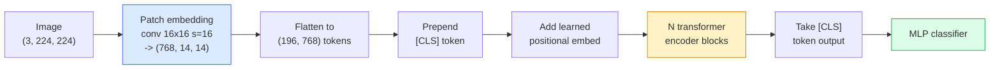

# Vizyon Transformer'ler (ViT)

> Görüntüyü yamalar halinde kesin, her yamayı bir kelime olarak değerlendirin, standart bir transformer çalıştırın. Arkanıza bakmayın.

**Tür:** Yapım
**Diller:** Python
**Önkoşullar:** Aşama 7 Ders 02 (Kişisel Dikkat), Aşama 4 Ders 04 (Görüntü Sınıflandırması)
**Süre:** ~45 dakika

## Öğrenme Hedefleri

- Minimal bir ViT oluşturmak için sıfırdan embedding yamasını, öğrenilen konumsal embedding, sınıf token ve transformer kodlayıcı bloklarını uygulayın
- DeiT ve MAE aksini kanıtlayana kadar ViT'nin neden büyük miktarda ön eğitim verilerine ihtiyaç duyduğunun düşünüldüğünü açıklayın
- ViT, Swin ve ConvNeXt'i mimari önceliklerine göre karşılaştırın (yok, yerel pencere dikkati, dönüşüm omurgası)
- `timm`'yi ve standart doğrusal prob / ince ayar tarifini kullanarak küçük bir dataset üzerinde önceden eğitilmiş bir ViT'ye ince ayar yapın

## Sorun

On yıl boyunca evrişim, bilgisayar görüşüyle eş anlamlıydı. CNN'lerin, kimsenin değiştirebileceğinizi düşünmediği güçlü tümevarımsal önyargıları (yerellik, çeviri eşitliği) vardı. Daha sonra Dosovitskiy ve ark. (2020), düzleştirilmiş görüntü yamalarına hiçbir evrişim makinesi olmadan uygulanan düz bir transformer'nin, ölçekteki en iyi CNN'lerle eşleşebileceğini veya onları yenebileceğini gösterdi.

Yakalama "ölçekli" idi. ImageNet-1k'deki ViT, ResNet'e yenildi. ImageNet-21k veya JFT-300M'de önceden eğitilmiş, ardından ImageNet-1k'de ince ayar yapılmış ViT onu yendi. Sonuç, transformer'lerin yararlı önceliklerden yoksun olduğu ancak bunları yeterli veriden öğrenebildikleriydi. Sonraki çalışmalar (DeiT, MAE, DINO), doğru eğitim reçeteleriyle (güçlü artırma, kendi kendini denetleyen ön eğitim, damıtma) ViT'lerin küçük veriler üzerinde de iyi eğitim aldığını gösterdi.

2026 yılına gelindiğinde, saf CNN'ler uç cihazlarda hâlâ rekabetçi (ConvNeXt en güçlüsüdür), ancak transformer'ler diğer her şeye hakimdir: segmentasyon (Mask2Former, SegFormer), algılama (DETR, RT-DETR), multimodal (CLIP, SigLIP), video (VideoMAE, VJEPA). Bilinmesi gereken ViT blok yapısıdır.

## Konsept

### Boru hattı



Yedi adım. Yamalar -> token'ler -> dikkat -> sınıflandırıcı. Her değişken (DeiT, Swin, ConvNeXt, MAE ön eğitimi) yedisinden birini veya ikisini değiştirir ve gerisini kendi haline bırakır.

### Yaması embedding

İlk görüşme sırdır. Çekirdek boyutu 16, adım 16, yani 224x224'lük bir görüntü, her biri 768-dim embedding'ye yansıtılan 16x16 parçadan oluşan 14x14'lük bir ızgaraya dönüşür. Bu tek dönüşüm hem yama uygular hem de doğrusal olarak yansıtır.

```
Input:  (3, 224, 224)
Conv (3 -> 768, k=16, s=16, no padding):
Output: (768, 14, 14)
Flatten spatial: (196, 768)
```

196 yama = 196 token. Her token'nin özellik boyutu 768 (ViT-B), 1024 (ViT-L) veya 1280'dir (ViT-H).

### Sınıf token

Dizinin başına eklenen tek bir öğrenilmiş vektör:

```
tokens = [CLS; patch_1; patch_2; ...; patch_196]   shape (197, 768)
```

N transformer bloğundan sonra `[CLS]` çıkışı genel görüntü temsilidir. Sınıflandırma başlığı yalnızca bu tek vektörü okur.

### Konumsal embedding

Transformer'lerin yerleşik bir uzamsal konum kavramı yoktur. Her token'ye öğrenilmiş bir vektör ekleyin:

```
tokens = tokens + learned_pos_embedding   (also shape (197, 768))
```

embedding modelin bir parametresidir; gradient tabanlı eğitim, onu 2 boyutlu görüntü yapısına uyarlar. Sinüsoidal 2 boyutlu alternatifler mevcuttur ancak pratikte nadiren kullanılır.

### Transformer kodlayıcı bloğu

Standart. Çok kafalı öz dikkat, MLP, artık bağlantılar, Katman Öncesi Norm.

```
x = x + MSA(LN(x))
x = x + MLP(LN(x))

MLP is two-layer with GELU: Linear(d -> 4d) -> GELU -> Linear(4d -> d)
```

ViT-B/16, her biri 12 dikkat başlığına sahip olan ve toplamda 86M parametreye sahip olan bu bloklardan 12 tanesini istifler.

### Neden LN öncesi

İlk transformer'ler LN sonrası (`x = LN(x + sublayer(x))`) kullandılar ve ısınmadan 6-8 katmanı geçmek için çabaladılar. Ön LN (`x = x + sublayer(LN(x))`), daha derin ağları ısınmadan istikrarlı bir şekilde eğitir. Her ViT ve her modern LLM, LN öncesi kullanır.

### Yama boyutu değişimi

- 16x16 yama -> 196 token, standart.
- 32x32 yama -> 49 token, daha hızlı ancak daha düşük çözünürlük.
- 8x8 yama -> 784 token, daha ince ancak O(n^2) dikkat maliyeti kötü şekilde ölçekleniyor.

Daha büyük yamalar = daha az token = daha hızlı ancak daha az uzamsal ayrıntı. SwinV2 hiyerarşik pencerelerde 4x4 yama kullanır.

### DeiT'in ImageNet-1k'de ViT eğitimi tarifi

Orijinal ViT'nin CNN'leri yenmek için JFT-300M'ye ihtiyacı vardı. DeiT (Touvron ve diğerleri, 2020), ViT-B'yi dört değişiklikle yalnızca ImageNet-1k'de %81,8 ilk 1'e eğitti:

1. Ağır artırma: RandAugment, Mixup, CutMix, Rastgele Silme.
2. Stokastik derinlik (eğitim sırasında tüm blokları rastgele bırakın).
3. Tekrarlanan büyütme (aynı görüntü grup başına 3 kez örneklenir).
4. Bir CNN öğretmeninden damıtma (isteğe bağlı, doğruluğu daha da artırır).

Her modern ViT antrenman tarifi DeiT'ten gelmektedir.

### Swin ve ConvNeXt

- **Swin** (Liu ve diğerleri, 2021) — pencereye dayalı dikkat. Her blok yerel bir pencere içerisinde katılır; Alternatif bloklar, bilgileri pencereler arasında karıştırmak için pencereyi kaydırır. Operatörün dikkatini korurken CNN benzeri bir konumu önceden geri getirir.
- **ConvNeXt** (Liu ve diğerleri, 2022) — Swin'in mimari tercihleriyle (derinlemesine dönüşümler, LayerNorm, GELU, ters çevrilmiş darboğaz) eşleşen CNN'yi yeniden tasarladı. Aradaki farkın "dikkat ve evrişim" değil, "modern eğitim tarifi + mimari" olduğunu gösterdi.

2026'da ConvNeXt-V2 ve Swin-V2'nin her ikisi de üretim sınıfında olacak; doğru seçim inference yığınınıza (ConvNeXt uç için daha iyi derlenir) ve ön eğitim külliyatınıza bağlıdır.

### MAE ön eğitimi

Maskeli Otomatik Kodlayıcı (He ve diğerleri, 2022): yamaların %75'ini rastgele maskeleyin, kodlayıcıyı yalnızca görünür %25'i işleyecek şekilde eğitin, küçük bir kod çözücüyü kodlayıcının çıkışından maskelenmiş yamaları yeniden oluşturacak şekilde eğitin. Ön eğitimden sonra kod çözücüyü atın ve kodlayıcıya ince ayar yapın.

MAE, ViT'yi yalnızca ImageNet-1k üzerinde eğitilebilir hale getirir, SOTA'ya ulaşır ve mevcut varsayılan kendi kendini denetleyen tariftir.

## İnşa Et

### Adım 1: embedding Yaması

```python
import torch
import torch.nn as nn

class PatchEmbedding(nn.Module):
    def __init__(self, in_channels=3, patch_size=16, dim=192, image_size=64):
        super().__init__()
        assert image_size % patch_size == 0
        self.proj = nn.Conv2d(in_channels, dim, kernel_size=patch_size, stride=patch_size)
        num_patches = (image_size // patch_size) ** 2
        self.num_patches = num_patches

    def forward(self, x):
        x = self.proj(x)
        return x.flatten(2).transpose(1, 2)
```

Bir dönüşüm, bir düzleştirme, bir devrik. Görüntüyü token'ye dönüştürme adımının tamamı budur.

### Adım 2: Transformer bloğu

LN öncesi, çok başlı kişisel dikkat, GELU ile MLP, artık bağlantılar.

```python
class Block(nn.Module):
    def __init__(self, dim, num_heads, mlp_ratio=4, dropout=0.0):
        super().__init__()
        self.ln1 = nn.LayerNorm(dim)
        self.attn = nn.MultiheadAttention(dim, num_heads, dropout=dropout, batch_first=True)
        self.ln2 = nn.LayerNorm(dim)
        self.mlp = nn.Sequential(
            nn.Linear(dim, dim * mlp_ratio),
            nn.GELU(),
            nn.Dropout(dropout),
            nn.Linear(dim * mlp_ratio, dim),
            nn.Dropout(dropout),
        )

    def forward(self, x):
        a, _ = self.attn(self.ln1(x), self.ln1(x), self.ln1(x), need_weights=False)
        x = x + a
        x = x + self.mlp(self.ln2(x))
        return x
```

`nn.MultiheadAttention` kafalara bölmeyi, ölçeklendirilmiş nokta çarpımı ve çıktı projeksiyonunu yönetir. `batch_first=True` yani şekiller `(N, seq, dim)`'dir.

### Adım 3: ViT

```python
class ViT(nn.Module):
    def __init__(self, image_size=64, patch_size=16, in_channels=3,
                 num_classes=10, dim=192, depth=6, num_heads=3, mlp_ratio=4):
        super().__init__()
        self.patch = PatchEmbedding(in_channels, patch_size, dim, image_size)
        num_patches = self.patch.num_patches
        self.cls_token = nn.Parameter(torch.zeros(1, 1, dim))
        self.pos_embed = nn.Parameter(torch.zeros(1, num_patches + 1, dim))
        self.blocks = nn.ModuleList([
            Block(dim, num_heads, mlp_ratio) for _ in range(depth)
        ])
        self.ln = nn.LayerNorm(dim)
        self.head = nn.Linear(dim, num_classes)
        nn.init.trunc_normal_(self.pos_embed, std=0.02)
        nn.init.trunc_normal_(self.cls_token, std=0.02)

    def forward(self, x):
        x = self.patch(x)
        cls = self.cls_token.expand(x.size(0), -1, -1)
        x = torch.cat([cls, x], dim=1)
        x = x + self.pos_embed
        for blk in self.blocks:
            x = blk(x)
        x = self.ln(x[:, 0])
        return self.head(x)

vit = ViT(image_size=64, patch_size=16, num_classes=10, dim=192, depth=6, num_heads=3)
x = torch.randn(2, 3, 64, 64)
print(f"output: {vit(x).shape}")
print(f"params: {sum(p.numel() for p in vit.parameters()):,}")
```

Yaklaşık 2,8 milyon parametre — CPU üzerinde izlenebilir küçük bir ViT. Gerçek ViT-B 86M'dir; `dim=768, depth=12, num_heads=12` ile aynı sınıf tanımı.

### Adım 4: Sağlamlık kontrolü — tek görüntü inference

```python
logits = vit(torch.randn(1, 3, 64, 64))
print(f"logits: {logits}")
print(f"probs:  {logits.softmax(-1)}")
```

Hatasız çalışmalıdır. Olasılıkların toplamı 1'dir.

## Kullan onu

`timm`, her ViT varyantını ImageNet önceden eğitilmiş ağırlıklarla birlikte gönderir. Bir satır:

```python
import timm

model = timm.create_model("vit_base_patch16_224", pretrained=True, num_classes=10)
```

`timm`, 2026 yılında vizyon transformer'ler için üretim varsayılanıdır. Aynı API altında ViT, DeiT, Swin, Swin-V2, ConvNeXt, ConvNeXt-V2, MaxViT, MViT, EfficientFormer ve düzinelercesini destekler.

Çok modlu çalışma (resim + metin) için `transformers`, CLIP, SigLIP, BLIP-2, LLaVA'yı sunar. Bunların tamamındaki görüntü kodlayıcı bir ViT çeşididir.

## Gönderin

Bu ders şunları üretir:

- `outputs/prompt-vit-vs-cnn-picker.md` — dataset boyutuna, hesaplamaya ve inference yığınına göre ViT, ConvNeXt veya Swin arasında seçim yapan bir prompt.
- `outputs/skill-vit-patch-and-pos-embed-inspector.md` — bir ViT yaması embedding ve konumsal embedding şekillerinin modelin beklenen dizi uzunluğuyla eşleştiğini doğrulayan ve en yaygın taşıma hatalarını yakalayan bir beceri.

## Egzersizler

1. **(Kolay)** Yukarıdaki küçük ViT'den ileri geçiş için her ara tensörün şeklini yazdırın. Onaylayın: `(N, 3, 64, 64)` girişi -> `(N, 16, 192)` yamaları -> CLS `(N, 17, 192)` ile -> `(N, 192)` sınıflandırıcı girişi -> `(N, num_classes)` çıkışı.
2. **(Orta)** Ders 4'teki sentetik-CIFAR dataset üzerinde önceden eğitilmiş bir `timm` ViT-S/16'ya ince ayar yapın. Aynı veriler üzerinde ResNet-18 fine-tuning ile karşılaştırın. Eğitim süresini ve nihai doğruluğunu rapor edin.
3. **(Zor)** Küçük ViT için MAE ön eğitimini uygulayın: yamaların %75'ini maskeleyin, maskelenmiş yamaları yeniden oluşturmak için kodlayıcıyı + küçük bir kod çözücüyü eğitin. Ön eğitimden önce ve sonra sentetik veriler üzerindeki doğrusal prob doğruluğunu değerlendirin.

## Anahtar Terimler

| Dönem | İnsanlar ne diyor | Aslında ne anlama geliyor |
|------|----------------|----------------------|
| Yama embedding | "İlk dönüşüm" | Çekirdek boyutuna sahip bir dönüşüm = adım = yama boyutu; görüntüyü token embedding'lerden oluşan bir ızgaraya dönüştürür |
| Sınıf token | "[CLS]" | token dizisinin başına eklenen öğrenilmiş bir vektör; nihai çıktısı küresel görüntü temsilidir |
| Konumsal embedding | "Öğrenilen konum" | Her token'ye öğrenilmiş bir vektör eklendi, böylece transformer her yamanın nereden geldiğini bilir |
| LN Öncesi | "Alt katmandan önceki KatmanNormu" | Kararlı transformer çeşidi: `LN(x + sublayer(x))` yerine `x + sublayer(LN(x))` |
| Çok kafalı dikkat | "Paralel dikkat" | Standart transformer dikkat, daha sonra birleştirilen sayı_başlıklı bağımsız alt uzaylara bölünmüştür |
| ViT-B/16 | "Temel, yama 16" | Kanonik boyut: dim=768, derinlik=12, kafalar=12, patch_size=16, image=224; ~86M parametre |
| DeiT | "Veri açısından verimli ViT" | ViT, güçlü bir güçlendirmeyle yalnızca ImageNet-1k üzerinde eğitildi; kanıtlanmış büyük ön eğitim dataset'lerin kesinlikle gerekli olmadığı |
| MAE | "Maskeli otomatik kodlayıcı" | Kendi kendine denetlenen ön eğitim: yamaların %75'ini maskeleyin, yeniden yapılandırın; Baskın ViT antrenman öncesi tarifi |

## Daha Fazla Okuma

- [Bir Görüntü 16x16 Kelimeye Değerdir (Dosovitskiy ve diğerleri, 2020)](https://arxiv.org/abs/2010.11929) — ViT makalesi
- [DeiT: Veri verimli Image Transformers (Touvron ve diğerleri, 2020)](https://arxiv.org/abs/2012.12877) — ViT'nin yalnızca ImageNet-1k üzerinde nasıl eğitileceği
- [Maskeli Otomatik Kodlayıcılar Ölçeklenebilir Görme Öğrenicileridir (He ve diğerleri, 2022)](https://arxiv.org/abs/2111.06377) — MAE ön eğitimi
- [timm belgeleri](https://huggingface.co/docs/timm) — üretimde kullanacağınız her transformer vizyonu için referans
