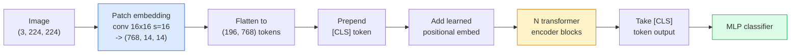

# 14 · 视觉 Transformer（ViT）

> 把图像切成小块（patch），把每个 patch 当成一个词，跑一个标准 Transformer。不要回头。

**类型：** 实践构建
**语言：** Python
**前置：** 第 7 阶段第 02 课（自注意力），第 4 阶段第 04 课（图像分类）
**时长：** 约 45 分钟

## 学习目标

- 从零实现 patch 嵌入（patch embedding）、可学习位置嵌入（learned positional embedding）、类别标记（class token）以及 Transformer 编码器块，搭建一个最小化的 ViT
- 解释为什么 ViT 曾被认为需要海量预训练数据，直到 DeiT 和 MAE 证明并非如此
- 从架构先验（无先验、局部窗口注意力、卷积骨干网络）的角度对比 ViT、Swin 和 ConvNeXt
- 使用 `timm` 以及标准的线性探测（linear-probe）/ 微调（fine-tune）配方，在小数据集上微调一个预训练的 ViT

## 问题所在

整整十年间，卷积几乎就是计算机视觉的代名词。卷积神经网络（CNN）拥有强大的归纳偏置（inductive bias）——局部性、平移等变性——没人认为这些东西能被替代。然后 Dosovitskiy 等人（2020）证明：一个直接作用于展平图像 patch 的普通 Transformer，完全不依赖任何卷积机制，在大规模数据上就能匹敌甚至超越最强的 CNN。

关键在于「大规模」。在 ImageNet-1k 上，ViT 输给了 ResNet。而先在 ImageNet-21k 或 JFT-300M 上预训练、再在 ImageNet-1k 上微调的 ViT 则胜出。由此得出的结论是：Transformer 缺乏有用的先验，但只要数据足够多，它能自己学出来。后续工作（DeiT、MAE、DINO）则表明：只要训练配方得当——强数据增强、自监督预训练、知识蒸馏——ViT 在小数据上同样训练良好。

到 2026 年，纯 CNN 在边缘设备上依然有竞争力（ConvNeXt 是其中最强的），但 Transformer 在其他几乎所有领域占据主导：分割（Mask2Former、SegFormer）、检测（DETR、RT-DETR）、多模态（CLIP、SigLIP）、视频（VideoMAE、VJEPA）。ViT 的块结构是必须掌握的那一个。

## 核心概念

### 流程管线



七个步骤。patch -> token -> 注意力 -> 分类器。每一种变体（DeiT、Swin、ConvNeXt、MAE 预训练）都只改动这七步中的一到两步，其余原封不动。

### Patch 嵌入

第一层卷积是秘诀所在。卷积核大小为 16，步长为 16，于是一张 224x224 的图像变成 14x14 的网格、每格是一个 16x16 的 patch，每个 patch 被投影成一个 768 维的嵌入向量。这一层卷积同时完成了「切块」和「线性投影」两件事。

```
Input:  (3, 224, 224)
Conv (3 -> 768, k=16, s=16, no padding):
Output: (768, 14, 14)
Flatten spatial: (196, 768)
```

196 个 patch = 196 个 token。每个 token 的特征维度为 768（ViT-B）、1024（ViT-L）或 1280（ViT-H）。

### 类别标记

一个被预置（prepend）到序列开头的可学习向量：

```
tokens = [CLS; patch_1; patch_2; ...; patch_196]   shape (197, 768)
```

经过 N 个 Transformer 块之后，`[CLS]` 的输出就是全局图像表示。分类头只读取这一个向量。

### 位置嵌入

Transformer 本身没有空间位置的概念。给每个 token 加上一个可学习向量：

```
tokens = tokens + learned_pos_embedding   (also shape (197, 768))
```

该嵌入是模型的一个参数；基于梯度的训练会让它自适应于二维图像结构。也存在二维正弦（sinusoidal）位置嵌入的替代方案，但实践中很少使用。

### Transformer 编码器块

标准结构。多头自注意力（multi-head self-attention）、MLP、残差连接、前置 LayerNorm（pre-LayerNorm）。

```
x = x + MSA(LN(x))
x = x + MLP(LN(x))

MLP is two-layer with GELU: Linear(d -> 4d) -> GELU -> Linear(4d -> d)
```

ViT-B/16 堆叠了 12 个这样的块，每个块有 12 个注意力头，参数总量为 8600 万。

### 为什么用 pre-LN

早期的 Transformer 使用 post-LN（`x = LN(x + sublayer(x))`），不借助预热（warmup）就很难训练超过 6-8 层。pre-LN（`x = x + sublayer(LN(x))`）则无需预热即可稳定训练更深的网络。所有 ViT 以及所有现代大语言模型都使用 pre-LN。

### Patch 大小的取舍

- 16x16 patch -> 196 个 token，标准配置。
- 32x32 patch -> 49 个 token，更快但分辨率更低。
- 8x8 patch -> 784 个 token，更精细，但 O(n^2) 的注意力开销增长得很糟糕。

patch 越大 = token 越少 = 越快但空间细节越少。SwinV2 在分层窗口中使用 4x4 的 patch。

### DeiT 在 ImageNet-1k 上训练 ViT 的配方

最初的 ViT 需要 JFT-300M 才能击败 CNN。DeiT（Touvron 等人，2020）仅用 ImageNet-1k 就把 ViT-B 训练到了 81.8% 的 top-1 准确率，靠的是四项改动：

1. 重度数据增强：RandAugment、Mixup、CutMix、Random Erasing。
2. 随机深度（stochastic depth，训练时随机丢弃整个块）。
3. 重复增强（repeated augmentation，同一张图在一个批次内被采样 3 次）。
4. 从 CNN 教师模型进行蒸馏（可选，能进一步提升准确率）。

每一个现代 ViT 训练配方都源自 DeiT。

### Swin 对比 ConvNeXt

- **Swin**（Liu 等人，2021）——基于窗口的注意力。每个块在一个局部窗口内做注意力；相邻的块会移动窗口，从而在窗口之间混合信息。它在保留注意力算子的同时，重新引入了类似 CNN 的局部性先验。
- **ConvNeXt**（Liu 等人，2022）——重新设计的 CNN，匹配了 Swin 的架构选择（深度可分离卷积、LayerNorm、GELU、倒置瓶颈结构）。它表明：差距并不在于「注意力 vs 卷积」，而在于「现代训练配方 + 架构」。

到 2026 年，ConvNeXt-V2 和 Swin-V2 都已达到生产级水准；正确的选择取决于你的推理技术栈（ConvNeXt 在边缘设备上能更好地编译）和预训练语料。

### MAE 预训练

掩码自编码器（Masked Autoencoder，He 等人，2022）：随机掩盖 75% 的 patch，训练编码器只处理可见的那 25%，再训练一个小型解码器从编码器的输出重建被掩盖的 patch。预训练结束后丢弃解码器，对编码器进行微调。

MAE 让 ViT 仅凭 ImageNet-1k 就能训练，达到了 SOTA，是当前默认的自监督配方。

## 动手构建

### 第 1 步：Patch 嵌入

```python
import torch
import torch.nn as nn

class PatchEmbedding(nn.Module):
    def __init__(self, in_channels=3, patch_size=16, dim=192, image_size=64):
        super().__init__()
        assert image_size % patch_size == 0
        self.proj = nn.Conv2d(in_channels, dim, kernel_size=patch_size, stride=patch_size)
        num_patches = (image_size // patch_size) ** 2
        self.num_patches = num_patches

    def forward(self, x):
        x = self.proj(x)
        return x.flatten(2).transpose(1, 2)
```

一次卷积、一次展平、一次转置。这就是整个「图像到 token」的步骤。

### 第 2 步：Transformer 块

pre-LN、多头自注意力、带 GELU 的 MLP、残差连接。

```python
class Block(nn.Module):
    def __init__(self, dim, num_heads, mlp_ratio=4, dropout=0.0):
        super().__init__()
        self.ln1 = nn.LayerNorm(dim)
        self.attn = nn.MultiheadAttention(dim, num_heads, dropout=dropout, batch_first=True)
        self.ln2 = nn.LayerNorm(dim)
        self.mlp = nn.Sequential(
            nn.Linear(dim, dim * mlp_ratio),
            nn.GELU(),
            nn.Dropout(dropout),
            nn.Linear(dim * mlp_ratio, dim),
            nn.Dropout(dropout),
        )

    def forward(self, x):
        a, _ = self.attn(self.ln1(x), self.ln1(x), self.ln1(x), need_weights=False)
        x = x + a
        x = x + self.mlp(self.ln2(x))
        return x
```

`nn.MultiheadAttention` 处理了拆分为多头、缩放点积以及输出投影。设置 `batch_first=True`，因此张量形状为 `(N, seq, dim)`。

### 第 3 步：ViT 本体

```python
class ViT(nn.Module):
    def __init__(self, image_size=64, patch_size=16, in_channels=3,
                 num_classes=10, dim=192, depth=6, num_heads=3, mlp_ratio=4):
        super().__init__()
        self.patch = PatchEmbedding(in_channels, patch_size, dim, image_size)
        num_patches = self.patch.num_patches
        self.cls_token = nn.Parameter(torch.zeros(1, 1, dim))
        self.pos_embed = nn.Parameter(torch.zeros(1, num_patches + 1, dim))
        self.blocks = nn.ModuleList([
            Block(dim, num_heads, mlp_ratio) for _ in range(depth)
        ])
        self.ln = nn.LayerNorm(dim)
        self.head = nn.Linear(dim, num_classes)
        nn.init.trunc_normal_(self.pos_embed, std=0.02)
        nn.init.trunc_normal_(self.cls_token, std=0.02)

    def forward(self, x):
        x = self.patch(x)
        cls = self.cls_token.expand(x.size(0), -1, -1)
        x = torch.cat([cls, x], dim=1)
        x = x + self.pos_embed
        for blk in self.blocks:
            x = blk(x)
        x = self.ln(x[:, 0])
        return self.head(x)

vit = ViT(image_size=64, patch_size=16, num_classes=10, dim=192, depth=6, num_heads=3)
x = torch.randn(2, 3, 64, 64)
print(f"output: {vit(x).shape}")
print(f"params: {sum(p.numel() for p in vit.parameters()):,}")
```

约 280 万参数——一个在 CPU 上也跑得动的微型 ViT。真正的 ViT-B 有 8600 万参数；同一个类定义，只需改成 `dim=768, depth=12, num_heads=12`。

### 第 4 步：合理性检查——单张图像推理

```python
logits = vit(torch.randn(1, 3, 64, 64))
print(f"logits: {logits}")
print(f"probs:  {logits.softmax(-1)}")
```

应当无报错运行。各类别概率之和为 1。

## 实际使用

`timm` 提供了所有带 ImageNet 预训练权重的 ViT 变体。一行搞定：

```python
import timm

model = timm.create_model("vit_base_patch16_224", pretrained=True, num_classes=10)
```

到 2026 年，`timm` 是视觉 Transformer 的生产级默认选择。它在同一套 API 下支持 ViT、DeiT、Swin、Swin-V2、ConvNeXt、ConvNeXt-V2、MaxViT、MViT、EfficientFormer 以及数十种其他模型。

对于多模态工作（图像 + 文本），`transformers` 提供了 CLIP、SigLIP、BLIP-2、LLaVA。它们当中的图像编码器全都是某种 ViT 变体。

## 交付产物

本课产出：

- `outputs/prompt-vit-vs-cnn-picker.md` —— 一个提示词，根据数据集规模、算力和推理技术栈，在 ViT、ConvNeXt 与 Swin 之间做选择。
- `outputs/skill-vit-patch-and-pos-embed-inspector.md` —— 一个技能，用于验证 ViT 的 patch 嵌入和位置嵌入的形状是否与模型预期的序列长度一致，从而捕捉移植过程中最常见的 bug。

## 练习

1. **（简单）** 打印微型 ViT 一次前向传播中每一个中间张量的形状。确认：输入 `(N, 3, 64, 64)` -> patch `(N, 16, 192)` -> 加上 CLS 后 `(N, 17, 192)` -> 分类器输入 `(N, 192)` -> 输出 `(N, num_classes)`。
2. **（中等）** 在第 4 课的合成 CIFAR 数据集上微调一个预训练的 `timm` ViT-S/16。与在相同数据上微调的 ResNet-18 进行对比。报告训练时间和最终准确率。
3. **（困难）** 为微型 ViT 实现 MAE 预训练：掩盖 75% 的 patch，训练编码器 + 一个小型解码器来重建被掩盖的 patch。评估预训练前后在合成数据上的线性探测准确率。

## 关键术语

| 术语 | 大家怎么说 | 实际含义 |
|------|----------------|----------------------|
| Patch 嵌入 | 「第一层卷积」 | 一个卷积核大小 = 步长 = patch 大小的卷积；把图像变成一个由 token 嵌入构成的网格 |
| 类别标记 | 「[CLS]」 | 预置到 token 序列开头的可学习向量；它的最终输出是全局图像表示 |
| 位置嵌入 | 「可学习位置」 | 加到每个 token 上的可学习向量，让 Transformer 知道每个 patch 来自哪里 |
| pre-LN | 「LayerNorm 放在子层之前」 | 稳定的 Transformer 变体：用 `x + sublayer(LN(x))` 取代 `LN(x + sublayer(x))` |
| 多头注意力 | 「并行注意力」 | 标准 Transformer 注意力被拆分为 num_heads 个独立子空间，之后再拼接起来 |
| ViT-B/16 | 「Base，patch 16」 | 标准规格：dim=768、depth=12、heads=12、patch_size=16、image=224；约 8600 万参数 |
| DeiT | 「数据高效的 ViT」 | 仅用 ImageNet-1k 配合强数据增强训练的 ViT；证明了大规模预训练数据集并非严格必需 |
| MAE | 「掩码自编码器」 | 自监督预训练：掩盖 75% 的 patch 并重建；当前主流的 ViT 预训练配方 |

## 延伸阅读

- [An Image is Worth 16x16 Words (Dosovitskiy et al., 2020)](https://arxiv.org/abs/2010.11929) —— ViT 原论文
- [DeiT: Data-efficient Image Transformers (Touvron et al., 2020)](https://arxiv.org/abs/2012.12877) —— 如何仅用 ImageNet-1k 训练 ViT
- [Masked Autoencoders are Scalable Vision Learners (He et al., 2022)](https://arxiv.org/abs/2111.06377) —— MAE 预训练
- [timm documentation](https://huggingface.co/docs/timm) —— 你在生产中会用到的每一个视觉 Transformer 的参考文档
