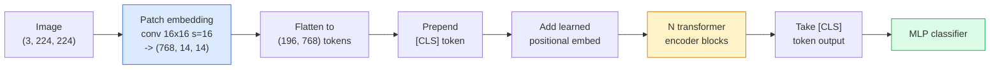

# Vision Transformers (ViT)

> 将图像切割成补丁，将每个补丁视为一个单词，运行标准Transformer。别回头

** 类型：** 构建
** 语言：** Python
** 前提：** 阶段7第2课（自我注意），阶段4第4课（图像分类）
** 时间：** ~45分钟

## Learning Objectives

- 从头开始实施补丁嵌入、学习位置嵌入、类令牌和Transformer编码器块，以构建最小的ViT
- 解释为什么ViT被认为需要大量预训练数据，直到DeiT和MAE证明并非如此
- 比较ViT、Swin和ConvNeXt的架构先验（无、本地窗口关注、conv主干）
- 使用“timm”和标准线性探测/微调食谱在小数据集上微调预训练的ViT

## The Problem

十年来，卷积一直是计算机视觉的代名词。CNN有很强的归纳偏差--局部性、翻译等方差--没有人认为你可以取代这些偏差。然后，Dosovitskiy等人（2020）表明，应用于扁平图像补丁的普通Transformer（根本没有卷积机制）可以匹配或击败大规模最好的CNN。

捕获是“规模化的。ImageNet上的ViT-1 k输给了ResNet。ViT在ImageNet-21 k或JFT-300 M上进行预训练，然后在ImageNet-1 k上进行微调。结论是transformers缺乏有用的先验知识，但可以从足够的数据中学习它们。随后的工作（DeiT，MAE，DINO）表明，通过正确的训练配方-强大的增强，自我监督的预训练，蒸馏- ViTs在小数据上也能很好地训练。

到2026年，纯CNN在边缘设备上仍然具有竞争力（ConvNeXt是最强的），但转换器主导了其他一切：分段（Mask 2Former、SegFormer）、检测（DETR、RT-DETR）、多模式（CLIP、SigLIP）、视频（VideoMAE、VJEPA）。ViT块结构是需要了解的。

## The Concept

### The pipeline



七步。补丁->标记->注意->分类器。每个变体（DeiT，Swin，ConvNeXt，MAE预训练）都会改变七个变量中的一个或两个，而其余的变量则保持不变。

### Patch embedding

第一个秘密是秘密。核心大小为16，跨度为16，因此224 x224图像将成为由16 x16补丁组成的14 x14网格，每个补丁投影到768-dim嵌入。该单一转换既可以细分又可以线性投影。

```
Input:  (3, 224, 224)
Conv (3 -> 768, k=16, s=16, no padding):
Output: (768, 14, 14)
Flatten spatial: (196, 768)
```

196 补丁= 196个令牌。每个代币的特征维度为768（ViT-B）、1024（ViT-L）或1280（ViT-H）。

### Class token

序列前有一个学习的载体：

```
tokens = [CLS; patch_1; patch_2; ...; patch_196]   shape (197, 768)
```

经过N个Transformer块后，“[LIS]”输出是全局图像表示。分类头只读取这一个向量。

### Positional embedding

变形金刚没有固有的空间位置概念。向每个令牌添加一个学习的载体：

```
tokens = tokens + learned_pos_embedding   (also shape (197, 768))
```

嵌入是模型的一个参数;基于梯度的训练使其适应2D图像结构。虽然有鼻窦2D替代方案，但很少在实践中使用。

### Transformer encoder block

标准多头自我注意力、MLP、剩余连接、前LayerNorm。

```
x = x + MSA(LN(x))
x = x + MLP(LN(x))

MLP is two-layer with GELU: Linear(d -> 4d) -> GELU -> Linear(4d -> d)
```

ViT-B/16堆叠了12个这样的块，每个块有12个注意头，总共8600万个参数。

### Why pre-LN

早期的变压器使用LN后（' x = LN（x +子层（x））'），并且在没有预热的情况下很难训练超过6-8层。Pre-LN（' x = x +子层（LN（x））'）无需预热即可稳定训练更深层次的网络。每个ViT和每个现代LLM都使用预LN。

### Patch size trade-off

- 16 x16补丁-> 196个令牌，标准。
- 32 x32补丁-> 49个令牌，速度更快，但分辨率更低。
- 8x 8补丁-> 784个令牌，更细，但O（n#2）注意力成本比例很大。

更大的补丁=更少的令牌=更快，但空间细节更少。SwinV2在分层窗口中使用4x 4补丁。

### DeiT's recipe for training ViT on ImageNet-1k

最初的ViT需要JFT-300 M才能击败CNN。DeiT（Touvron等人，2020年）仅在ImageNet-1 k上就将ViT-B训练为81.8%的前一名，并进行了四项变化：

1. 重度增强：RandAugment、Mixup、CutMix、Random Eraser。
2. 随机深度（训练期间随机投掷整个区块）。
3. 重复增强（同一图像每批采样3次）。
4. CNN老师的蒸馏（可选，进一步提高准确性）。

每一个现代ViT训练食谱都源自DeiT。

### Swin vs ConvNeXt

- **Swin**（Liu等人，2021）-基于窗口的关注。每个块都在本地窗口内进行;交替的块会移动窗口以混合窗口之间的信息。在保持注意力操作员的同时，恢复类似CNN的位置先验。
- **ConvNeXt**（Liu等人，2022年）-重新设计的CNN，与Swin的架构选择相匹配（dependency convs、LayerNorm、GELU、倒置瓶颈）。表明差距不是“注意力与卷积”，而是“现代训练食谱+架构”。"

2026年，ConvNeXt-V2和Swin-V2都是生产级的;正确的选择取决于您的推断堆栈（ConvNeXt对于边缘编译得更好）和预训练文集。

### MAE pretraining

屏蔽自动编码器（He等人，2022年）：随机屏蔽75%的补丁，训练编码器仅处理可见的25%，训练小型解码器从编码器的输出中重建屏蔽的补丁。预训练后，丢弃解码器并微调编码器。

MAE使ViT可单独在ImageNet-1 k上训练，符合SOTA，并且是当前默认的自我监督食谱。

## Build It

### Step 1: Patch embedding

```python
import torch
import torch.nn as nn

class PatchEmbedding(nn.Module):
    def __init__(self, in_channels=3, patch_size=16, dim=192, image_size=64):
        super().__init__()
        assert image_size % patch_size == 0
        self.proj = nn.Conv2d(in_channels, dim, kernel_size=patch_size, stride=patch_size)
        num_patches = (image_size // patch_size) ** 2
        self.num_patches = num_patches

    def forward(self, x):
        x = self.proj(x)
        return x.flatten(2).transpose(1, 2)
```

一次转换，一次压平，一次调换。这是从图像到代币的整个步骤。

### Step 2: Transformer block

LN前、多头自我注意力、MLP与GELU、剩余连接。

```python
class Block(nn.Module):
    def __init__(self, dim, num_heads, mlp_ratio=4, dropout=0.0):
        super().__init__()
        self.ln1 = nn.LayerNorm(dim)
        self.attn = nn.MultiheadAttention(dim, num_heads, dropout=dropout, batch_first=True)
        self.ln2 = nn.LayerNorm(dim)
        self.mlp = nn.Sequential(
            nn.Linear(dim, dim * mlp_ratio),
            nn.GELU(),
            nn.Dropout(dropout),
            nn.Linear(dim * mlp_ratio, dim),
            nn.Dropout(dropout),
        )

    def forward(self, x):
        a, _ = self.attn(self.ln1(x), self.ln1(x), self.ln1(x), need_weights=False)
        x = x + a
        x = x + self.mlp(self.ln2(x))
        return x
```

' nn.MultiheadAttention '处理头部的拆分、缩放的点积和输出投影。' batch_start =True '所以形状是'（N，seq，dim）'。

### Step 3: The ViT

```python
class ViT(nn.Module):
    def __init__(self, image_size=64, patch_size=16, in_channels=3,
                 num_classes=10, dim=192, depth=6, num_heads=3, mlp_ratio=4):
        super().__init__()
        self.patch = PatchEmbedding(in_channels, patch_size, dim, image_size)
        num_patches = self.patch.num_patches
        self.cls_token = nn.Parameter(torch.zeros(1, 1, dim))
        self.pos_embed = nn.Parameter(torch.zeros(1, num_patches + 1, dim))
        self.blocks = nn.ModuleList([
            Block(dim, num_heads, mlp_ratio) for _ in range(depth)
        ])
        self.ln = nn.LayerNorm(dim)
        self.head = nn.Linear(dim, num_classes)
        nn.init.trunc_normal_(self.pos_embed, std=0.02)
        nn.init.trunc_normal_(self.cls_token, std=0.02)

    def forward(self, x):
        x = self.patch(x)
        cls = self.cls_token.expand(x.size(0), -1, -1)
        x = torch.cat([cls, x], dim=1)
        x = x + self.pos_embed
        for blk in self.blocks:
            x = blk(x)
        x = self.ln(x[:, 0])
        return self.head(x)

vit = ViT(image_size=64, patch_size=16, num_classes=10, dim=192, depth=6, num_heads=3)
x = torch.randn(2, 3, 64, 64)
print(f"output: {vit(x).shape}")
print(f"params: {sum(p.numel() for p in vit.parameters()):,}")
```

大约280万个参数-一个可在中央处理器上处理的微小ViT。真实ViT-B为86 M;相同的类定义，“dim=768，深度=12，num_heads=12”。

### Step 4: Sanity check — single image inference

```python
logits = vit(torch.randn(1, 3, 64, 64))
print(f"logits: {logits}")
print(f"probs:  {logits.softmax(-1)}")
```

应无错误地运行。概率总和为1。

## Use It

“tim”使用ImageNet预训练的权重来运送每个ViT变体。一行：

```python
import timm

model = timm.create_model("vit_base_patch16_224", pretrained=True, num_classes=10)
```

“timm”是2026年视觉转换器的生产默认值。支持ViT，DeiT，Swin，Swin-V2，ConvNeXt，ConvNeXt-V2，MaxViT，MViT，EfficientFormer，和其他几十个在同一API下。

对于多模式工作（图像+文本），“transformers”推出CLIP、SigLIP、BLIP-2、LLaVA。所有这些中的图像编码器都是ViT变体。

## Ship It

本课产生：

- ' outputes/prompt-vit-vs-cnn-picker.md '-根据数据集大小、计算和推理堆栈在ViT、ConvNeXt或Swin之间进行选择的提示。
- ' outputes/skill-vit-patch-and-pos-embed-inspector.md '-一种验证ViT的补丁嵌入和位置嵌入形状是否匹配模型的预期序列长度的技能，以捕获最常见的移植错误。

## Exercises

1. **（简单）** 打印每个中间张量的形状，以便向前通过上面的微小ViT。确认：输入'（N，3，64，64）'->补丁'（N，16，192）'-'与XS '（N，17，192）'->输出'（N，num_classes）'。
2. **（中）** 在第4课的合成CIFAR数据集上微调预训练的“timm”ViT-S/16。与相同数据上的ResNet-18微调进行比较。报告培训时间和最终准确性。
3. **（硬）** 对微小ViT实施MAE预训练：屏蔽75%的补丁，训练编码器+小型解码器来重建屏蔽的补丁。评估预训练前后合成数据的线性探测准确性。

## Key Terms

| Term | 别人怎么说 | 它实际上意味着什么 |
|------|----------------|----------------------|
| 补丁嵌入 | “第一场会议” | 内核大小= stride = patch大小的conv;将图像转换为令牌嵌入的网格 |
| 类令牌 | “[CLS]” | 预先添加到令牌序列的学习载体;其最终输出是全局图像表示 |
| 位置嵌入 | “学到的位置” | 将学习向量添加到每个令牌，以便Transformer知道每个补丁来自何处 |
| LN前 | “子层之前的规范” | 稳定Transformer变体：“x +子层（LN（x））”而不是“LN（x +子层（x））” |
| 多头注意 | “平行关注” | 标准的Transformer注意力被拆分为num_heads独立子空间，然后连接 |
| ViT-B/16 | “基础，补丁16” | 典型大小：dim=768，深度=12，heads=12，patch_size=16，图像=224; ~ 86 M参数 |
| 戴特 | “数据高效ViT” | ViT单独在ImageNet-1 k上进行训练，并具有强大的增强;已证明不严格要求大型预训练数据集 |
| Mae | “蒙面自动编码器” | 自我监督预训练：掩盖75%的补丁，重建;主要的ViT预训练配方 |

## Further Reading

- [An图像价值16 x16字（Dosovitskiy等人，2020）]（https：//arxiv.org/ab/2010.11929）-ViT论文
- [DeiT：数据高效的图像变形金刚（Touvron等人，2020）]（https：//arxiv.org/ab/2012.12877）-如何在ImageNet上训练ViT-仅1 k
- [屏蔽自动编码器是可扩展的视觉学习者（他等人，2022）]（https：//arxiv.org/ab/2111.06377）- MAE预培训
- [timm文档]（https：//huggingface.co/docs/timm）-您将在生产中使用的每个视觉Transformer的参考
