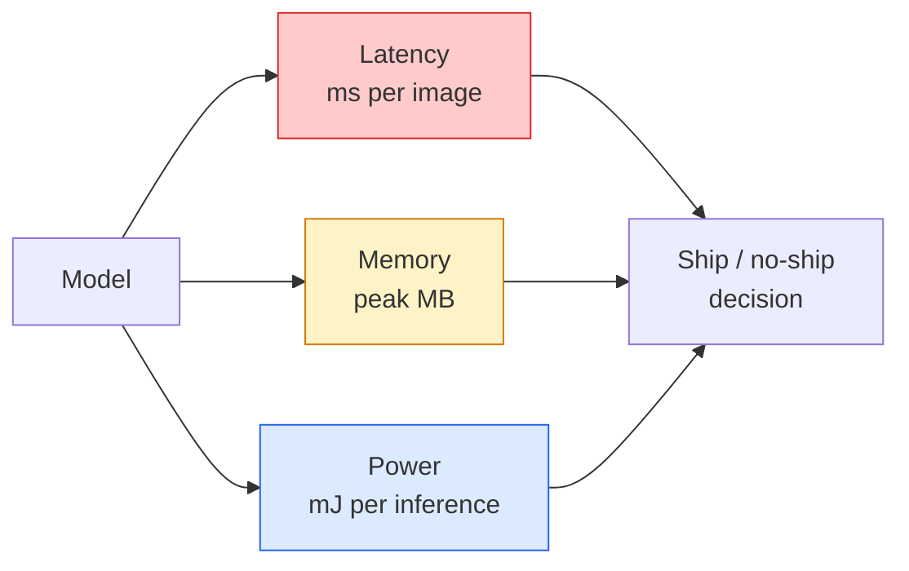

# Real-Time Vision — Edge Deployment

> Edge inferenceとは、90% accuracyのmodelを、RAM 2 GBのdevice上で30 fpsで動かす技術です。accuracyの1 percentage pointは、latencyの数ミリ秒と常に交換されています。

**種別:** 学習 + 構築
**言語:** Python
**前提条件:** Phase 4 Lesson 04 (Image Classification), Phase 10 Lesson 11 (Quantization)
**所要時間:** 約75分

## 学習目標

- 任意のPyTorch modelについてinference latency、peak memory、throughputを測定し、FLOPs / params / latencyのtrade-offを読む
- PyTorchのpost-training quantisationでvision modelをINT8へquantiseし、accuracy loss < 1%を検証する
- ONNXへexportし、ONNX RuntimeまたはTensorRTでcompileする。最もよくある3つのexport failureと修正を説明する
- edge制約でMobileNetV3、EfficientNet-Lite、ConvNeXt-Tiny、MobileViTのどれを選ぶべきか説明する

## 問題

training-timeのvision modelはfloating-pointの怪物です。100M parameters、forward passあたり10 GFLOPs、2 GBのVRAM。phone、car infotainment unit、industrial camera、droneのどれにもそのままは入りません。vision systemを出荷するとは、同じpredictionを100分の1のbudgetに収めることです。

作業の大半は3つのknobで決まります。model choice（同じrecipeで小さいarchitecture）、quantisation（FP32ではなくINT8）、inference runtime（ONNX Runtime、TensorRT、Core ML、TFLite）です。これらを正しく選べるかが、workstation上のdemoと30ドルのcamera moduleで動くproductを分けます。

このlessonではまずmeasurement disciplineを整えます（測れないものは最適化できません）。その後、3つのknobを順に扱います。目的はすべてのedge runtimeを覚えることではなく、存在するleverと、それぞれが本当に効いたか検証する方法を知ることです。

## コンセプト

### 3つのbudget



- **Latency**: p50、p95、p99。p50平均だけでは、real-time systemで重要なtail behaviourが隠れます。
- **Peak memory**: steady-state averageではなく、deviceが一度でも見る最大値。embedded targetではOOMが致命的です。
- **Power / energy**: battery-powered deviceでのinferenceあたりmillijoules。CPU/GPU utilisation * timeで近似することが多いです。

(model, latency, memory, accuracy) の表がedge decisionの材料です。各cellはworkstationではなくtarget device上で測定します。

### Measurement discipline

すべてのedge profileが守るべき3つのruleです。

1. 測定前に5-10回のdummy forward passでmodelを **warm up** する。cold cacheやJIT compilationは代表的でない初回値を生みます。
2. timed blockの前後で `torch.cuda.synchronize()` によりGPU workloadを **synchronise** する。省略するとkernel executionではなくkernel dispatchを測ります。
3. input sizeをproduction resolutionに **fix** する。224x224のlatencyは512x512のlatencyではありません。

### proxyとしてのFLOPs

FLOPs（inferenceあたりfloating-point operations）は、安価でdevice-independentなlatency proxyです。architecture比較には便利ですが、absolute wall-clockとしては誤解を招きます。FLOPsが10%多いmodelが、hardware-friendlyなopを使うため実際には2倍速いこともあります（depthwise convはよくcompileされることもあれば、大きな7x7 convはそうでないこともあります）。

rule: architecture searchにはFLOPsを使い、deployment decisionにはon-device latencyを使います。

### quantisationを1段落で

FP32 weightsとactivationsをINT8へ置き換えます。model sizeは4分の1、memory bandwidthも4分の1、INT8 kernelを持つhardwareではcomputeが2-4倍速くなります（modern mobile SoC、Tensor Cores搭載NVIDIA GPU）。vision taskでのaccuracy lossは、post-training static quantisationなら通常0.1-1 percentage pointsです。

種類:

- **Dynamic** — weightsをINT8へquantiseし、activationsはFPで計算する。簡単だがspeedupは小さい。
- **Static (post-training)** — weightsをquantiseし、小さなcalibration setでactivation rangeをcalibrateする。dynamicよりずっと高速。
- **Quantisation-aware training (QAT)** — training中にquantisationをsimulateし、modelがそれに適応するよう学習する。最高精度だがlabelled dataが必要。

visionでは、post-training static quantisationが労力5%で効果95%をくれます。PTQのaccuracy lossが許容できない場合だけQATを使います。

### Pruning and distillation

- **Pruning** — 重要でないweight（magnitude-based）またはchannel（structured）を除去する。overparameterised modelでは有効ですが、すでにcompactなarchitectureでは効果が小さいです。
- **Distillation** — 小さなstudentに大きなteacherのlogitsを真似させる。model縮小で失ったaccuracyの大半を回復することが多く、production edge modelの標準手法です。

### inference runtimes

- **PyTorch eager** — 遅く、deployment向きではありません。development専用です。
- **TorchScript** — legacy。`torch.compile` とONNX exportに置き換えられました。
- **ONNX Runtime** — 中立runtime。CPU、CUDA、CoreML、TensorRT、OpenVINOがONNX providerを持ちます。ここから始めます。
- **TensorRT** — NVIDIAのcompiler。NVIDIA GPU（workstationとJetson）で最良latency。ONNX Runtime経由またはstandaloneで使います。
- **Core ML** — iOS/macOS向けApple runtime。`.mlmodel` または `.mlpackage` が必要です。
- **TFLite** — Android/ARM向けGoogle runtime。`.tflite` が必要です。
- **OpenVINO** — Intel CPU/VPU向けruntime。`.xml` + `.bin` が必要です。

実務では PyTorch -> ONNX -> target向けruntime を選びます。ONNXはlingua francaです。

### Edge architecture picker

| Budget | Model | Why |
|--------|-------|-----|
| < 3M params | MobileNetV3-Small | どこでもcompileできる良いbaseline |
| 3-10M | EfficientNet-Lite-B0 | TFLite上でparamあたりaccuracyが高い |
| 10-20M | ConvNeXt-Tiny | accuracy-per-paramが高く、CPU-friendly |
| 20-30M | MobileViT-S or EfficientViT | ImageNet accuracyを持つTransformer |
| 30-80M | Swin-V2-Tiny | stackがwindow attentionをsupportする場合 |

明確な理由がない限り、これらはすべてINT8へquantiseします。

## 作ってみる

### Step 1: Measure latency correctly

```python
import time
import torch

def measure_latency(model, input_shape, device="cpu", warmup=10, iters=50):
    model = model.to(device).eval()
    x = torch.randn(input_shape, device=device)
    with torch.no_grad():
        for _ in range(warmup):
            model(x)
        if device == "cuda":
            torch.cuda.synchronize()
        times = []
        for _ in range(iters):
            if device == "cuda":
                torch.cuda.synchronize()
            t0 = time.perf_counter()
            model(x)
            if device == "cuda":
                torch.cuda.synchronize()
            times.append((time.perf_counter() - t0) * 1000)
    times.sort()
    return {
        "p50_ms": times[len(times) // 2],
        "p95_ms": times[int(len(times) * 0.95)],
        "p99_ms": times[int(len(times) * 0.99)],
        "mean_ms": sum(times) / len(times),
    }
```

warm upし、synchroniseし、`time.perf_counter()` を使います。meanだけでなくpercentilesを報告します。

### Step 2: Parameter and FLOP counts

```python
def parameter_count(model):
    return sum(p.numel() for p in model.parameters())

def flops_estimate(model, input_shape):
    """
    Rough FLOP count for a conv/linear-only model. For production use `fvcore` or `ptflops`.
    """
    total = 0
    def conv_hook(m, inp, out):
        nonlocal total
        c_out, c_in, kh, kw = m.weight.shape
        h, w = out.shape[-2:]
        total += 2 * c_in * c_out * kh * kw * h * w
    def linear_hook(m, inp, out):
        nonlocal total
        total += 2 * m.in_features * m.out_features
    hooks = []
    for m in model.modules():
        if isinstance(m, torch.nn.Conv2d):
            hooks.append(m.register_forward_hook(conv_hook))
        elif isinstance(m, torch.nn.Linear):
            hooks.append(m.register_forward_hook(linear_hook))
    model.eval()
    with torch.no_grad():
        model(torch.randn(input_shape))
    for h in hooks:
        h.remove()
    return total
```

実projectでは `fvcore.nn.FlopCountAnalysis` または `ptflops` を使います。すべてのmodule typeを正しく扱えます。

### Step 3: Post-training static quantisation

```python
def quantise_ptq(model, calibration_loader, backend="x86"):
    import torch.ao.quantization as tq
    model = model.eval().cpu()
    model.qconfig = tq.get_default_qconfig(backend)
    tq.prepare(model, inplace=True)
    with torch.no_grad():
        for x, _ in calibration_loader:
            model(x)
    tq.convert(model, inplace=True)
    return model
```

3 stepsです。configure、prepare（observerを挿入）、real dataでcalibrate、convert（fuse + quantise）。modelがfuse済みである必要があります（`Conv -> BN -> ReLU` -> `ConvBnReLU`）。これは `torch.ao.quantization.fuse_modules` が処理します。

### Step 4: ONNXへexportする

```python
def export_onnx(model, sample_input, path="model.onnx"):
    model = model.eval()
    torch.onnx.export(
        model,
        sample_input,
        path,
        input_names=["input"],
        output_names=["output"],
        dynamic_axes={"input": {0: "batch"}, "output": {0: "batch"}},
        opset_version=17,
    )
    return path
```

2026年の安全なdefaultは `opset_version=17` です。`dynamic_axes` により、任意のbatch sizeでONNX modelを実行できます。

### Step 5: regimeをbenchmarkして比較する

```python
import torch.nn as nn
from torchvision.models import mobilenet_v3_small

def compare_regimes():
    model = mobilenet_v3_small(weights=None, num_classes=10)
    params = parameter_count(model)
    flops = flops_estimate(model, (1, 3, 224, 224))
    lat_fp32 = measure_latency(model, (1, 3, 224, 224), device="cpu")
    print(f"FP32 MobileNetV3-Small: {params:,} params  {flops/1e9:.2f} GFLOPs  "
          f"p50={lat_fp32['p50_ms']:.2f}ms  p95={lat_fp32['p95_ms']:.2f}ms")
```

同じfunctionを `resnet50`、`efficientnet_v2_s`、`convnext_tiny` に対して実行すれば、deployment decisionに必要な比較表が得られます。

## 使ってみる

production stackは次の3 pathのいずれかへ収束します。

- **Web / serverless**: PyTorch -> ONNX -> ONNX Runtime（CPUまたはCUDA provider）。最も簡単で、多くの場合十分。
- **NVIDIA edge (Jetson, GPU server)**: PyTorch -> ONNX -> TensorRT。最良latencyだがengineering effortが最も大きい。
- **Mobile**: PyTorch -> ONNX -> Core ML（iOS）またはTFLite（Android）。export前にquantiseする。

measurementには、`torch-tb-profiler`、`nvprof` / `nsys`、macOSのInstrumentsがlayer-by-layer breakdownを提供します。`benchmark_app`（OpenVINO）と`trtexec`（TensorRT）はstandalone CLIの数値を出します。

## 出荷する

このlessonが生成するもの:

- `outputs/prompt-edge-deployment-planner.md` — target deviceとlatency SLAに応じてbackbone、quantisation strategy、runtimeを選ぶprompt。
- `outputs/skill-latency-profiler.md` — warmup、synchronisation、percentiles、memory trackingを備えた完全なlatency-benchmarking scriptを書くskill。

## 演習

1. **(Easy)** CPU上224x224で、`resnet18`、`mobilenet_v3_small`、`efficientnet_v2_s`、`convnext_tiny` のp50 latencyを測定してください。表を報告し、accuracy-per-msが最も良いarchitectureを特定してください。
2. **(Medium)** `mobilenet_v3_small` にpost-training static quantisationを適用してください。CIFAR-10などのheld-out subsetで、FP32 vs INT8 latencyとaccuracy lossを報告してください。
3. **(Hard)** `convnext_tiny` をONNXへexportし、`CPUExecutionProvider`付きの`onnxruntime`で実行し、PyTorch eager baselineとlatencyを比較してください。ONNX Runtimeが最初に速くなるlayerを特定し、その理由を説明してください。

## 重要用語

| 用語 | よく言われること | 実際の意味 |
|------|----------------|----------------------|
| Latency | "どれだけ速いか" | inputからoutputまでの時間。meanではなくp50/p95/p99 percentiles |
| FLOPs | "Model size" | forward passあたりfloating-point ops。compute costのおおまかなproxy |
| INT8 quantisation | "8-bit" | FP32 weights/activationsを8-bit integersへ置換。約4倍小さく、2-4倍高速 |
| PTQ | "Post-training quantisation" | retrainingなしでtrained modelをquantiseする。簡単で、多くの場合十分 |
| QAT | "Quantisation-aware training" | training中にquantisationをsimulateする。最高accuracyだがlabelled dataが必要 |
| ONNX | "The neutral format" | 主流inference runtimeがすべてsupportするmodel exchange format |
| TensorRT | "NVIDIA compiler" | ONNXをNVIDIA GPU向けoptimized engineへcompileする |
| Distillation | "Teacher -> student" | 小さなmodelに大きなmodelのlogitsを真似させる。失ったaccuracyの大半を回復する |

## 参考文献

- [EfficientNet (Tan & Le, 2019)](https://arxiv.org/abs/1905.11946) — efficient architectureのcompound scaling
- [MobileNetV3 (Howard et al., 2019)](https://arxiv.org/abs/1905.02244) — h-swishとsqueeze-exciteを備えたmobile-first architecture
- [A Practical Guide to TensorRT Optimization (NVIDIA)](https://developer.nvidia.com/blog/accelerating-model-inference-with-tensorrt-tips-and-best-practices-for-pytorch-users/) — 論文中のthroughput数値を実際に得る方法
- [ONNX Runtime docs](https://onnxruntime.ai/docs/) — quantisation、graph optimisation、provider selection
