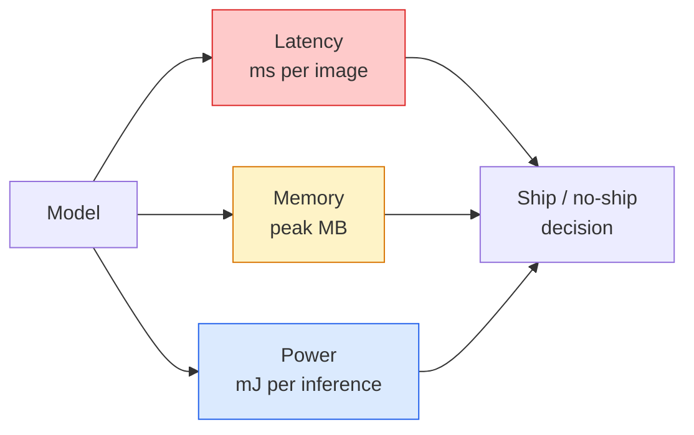

# Gerçek Zamanlı Görüş — Edge Deployment

> Edge inference, 90 doğruluklu bir modelin 2 GB RAM'e sahip bir cihazda 30 fps hızında çalışmasını sağlama disiplinidir. Doğruluğun her yüzde puanı milisaniyelik gecikmeye karşı işlem görür.

**Tür:** Öğren + Oluştur
**Diller:** Python
**Önkoşullar:** Aşama 4 Ders 04 (Görüntü Sınıflandırması), Aşama 10 Ders 11 (Kuantizasyon)
**Süre:** ~75 dakika

## Öğrenme Hedefleri

- Herhangi bir PyTorch modeli için inference gecikmesini, en yüksek belleği ve verimi ölçün ve FLOP'ları / parametreleri / gecikme değişimlerini okuyun
- PyTorch'un eğitim sonrası nicelemesini kullanarak bir görüntü modelini INT8'e niceliklendirin ve doğruluk kaybının <%1 olduğunu doğrulayın
- ONNX'e aktarın ve ONNX Runtime veya TensorRT ile derleyin; En yaygın üç dışa aktarma hatasını ve bunların düzeltmelerini adlandırın
- Uç kısıtlaması için MobileNetV3, EfficientNet-Lite, ConvNeXt-Tiny veya MobileViT'nin ne zaman seçileceğini açıklayın

## Sorun

Eğitim zamanı görüş modeli, kayan nokta canavarıdır. 100M parametre, ileri geçiş başına 10 GFLOP, 2 GB VRAM. Bunların hiçbiri bir telefona, bir arabanın bilgi-eğlence ünitesine, bir endüstriyel kameraya veya bir drone'a sığmaz. Bir vizyon sistemi sunmak, aynı tahminleri 100 kat daha küçük bir bütçeye sığdırmak anlamına gelir.

İşin çoğunu üç düğme yapar: model seçimi (aynı tarife sahip daha küçük bir mimari), niceleme (FP32 yerine INT8) ve inference çalışma zamanı (ONNX Runtime, TensorRT, Core ML, TFLite). Bunları doğru yapmak, iş istasyonunda çalışan bir demo ile 30 dolarlık kamera modülüyle gönderilen bir ürün arasındaki farktır.

Bu ders öncelikle ölçüm disiplinini kurar (ölçemediğiniz şeyi optimize edemezsiniz), ardından üç düğmeyi gezdirir. Amaç, her uç çalışma süresini öğrenmek değil, hangi kaldıraçların mevcut olduğunu ve her birinin düşündüğünüzü yaptığını nasıl doğrulayacağınızı bilmektir.

## Konsept

### Üç bütçe



- **Gecikme**: p50, p95, p99. Yalnızca p50'nin ortalaması, gerçek zamanlı sistemler için önemli olan kuyruk davranışını gizler.
- **Hafızanın zirvesi**: Kararlı durum ortalaması değil, cihazın şimdiye kadar gördüğü maksimum değer. Önemli çünkü OOM'lar gömülü hedeflerde ölümcül.
- **Güç / enerji**: pille çalışan bir cihazda inference başına milijoule. Çoğunlukla CPU/GPU kullanımı* süresiyle temsil edilir.

Bir (model, gecikme, bellek, doğruluk) tablosu, uç kararın verildiği tablodur. Her hücre iş istasyonunda değil hedef cihazda ölçülür.

### Ölçüm disiplini

Her kenar profilinin uyması gereken üç kural:

1. Ölçmeden önce modeli 5-10 kukla ileri geçişle **ısındırın**. Soğuk önbellekler ve JIT derlemesi, temsili olmayan ilk sayıları üretir.
2. Zamanlanmış bloktan önce ve sonra `torch.cuda.synchronize()` ile GPU iş yüklerini **senkronize edin**. Bu olmadan çekirdek yürütmeyi değil, çekirdek dağıtımını ölçersiniz.
3. **Giriş boyutlarını** üretim çözünürlüğüne sabitleyin. 224x224'teki gecikme, 512x512'deki gecikme değildir.

### Proxy olarak FLOP'lar

FLOP'lar (inference başına kayan nokta işlemleri), gecikme için ucuz, cihazdan bağımsız bir proxy'dir. Mimari karşılaştırma için kullanışlıdır, mutlak bir duvar saati olarak yanıltıcıdır. %10 daha fazla FLOP'a sahip bir model, donanım dostu operasyonlar kullandığı için pratikte 2 kat daha hızlı olabilir (derinlemesine dönüşümler iyi derlenir, büyük 7x7 dönüşümler bunu yapmaz).

Kural: Mimari arama için FLOP'ları kullanın, deployment kararları için cihaz içi gecikmeyi kullanın.

### Bir paragrafta niceleme

FP32 ağırlıklarını ve aktivasyonlarını INT8 ile değiştirin. INT8 çekirdeklerine sahip donanımlarda model boyutu 4 kat düşer, bellek bant genişliği 4 kat düşer, hesaplama 2-4 kat düşer (her modern mobil SoC, Tensor Çekirdekli her NVIDIA GPU). Görme görevlerindeki doğruluk kaybı, eğitim sonrası statik kuantizasyon ile genellikle yüzde 0,1-1 puandır.

Türler:

- **Dinamik** — ağırlıkları INT8'e göre nicelikselleştirin, aktivasyonlar FP'de hesaplanır. Kolay, küçük hızlandırma.
- **Statik (eğitim sonrası)** — küçük bir kalibrasyon setinde ağırlıkları ölçün + aktivasyon aralıklarını kalibre edin. Dinamikten çok daha hızlı.
- **Kuantizasyona duyarlı eğitim (QAT)** — modelin öğrenmesi için eğitim sırasında kuantizasyon simülasyonu yapın. En iyi doğruluk, etiketlenmiş verilere ihtiyaç duyar.

Görme konusunda, eğitim sonrası statik kuantizasyon, çabanın %5'i ile %95 fayda sağlar. QAT'yi yalnızca PTQ'dan kaynaklanan doğruluk kaybı kabul edilemez olduğunda kullanın.

### Budama ve damıtma

- **Budama** — önemsiz ağırlıkları (büyüklüğe dayalı) veya kanalları (yapılandırılmış) kaldırın. Aşırı parametreli modellerde iyi çalışır; zaten kompakt mimarilerde daha az kullanışlıdır.
- **Distilasyon** — küçük bir öğrenciye, büyük bir öğretmenin logitlerini taklit etmesi konusunda eğitim verin. Genellikle modeli küçülterek kaybedilen doğruluğun çoğunu kurtarır. Üretim kenarı modelleri için standart.

### inference çalışma zamanları

- **PyTorch istekli** — yavaş, deployment için değil. Yalnızca geliştirme amacıyla kullanın.
- **TorchScript** — eski. `torch.compile` ve ONNX dışa aktarma ile değiştirildi.
- **ONNX Çalışma Süresi** — nötr çalışma süresi. CPU, CUDA, CoreML, TensorRT, OpenVINO'nun hepsinde ONNX sağlayıcıları bulunur. Buradan başlayın.
- **TensorRT** — NVIDIA'nın derleyicisi. NVIDIA GPU'larda (iş istasyonu ve Jetson) en iyi gecikme. ONNX Runtime ile veya bağımsız olarak entegre olur.
- **Core ML** — Apple'ın iOS/macOS için çalışma zamanı. `.mlmodel` veya `.mlpackage` gerekir.
- **TFLite** — Google'ın Android/ARM için çalışma zamanı. `.tflite` gerekiyor.
- **OpenVINO** — Intel'in CPU/VPU çalışma zamanı. `.xml` + `.bin` gerekir.

Uygulamada: PyTorch'u dışa aktar -> ONNX -> hedef için çalışma zamanını seçin. ONNX ortak dildir.

### Kenar mimarisi seçici

| Bütçe | Modeli | Neden |
|--------|-------|-----|
| < 3 milyon parametre | MobileNetV3-Küçük | Her yerde derlenir, iyi bir temel |
| 3-10M | EfficientNet-Lite-B0 | TFLite'da parametre başına en iyi doğruluk |
| 10-20M | ConvNeXt-Tiny | Parametre başına en iyi doğruluk, CPU dostu |
| 20-30M | MobileViT-S veya EfficientViT | ImageNet doğruluğu ile Transformer |
| 30-80M | Swin-V2-Küçük | Yığın pencere dikkatini destekliyorsa |

Özel bir nedeniniz olmadığı sürece bunların hepsini INT8'e nicelendirin.

```figure
cnn-param-count
```

## İnşa Et

### 1. Adım: Gecikmeyi doğru şekilde ölçün

```python
import time
import torch

def measure_latency(model, input_shape, device="cpu", warmup=10, iters=50):
    model = model.to(device).eval()
    x = torch.randn(input_shape, device=device)
    with torch.no_grad():
        for _ in range(warmup):
            model(x)
        if device == "cuda":
            torch.cuda.synchronize()
        times = []
        for _ in range(iters):
            if device == "cuda":
                torch.cuda.synchronize()
            t0 = time.perf_counter()
            model(x)
            if device == "cuda":
                torch.cuda.synchronize()
            times.append((time.perf_counter() - t0) * 1000)
    times.sort()
    return {
        "p50_ms": times[len(times) // 2],
        "p95_ms": times[int(len(times) * 0.95)],
        "p99_ms": times[int(len(times) * 0.99)],
        "mean_ms": sum(times) / len(times),
    }
```

Isınma, senkronize etme, `time.perf_counter()`'yi kullanma. Sadece ortalamayı değil, yüzdelik dilimleri de raporlayın.

### Adım 2: Parametre ve FLOP sayımları

```python
def parameter_count(model):
    return sum(p.numel() for p in model.parameters())

def flops_estimate(model, input_shape):
    """
    Rough FLOP count for a conv/linear-only model. For production use `fvcore` or `ptflops`.
    """
    total = 0
    def conv_hook(m, inp, out):
        nonlocal total
        c_out, c_in, kh, kw = m.weight.shape
        h, w = out.shape[-2:]
        total += 2 * c_in * c_out * kh * kw * h * w
    def linear_hook(m, inp, out):
        nonlocal total
        total += 2 * m.in_features * m.out_features
    hooks = []
    for m in model.modules():
        if isinstance(m, torch.nn.Conv2d):
            hooks.append(m.register_forward_hook(conv_hook))
        elif isinstance(m, torch.nn.Linear):
            hooks.append(m.register_forward_hook(linear_hook))
    model.eval()
    with torch.no_grad():
        model(torch.randn(input_shape))
    for h in hooks:
        h.remove()
    return total
```

Gerçek projeler için `fvcore.nn.FlopCountAnalysis` veya `ptflops` kullanın; her modül tipini doğru bir şekilde ele alırlar.

### 3. Adım: Eğitim sonrası statik nicemleme

```python
def quantise_ptq(model, calibration_loader, backend="x86"):
    import torch.ao.quantization as tq
    model = model.eval().cpu()
    model.qconfig = tq.get_default_qconfig(backend)
    tq.prepare(model, inplace=True)
    with torch.no_grad():
        for x, _ in calibration_loader:
            model(x)
    tq.convert(model, inplace=True)
    return model
```

Üç adım: yapılandırma, hazırlama (gözlemcileri ekleme), gerçek verilerle kalibre etme, dönüştürme (birleştirme + niceleme). `torch.ao.quantization.fuse_modules`'nin işlediği modelin (`Conv -> BN -> ReLU` -> `ConvBnReLU`) birleştirilmesini gerektirir.

### Adım 4: ONNX'e aktarın

```python
def export_onnx(model, sample_input, path="model.onnx"):
    model = model.eval()
    torch.onnx.export(
        model,
        sample_input,
        path,
        input_names=["input"],
        output_names=["output"],
        dynamic_axes={"input": {0: "batch"}, "output": {0: "batch"}},
        opset_version=17,
    )
    return path
```

`opset_version=17`, 2026'daki güvenli varsayılandır. `dynamic_axes`, ONNX modelini isteğe bağlı toplu iş boyutuyla çalıştırmanıza olanak tanır.

### Adım 5: Benchmark ve rejimleri karşılaştırın

```python
import torch.nn as nn
from torchvision.models import mobilenet_v3_small

def compare_regimes():
    model = mobilenet_v3_small(weights=None, num_classes=10)
    params = parameter_count(model)
    flops = flops_estimate(model, (1, 3, 224, 224))
    lat_fp32 = measure_latency(model, (1, 3, 224, 224), device="cpu")
    print(f"FP32 MobileNetV3-Small: {params:,} params  {flops/1e9:.2f} GFLOPs  "
          f"p50={lat_fp32['p50_ms']:.2f}ms  p95={lat_fp32['p95_ms']:.2f}ms")
```

`resnet50`, `efficientnet_v2_s` ve `convnext_tiny` için aynı işlevi çalıştırdığınızda deployment kararı için ihtiyacınız olan karşılaştırma tablosuna sahip olursunuz.

## Kullan onu

Üretim yığınları üç yoldan birinde birleşir:

- **Web / sunucusuz**: PyTorch -> ONNX -> ONNX Çalışma Zamanı (CPU veya CUDA sağlayıcısı). En kolayı, çoğu kişi için yeterince iyi.
- **NVIDIA kenarı (Jetson, GPU sunucusu)**: PyTorch -> ONNX -> TensorRT. En iyi gecikme süresi, en büyük mühendislik çalışması.
- **Mobil**: PyTorch -> ONNX -> Core ML (iOS) veya TFLite (Android). Dışa aktarmadan önce nicelik belirleyin.

Ölçüm için `torch-tb-profiler`, `nvprof` / `nsys` ve macOS'taki Instruments, katman katman dökümler sağlar. `benchmark_app` (OpenVINO) ve `trtexec` (TensorRT), bağımsız CLI numaraları verir.

## Gönderin

Bu ders şunları üretir:

- `outputs/prompt-edge-deployment-planner.md` — hedef cihaz ve gecikme SLA'sına göre omurgayı, niceleme stratejisini ve çalışma zamanını seçen bir prompt.
- `outputs/skill-latency-profiler.md` — ısınma, senkronizasyon, yüzdelik dilimler ve bellek takibi ile eksiksiz bir gecikme benchmark komut dosyası yazan bir beceri.

## Egzersizler

1. **(Kolay)** CPU'da `resnet18`, `mobilenet_v3_small`, `efficientnet_v2_s` ve `convnext_tiny` için p50 gecikmesini 224x224'te ölçün. Tabloyu raporlayın ve hangi mimarinin ms başına en iyi doğruluğa sahip olduğunu belirleyin.
2. **(Orta)** `mobilenet_v3_small`'ye eğitim sonrası statik kuantizasyon uygulayın. CIFAR-10 veya benzerinin gecikmiş bir alt kümesinde FP32 ile INT8 arasındaki gecikme ve doğruluk kaybını bildirin.
3. **(Zor)** `convnext_tiny`'yi ONNX'e aktarın, `CPUExecutionProvider` ile `onnxruntime` üzerinden çalıştırın ve gecikmeyi PyTorch istekli temel çizgisiyle karşılaştırın. ONNX Çalışma Zamanının daha hızlı olduğu ilk katmanı belirleyin ve nedenini açıklayın.

## Anahtar Terimler

| Dönem | İnsanlar ne diyor | Aslında ne anlama geliyor |
|------|----------------|----------------------|
| Gecikme | "Ne kadar hızlı" | Girişten çıkışa kadar geçen süre; p50/p95/p99 yüzdelikleri, ortalama değil |
| FLOP'lar | "Model boyutu" | İleri geçiş başına kayan nokta işlemleri; bilgi işlem maliyetinin kabaca temsili |
| INT8 nicemleme | "8 bit" | FP32 ağırlıklarını/aktivasyonlarını 8 bitlik tamsayılarla değiştirin; ~4 kat daha küçük, 2-4 kat daha hızlı |
| PTQ | "Eğitim sonrası kuantizasyon" | Eğitilmiş bir modeli yeniden eğitmeden nicelikselleştirin; kolay, genellikle yeterli |
| QAT | "Kuantizasyona duyarlı eğitim" | Eğitim sırasında nicelemeyi simüle edin; en iyi doğruluk, etiketli veriler gerektirir |
| ONNX | "Nötr format" | Tüm ana akım inference çalışma zamanı tarafından desteklenen model değişim formatı |
| TensorRT | "NVIDIA derleyicisi" | ONNX'i NVIDIA GPU'lar için optimize edilmiş bir motorda derler |
| Damıtma | "Öğretmen -> öğrenci" | Büyük bir modelin logitlerini taklit etmek için küçük bir modeli eğitin; kaybedilen doğruluğun çoğunu kurtarır |

## Daha Fazla Okuma

- [EfficientNet (Tan ve Le, 2019)](https://arxiv.org/abs/1905.11946) — verimli mimariler için bileşik ölçeklendirme
- [MobileNetV3 (Howard ve diğerleri, 2019)](https://arxiv.org/abs/1905.02244) — h-swish ve sıkma-heyecan ile mobil öncelikli mimari
- [TensorRT Optimizasyonuna İlişkin Pratik Bir Kılavuz (NVIDIA)](https://developer.nvidia.com/blog/accelerating-model-inference-with-tensorrt-tips-and-best-practices-for-pytorch-users/) — kağıttaki üretim rakamlarının gerçekte nasıl elde edileceği
- [ONNX Çalışma Zamanı belgeleri](https://onnxruntime.ai/docs/) — nicemleme, grafik optimizasyonu, sağlayıcı seçimi
