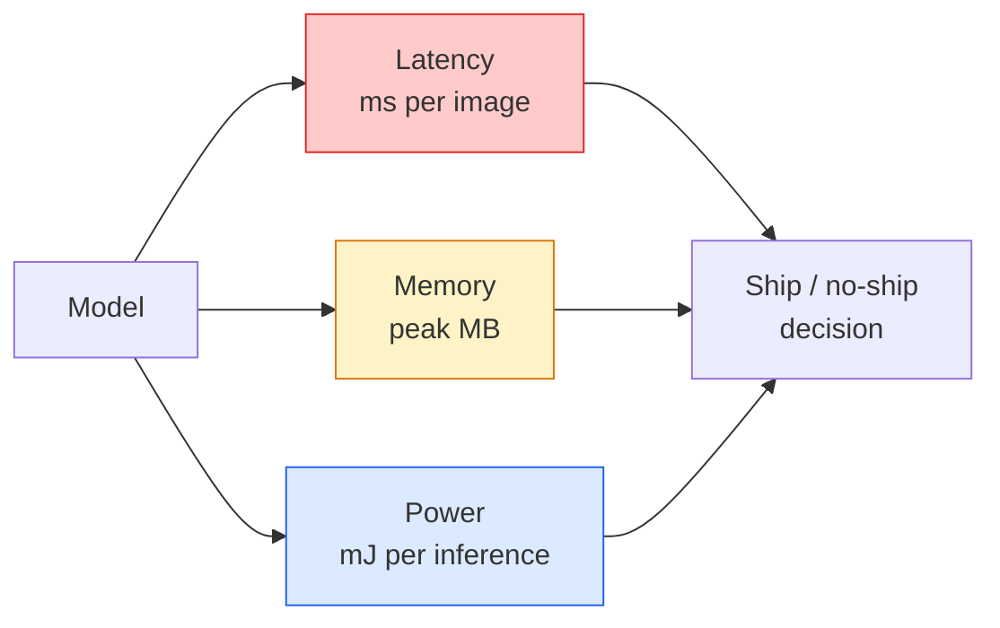

# 实时愿景-边缘部署

> 边缘推理是让90准确度模型在具有2 GB RAM的设备上以30帧/秒的速度运行的学科。每个百分点的准确性都与毫秒的延迟进行交易。

** 类型：** 学习+构建
** 语言：** Python
** 先决条件：** 阶段4第04课（图像分类），阶段10第11课（量化）
** 时间：** ~75分钟

## 学习目标

- 测量任何PyTorch模型的推理延迟、峰值内存和吞吐量，并读取FLOP/参数/延迟权衡
- 使用PyTorch的训练后量化将视觉模型量化到INT 8并验证准确性损失< 1%
- 输出到ONNX并使用ONNX SYS或TensorRT进行编译;列出三种最常见的输出失败及其修复程序
- 解释何时选择MobileNetV 3、EfficientNet-Lite、ConvNeXt-Tiny或MobileViT作为边约束

## 问题

训练时的视觉模型是一个浮点怪物。100 M参数，每次向前传递10 GFLOP，2 GB VRAM。这些都不适合手机、汽车信息娱乐单元、工业摄像机或无人机。交付视觉系统意味着将相同的预测纳入小100倍的预算中。

三个旋钮完成了大部分工作：模型选择（具有相同配方的较小架构）、量化（INT 8而不是FP 32）和推理运行时（ONNX RST、TensorRT、Core ML、TFLite）。正确处理它们是在工作站上运行的演示和在30美元相机模块上发货的产品之间的区别。

本课首先设置度量规程（您无法优化无法度量的内容），然后依次介绍三个旋钮。我们的目标不是学习每一个边缘运行时，而是了解存在哪些杠杆，以及如何验证每个杠杆都在做你认为的事情。

## 概念

### 三项预算



- ** 延迟 **：p50、p95、p99。仅对p50进行平均可以隐藏对实时系统很重要的尾部行为。
- ** 峰值内存 **：设备见过的最大值，而不是稳态平均值。很重要，因为OOM对嵌入式目标来说是致命的。
- ** 功率/能量 **：电池供电设备上每次推断的毫焦。通常由中央处理器/图形处理器利用率 * 时间代理。

（模型、延迟、内存、准确性）表是边缘决策的基础。每个单元都在目标设备上测量，而不是在工作站上测量。

### 测量学科

每个边缘轮廓都应该遵循的三条规则：

1. ** 在测量前通过5-10次假向前传球来热身 ** 模型。冷缓存和准时编辑会产生不具代表性的第一个数字。
2. ** 在定时块之前和之后使用' torch.cuda. symate（）'同步 ** 图形处理器工作负载。如果没有这个，您可以测量内核调度，而不是内核执行。
3. ** 将输入大小 ** 固定为生产分辨率。224 x224上的延迟不是512 x512上的延迟。

### FLOPS作为代理

FLOPs（每次推理的浮点运算）是一种廉价的、与设备无关的延迟代理。用于架构比较，误导为绝对挂钟。在实践中，一个具有10%以上FLOP的模型可以快2倍，因为它使用了硬件友好的操作（dependencyconvs编译良好，大型7x7 convs编译不好）。

规则：使用FLOP进行架构搜索，使用设备上延迟进行部署决策。

### 一段量化

将FP 32重量和激活替换为INT 8。在具有INT 8内核的硬件上，模型大小下降了4倍，内存带宽下降了4倍，计算量下降了2- 4倍（每个现代移动SOC、每个带有Tensor Cores的NVIDIA图形处理器）。使用训练后静态量化，视觉任务的准确性损失通常为0.1-1个百分点。

类型：

- ** 动态 ** -将权重量化到INT 8，激活以FP计算。简单、小加速。
- ** 静态（训练后）** -量化权重+在小型校准集上校准激活范围。比动态快得多。
- ** 量化感知训练（QAT）** -在训练期间模拟量化，以便模型围绕它进行学习。最佳准确性，需要标记数据。

对于视觉，训练后静态量化只需5%的努力即可获得95%的收益。仅当PTQ的准确性损失不可接受时才使用QAT。

### 修剪和蒸馏

- ** 修剪 ** -删除不重要的权重（基于量级）或通道（结构化）。适用于过度参数化的模型;适用于已经紧凑的架构。
- ** 蒸馏 ** -训练一个小学生模仿一个大老师的逻辑。通常会恢复因缩小模型而丢失的大部分准确性。生产边缘模型的标准。

### 推理运行时

- **PyTorch渴望 ** -缓慢，不适合部署。仅用于开发。
- **TorchScript** -遗产。被“torch.compile”和ONNX出口取代。
- **ONNX SYS ** -中立运行时。中央处理器、CUDA、CoreML、TensorRT、OpenVINO都有ONNX提供商。欢迎来到
- **TensorRT** -英伟达的编译器。NVIDIA图形处理器（工作站和Jetson）上的最佳延迟。与ONNX收件箱或独立版本集成。
- **Core ML** - Apple的iOS/macOS运行时。需要'. mlmode '或'. mlpack '。
- **Tflite** - Google的Android/ARM运行时。需要'.tflite '。
- **OpenVINO** -英特尔的处理器/VPU运行时。需要'. html '+'.bin '。

实践中：输出PyTorch -> ONNX ->选择目标的运行时。ONNX是通用语。

### 边缘架构选择器

| 预算 | 模型 | 为什么 |
|--------|-------|-----|
| <300万参数 | MobileNetV 3-小型 | 到处编译，良好的基线 |
| 3- 10 M | 高效Net-Lite-B 0 | TFLite上每个参数的最佳准确性 |
| 10-20M | ConvNeXt-Tiny | 每参数最佳精度，CPU友好 |
| 20-30M | MobileViT-S或EfficientViT | 具有ImageNet精度的Transformer |
| 30- 80 M | Swin-V2-Tiny | 如果堆栈支持窗口关注 |

将所有这些量化到INT 8，除非您有具体的理由不这样做。

## 建设党

### 第1步：正确测量延迟

```python
import time
import torch

def measure_latency(model, input_shape, device="cpu", warmup=10, iters=50):
    model = model.to(device).eval()
    x = torch.randn(input_shape, device=device)
    with torch.no_grad():
        for _ in range(warmup):
            model(x)
        if device == "cuda":
            torch.cuda.synchronize()
        times = []
        for _ in range(iters):
            if device == "cuda":
                torch.cuda.synchronize()
            t0 = time.perf_counter()
            model(x)
            if device == "cuda":
                torch.cuda.synchronize()
            times.append((time.perf_counter() - t0) * 1000)
    times.sort()
    return {
        "p50_ms": times[len(times) // 2],
        "p95_ms": times[int(len(times) * 0.95)],
        "p99_ms": times[int(len(times) * 0.99)],
        "mean_ms": sum(times) / len(times),
    }
```

热身、同步、使用' time.perf_counter（）'。报告百分百，而不仅仅是刻薄。

### 第2步：参数和FLOP计数

```python
def parameter_count(model):
    return sum(p.numel() for p in model.parameters())

def flops_estimate(model, input_shape):
    """
    Rough FLOP count for a conv/linear-only model. For production use `fvcore` or `ptflops`.
    """
    total = 0
    def conv_hook(m, inp, out):
        nonlocal total
        c_out, c_in, kh, kw = m.weight.shape
        h, w = out.shape[-2:]
        total += 2 * c_in * c_out * kh * kw * h * w
    def linear_hook(m, inp, out):
        nonlocal total
        total += 2 * m.in_features * m.out_features
    hooks = []
    for m in model.modules():
        if isinstance(m, torch.nn.Conv2d):
            hooks.append(m.register_forward_hook(conv_hook))
        elif isinstance(m, torch.nn.Linear):
            hooks.append(m.register_forward_hook(linear_hook))
    model.eval()
    with torch.no_grad():
        model(torch.randn(input_shape))
    for h in hooks:
        h.remove()
    return total
```

对于实际项目，使用`fvcore.nn.FlopCountAnalysis`或`ptflops`;它们可以正确处理每个模块类型。

### 第3步：训练后静态量化

```python
def quantise_ptq(model, calibration_loader, backend="x86"):
    import torch.ao.quantization as tq
    model = model.eval().cpu()
    model.qconfig = tq.get_default_qconfig(backend)
    tq.prepare(model, inplace=True)
    with torch.no_grad():
        for x, _ in calibration_loader:
            model(x)
    tq.convert(model, inplace=True)
    return model
```

三个步骤：配置、准备（插入观察者）、使用真实数据进行校准、转换（融合+量化）。需要将模型融合（' Conv -> BN -> ReLU '->' ConvBnReLU '），由' torch.ao. quanification.fuse_modules '处理。

### 步骤4：导出到ONNX

```python
def export_onnx(model, sample_input, path="model.onnx"):
    model = model.eval()
    torch.onnx.export(
        model,
        sample_input,
        path,
        input_names=["input"],
        output_names=["output"],
        dynamic_axes={"input": {0: "batch"}, "output": {0: "batch"}},
        opset_version=17,
    )
    return path
```

' opset_Version=17 '是2026年的安全默认值。“Dynamics_axes”允许您以任意批量运行ONNX模型。

### 第5步：制定基准并比较制度

```python
import torch.nn as nn
from torchvision.models import mobilenet_v3_small

def compare_regimes():
    model = mobilenet_v3_small(weights=None, num_classes=10)
    params = parameter_count(model)
    flops = flops_estimate(model, (1, 3, 224, 224))
    lat_fp32 = measure_latency(model, (1, 3, 224, 224), device="cpu")
    print(f"FP32 MobileNetV3-Small: {params:,} params  {flops/1e9:.2f} GFLOPs  "
          f"p50={lat_fp32['p50_ms']:.2f}ms  p95={lat_fp32['p95_ms']:.2f}ms")
```

对“resnet50”、“efficientnet_v2_s”和“convNext_tiny”运行相同的函数，您就会获得部署决策所需的比较表。

## 使用它

Production stacks converge on one of three paths:

- **Web / serverless**: PyTorch -> ONNX -> ONNX Runtime (CPU or CUDA provider). Easiest, good enough for most.
- **NVIDIA edge (Jetson, GPU server)**: PyTorch -> ONNX -> TensorRT. Best latency, biggest engineering effort.
- ** 移动 **：PyTorch -> ONNX -> Core ML（iOS）或TFLite（Android）。出口前进行量化。

对于测量，“torch-tb-profiler”、“nvprof”/“nsys”和macOS上的仪器会给出逐层细分。“benchmark_app”（OpenVINO）和“trtexec”（TensorRT）提供独立的CLI编号。

## 把它运

本课产生：

- '输出/prompt-edge-deployment-planner.md '-一个提示，在给定目标设备和延迟SLA的情况下选择主干、量化策略和运行时。
- `outputs/skill-latency-profiler.md` -一种编写完整的延迟基准测试脚本的技能，包括预热、同步、同步和内存跟踪。

## 演习

1. **（简单）** 在224 x224下测量“resnet 18”、“movienet_v3_small”、“efficientnet_v2_s”和“convNext_tiny”的p50延迟。报告该表并确定哪个体系结构具有最好的每秒准确性。
2. **（中）** 将训练后静态量化应用于`mobilenet_v3_small`。报告CIFAR-10或类似设备的保留子集上的FP 32与INT 8延迟和准确性损失。
3. **（Hard）** 将“convNext_tiny”输出到ONNX，使用“CPUExecutionDeveloper”通过“onnxruntime”运行它，并将延迟与PyTorch渴望基线进行比较。确定ONNX收件箱速度更快的第一层并解释原因。

## 关键术语

| Term | 别人怎么说 | 它实际上意味着什么 |
|------|----------------|----------------------|
| 延迟 | "How fast" | Time from input to output; p50/p95/p99 percentiles, not mean |
| FLOPs | “型号尺寸” | 每次向前传递的浮点操作;计算成本的粗略代理 |
| INT 8量化 | “8位” | 将FP 32权重/激活替换为8位整数; ~小4倍，快2- 4倍 |
| PTQ | “培训后量化” | 量化经过训练的模型，无需重新训练;很简单，通常足够 |
| QAT | “量化感知培训” | 训练期间模拟量化;最佳准确性，需要标记数据 |
| ONNX | "The neutral format" | 每个主流推理运行时都支持的模型交换格式 |
| TensorRT | "NVIDIA compiler" | Compiles ONNX into an optimised engine for NVIDIA GPUs |
| 蒸馏 | “老师->学生” | Train a small model to mimic a big model's logits; recovers most lost accuracy |

## Further Reading

- [EfficientNet（Tan & Le，2019）]（https：//arxiv.org/ab/1905.11946）-高效架构的复合扩展
- [MobileNetV 3（Howard等人，2019）]（https：//arxiv.org/ab/1905.02244）-具有h-swish和squeze-excite的移动优先架构
- [TensorRT优化实用指南（NVIDIA）]（https：//developer.nvidia.com/blog/accelerating-model-inference-with-tensorrt-tips-and-best-practices-for-pytorch-users/）-如何实际获取论文中的吞吐量数字
- [ONNX Docs]（https：//onnxruntime.ai/docs/）-量化、图形优化、提供商选择
