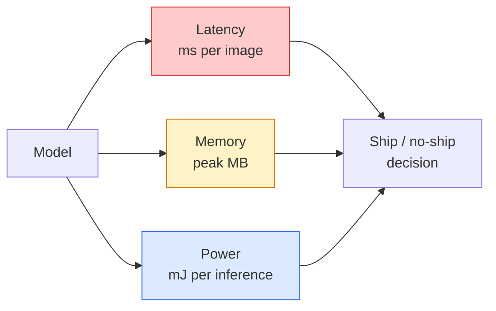

# 实时视觉 — 边缘部署

> 边缘推理（Edge inference）是将一个准确率为90%的模型在2GB RAM的设备上以30 fps的速度运行的学科。准确率的每一个百分点都需要以毫秒级的延迟为代价。

**类型：** 学习 + 构建
**语言：** Python
**先决条件：** 第4课第4节（图像分类），第10课第11节（量化）
**时间：** 约75分钟

## 学习目标

- 测量任何PyTorch模型的推理延迟、峰值内存和吞吐量，并理解FLOPs/参数/延迟之间的权衡
- 使用PyTorch的训练后量化将视觉模型量化为INT8，并验证准确率损失<1%
- 导出为ONNX并使用ONNX Runtime或TensorRT编译；列出三种最常见的导出失败及其修复方法
- 解释在边缘约束下何时选择MobileNetV3、EfficientNet-Lite、ConvNeXt-Tiny或MobileViT

## 问题

训练时的视觉模型是一个浮点数怪物。1亿个参数，每次前向传递10 GFLOPs，2 GB的VRAM。这些都不适合放在手机、车载娱乐系统、工业相机或无人机上。部署视觉系统意味着将相同的预测能力压缩到小100倍的预算中。

三个旋钮做了大部分工作：模型选择（相同配方但更小的架构）、量化（INT8代替FP32）和推理运行时（ONNX Runtime、TensorRT、Core ML、TFLite）。正确设置它们是在工作站上运行的演示和在30美元相机模块上发布的产品之间的区别。

本课程首先建立测量学科（无法测量的东西无法优化），然后介绍这三个旋钮。目标不是学习每个边缘运行时，而是了解存在哪些杠杆以及如何验证每个杠杆是否按预期工作。

## 概念

### 三个预算



- **延迟（Latency）**：p50、p95、p99。仅平均p50会隐藏对实时系统重要的尾部行为。
- **峰值内存（Peak memory）**：设备曾经看到的最大值，而不是稳态平均值。这很重要，因为在嵌入式目标上OOM（内存不足）是致命的。
- **功耗/能量（Power/energy）**：在电池供电设备上每次推理的毫焦耳。通常由CPU/GPU利用率*时间来代理。

边缘决策基于（模型、延迟、内存、准确率）表格。每个单元格都在目标设备上测量，而不是在工作站上。

### 测量学科

每个边缘分析应遵循的三条规则：

1. 在测量前，使用5-10个虚拟前向传递来**预热**模型。冷缓存和JIT编译会产生不具代表性的初始数据。
2. 在计时块前后使用`torch.cuda.synchronize()`**同步**GPU工作负载。没有这个，你测量的是内核调度，而不是内核执行。
3. 将输入大小**固定**为生产分辨率。224x224上的延迟不是512x512上的延迟。

### FLOPs作为代理

FLOPs（每次推理的浮点运算）是延迟的一个低成本、设备无关的代理。对于架构比较有用，但作为绝对时钟时间则具有误导性。一个FLOPs多10%的模型在实践中可能快2倍，因为它使用了硬件友好的操作（深度卷积编译良好，而大的7x7卷积则不然）。

规则：使用FLOPs进行架构搜索，使用设备延迟进行部署决策。

### 一段话理解量化

用INT8替换FP32权重和激活。模型大小减少4倍，内存带宽减少4倍，在有INT8内核的硬件上计算减少2-4倍（每个现代移动SoC，每个带有Tensor Cores的NVIDIA GPU）。视觉任务上的准确率损失通常为0.1-1个百分点，使用训练后静态量化。

类型：

- **动态（Dynamic）** — 将权重量化为INT8，激活在FP中计算。简单，小幅加速。
- **静态（训练后）** — 量化权重 + 在小型校准集上校准激活范围。比动态快得多。
- **量化感知训练（QAT）** — 在训练期间模拟量化，使模型围绕它学习。最佳准确率，需要标记数据。

对于视觉，训练后静态量化只需5%的努力就能获得95%的好处。仅当PTQ的准确率损失不可接受时才使用QAT。

### 剪枝和蒸馏

- **剪枝（Pruning）** — 移除不重要的权重（基于幅度）或通道（结构化）。在参数过多的模型上效果良好；在已经很紧凑的架构上用处较小。
- **蒸馏（Distillation）** — 训练一个小型学生模型来模仿大型教师模型的logits。通常能恢复模型缩小损失的大部分准确率。生产边缘模型的标准。

### 推理运行时

- **PyTorch eager** — 慢，不用于部署。仅用于开发。
- **TorchScript** — 遗留技术。已被`torch.compile`和ONNX导出取代。
- **ONNX Runtime** — 中性运行时。CPU、CUDA、CoreML、TensorRT、OpenVINO都有ONNX提供程序。从这里开始。
- **TensorRT** — NVIDIA的编译器。在NVIDIA GPU（工作站和Jetson）上最佳延迟。可与ONNX Runtime集成或独立使用。
- **Core ML** — Apple用于iOS/macOS的运行时。需要`.mlmodel`或`.mlpackage`。
- **TFLite** — Google用于Android/ARM的运行时。需要`.tflite`。
- **OpenVINO** — Intel用于CPU/VPU的运行时。需要`.xml` + `.bin`。

实际上：导出PyTorch -> ONNX -> 为目标选择运行时。ONNX是通用语言。

### 边缘架构选择器

| 预算 | 模型 | 原因 |
|--------|-------|-----|
| < 3M参数 | MobileNetV3-Small | 到处可编译，良好的基线 |
| 3-10M | EfficientNet-Lite-B0 | 在TFLite上每个参数的最佳准确率 |
| 10-20M | ConvNeXt-Tiny | 最佳每参数准确率，CPU友好 |
| 20-30M | MobileViT-S或EfficientViT | 具有ImageNet准确率的Transformer |
| 30-80M | Swin-V2-Tiny | 如果堆栈支持窗口注意力 |

除非有特定原因，否则将所有这些都量化为INT8。

## 构建它

### 步骤1：正确测量延迟

```python
import time
import torch

def measure_latency(model, input_shape, device="cpu", warmup=10, iters=50):
    model = model.to(device).eval()
    x = torch.randn(input_shape, device=device)
    with torch.no_grad():
        for _ in range(warmup):
            model(x)
        if device == "cuda":
            torch.cuda.synchronize()
        times = []
        for _ in range(iters):
            if device == "cuda":
                torch.cuda.synchronize()
            t0 = time.perf_counter()
            model(x)
            if device == "cuda":
                torch.cuda.synchronize()
            times.append((time.perf_counter() - t0) * 1000)
    times.sort()
    return {
        "p50_ms": times[len(times) // 2],
        "p95_ms": times[int(len(times) * 0.95)],
        "p99_ms": times[int(len(times) * 0.99)],
        "mean_ms": sum(times) / len(times),
    }
```

预热，同步，使用`time.perf_counter()`。报告百分位数，而不仅仅是平均值。

### 步骤2：参数和FLOP计数

```python
def parameter_count(model):
    return sum(p.numel() for p in model.parameters())

def flops_estimate(model, input_shape):
    """
    仅包含卷积/线性模型的粗略FLOP计数。生产环境使用`fvcore`或`ptflops`。
    """
    total = 0
    def conv_hook(m, inp, out):
        nonlocal total
        c_out, c_in, kh, kw = m.weight.shape
        h, w = out.shape[-2:]
        total += 2 * c_in * c_out * kh * kw * h * w
    def linear_hook(m, inp, out):
        nonlocal total
        total += 2 * m.in_features * m.out_features
    hooks = []
    for m in model.modules():
        if isinstance(m, torch.nn.Conv2d):
            hooks.append(m.register_forward_hook(conv_hook))
        elif isinstance(m, torch.nn.Linear):
            hooks.append(m.register_forward_hook(linear_hook))
    model.eval()
    with torch.no_grad():
        model(torch.randn(input_shape))
    for h in hooks:
        h.remove()
    return total
```

对于真实项目，使用`fvcore.nn.FlopCountAnalysis`或`ptflops`；它们正确处理每种模块类型。

### 步骤3：训练后静态量化

```python
def quantise_ptq(model, calibration_loader, backend="x86"):
    import torch.ao.quantization as tq
    model = model.eval().cpu()
    model.qconfig = tq.get_default_qconfig(backend)
    tq.prepare(model, inplace=True)
    with torch.no_grad():
        for x, _ in calibration_loader:
            model(x)
    tq.convert(model, inplace=True)
    return model
```

三个步骤：配置，准备（插入观察器），用真实数据校准，转换（融合+量化）。需要模型被融合（`Conv -> BN -> ReLU` -> `ConvBnReLU`），这由`torch.ao.quantization.fuse_modules`处理。

### 步骤4：导出到ONNX

```python
def export_onnx(model, sample_input, path="model.onnx"):
    model = model.eval()
    torch.onnx.export(
        model,
        sample_input,
        path,
        input_names=["input"],
        output_names=["output"],
        dynamic_axes={"input": {0: "batch"}, "output": {0: "batch"}},
        opset_version=17,
    )
    return path
```

`opset_version=17`是2026年的安全默认值。`dynamic_axes`允许您以任意批次大小运行ONNX模型。

### 步骤5：基准测试和比较方案

```python
import torch.nn as nn
from torchvision.models import mobilenet_v3_small

def compare_regimes():
    model = mobilenet_v3_small(weights=None, num_classes=10)
    params = parameter_count(model)
    flops = flops_estimate(model, (1, 3, 224, 224))
    lat_fp32 = measure_latency(model, (1, 3, 224, 224), device="cpu")
    print(f"FP32 MobileNetV3-Small: {params:,} params  {flops/1e9:.2f} GFLOPs  "
          f"p50={lat_fp32['p50_ms']:.2f}ms  p95={lat_fp32['p95_ms']:.2f}ms")
```

对`resnet50`、`efficientnet_v2_s`和`convnext_tiny`运行相同的函数，您就有了部署决策所需的比较表。

## 使用它

生产堆栈收敛到三条路径之一：

- **Web / serverless**：PyTorch -> ONNX -> ONNX Runtime（CPU或CUDA提供程序）。最简单，对大多数情况足够好。
- **NVIDIA边缘（Jetson，GPU服务器）**：PyTorch -> ONNX -> TensorRT。最佳延迟，最大的工程努力。
- **移动端**：PyTorch -> ONNX -> Core ML（iOS）或TFLite（Android）。导出前量化。

对于测量，`torch-tb-profiler`、`nvprof`/`nsys`和macOS上的Instruments提供逐层分解。`benchmark_app`（OpenVINO）和`trtexec`（TensorRT）提供独立的CLI数字。

## 发布它

本课程产生：

- `outputs/prompt-edge-deployment-planner.md` — 一个根据目标设备和延迟SLA选择主干、量化策略和运行时的提示。
- `outputs/skill-latency-profiler.md` — 一个编写完整延迟基准测试脚本的技能，包含预热、同步、百分位数和内存跟踪。

## 练习

1. **（简单）** 在CPU上测量`resnet18`、`mobilenet_v3_small`、`efficientnet_v2_s`和`convnext_tiny`在224x224下的p50延迟。报告表格并确定哪个架构具有最佳的每毫秒准确率。
2. **（中等）** 对`mobilenet_v3_small`应用训练后静态量化。报告FP32与INT8的延迟和CIFAR-10或类似数据集的保留子集上的准确率损失。
3. **（困难）** 将`convnext_tiny`导出到ONNX，使用`CPUExecutionProvider`通过`onnxruntime`运行它，并与PyTorch eager基线比较延迟。确定ONNX Runtime更快的第一个层并解释原因。

## 关键术语

| 术语 | 人们怎么说 | 实际含义 |
|------|----------------|----------------------|
| 延迟 | "多快" | 从输入到输出的时间；p50/p95/p99百分位数，不是平均值 |
| FLOPs | "模型大小" | 每次前向传递的浮点运算；计算成本的粗略代理 |
| INT8量化 | "8位" | 用8位整数替换FP32权重/激活；约小4倍，快2-4倍 |
| PTQ | "训练后量化" | 量化训练好的模型而不重新训练；简单，通常足够 |
| QAT | "量化感知训练" | 在训练期间模拟量化；最佳准确率，需要标记数据 |
| ONNX | "中性格式" | 每个主流推理运行时都支持的模型交换格式 |
| TensorRT | "NVIDIA编译器" | 将ONNX编译为NVIDIA GPU的优化引擎 |
| 蒸馏 | "教师 -> 学生" | 训练一个小模型来模仿大模型的logits；恢复大部分损失的准确率 |

## 进一步阅读

- [EfficientNet（Tan & Le，2019）](https://arxiv.org/abs/1905.11946) — 高效架构的复合缩放
- [MobileNetV3（Howard等人，2019）](https://arxiv.org/abs/1905.02244) — 首先移动的架构，具有h-swish和squeeze-excite
- [TensorRT优化实用指南（NVIDIA）](https://developer.nvidia.com/blog/accelerating-model-inference-with-tensorrt-tips-and-best-practices-for-pytorch-users/) — 如何实际获得论文中的吞吐量数字
- [ONNX Runtime文档](https://onnxruntime.ai/docs/) — 量化、图优化、提供程序选择