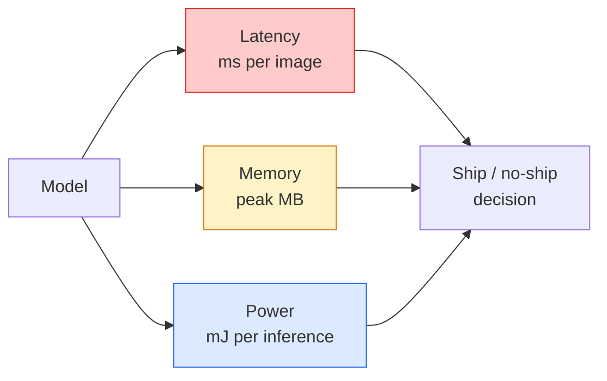

# 15 · 实时视觉——边缘部署

> 边缘推理（edge inference）是一门让 90 分准确率的模型在仅有 2 GB 内存的设备上跑到 30 fps 的学问。每提升一个百分点的准确率，都要用若干毫秒的延迟去交换。

**类型：** 学习 + 实践
**语言：** Python
**前置：** 第 4 阶段第 04 课（图像分类），第 10 阶段第 11 课（量化）
**时长：** 约 75 分钟

## 学习目标

- 测量任意 PyTorch 模型的推理延迟、峰值内存和吞吐量，并读懂 FLOPs / 参数量 / 延迟之间的权衡
- 使用 PyTorch 的训练后量化（post-training quantisation）把视觉模型量化为 INT8，并验证准确率损失小于 1%
- 导出为 ONNX，并用 ONNX Runtime 或 TensorRT 编译；说出三种最常见的导出失败及其修复方法
- 解释在某个边缘约束下，何时该选 MobileNetV3、EfficientNet-Lite、ConvNeXt-Tiny 还是 MobileViT

## 问题所在

训练阶段的视觉模型是一头浮点巨兽：1 亿参数、每次前向传播 10 GFLOPs、2 GB 显存。这些都塞不进手机、汽车车机、工业相机或无人机。要把一套视觉系统真正交付出去，就意味着把同样的预测结果压进一个小 100 倍的预算里。

主要靠三个旋钮来完成这件事：模型选型（用同一套训练配方的更小架构）、量化（用 INT8 替代 FP32），以及推理运行时（inference runtime，如 ONNX Runtime、TensorRT、Core ML、TFLite）。把这三者调对，就是「只能在工作站上跑的演示」与「能装进 30 美元相机模组里出货的产品」之间的差别。

本课先建立测量纪律（measurement discipline，无法测量的东西就无法优化），然后逐一讲解这三个旋钮。目标不是学会每一种边缘运行时，而是搞清楚有哪些可调的杠杆，以及如何验证每个杠杆是否真的做了你以为它在做的事。

## 核心概念

### 三类预算



- **延迟（Latency）**：p50、p95、p99。只取 p50 平均值会掩盖尾部行为，而尾部行为对实时系统至关重要。
- **峰值内存（Peak memory）**：设备所见过的最大值，而非稳态平均值。这一点很重要，因为在嵌入式目标上一旦 OOM（内存溢出）就是致命的。
- **功耗 / 能量（Power / energy）**：电池供电设备上每次推理消耗的毫焦耳。通常用「CPU/GPU 利用率 × 时间」来近似。

一张 (模型, 延迟, 内存, 准确率) 的表格，就是做出边缘部署决策的依据。每个单元格的数值都要在目标设备上测得，而不是在工作站上。

### 测量纪律

每一份边缘性能剖析都应遵循三条规则：

1. **预热（Warm up）**：在测量前用 5-10 次假的前向传播预热模型。冷缓存和 JIT 编译会让最初的数字毫无代表性。
2. **同步（Synchronise）**：在计时代码块前后用 `torch.cuda.synchronize()` 同步 GPU 工作负载。不这样做，你测的是内核调度（kernel dispatch），而不是内核执行（kernel execution）。
3. **固定输入尺寸（Fix input sizes）**：固定为生产环境分辨率。224x224 上的延迟不等于 512x512 上的延迟。

### 用 FLOPs 作为代理指标

FLOPs（每次推理的浮点运算次数）是一个廉价、与设备无关的延迟代理指标。它适合用于架构对比，但若当作绝对的墙钟时间（wall-clock）就会产生误导。一个 FLOPs 多 10% 的模型在实践中可能反而快 2 倍，因为它用了硬件友好的算子（深度可分离卷积（depthwise conv）编译效果好，大的 7x7 卷积则不然）。

规则：用 FLOPs 做架构搜索，用设备上实测延迟做部署决策。

### 一段话讲清量化

把 FP32 权重和激活值替换为 INT8。模型体积缩小 4 倍，内存带宽降为 1/4，在具备 INT8 内核的硬件上（每一款现代移动 SoC、每一块带 Tensor Core 的 NVIDIA GPU）算力开销降为 1/2 到 1/4。对视觉任务而言，采用训练后静态量化（post-training static quantisation）的准确率损失通常只有 0.1-1 个百分点。

类型：

- **动态量化（Dynamic）**——把权重量化为 INT8，激活值仍在浮点下计算。简单，加速幅度小。
- **静态量化（训练后）（Static, post-training）**——量化权重，并在一个小的校准集（calibration set）上标定激活值的取值范围。比动态量化快得多。
- **量化感知训练（QAT，Quantisation-aware training）**——在训练过程中模拟量化，使模型能围绕量化进行学习。准确率最高，但需要带标签的数据。

对于视觉任务，训练后静态量化能以 5% 的工作量拿到 95% 的收益。仅当 PTQ 带来的准确率损失无法接受时，才动用 QAT。

### 剪枝与蒸馏

- **剪枝（Pruning）**——移除不重要的权重（基于幅度）或通道（结构化剪枝）。在参数过剩（overparameterised）的模型上效果很好；对已经很紧凑的架构则用处不大。
- **蒸馏（Distillation）**——训练一个小的学生模型去模仿大的教师模型的 logits。通常能找回因缩小模型而损失的大部分准确率。这是生产级边缘模型的标准做法。

### 推理运行时

- **PyTorch eager 模式**——慢，不适合部署。仅用于开发阶段。
- **TorchScript**——遗留方案。已被 `torch.compile` 和 ONNX 导出取代。
- **ONNX Runtime**——中立的运行时。CPU、CUDA、CoreML、TensorRT、OpenVINO 都有对应的 ONNX provider。从它入手。
- **TensorRT**——NVIDIA 的编译器。在 NVIDIA GPU（工作站和 Jetson）上延迟最佳。可与 ONNX Runtime 集成，也可独立使用。
- **Core ML**——Apple 面向 iOS/macOS 的运行时。需要 `.mlmodel` 或 `.mlpackage`。
- **TFLite**——Google 面向 Android/ARM 的运行时。需要 `.tflite`。
- **OpenVINO**——Intel 面向 CPU/VPU 的运行时。需要 `.xml` + `.bin`。

实践中：导出 PyTorch -> ONNX -> 为目标平台挑选运行时。ONNX 是通用语言（lingua franca）。

### 边缘架构选型表

| 预算 | 模型 | 原因 |
|--------|-------|-----|
| < 3M 参数 | MobileNetV3-Small | 到处都能编译，良好的基线 |
| 3-10M | EfficientNet-Lite-B0 | 在 TFLite 上单位参数的准确率最佳 |
| 10-20M | ConvNeXt-Tiny | 单位参数准确率最佳，对 CPU 友好 |
| 20-30M | MobileViT-S 或 EfficientViT | 具备 ImageNet 级准确率的 Transformer |
| 30-80M | Swin-V2-Tiny | 当技术栈支持窗口注意力（window attention）时 |

除非有特定理由，否则把以上模型全部量化为 INT8。

## 动手实现

### 第 1 步：正确测量延迟

```python
import time
import torch

def measure_latency(model, input_shape, device="cpu", warmup=10, iters=50):
    model = model.to(device).eval()
    x = torch.randn(input_shape, device=device)
    with torch.no_grad():
        for _ in range(warmup):
            model(x)
        if device == "cuda":
            torch.cuda.synchronize()
        times = []
        for _ in range(iters):
            if device == "cuda":
                torch.cuda.synchronize()
            t0 = time.perf_counter()
            model(x)
            if device == "cuda":
                torch.cuda.synchronize()
            times.append((time.perf_counter() - t0) * 1000)
    times.sort()
    return {
        "p50_ms": times[len(times) // 2],
        "p95_ms": times[int(len(times) * 0.95)],
        "p99_ms": times[int(len(times) * 0.99)],
        "mean_ms": sum(times) / len(times),
    }
```

预热、同步、使用 `time.perf_counter()`。报告分位数（percentile），而不只是均值。

### 第 2 步：参数量与 FLOP 统计

```python
def parameter_count(model):
    return sum(p.numel() for p in model.parameters())

def flops_estimate(model, input_shape):
    """
    针对仅含 conv/linear 的模型的粗略 FLOP 统计。生产环境请用 `fvcore` 或 `ptflops`。
    """
    total = 0
    def conv_hook(m, inp, out):
        nonlocal total
        c_out, c_in, kh, kw = m.weight.shape
        h, w = out.shape[-2:]
        total += 2 * c_in * c_out * kh * kw * h * w
    def linear_hook(m, inp, out):
        nonlocal total
        total += 2 * m.in_features * m.out_features
    hooks = []
    for m in model.modules():
        if isinstance(m, torch.nn.Conv2d):
            hooks.append(m.register_forward_hook(conv_hook))
        elif isinstance(m, torch.nn.Linear):
            hooks.append(m.register_forward_hook(linear_hook))
    model.eval()
    with torch.no_grad():
        model(torch.randn(input_shape))
    for h in hooks:
        h.remove()
    return total
```

真实项目中请使用 `fvcore.nn.FlopCountAnalysis` 或 `ptflops`；它们能正确处理各类模块。

### 第 3 步：训练后静态量化

```python
def quantise_ptq(model, calibration_loader, backend="x86"):
    import torch.ao.quantization as tq
    model = model.eval().cpu()
    model.qconfig = tq.get_default_qconfig(backend)
    tq.prepare(model, inplace=True)
    with torch.no_grad():
        for x, _ in calibration_loader:
            model(x)
    tq.convert(model, inplace=True)
    return model
```

三个步骤：配置（configure）、准备（prepare，插入观测器 observer）、用真实数据校准（calibrate）、转换（convert，融合 + 量化）。这要求模型先被融合（`Conv -> BN -> ReLU` -> `ConvBnReLU`），而融合可由 `torch.ao.quantization.fuse_modules` 完成。

### 第 4 步：导出为 ONNX

```python
def export_onnx(model, sample_input, path="model.onnx"):
    model = model.eval()
    torch.onnx.export(
        model,
        sample_input,
        path,
        input_names=["input"],
        output_names=["output"],
        dynamic_axes={"input": {0: "batch"}, "output": {0: "batch"}},
        opset_version=17,
    )
    return path
```

`opset_version=17` 是 2026 年的安全默认值。`dynamic_axes` 让你能以任意批大小运行该 ONNX 模型。

### 第 5 步：基准测试并对比各方案

```python
import torch.nn as nn
from torchvision.models import mobilenet_v3_small

def compare_regimes():
    model = mobilenet_v3_small(weights=None, num_classes=10)
    params = parameter_count(model)
    flops = flops_estimate(model, (1, 3, 224, 224))
    lat_fp32 = measure_latency(model, (1, 3, 224, 224), device="cpu")
    print(f"FP32 MobileNetV3-Small: {params:,} params  {flops/1e9:.2f} GFLOPs  "
          f"p50={lat_fp32['p50_ms']:.2f}ms  p95={lat_fp32['p95_ms']:.2f}ms")
```

对 `resnet50`、`efficientnet_v2_s` 和 `convnext_tiny` 运行同一个函数，你就得到了做部署决策所需的对比表。

## 实际应用

生产技术栈最终会收敛到以下三条路径之一：

- **Web / serverless**：PyTorch -> ONNX -> ONNX Runtime（CPU 或 CUDA provider）。最简单，对大多数场景足够好。
- **NVIDIA 边缘端（Jetson、GPU 服务器）**：PyTorch -> ONNX -> TensorRT。延迟最佳，工程投入最大。
- **移动端**：PyTorch -> ONNX -> Core ML（iOS）或 TFLite（Android）。导出前先量化。

测量方面，`torch-tb-profiler`、`nvprof` / `nsys` 以及 macOS 上的 Instruments 能给出逐层（layer-by-layer）的开销拆解。`benchmark_app`（OpenVINO）和 `trtexec`（TensorRT）则提供独立的命令行测量数字。

## 交付物

本课产出：

- `outputs/prompt-edge-deployment-planner.md` —— 一个提示词，在给定目标设备和延迟 SLA 的前提下，挑选骨干网络（backbone）、量化策略和运行时。
- `outputs/skill-latency-profiler.md` —— 一个 skill，用于生成一份完整的延迟基准测试脚本，包含预热、同步、分位数统计和内存追踪。

## 练习

1. **（简单）** 在 CPU 上以 224x224 测量 `resnet18`、`mobilenet_v3_small`、`efficientnet_v2_s` 和 `convnext_tiny` 的 p50 延迟。报告该表格，并指出哪个架构的「单位毫秒准确率」最佳。
2. **（中等）** 对 `mobilenet_v3_small` 应用训练后静态量化。在 CIFAR-10 或类似数据集的留出子集上报告 FP32 与 INT8 的延迟及准确率损失。
3. **（困难）** 把 `convnext_tiny` 导出为 ONNX，用 `onnxruntime` 配 `CPUExecutionProvider` 运行，并将延迟与 PyTorch eager 基线对比。找出 ONNX Runtime 首次变快的那一层，并解释原因。

## 关键术语

| 术语 | 大家怎么说 | 实际含义 |
|------|----------------|----------------------|
| 延迟（Latency） | 「跑得多快」 | 从输入到输出的时间；用 p50/p95/p99 分位数，而非均值 |
| FLOPs | 「模型大小」 | 每次前向传播的浮点运算次数；算力开销的粗略代理指标 |
| INT8 量化 | 「8 比特」 | 把 FP32 权重/激活值替换为 8 位整数；体积约缩小 4 倍，速度快 2-4 倍 |
| PTQ | 「训练后量化」 | 不重新训练就量化已训好的模型；简单，通常够用 |
| QAT | 「量化感知训练」 | 在训练过程中模拟量化；准确率最佳，需要带标签数据 |
| ONNX | 「那个中立格式」 | 主流推理运行时都支持的模型交换格式 |
| TensorRT | 「NVIDIA 编译器」 | 把 ONNX 编译为针对 NVIDIA GPU 优化的引擎 |
| 蒸馏（Distillation） | 「教师 -> 学生」 | 训练一个小模型去模仿大模型的 logits；可找回大部分损失的准确率 |

## 延伸阅读

- [EfficientNet（Tan & Le, 2019）](https://arxiv.org/abs/1905.11946) —— 面向高效架构的复合缩放（compound scaling）
- [MobileNetV3（Howard et al., 2019）](https://arxiv.org/abs/1905.02244) —— 移动优先的架构，采用 h-swish 与 squeeze-excite
- [TensorRT 优化实战指南（NVIDIA）](https://developer.nvidia.com/blog/accelerating-model-inference-with-tensorrt-tips-and-best-practices-for-pytorch-users/) —— 如何真正拿到论文里的吞吐量数字
- [ONNX Runtime 文档](https://onnxruntime.ai/docs/) —— 量化、图优化、provider 选择
