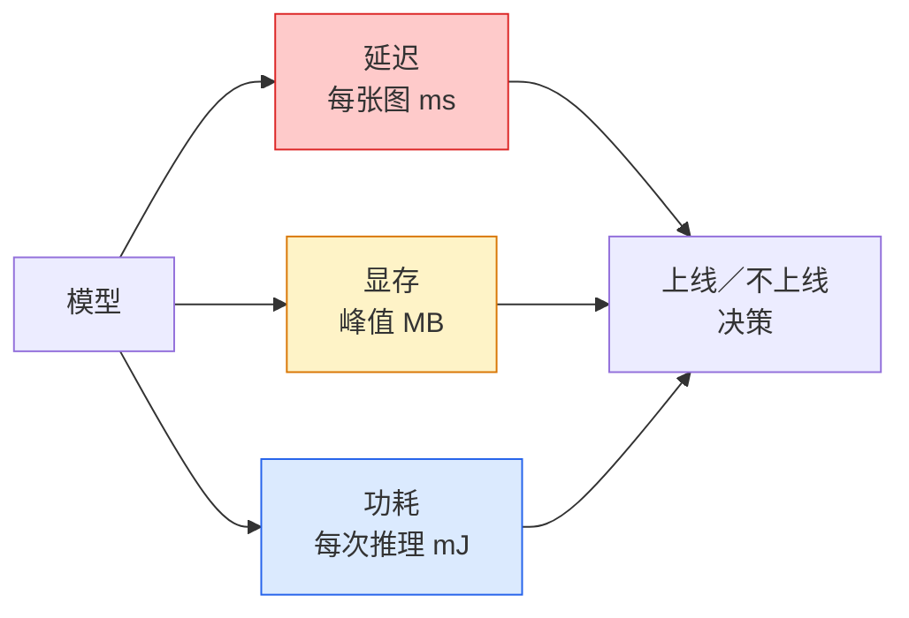

# 实时视觉 —— 边缘部署（Real-Time Vision — Edge Deployment）

> 译注：本文译自同目录 [`en.md`](./en.md)。术语遵循仓根 [TRANSLATION_GUIDE.md](../../../../TRANSLATION_GUIDE.md)。

> 边缘推理（edge inference）是一门手艺：把准确率 90 的模型塞进只有 2 GB RAM 的设备里、还得跑出 30 fps。每多一个百分点的准确率，都要拿毫秒级的延迟（latency）去换。

**Type:** Learn + Build
**Languages:** Python
**Prerequisites:** Phase 4 Lesson 04 (Image Classification), Phase 10 Lesson 11 (Quantization)
**Time:** ~75 minutes

## 学习目标（Learning Objectives）

- 会测量任意 PyTorch 模型的推理（inference）延迟、峰值内存和吞吐，并能读懂 FLOPs / 参数量 / 延迟三者之间的取舍
- 用 PyTorch 自带的训练后量化（post-training quantisation）把视觉模型量化（quantisation）到 INT8，并验证准确率损失 < 1%
- 导出为 ONNX，用 ONNX Runtime 或 TensorRT 编译；说出最常见的三类导出失败及其修复方式
- 解释在给定边缘约束下，何时该选 MobileNetV3、EfficientNet-Lite、ConvNeXt-Tiny 还是 MobileViT

## 问题（The Problem）

训练态的视觉模型是个浮点怪兽：1 亿参数、单次前向传播 10 GFLOPs、2 GB 显存。这些指标在手机、车机、工业相机或无人机上一样都塞不下。要把视觉系统真正交付出去，意味着把同样的预测能力压进一个小 100 倍的预算里。

主要靠三个旋钮：模型选型（同样的训练 recipe（配方），换更小的架构）、量化（用 INT8 替代 FP32），以及推理运行时（ONNX Runtime、TensorRT、Core ML、TFLite）。把这三个旋钮拧对，就是「demo 只能跑在工作站上」与「产品能在 30 美元相机模组上量产」之间的差别。

这一课先建立测量纪律（measurement discipline）——你没法优化你测不准的东西——再依次过这三个旋钮。目标不是把每个边缘运行时都学一遍，而是搞清楚有哪些杠杆、以及怎样验证每个杠杆确实在做你以为它在做的事。

## 概念（The Concept）

### 三类预算（The three budgets）



- **延迟（Latency）**：p50、p95、p99。只看 p50 平均值会掩盖尾部行为，而尾部对实时系统恰恰至关重要。
- **峰值内存（Peak memory）**：设备能见到的最大值，不是稳态平均值。重要是因为嵌入式目标上 OOM 会直接致命。
- **功耗 / 能耗（Power / energy）**：电池设备上每次推理消耗多少毫焦。常用 CPU/GPU 利用率乘以时间来近似。

边缘部署的决策依据，就是一张 (模型、延迟、内存、准确率) 的表。每一格都得在目标设备上实测，而不是工作站上。

### 测量纪律（Measurement discipline）

每次跑边缘 profile 都要遵守的三条规则：

1. **预热（Warm up）** —— 测量前先用 5–10 次 dummy 前向传播热一下模型。冷缓存和 JIT 编译会给出不具代表性的「第一次」数字。
2. **同步（Synchronise）** —— GPU workload 在计时块前后都要 `torch.cuda.synchronize()`。少了这一步，你测到的是 kernel 派发，而不是 kernel 执行。
3. **固定输入尺寸** —— 用生产环境的真实分辨率。224x224 的延迟不等于 512x512 的延迟。

### 用 FLOPs 当代理（FLOPs as a proxy）

FLOPs（每次推理的浮点运算数）是一个便宜、与设备无关的延迟代理量。用来比较架构很合适，但当成绝对 wall-clock 来读会误导人。一个 FLOPs 多 10% 的模型，在实际部署里可能反而快 2 倍——因为它用了对硬件友好的算子（depthwise 卷积编得很好，7x7 大卷积编得很糟）。

法则：架构搜索看 FLOPs，部署决策看设备上的实测延迟。

### 一段话讲清楚量化（Quantisation in one paragraph）

把 FP32 的权重和激活换成 INT8。模型体积降到 1/4，内存带宽降到 1/4，在带 INT8 kernel 的硬件上算力降到 1/2 ~ 1/4（每一颗现代手机 SoC，每一颗带 Tensor Core 的 NVIDIA GPU 都算）。在视觉任务上，训练后静态量化（post-training static quantisation）的准确率损失通常只有 0.1–1 个百分点。

类型：

- **动态量化（Dynamic）** —— 权重量化到 INT8，激活仍在 FP 下计算。简单，加速有限。
- **静态量化（训练后）（Static post-training）** —— 权重量化 + 在小校准集上校准激活范围。比动态快得多。
- **量化感知训练（Quantisation-aware training, QAT）** —— 训练时模拟量化，让模型学着绕过量化误差。准确率最好，但需要带标签数据。

视觉任务上，训练后静态量化用 5% 的工作量拿到 95% 的收益。只在 PTQ 的准确率损失不可接受时才上 QAT。

### 剪枝与蒸馏（Pruning and distillation）

- **剪枝（Pruning）** —— 把不重要的权重（按幅度）或通道（结构化）删掉。在过参数化的模型上效果好；在本就紧凑的架构上效果有限。
- **蒸馏（Distillation）** —— 训一个小学生模型去模仿大老师模型的 logits。通常能把缩小模型损失掉的大部分准确率找回来。生产环境的边缘模型基本都用它。

### 推理运行时（The inference runtimes）

- **PyTorch eager** —— 慢，不用于部署。仅供开发。
- **TorchScript** —— 历史遗留。被 `torch.compile` 和 ONNX 导出取代。
- **ONNX Runtime** —— 中立运行时。CPU、CUDA、CoreML、TensorRT、OpenVINO 都有 ONNX provider。从这里入手。
- **TensorRT** —— NVIDIA 自家的编译器。NVIDIA GPU（工作站和 Jetson）上延迟最佳。可以走 ONNX Runtime，也可独立用。
- **Core ML** —— 苹果的 iOS/macOS 运行时。需要 `.mlmodel` 或 `.mlpackage`。
- **TFLite** —— 谷歌的 Android/ARM 运行时。需要 `.tflite`。
- **OpenVINO** —— 英特尔的 CPU/VPU 运行时。需要 `.xml` + `.bin`。

实际操作：PyTorch -> ONNX -> 选目标平台对应的运行时。ONNX 是通用语。

### 边缘架构选型表（Edge architecture picker）

| 预算 | 模型 | 原因 |
|--------|-------|-----|
| < 3M 参数 | MobileNetV3-Small | 到处都能编，基线靠谱 |
| 3–10M | EfficientNet-Lite-B0 | TFLite 上每参数准确率最佳 |
| 10–20M | ConvNeXt-Tiny | 每参数准确率最佳，对 CPU 友好 |
| 20–30M | MobileViT-S 或 EfficientViT | 带 transformer，达到 ImageNet 级别准确率 |
| 30–80M | Swin-V2-Tiny | 如果技术栈支持窗口 attention |

除非有特别理由，否则以上模型一律量化到 INT8。

## 动手实现（Build It）

### 第 1 步：正确测延迟（Measure latency correctly）

```python
import time
import torch

def measure_latency(model, input_shape, device="cpu", warmup=10, iters=50):
    model = model.to(device).eval()
    x = torch.randn(input_shape, device=device)
    with torch.no_grad():
        for _ in range(warmup):
            model(x)
        if device == "cuda":
            torch.cuda.synchronize()
        times = []
        for _ in range(iters):
            if device == "cuda":
                torch.cuda.synchronize()
            t0 = time.perf_counter()
            model(x)
            if device == "cuda":
                torch.cuda.synchronize()
            times.append((time.perf_counter() - t0) * 1000)
    times.sort()
    return {
        "p50_ms": times[len(times) // 2],
        "p95_ms": times[int(len(times) * 0.95)],
        "p99_ms": times[int(len(times) * 0.99)],
        "mean_ms": sum(times) / len(times),
    }
```

预热、同步、用 `time.perf_counter()`。汇报百分位数，不要只报均值。

### 第 2 步：参数量与 FLOP 计数（Parameter and FLOP counts）

```python
def parameter_count(model):
    return sum(p.numel() for p in model.parameters())

def flops_estimate(model, input_shape):
    """
    Rough FLOP count for a conv/linear-only model. For production use `fvcore` or `ptflops`.
    """
    total = 0
    def conv_hook(m, inp, out):
        nonlocal total
        c_out, c_in, kh, kw = m.weight.shape
        h, w = out.shape[-2:]
        total += 2 * c_in * c_out * kh * kw * h * w
    def linear_hook(m, inp, out):
        nonlocal total
        total += 2 * m.in_features * m.out_features
    hooks = []
    for m in model.modules():
        if isinstance(m, torch.nn.Conv2d):
            hooks.append(m.register_forward_hook(conv_hook))
        elif isinstance(m, torch.nn.Linear):
            hooks.append(m.register_forward_hook(linear_hook))
    model.eval()
    with torch.no_grad():
        model(torch.randn(input_shape))
    for h in hooks:
        h.remove()
    return total
```

正式项目里用 `fvcore.nn.FlopCountAnalysis` 或 `ptflops`，它们能正确处理每一种模块类型。

### 第 3 步：训练后静态量化（Post-training static quantisation）

```python
def quantise_ptq(model, calibration_loader, backend="x86"):
    import torch.ao.quantization as tq
    model = model.eval().cpu()
    model.qconfig = tq.get_default_qconfig(backend)
    tq.prepare(model, inplace=True)
    with torch.no_grad():
        for x, _ in calibration_loader:
            model(x)
    tq.convert(model, inplace=True)
    return model
```

三步走：配置、prepare（插入 observer）、用真实数据校准、convert（融合 + 量化）。要求模型先做过算子融合（`Conv -> BN -> ReLU` -> `ConvBnReLU`），由 `torch.ao.quantization.fuse_modules` 完成。

### 第 4 步：导出 ONNX（Export to ONNX）

```python
def export_onnx(model, sample_input, path="model.onnx"):
    model = model.eval()
    torch.onnx.export(
        model,
        sample_input,
        path,
        input_names=["input"],
        output_names=["output"],
        dynamic_axes={"input": {0: "batch"}, "output": {0: "batch"}},
        opset_version=17,
    )
    return path
```

`opset_version=17` 是 2026 年的安全默认。`dynamic_axes` 让导出后的 ONNX 模型支持任意 batch 大小。

### 第 5 步：基准测试与不同方案对比（Benchmark and compare regimes）

```python
import torch.nn as nn
from torchvision.models import mobilenet_v3_small

def compare_regimes():
    model = mobilenet_v3_small(weights=None, num_classes=10)
    params = parameter_count(model)
    flops = flops_estimate(model, (1, 3, 224, 224))
    lat_fp32 = measure_latency(model, (1, 3, 224, 224), device="cpu")
    print(f"FP32 MobileNetV3-Small: {params:,} params  {flops/1e9:.2f} GFLOPs  "
          f"p50={lat_fp32['p50_ms']:.2f}ms  p95={lat_fp32['p95_ms']:.2f}ms")
```

把同一个函数对 `resnet50`、`efficientnet_v2_s`、`convnext_tiny` 都跑一遍，你就拿到了做部署决策所需要的对比表。

## 用起来（Use It）

生产技术栈一般会收敛到这三条路径之一：

- **Web / serverless**：PyTorch -> ONNX -> ONNX Runtime（CPU 或 CUDA provider）。最简单，对大多数场景已经够用。
- **NVIDIA 边缘（Jetson、GPU 服务器）**：PyTorch -> ONNX -> TensorRT。延迟最佳，工程投入也最大。
- **移动端**：PyTorch -> ONNX -> Core ML（iOS）或 TFLite（Android）。导出前先量化。

测量层面，`torch-tb-profiler`、`nvprof` / `nsys`，以及 macOS 上的 Instruments 能给出逐层的耗时拆解。`benchmark_app`（OpenVINO）和 `trtexec`（TensorRT）则提供独立 CLI 数字。

## 上线部署（Ship It）

本课的产物：

- `outputs/prompt-edge-deployment-planner.md` —— 一个 prompt：给定目标设备和延迟 SLA，自动选 backbone、量化策略和运行时。
- `outputs/skill-latency-profiler.md` —— 一个 skill：写出完整的延迟基准脚本，覆盖预热、同步、百分位数和内存追踪。

## 练习（Exercises）

1. **（简单）** 在 CPU 上、224x224 输入下，分别测量 `resnet18`、`mobilenet_v3_small`、`efficientnet_v2_s`、`convnext_tiny` 的 p50 延迟。报出对比表，指出哪一个架构在「每毫秒准确率」上最优。
2. **（中等）** 给 `mobilenet_v3_small` 做训练后静态量化。在 CIFAR-10 或类似数据的留出子集上，报出 FP32 vs INT8 的延迟和准确率损失。
3. **（困难）** 把 `convnext_tiny` 导出成 ONNX，用 `onnxruntime` 的 `CPUExecutionProvider` 跑起来，与 PyTorch eager 基线对比延迟。指出 ONNX Runtime 第一次反超 PyTorch 的层是哪一层，并解释原因。

## 关键术语（Key Terms）

| 术语 | 大家口头怎么说 | 实际含义 |
|------|----------------|----------------------|
| Latency | 「多快」 | 从输入到输出的时间；看 p50/p95/p99 百分位，不是均值 |
| FLOPs | 「模型大小」 | 每次前向传播的浮点运算数；算力成本的粗略代理 |
| INT8 量化 | 「8 比特」 | 把 FP32 权重 / 激活换成 8 比特整数；体积约 1/4，速度 2–4 倍 |
| PTQ | 「训练后量化」 | 已训练模型直接量化、不再训练；简单，通常够用 |
| QAT | 「量化感知训练」 | 训练时模拟量化；准确率最佳，需要带标签数据 |
| ONNX | 「中立格式」 | 模型交换格式，所有主流推理运行时都支持 |
| TensorRT | 「NVIDIA 编译器」 | 把 ONNX 编译成 NVIDIA GPU 上的优化引擎 |
| Distillation | 「老师 -> 学生」 | 训小模型去模仿大模型的 logits；找回大部分流失的准确率 |

## 延伸阅读（Further Reading）

- [EfficientNet (Tan & Le, 2019)](https://arxiv.org/abs/1905.11946) —— 高效架构的 compound scaling
- [MobileNetV3 (Howard et al., 2019)](https://arxiv.org/abs/1905.02244) —— 移动优先的架构，用上 h-swish 与 squeeze-excite
- [A Practical Guide to TensorRT Optimization (NVIDIA)](https://developer.nvidia.com/blog/accelerating-model-inference-with-tensorrt-tips-and-best-practices-for-pytorch-users/) —— 怎么在实际工程里把论文里的吞吐数字真正跑出来
- [ONNX Runtime docs](https://onnxruntime.ai/docs/) —— 量化、图优化、provider 选型
