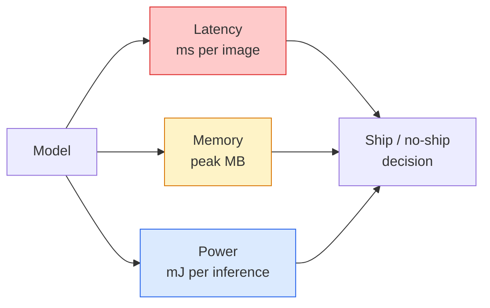

# 实时视觉 — 边缘部署

> 边缘推理是这样一门技艺：让一个 90% 准确率的模型在只有 2 GB RAM 的设备上以 30 fps 运行。每一个百分点的精度都要用毫秒级的延迟来交换。

**类型：** 学习 + 构建
**语言：** Python
**前置条件：** 阶段 4 第 04 课（图像分类），阶段 10 第 11 课（量化）
**时间：** ~75 分钟

## 学习目标

- 测量任意 PyTorch 模型的推理延迟、峰值内存和吞吐量，并理解 FLOPs / 参数量 / 延迟之间的权衡
- 使用 PyTorch 的训练后量化将视觉模型量化为 INT8，并验证精度损失 < 1%
- 导出为 ONNX 并用 ONNX Runtime 或 TensorRT 编译；列举三种最常见的导出失败原因及其修复方法
- 解释在选择边缘设备约束时，何时选择 MobileNetV3、EfficientNet-Lite、ConvNeXt-Tiny 或 MobileViT

## 问题

训练时的视觉模型是一个浮点怪物。1 亿个参数，每次前向传播 10 GFLOPs，2 GB 显存。这些都无法跑在手机、汽车信息娱乐单元、工业相机或无人机上。部署视觉系统意味着将同样的预测能力塞进一个小 100 倍的预算中。

三个主要的调节手段：模型选择（使用相同配方但更小的架构）、量化（INT8 替代 FP32）和推理运行时（ONNX Runtime、TensorRT、Core ML、TFLite）。把它们做对，就是"在工作站上演示"和"在 30 美元的相机模块上出货"之间的区别。

本课首先建立测量纪律（你无法优化你无法测量的东西），然后逐一介绍这三个调节手段。目标不是学习每一种边缘运行时，而是了解存在哪些杠杆以及如何验证每个杠杆是否按预期工作。

## 概念

### 三个预算维度


```mermaid
flowchart LR
    M["Model"] --> LAT["Latency<br/>ms per image"]
    M --> MEM["Memory<br/>peak MB"]
    M --> PWR["Power<br/>mJ per inference"]

    LAT --> SHIP["Ship / no-ship<br/>decision"]
    MEM --> SHIP
    PWR --> SHIP

    style LAT fill:#fecaca,stroke:#dc2626
    style MEM fill:#fef3c7,stroke:#d97706
    style PWR fill:#dbeafe,stroke:#2563eb
```

- **延迟**：p50、p95、p99。仅平均 p50 会隐藏对实时系统至关重要的尾部行为。
- **峰值内存**：设备所见的最大值，而非稳态平均值。在嵌入式平台上 OOM 是致命的。
- **功耗 / 能量**：电池供电设备上每次推理的毫焦耳数。通常通过 CPU/GPU 利用率 × 时间来近似。

一张包含（模型、延迟、内存、精度）的表格就是边缘决策的依据。每一项都要在目标设备上测量，而不是在工作站上。

### 测量纪律

每条边缘性能分析应遵循三条规则：

1. **预热**——在测量之前用 5-10 次虚拟前向传播来预热模型。冷缓存和 JIT 编译会产生不具有代表性的初始数值。
2. **同步**——在计时块前后使用 `torch.cuda.synchronize()` 同步 GPU 工作负载。否则你测量的是内核调度时间，而非内核执行时间。
3. **固定输入尺寸**——使用生产环境的分辨率。224x224 的延迟不是 512x512 的延迟。

### FLOPs 作为代理指标

FLOPs（每次推理的浮点运算次数）是一个廉价且与设备无关的延迟代理指标。适用于架构比较，但作为绝对时钟时间具有误导性。一个 FLOPs 多 10% 的模型在实践中可能快 2 倍，因为它使用了硬件友好的算子（深度可分离卷积编译效果好，而大 7x7 卷积则不然）。

规则：用 FLOPs 做架构搜索，用设备上的延迟做部署决策。

### 量化（一句话概括）

用 INT8 替换 FP32 权重和激活值。模型大小缩小 4 倍，内存带宽降低 4 倍，在拥有 INT8 内核的硬件上计算量降低 2-4 倍（每款现代移动 SoC、每块带 Tensor Core 的 NVIDIA GPU）。视觉任务的精度损失通常在 0.1-1 个百分点之间（使用训练后静态量化时）。

类型：

- **动态量化**——权重量化为 INT8，激活值用 FP 计算。简单，加速效果一般。
- **静态（训练后）量化**——量化权重 + 在小型校准集上校准激活值范围。比动态量化快得多。
- **量化感知训练（QAT）**——在训练过程中模拟量化，使模型学会适应量化。精度最佳，需要标注数据。

对于视觉任务，训练后静态量化能以 5% 的努力获得 95% 的收益。仅在 PTQ 的精度损失不可接受时才使用 QAT。

### 剪枝和蒸馏

- **剪枝**——移除不重要的权重（基于幅度的）或通道（结构化的）。在过参数化的模型上效果良好；在已经紧凑的架构上用处不大。
- **蒸馏**——训练一个小学生模型模仿大教师模型的 logits。通常能恢复大部分因缩小模型而损失的精度。生产环境边缘模型的标准做法。

### 推理运行时

- **PyTorch eager**——慢，不用于部署。仅用于开发。
- **TorchScript**——遗留方案。已被 `torch.compile` 和 ONNX 导出取代。
- **ONNX Runtime**——中性运行时。CPU、CUDA、CoreML、TensorRT、OpenVINO 都有 ONNX provider。从这里开始。
- **TensorRT**——NVIDIA 的编译器。在 NVIDIA GPU（工作站和 Jetson）上延迟最低。可与 ONNX Runtime 集成或独立运行。
- **Core ML**——Apple 的 iOS/macOS 运行时。需要 `.mlmodel` 或 `.mlpackage`。
- **TFLite**——Google 的 Android/ARM 运行时。需要 `.tflite`。
- **OpenVINO**——Intel 的 CPU/VPU 运行时。需要 `.xml` + `.bin`。

实践中：PyTorch → ONNX → 为目标平台选择运行时。ONNX 是通用语言。

### 边缘架构选择器

| 预算 | 模型 | 原因 |
|--------|-------|-----|
| < 3M 参数 | MobileNetV3-Small | 随处可编译，良好的基线 |
| 3-10M | EfficientNet-Lite-B0 | TFLite 上每参数量精度最佳 |
| 10-20M | ConvNeXt-Tiny | 每参数量精度最佳，CPU 友好 |
| 20-30M | MobileViT-S 或 EfficientViT | 具有 ImageNet 精度的 Transformer |
| 30-80M | Swin-V2-Tiny | 如果堆栈支持窗口注意力 |

除非有特殊原因，否则将所有这些量化为 INT8。

```figure
cnn-param-count
```

## 构建

### 步骤 1：正确测量延迟

```python
import time
import torch

def measure_latency(model, input_shape, device="cpu", warmup=10, iters=50):
    model = model.to(device).eval()
    x = torch.randn(input_shape, device=device)
    with torch.no_grad():
        for _ in range(warmup):
            model(x)
        if device == "cuda":
            torch.cuda.synchronize()
        times = []
        for _ in range(iters):
            if device == "cuda":
                torch.cuda.synchronize()
            t0 = time.perf_counter()
            model(x)
            if device == "cuda":
                torch.cuda.synchronize()
            times.append((time.perf_counter() - t0) * 1000)
    times.sort()
    return {
        "p50_ms": times[len(times) // 2],
        "p95_ms": times[int(len(times) * 0.95)],
        "p99_ms": times[int(len(times) * 0.99)],
        "mean_ms": sum(times) / len(times),
    }
```

预热、同步、使用 `time.perf_counter()`。报告百分位数，而不仅仅是平均值。

### 步骤 2：参数和 FLOPs 计数

```python
def parameter_count(model):
    return sum(p.numel() for p in model.parameters())

def flops_estimate(model, input_shape):
    """
    粗略计算仅含 conv/linear 模型的 FLOPs。生产环境使用 `fvcore` 或 `ptflops`。
    """
    total = 0
    def conv_hook(m, inp, out):
        nonlocal total
        c_out, c_in, kh, kw = m.weight.shape
        h, w = out.shape[-2:]
        total += 2 * c_in * c_out * kh * kw * h * w
    def linear_hook(m, inp, out):
        nonlocal total
        total += 2 * m.in_features * m.out_features
    hooks = []
    for m in model.modules():
        if isinstance(m, torch.nn.Conv2d):
            hooks.append(m.register_forward_hook(conv_hook))
        elif isinstance(m, torch.nn.Linear):
            hooks.append(m.register_forward_hook(linear_hook))
    model.eval()
    with torch.no_grad():
        model(torch.randn(input_shape))
    for h in hooks:
        h.remove()
    return total
```

对于真实项目使用 `fvcore.nn.FlopCountAnalysis` 或 `ptflops`；它们能正确处理所有模块类型。

### 步骤 3：训练后静态量化

```python
def quantise_ptq(model, calibration_loader, backend="x86"):
    import torch.ao.quantization as tq
    model = model.eval().cpu()
    model.qconfig = tq.get_default_qconfig(backend)
    tq.prepare(model, inplace=True)
    with torch.no_grad():
        for x, _ in calibration_loader:
            model(x)
    tq.convert(model, inplace=True)
    return model
```

三步：配置、准备（插入观察器）、用真实数据校准、转换（融合 + 量化）。要求模型已融合（`Conv -> BN -> ReLU` → `ConvBnReLU`），由 `torch.ao.quantization.fuse_modules` 处理。

### 步骤 4：导出为 ONNX

```python
def export_onnx(model, sample_input, path="model.onnx"):
    model = model.eval()
    torch.onnx.export(
        model,
        sample_input,
        path,
        input_names=["input"],
        output_names=["output"],
        dynamic_axes={"input": {0: "batch"}, "output": {0: "batch"}},
        opset_version=17,
    )
    return path
```

`opset_version=17` 是 2026 年安全的默认值。`dynamic_axes` 允许你以任意批量大小运行 ONNX 模型。

### 步骤 5：基准测试和比较不同方案

```python
import torch.nn as nn
from torchvision.models import mobilenet_v3_small

def compare_regimes():
    model = mobilenet_v3_small(weights=None, num_classes=10)
    params = parameter_count(model)
    flops = flops_estimate(model, (1, 3, 224, 224))
    lat_fp32 = measure_latency(model, (1, 3, 224, 224), device="cpu")
    print(f"FP32 MobileNetV3-Small: {params:,} params  {flops/1e9:.2f} GFLOPs  "
          f"p50={lat_fp32['p50_ms']:.2f}ms  p95={lat_fp32['p95_ms']:.2f}ms")
```

对 `resnet50`、`efficientnet_v2_s` 和 `convnext_tiny` 运行相同的函数，你就能得到部署决策所需的对比表。

## 使用

生产堆栈通常收敛到以下三种路径之一：

- **Web / serverless**：PyTorch → ONNX → ONNX Runtime（CPU 或 CUDA provider）。最简单，对大多数情况足够好。
- **NVIDIA 边缘（Jetson、GPU 服务器）**：PyTorch → ONNX → TensorRT。延迟最低，工程投入最大。
- **移动端**：PyTorch → ONNX → Core ML（iOS）或 TFLite（Android）。导出前先量化。

关于测量，`torch-tb-profiler`、`nvprof` / `nsys` 和 macOS 上的 Instruments 提供逐层分析。`benchmark_app`（OpenVINO）和 `trtexec`（TensorRT）提供独立的 CLI 数值。

## 交付

本课产出：

- `outputs/prompt-edge-deployment-planner.md`——一个 prompt，根据目标设备和延迟 SLA 选择 backbone、量化策略和运行时。
- `outputs/skill-latency-profiler.md`——一个技能，编写包含预热、同步、百分位数和内存追踪的完整延迟基准测试脚本。

## 练习

1. **（简单）** 在 CPU 上测量 `resnet18`、`mobilenet_v3_small`、`efficientnet_v2_s` 和 `convnext_tiny` 在 224x224 下的 p50 延迟。报告表格并确定哪个架构具有最佳的每毫秒精度。
2. **（中等）** 对 `mobilenet_v3_small` 应用训练后静态量化。报告 FP32 与 INT8 的延迟以及在 CIFAR-10 或其类似数据集的保留子集上的精度损失。
3. **（困难）** 将 `convnext_tiny` 导出为 ONNX，通过 `onnxruntime` 的 `CPUExecutionProvider` 运行，并与 PyTorch eager 基线比较延迟。找出 ONNX Runtime 更快的第一个层并解释原因。

## 关键术语

| 术语 | 人们说的 | 实际含义 |
|------|----------------|----------------------|
| 延迟 | "多快" | 从输入到输出的时间；p50/p95/p99 百分位数，而非平均值 |
| FLOPs | "模型大小" | 每次前向传播的浮点运算次数；计算成本的粗略代理指标 |
| INT8 量化 | "8-bit" | 用 8 位整数替换 FP32 权重和激活值；约小 4 倍，快 2-4 倍 |
| PTQ | "训练后量化" | 在不重新训练的情况下量化已训练好的模型；简单，通常足够 |
| QAT | "量化感知训练" | 在训练过程中模拟量化；精度最佳，需要标注数据 |
| ONNX | "中性格式" | 每个主流推理运行时都支持的模型交换格式 |
| TensorRT | "NVIDIA 编译器" | 将 ONNX 编译为针对 NVIDIA GPU 优化的引擎 |
| 蒸馏 | "教师 → 学生" | 训练小模型模仿大模型的 logits；恢复大部分损失的精度 |

## 延伸阅读

- [EfficientNet（Tan & Le, 2019）](https://arxiv.org/abs/1905.11946)——高效架构的复合缩放
- [MobileNetV3（Howard 等人, 2019）](https://arxiv.org/abs/1905.02244)——移动优先架构，含 h-swish 和 squeeze-excite
- [TensorRT 优化实用指南（NVIDIA）](https://developer.nvidia.com/blog/accelerating-model-inference-with-tensorrt-tips-and-best-practices-for-pytorch-users/)——如何实际获得论文中的吞吐量数据
- [ONNX Runtime 文档](https://onnxruntime.ai/docs/)——量化、图优化、provider 选择
