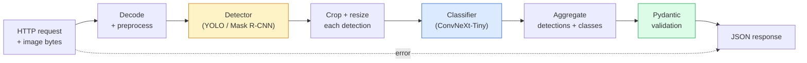

# Build a Complete Vision Pipeline — Capstone

> 本番のvision systemは、modelとruleをdata contractで縫い合わせたchainです。部品はこのphaseですでに学びました。capstoneでは、それらをend-to-endに接続します。

**種別:** 構築
**言語:** Python
**前提条件:** Phase 4 Lessons 01-15
**所要時間:** 約120分

## 学習目標

- objectを検出し、分類し、structured JSONを出力する本番vision pipelineを設計する。すべてのfailure pathを処理する
- detector（Mask R-CNNまたはYOLO）、classifier（ConvNeXt-Tiny）、data contract（Pydantic）を1つのserviceへ接続する
- end-to-end pipelineをbenchmarkし、最初のbottleneckを特定する（通常はpreprocessing、その次にdetector）
- image uploadを受け取り、pipelineを実行し、classification付きdetectionsを返す最小FastAPI serviceを出荷する

## 問題

個別のvision modelは有用ですが、vision productはそれらのchainです。retail shelf auditはdetector + product classifier + price-OCR pipelineです。autonomous drivingは2D detector + 3D detector + segmenter + tracker + plannerです。medical pre-screenはsegmenter + region classifier + clinician UIです。

そのchainを配線する部分が、ML prototypeとproductを分けます。model間のinterfaceはすべて新しいbugの場所です。coordinate transform、normalisation、mask resizeのどれもがsilent failureの候補です。pipelineは最も弱いinterfaceと同じ強さしかありません。

このcapstoneでは、最小限の実用pipelineを作ります。detection + classification + structured output + serving layerです。Phase 4の他の要素はすべてこのskeletonへ差し替えられます。Mask R-CNNをYOLOv8に替える、OCR headを追加する、segmentation branchを追加する、trackerを追加する。architectureは安定しており、部品はpluggableです。

## コンセプト

### pipeline



7 stagesです。2つのmodel stageは高コストです。残り5つのstageにbugが潜みます。

### Pydanticによるdata contract

すべてのmodel boundaryをtyped objectにします。これによりsilent failureがloud failureになります。

```
Detection(
    box: tuple[float, float, float, float],   # (x1, y1, x2, y2), absolute pixels
    score: float,                              # [0, 1]
    class_id: int,                             # from detector's label map
    mask: Optional[list[list[int]]],           # RLE-encoded if present
)

PipelineResult(
    image_id: str,
    detections: list[Detection],
    classifications: list[Classification],
    inference_ms: float,
)
```

detectorが `(x1, y1, x2, y2)` ではなく `(cx, cy, w, h)` のboxを返した場合、Pydantic validationがboundaryで失敗します。downstreamのcropが空領域を黙って返すdebugに入る前に気付けます。

### latencyはどこへ行くか

ほぼすべてのvision pipelineで、次の3つは成り立ちます。

1. **Preprocessingが最大の単一blockになることが多い。** JPEG decode、colour space conversion、resizeはCPU-boundで、忘れられがちです。
2. **detectorがGPU timeを支配する。** GPU timeの70-90%はdetection forward passにあります。
3. **Postprocessing（NMS、RLE encode/decode）はGPUでは安いがCPUでは高い。** 必ず実targetでprofileします。

分布を知ることで、optimizationは優先順位付きlistになります。

### failure modes

- **Empty detections** — crashせずempty listを返す。logする。
- **Out-of-bounds boxes** — crop前にimage sizeへclampする。
- **Tiny crops** — classifierの最小inputより小さいboxはclassificationをskipする。
- **Corrupt upload** — 500ではなくspecific error code付き400 responseを返す。
- **Model load failure** — first requestではなくservice startupで失敗させる。

本番pipelineは、failureを隠すgeneric `try/except` なしでこれらを処理します。各failureはnamed codeとresponseを持ちます。

### Batching

production serviceは複数clientへ応答します。requestをまたいでdetectionやclassificationをbatchingするとthroughputが何倍にもなります。trade-offは、batchが埋まるのを待つ追加latencyです。典型設定では最大20ms requestを集め、まとめて処理し、responseを配ります。`torchserve` と `triton` はこれをnativeに扱います。予測可能な負荷の小規模serviceではmicro-batcherを自作することもあります。

## 作ってみる

### Step 1: Data contracts

```python
from pydantic import BaseModel, Field
from typing import List, Optional, Tuple

class Detection(BaseModel):
    box: Tuple[float, float, float, float]
    score: float = Field(ge=0, le=1)
    class_id: int = Field(ge=0)
    mask_rle: Optional[str] = None


class Classification(BaseModel):
    detection_index: int
    class_id: int
    class_name: str
    score: float = Field(ge=0, le=1)


class PipelineResult(BaseModel):
    image_id: str
    detections: List[Detection]
    classifications: List[Classification]
    inference_ms: float
```

5秒のcodeが、本格的なpipelineで1時間のdebugを節約します。

### Step 2: 最小Pipeline class

```python
import time
import numpy as np
import torch
from PIL import Image

class VisionPipeline:
    def __init__(self, detector, classifier, class_names,
                 device="cpu", min_crop=32):
        self.detector = detector.to(device).eval()
        self.classifier = classifier.to(device).eval()
        self.class_names = class_names
        self.device = device
        self.min_crop = min_crop

    def preprocess(self, image):
        """
        image: PIL.Image or np.ndarray (H, W, 3) uint8
        returns: CHW float tensor on device
        """
        if isinstance(image, Image.Image):
            image = np.asarray(image.convert("RGB"))
        tensor = torch.from_numpy(image).permute(2, 0, 1).float() / 255.0
        return tensor.to(self.device)

    @torch.no_grad()
    def detect(self, image_tensor):
        return self.detector([image_tensor])[0]

    @torch.no_grad()
    def classify(self, crops):
        if len(crops) == 0:
            return []
        batch = torch.stack(crops).to(self.device)
        logits = self.classifier(batch)
        probs = logits.softmax(-1)
        scores, cls = probs.max(-1)
        return list(zip(cls.tolist(), scores.tolist()))

    def run(self, image, image_id="anonymous"):
        t0 = time.perf_counter()
        tensor = self.preprocess(image)
        det = self.detect(tensor)

        crops = []
        detections = []
        valid_indices = []
        for i, (box, score, cls) in enumerate(zip(det["boxes"], det["scores"], det["labels"])):
            x1, y1, x2, y2 = [max(0, int(b)) for b in box.tolist()]
            x2 = min(x2, tensor.shape[-1])
            y2 = min(y2, tensor.shape[-2])
            detections.append(Detection(
                box=(x1, y1, x2, y2),
                score=float(score),
                class_id=int(cls),
            ))
            if (x2 - x1) < self.min_crop or (y2 - y1) < self.min_crop:
                continue
            crop = tensor[:, y1:y2, x1:x2]
            crop = torch.nn.functional.interpolate(
                crop.unsqueeze(0),
                size=(224, 224),
                mode="bilinear",
                align_corners=False,
            )[0]
            crops.append(crop)
            valid_indices.append(i)

        class_preds = self.classify(crops)

        classifications = []
        for valid_idx, (cls_id, cls_score) in zip(valid_indices, class_preds):
            classifications.append(Classification(
                detection_index=valid_idx,
                class_id=int(cls_id),
                class_name=self.class_names[cls_id],
                score=float(cls_score),
            ))

        return PipelineResult(
            image_id=image_id,
            detections=detections,
            classifications=classifications,
            inference_ms=(time.perf_counter() - t0) * 1000,
        )
```

すべてのinterfaceがtypedです。すべてのfailure pathに具体的なhandling decisionがあります。

### Step 3: detectorとclassifierを接続する

```python
from torchvision.models.detection import maskrcnn_resnet50_fpn_v2
from torchvision.models import convnext_tiny

# Use ImageNet-pretrained weights for a realistic pipeline without training
detector = maskrcnn_resnet50_fpn_v2(weights="DEFAULT")
classifier = convnext_tiny(weights="DEFAULT")
class_names = [f"imagenet_class_{i}" for i in range(1000)]

pipe = VisionPipeline(detector, classifier, class_names)

# Smoke test with a synthetic image
test_image = (np.random.rand(400, 600, 3) * 255).astype(np.uint8)
result = pipe.run(test_image, image_id="demo")
print(result.model_dump_json(indent=2)[:500])
```

### Step 4: FastAPI service

```python
from fastapi import FastAPI, UploadFile, HTTPException
from io import BytesIO

app = FastAPI()
pipe = None  # initialised on startup

@app.on_event("startup")
def load():
    global pipe
    detector = maskrcnn_resnet50_fpn_v2(weights="DEFAULT").eval()
    classifier = convnext_tiny(weights="DEFAULT").eval()
    pipe = VisionPipeline(detector, classifier, class_names=[f"c{i}" for i in range(1000)])

@app.post("/detect")
async def detect_endpoint(file: UploadFile):
    if file.content_type not in {"image/jpeg", "image/png", "image/webp"}:
        raise HTTPException(status_code=400, detail="unsupported image type")
    data = await file.read()
    try:
        img = Image.open(BytesIO(data)).convert("RGB")
    except Exception:
        raise HTTPException(status_code=400, detail="cannot decode image")
    result = pipe.run(img, image_id=file.filename or "upload")
    return result.model_dump()
```

`uvicorn main:app --host 0.0.0.0 --port 8000` で実行します。`curl -F 'file=@dog.jpg' http://localhost:8000/detect` でtestします。

### Step 5: pipelineをbenchmarkする

```python
import time

def benchmark(pipe, num_runs=20, image_size=(400, 600)):
    img = (np.random.rand(*image_size, 3) * 255).astype(np.uint8)
    pipe.run(img)  # warm up

    stages = {"preprocess": [], "detect": [], "classify": [], "total": []}
    for _ in range(num_runs):
        t0 = time.perf_counter()
        tensor = pipe.preprocess(img)
        t1 = time.perf_counter()
        det = pipe.detect(tensor)
        t2 = time.perf_counter()
        crops = []
        for box in det["boxes"]:
            x1, y1, x2, y2 = [max(0, int(b)) for b in box.tolist()]
            x2 = min(x2, tensor.shape[-1])
            y2 = min(y2, tensor.shape[-2])
            if (x2 - x1) >= pipe.min_crop and (y2 - y1) >= pipe.min_crop:
                crop = tensor[:, y1:y2, x1:x2]
                crop = torch.nn.functional.interpolate(
                    crop.unsqueeze(0), size=(224, 224), mode="bilinear", align_corners=False
                )[0]
                crops.append(crop)
        pipe.classify(crops)
        t3 = time.perf_counter()
        stages["preprocess"].append((t1 - t0) * 1000)
        stages["detect"].append((t2 - t1) * 1000)
        stages["classify"].append((t3 - t2) * 1000)
        stages["total"].append((t3 - t0) * 1000)

    for stage, times in stages.items():
        times.sort()
        print(f"{stage:12s}  p50={times[len(times)//2]:7.1f} ms  p95={times[int(len(times)*0.95)]:7.1f} ms")
```

CPUでの典型出力は、preprocess ~3 ms、detect 300-500 ms、classify 20-40 ms、total 350-550 msです。GPUではdetectが20-40 msになり、preprocess + classifyが相対的に重要になります。

## 使ってみる

production templateは同じ構造に収束し、さらに次を加えます。

- **Model versioning** — responseには常にmodel nameとweights hashをlogする。
- **Per-request trace IDs** — 各requestの全stage timingをlogし、遅いresponseをstageと相関させる。
- **Fallback path** — classifierがtimeoutした場合、request全体を失敗させずclassificationなしのdetectionsを返す。
- **Safety filters** — NSFW / PII filterはclassification後、responseがserviceを出る前に実行する。
- **Batch endpoint** — bulk processing用に、image URLのlistを受け取る `/detect_batch`。

production servingでは、`torchserve`、`Triton Inference Server`、`BentoML` がbatching、versioning、metrics、health checkを標準で扱います。prototypeや小規模productなら `FastAPI` を直接動かしても問題ありません。

## 出荷する

このlessonが生成するもの:

- `outputs/prompt-vision-service-shape-reviewer.md` — vision serviceのcodeをcontract/response shape違反の観点でreviewし、最初の破壊的bugを指摘するprompt。
- `outputs/skill-pipeline-budget-planner.md` — target latencyとthroughputから各pipeline stageへtime budgetを割り当て、どのstageが最初にbudget未達になるか示すskill。

## 演習

1. **(Easy)** 任意のopen datasetから10 imagesをpipelineで実行してください。stageごとのaverage timeと、imageごとのdetection count分布を報告してください。
2. **(Medium)** `Detection` にmask output fieldを追加し、RLEとしてencodeしてください。10-object imageでもJSONが1MB未満に収まることを検証してください。
3. **(Hard)** classifierの前にmicro-batcherを追加してください。最大10 ms cropsを集め、1回のGPU callでまとめてclassifyし、requestごとに結果を返します。5 concurrent requests per secondでthroughput gainと追加latencyを測定してください。

## 重要用語

| 用語 | よく言われること | 実際の意味 |
|------|----------------|----------------------|
| Pipeline | "The system" | preprocessing、inference、postprocessing stepsの順序付きchain。各pairの間にtyped interfaceを持つ |
| Data contract | "The schema" | 各stage input/outputが従うPydantic / dataclass定義。boundaryでintegration bugを捕まえる |
| Preprocessing | "Before the model" | decode、colour conversion、resize、normalising。通常最大のCPU time sink |
| Postprocessing | "After the model" | NMS、mask resize、threshold、RLE encode。GPUでは安く、CPUでは高い |
| Microbatcher | "Collect then forward" | 複数requestを固定windowだけ待って集約し、1回のbatched forward passを実行するaggregator |
| Trace ID | "Request id" | 各stageでlogされるrequestごとのidentifier。遅いrequestをend-to-endに追跡できる |
| Failure code | "Named error" | generic 500ではなくfailure classごとのspecific error code。client retry logicを可能にする |
| Health check | "Readiness probe" | serviceが応答可能か報告する安価なendpoint。load balancerが依存する |

## 参考文献

- [Full Stack Deep Learning — Deploying Models](https://fullstackdeeplearning.com/course/2022/lecture-5-deployment/) — production ML deploymentの標準的overview
- [BentoML docs](https://docs.bentoml.com) — batching、versioning、metricsを備えたserving framework
- [torchserve docs](https://pytorch.org/serve/) — PyTorch公式serving library
- [NVIDIA Triton Inference Server](https://developer.nvidia.com/triton-inference-server) — batchingとmulti-model supportを備えたhigh-throughput serving
