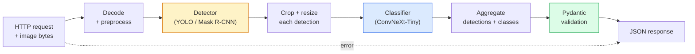

# Eksiksiz bir Vizyon Hattı Oluşturun — Bitirme Taşı

> Bir üretim vizyon sistemi, veri sözleşmeleriyle birleştirilmiş bir modeller ve kurallar zinciridir. Parçalar zaten bu aşamada; kapak taşı bunları uçtan uca birbirine bağlar.

**Tür:** Yapım
**Diller:** Python
**Önkoşullar:** Aşama 4 Dersleri 01-15
**Süre:** ~120 dakika

## Öğrenme Hedefleri

- Nesneleri algılayan, sınıflandıran ve yapılandırılmış JSON yayınlayan, her hata yolunu ele alan bir üretim vizyonu ardışık düzeni tasarlayın
- Bir dedektörü (Mask R-CNN veya YOLO), bir sınıflandırıcıyı (ConvNeXt-Tiny) ve bir veri sözleşmesini (Pydantic) tek bir hizmete bağlayın
- Benchmark uçtan uca boru hattı ve ilk darboğazın tanımlanması (genellikle ön işleme, ardından dedektör)
- Görüntü yüklemeyi kabul eden, işlem hattını çalıştıran ve sınıflandırmalarla birlikte algılamaları döndüren minimal bir FastAPI hizmeti gönderin

## Sorun

Bireysel görüş modelleri faydalıdır; vizyon ürünleri bunların zincirleridir. Perakende raf denetimi, bir dedektör artı bir ürün sınıflandırıcı artı bir fiyat-OCR hattından oluşur. Otonom sürüş, bir 2D dedektör artı bir 3D dedektör artı bir segmenter artı bir izleyici ve bir planlayıcıdan oluşur. Tıbbi ön tarama, bir segmenter artı bir bölge sınıflandırıcı artı bir klinisyen kullanıcı arayüzünden oluşur.

Bu zincirlerin kablolanması, makine öğrenimi prototipini üründen ayıran kısımdır. Modeller arasındaki her arayüz hatalar için yeni bir yerdir. Her koordinat dönüşümü, her normalleştirme, her maske yeniden boyutlandırması bir sessiz başarısızlık adayıdır. Bir boru hattı en zayıf arayüzü kadar güçlüdür.

Bu sonuç, minimum uygulanabilir boru hattını oluşturur: algılama + sınıflandırma + yapılandırılmış çıktı + bir hizmet katmanı. Aşama 4'teki diğer her şey bu iskelete yerleşiyor: R-CNN Maskesini YOLOv8 ile değiştirin, bir OCR kafası ekleyin, bir segmentasyon dalı ekleyin, bir izleyici ekleyin. Mimari stabildir; parçalar takılabilir.

## Konsept

### Boru hattı



Yedi aşama. İki model aşaması pahalıdır; diğer beş aşama böceklerin yaşadığı yerdir.

### Pydantic ile veri sözleşmeleri

Her model sınırı yazılı bir nesneye dönüşür. Bu, sessiz başarısızlıkları yüksek sesli başarısızlıklara dönüştürür.

```
Detection(
    box: tuple[float, float, float, float],   # (x1, y1, x2, y2), absolute pixels
    score: float,                              # [0, 1]
    class_id: int,                             # from detector's label map
    mask: Optional[list[list[int]]],           # RLE-encoded if present
)

PipelineResult(
    image_id: str,
    detections: list[Detection],
    classifications: list[Classification],
    inference_ms: float,
)
```

Bir dedektör, `(x1, y1, x2, y2)` yerine `(cx, cy, w, h)` içindeki kutuları döndürdüğünde, Pydantic'in doğrulaması sınırda başarısız olur ve boş bölgeleri sessizce döndüren aşağı yöndeki bir üründe hata ayıklamak yerine bunu hemen anlarsınız.

### Gecikme nereye gidiyor

Neredeyse her vizyon hattında üç gerçek yer alır:

1. **Ön işleme genellikle en büyük tek bloktur.** JPEG'lerin kodunu çözme, renk alanlarını dönüştürme, yeniden boyutlandırma — bunlar CPU'ya bağlıdır ve unutulması kolaydır.
2. **Dedektör GPU süresine hakimdir.** GPU süresinin %70-90'ı algılama ileri geçişindedir.
3. **Son işleme (NMS, RLE kodlama/kod çözme) GPU açısından ucuz, CPU açısından pahalıdır.** Her zaman gerçek hedefle profil oluşturun.

Dağıtımı bilmek, optimizasyonu öncelikli bir listeye dönüştüren şeydir.

### Arıza modları

- **Boş tespitler** — boş listeyi döndürür, kilitlenmez. Kayıt.
- **Sınır dışı kutular** — kırpmadan önce resim boyutuna sabitleyin.
- **Küçük mahsuller** — sınıflandırıcının minimum girişinden daha küçük kutular için sınıflandırmayı atlayın.
- **Bozuk yükleme** — Belirli bir hata koduyla 400 yanıt, 500 değil.
- **Model yükleme hatası** — ilk istekte değil, hizmet başlangıcında hata.

Bir üretim hattı, arızayı gizleyen genel `try/except` yazmadan bunların her birini işler. Her başarısızlığa adlandırılmış bir kod ve bir yanıt verilir.

### Toplu İşleme

Bir üretim hizmeti birden fazla müşteriye hizmet verir. İstekler arasında tespitlerin ve sınıflandırmaların toplu olarak işlenmesi verimi artırır. Takas: bir partinin dolmasını beklemekten kaynaklanan ekstra gecikme. Tipik kurulum: 20 ms'ye kadar istekleri toplayın, toplu olarak toplayın, işleyin ve yanıtları dağıtın. `torchserve` ve `triton` bunu yerel olarak yapar; Tahmin edilebilir yüke sahip küçük servisler kendi mikro harmanlayıcılarını çalıştırır.

## İnşa Et

### 1. Adım: Veri sözleşmeleri

```python
from pydantic import BaseModel, Field
from typing import List, Optional, Tuple

class Detection(BaseModel):
    box: Tuple[float, float, float, float]
    score: float = Field(ge=0, le=1)
    class_id: int = Field(ge=0)
    mask_rle: Optional[str] = None


class Classification(BaseModel):
    detection_index: int
    class_id: int
    class_name: str
    score: float = Field(ge=0, le=1)


class PipelineResult(BaseModel):
    image_id: str
    detections: List[Detection]
    classifications: List[Classification]
    inference_ms: float
```

Beş saniyelik kod, herhangi bir ciddi işlem hattında bir saatlik hata ayıklama süresinden tasarruf sağlar.

### Adım 2: Minimum Pipeline sınıfı

```python
import time
import numpy as np
import torch
from PIL import Image

class VisionPipeline:
    def __init__(self, detector, classifier, class_names,
                 device="cpu", min_crop=32):
        self.detector = detector.to(device).eval()
        self.classifier = classifier.to(device).eval()
        self.class_names = class_names
        self.device = device
        self.min_crop = min_crop

    def preprocess(self, image):
        """
        image: PIL.Image or np.ndarray (H, W, 3) uint8
        returns: CHW float tensor on device
        """
        if isinstance(image, Image.Image):
            image = np.asarray(image.convert("RGB"))
        tensor = torch.from_numpy(image).permute(2, 0, 1).float() / 255.0
        return tensor.to(self.device)

    @torch.no_grad()
    def detect(self, image_tensor):
        return self.detector([image_tensor])[0]

    @torch.no_grad()
    def classify(self, crops):
        if len(crops) == 0:
            return []
        batch = torch.stack(crops).to(self.device)
        logits = self.classifier(batch)
        probs = logits.softmax(-1)
        scores, cls = probs.max(-1)
        return list(zip(cls.tolist(), scores.tolist()))

    def run(self, image, image_id="anonymous"):
        t0 = time.perf_counter()
        tensor = self.preprocess(image)
        det = self.detect(tensor)

        crops = []
        detections = []
        valid_indices = []
        for i, (box, score, cls) in enumerate(zip(det["boxes"], det["scores"], det["labels"])):
            x1, y1, x2, y2 = [max(0, int(b)) for b in box.tolist()]
            x2 = min(x2, tensor.shape[-1])
            y2 = min(y2, tensor.shape[-2])
            detections.append(Detection(
                box=(x1, y1, x2, y2),
                score=float(score),
                class_id=int(cls),
            ))
            if (x2 - x1) < self.min_crop or (y2 - y1) < self.min_crop:
                continue
            crop = tensor[:, y1:y2, x1:x2]
            crop = torch.nn.functional.interpolate(
                crop.unsqueeze(0),
                size=(224, 224),
                mode="bilinear",
                align_corners=False,
            )[0]
            crops.append(crop)
            valid_indices.append(i)

        class_preds = self.classify(crops)

        classifications = []
        for valid_idx, (cls_id, cls_score) in zip(valid_indices, class_preds):
            classifications.append(Classification(
                detection_index=valid_idx,
                class_id=int(cls_id),
                class_name=self.class_names[cls_id],
                score=float(cls_score),
            ))

        return PipelineResult(
            image_id=image_id,
            detections=detections,
            classifications=classifications,
            inference_ms=(time.perf_counter() - t0) * 1000,
        )
```

Her arayüz yazılır. Her arıza yolunun belirli bir işleme kararı vardır.

### Adım 3: Dedektör ve sınıflandırıcının kablolamasını yapın

```python
from torchvision.models.detection import maskrcnn_resnet50_fpn_v2
from torchvision.models import convnext_tiny

# Use ImageNet-pretrained weights for a realistic pipeline without training
detector = maskrcnn_resnet50_fpn_v2(weights="DEFAULT")
classifier = convnext_tiny(weights="DEFAULT")
class_names = [f"imagenet_class_{i}" for i in range(1000)]

pipe = VisionPipeline(detector, classifier, class_names)

# Smoke test with a synthetic image
test_image = (np.random.rand(400, 600, 3) * 255).astype(np.uint8)
result = pipe.run(test_image, image_id="demo")
print(result.model_dump_json(indent=2)[:500])
```

### Adım 4: FastAPI hizmeti

```python
from fastapi import FastAPI, UploadFile, HTTPException
from io import BytesIO

app = FastAPI()
pipe = None  # initialised on startup

@app.on_event("startup")
def load():
    global pipe
    detector = maskrcnn_resnet50_fpn_v2(weights="DEFAULT").eval()
    classifier = convnext_tiny(weights="DEFAULT").eval()
    pipe = VisionPipeline(detector, classifier, class_names=[f"c{i}" for i in range(1000)])

@app.post("/detect")
async def detect_endpoint(file: UploadFile):
    if file.content_type not in {"image/jpeg", "image/png", "image/webp"}:
        raise HTTPException(status_code=400, detail="unsupported image type")
    data = await file.read()
    try:
        img = Image.open(BytesIO(data)).convert("RGB")
    except Exception:
        raise HTTPException(status_code=400, detail="cannot decode image")
    result = pipe.run(img, image_id=file.filename or "upload")
    return result.model_dump()
```

`uvicorn main:app --host 0.0.0.0 --port 8000` ile çalıştırın. `curl -F 'file=@dog.jpg' http://localhost:8000/detect` ile test edin.

### Adım 5: Benchmark boru hattı

```python
import time

def benchmark(pipe, num_runs=20, image_size=(400, 600)):
    img = (np.random.rand(*image_size, 3) * 255).astype(np.uint8)
    pipe.run(img)  # warm up

    stages = {"preprocess": [], "detect": [], "classify": [], "total": []}
    for _ in range(num_runs):
        t0 = time.perf_counter()
        tensor = pipe.preprocess(img)
        t1 = time.perf_counter()
        det = pipe.detect(tensor)
        t2 = time.perf_counter()
        crops = []
        for box in det["boxes"]:
            x1, y1, x2, y2 = [max(0, int(b)) for b in box.tolist()]
            x2 = min(x2, tensor.shape[-1])
            y2 = min(y2, tensor.shape[-2])
            if (x2 - x1) >= pipe.min_crop and (y2 - y1) >= pipe.min_crop:
                crop = tensor[:, y1:y2, x1:x2]
                crop = torch.nn.functional.interpolate(
                    crop.unsqueeze(0), size=(224, 224), mode="bilinear", align_corners=False
                )[0]
                crops.append(crop)
        pipe.classify(crops)
        t3 = time.perf_counter()
        stages["preprocess"].append((t1 - t0) * 1000)
        stages["detect"].append((t2 - t1) * 1000)
        stages["classify"].append((t3 - t2) * 1000)
        stages["total"].append((t3 - t0) * 1000)

    for stage, times in stages.items():
        times.sort()
        print(f"{stage:12s}  p50={times[len(times)//2]:7.1f} ms  p95={times[int(len(times)*0.95)]:7.1f} ms")
```

CPU'daki tipik çıktı: ön işleme ~3 ms, algılama 300-500 ms, sınıflandırma 20-40 ms, toplam 350-550 ms. GPU'da algılama 20-40 ms'dir ve ön işleme + sınıflandırma göreceli olarak daha fazla önem kazanmaya başlar.

## Kullan onu

Üretim şablonları aynı yapıya yakınlaşır, ayrıca:

- **Model sürümü oluşturma** — Yanıta her zaman model adını ve ağırlık karmasını kaydedin.
- **İstek başına izleme kimlikleri** — Yavaş yanıtları aşamalarla ilişkilendirebilmeniz için her istek için her aşamanın zamanlamasını kaydedin.
- **Geri dönüş yolu** — Sınıflandırıcı zaman aşımına uğrarsa, isteğin tamamının başarısız olması yerine, sınıflandırma olmadan algılamaları döndürür.
- **Güvenlik filtreleri** — NSFW / PII filtreleri sınıflandırmadan sonra, yanıt hizmetten ayrılmadan önce çalıştırılır.
- **Toplu uç nokta** — toplu işleme için resim URL'lerinin listesini kabul eden bir `/detect_batch`.

Üretim sunumu için `torchserve`, `Triton Inference Server` ve `BentoML`, toplu işlemleri, sürüm oluşturmayı, ölçümleri ve durum denetimlerini kutudan çıktığı gibi yönetir. `FastAPI`'yi doğrudan çalıştırmak prototipler ve küçük ölçekli ürünler için uygundur.

## Gönderin

Bu ders şunları üretir:

- `outputs/prompt-vision-service-shape-reviewer.md` — bir vizyon hizmetinin kodunu sözleşme/yanıt şekli ihlalleri açısından inceleyen ve ilk bozulan hatayı adlandıran bir prompt.
- `outputs/skill-pipeline-budget-planner.md` — hedef gecikme ve aktarım hızı göz önüne alındığında, her ardışık düzen aşamasına bir zaman bütçesi atayan ve bütçesini ilk önce hangi aşamanın kaçıracağını işaretleyen bir beceri.

## Egzersizler

1. **(Kolay)** Herhangi bir açık dataset'den 10 görüntü üzerinde işlem hattını çalıştırın. Aşama başına ortalama süreyi ve görüntü başına algılama sayılarının dağılımını bildirin.
2. **(Orta)** `Detection`'ye bir maske çıktı alanı ekleyin ve bunu RLE olarak kodlayın. 10 nesnelik bir görüntü için bile JSON'un 1 MB'ın altında kaldığını doğrulayın.
3. **(Zor)** Sınıflandırıcının önüne bir mikro-toplayıcı ekleyin: 10 ms'ye kadar mahsulleri toplayın, hepsini tek bir GPU çağrısında sınıflandırın, istek başına sonuçları döndürün. Saniyede 5 eşzamanlı istekte ve eklenen gecikmede aktarım kazancını ölçün.

## Anahtar Terimler

| Dönem | İnsanlar ne diyor | Aslında ne anlama geliyor |
|------|----------------|----------------------|
| Boru hattı | "Sistem" | Her çift arasında yazılı bir arayüz bulunan sıralı bir ön işleme zinciri, inference ve son işleme adımları |
| Veri sözleşmesi | "Şema" | Her aşama giriş ve çıkışının uyduğu Pydantic/dataclass tanımları; entegrasyon hatalarını sınırda yakalıyor |
| Ön İşleme | "Modelden önce" | Kod çözme, renk dönüştürme, yeniden boyutlandırma, normalleştirme; genellikle en büyük CPU zaman kaybı |
| Son İşleme | "Modelden sonra" | NMS, maske yeniden boyutlandırma, eşik, RLE kodlaması; GPU'da ucuz, CPU'da pahalı |
| Mikrobater | "Topla ve ilet" | Birden fazla istek için sabit bir pencere bekleyen toplayıcı, tek bir toplu ileri geçiş çalıştırır |
| İzleme Kimliği | "İstek kimliği" | Yavaş isteklerin uçtan uca izlenebilmesi için istek başına tanımlayıcı her aşamada günlüğe kaydedilir |
| Arıza kodu | "Adlandırılmış hata" | Genel 500 yerine arıza sınıfı başına özel hata kodu; istemcinin yeniden deneme mantığını etkinleştirir |
| Sağlık kontrolü | "Hazırlık araştırması" | Hizmetin yanıt verip veremeyeceğini bildiren ucuz uç nokta; yük dengeleyiciler buna güveniyor |

## Daha Fazla Okuma

- [Full Stack Deep Learning — Modelleri Dağıtma](https://fullstackdeeplearning.com/course/2022/lecture-5-deployment/) — ML deployment üretimine standart genel bakış
- [BentoML belgeleri](https://docs.bentoml.com) — framework'ye toplu işlem, sürüm oluşturma ve ölçümlerle hizmet veriyor
- [torchserve docs](https://pytorch.org/serve/) — PyTorch'un resmi hizmet kitaplığı
- [NVIDIA Triton Inference Sunucusu](https://developer.nvidia.com/triton-inference-server) — toplu işlem ve çoklu model desteğiyle yüksek verimli hizmet
