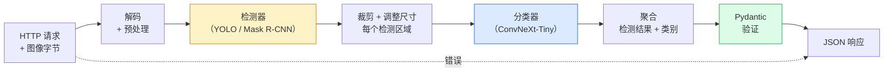

# 构建完整视觉管道 — 毕业项目

> 生产级视觉系统是由模型和规则组成的链条，通过数据契约衔接。本阶段已包含各组件；毕业项目将它们端到端地串联起来。

**类型：** 构建  
**语言：** Python  
**前置条件：** 第4阶段第01-15课  
**时长：** 约120分钟  

## 学习目标

- 设计一个生产级视觉管道，能够检测物体、对其分类并输出结构化 JSON —— 处理所有失败路径
- 将检测器（Mask R-CNN 或 YOLO）、分类器（ConvNeXt-Tiny）以及数据契约（Pydantic）整合到一个服务中
- 对端到端管道进行基准测试，识别首个瓶颈（通常是预处理，其次是检测器）
- 部署一个极简 FastAPI 服务，支持图像上传、运行管道并返回带有分类结果的检测结果

## 问题

单个视觉模型有用；视觉产品是它们的链条。零售货架审计是一个检测器 + 一个产品分类器 + 一个价格 OCR 管道。自动驾驶是一个 2D 检测器 + 一个 3D 检测器 + 一个分割器 + 一个追踪器 + 一个规划器。医学预检是一个分割器 + 一个区域分类器 + 一个临床 UI。

将这些链条连接起来，正是将机器学习原型与产品区分开的关键。模型之间的每个接口都是新的 Bug 滋生地。每个坐标变换、每个归一化、每个遮罩缩放都是潜在的静默失败点。一个管道的强度取决于其最薄弱的接口。

此毕业项目搭建了最小可行管道：检测 + 分类 + 结构化输出 + 服务层。第4阶段的其他所有内容都可以插入这个骨架：将 Mask R-CNN 替换为 YOLOv8，添加 OCR 头，添加分割分支，添加追踪器。架构是稳定的；组件是可插拔的。

## 概念

### 管道



七个阶段。两个模型阶段开销较大；其余五个阶段是 Bug 的常见藏身之处。

### 基于 Pydantic 的数据契约

每个模型边界都变成一个类型化对象。这会将静默失败转化为显式错误。

```
Detection(
    box: tuple[float, float, float, float],   # (x1, y1, x2, y2)，绝对像素
    score: float,                              # [0, 1]
    class_id: int,                             # 来自检测器的标签映射
    mask: Optional[list[list[int]]],           # 如果存在，则为 RLE 编码
)

PipelineResult(
    image_id: str,
    detections: list[Detection],
    classifications: list[Classification],
    inference_ms: float,
)
```

当检测器返回的框是 `(cx, cy, w, h)` 而非 `(x1, y1, x2, y2)` 时，Pydantic 的验证会在边界处失败，你能立即发现，而不是调试一个下游裁剪步骤（它可能静默地返回空区域）。

### 延迟分布

在几乎每个视觉管道中，有三个事实成立：

1. **预处理往往是最大的单一模块。** 解码 JPEG、转换色彩空间、调整尺寸——这些是 CPU 密集型的，且容易被忽视。
2. **检测器占用绝大部分 GPU 时间。** GPU 时间的 70%-90% 用于检测前向传播。
3. **后处理（NMS、RLE 编解码）在 GPU 上廉价，在 CPU 上昂贵。** 始终在实际目标环境下进行性能分析。

了解分布情况，才能将优化转化为优先级列表。

### 失败模式

- **空检测结果**——返回空列表，不崩溃。记录日志。
- **越界框**——在裁剪前裁剪到图像尺寸。
- **微小裁剪区域**——跳过小于分类器最小输入尺寸的框的分类。
- **损坏的上传**——返回 400 响应，附带具体错误码，而非 500。
- **模型加载失败**——在服务启动时失败，而非处理首个请求时。

生产级管道会处理上述每种情况，而不使用隐藏失败信息的通用 `try/except`。每种失败都有一个命名代码和一个响应。

### 批处理

生产级服务需要服务多个客户端。跨请求对检测和分类进行批处理可以倍增吞吐量。权衡：因等待填充批次而产生的额外延迟。典型设置：收集请求最多 20 毫秒，一起批处理，处理，分发响应。`torchserve` 和 `triton` 原生支持此功能；负载可预测的小型服务会自行实现微批处理器。

## 构建

### 第一步：数据契约

```python
from pydantic import BaseModel, Field
from typing import List, Optional, Tuple

class Detection(BaseModel):
    box: Tuple[float, float, float, float]
    score: float = Field(ge=0, le=1)
    class_id: int = Field(ge=0)
    mask_rle: Optional[str] = None


class Classification(BaseModel):
    detection_index: int
    class_id: int
    class_name: str
    score: float = Field(ge=0, le=1)


class PipelineResult(BaseModel):
    image_id: str
    detections: List[Detection]
    classifications: List[Classification]
    inference_ms: float
```

五秒钟的代码，能为你节省在任何一个严肃管道上的一小时调试时间。

### 第二步：极简 Pipeline 类

```python
import time
import numpy as np
import torch
from PIL import Image

class VisionPipeline:
    def __init__(self, detector, classifier, class_names,
                 device="cpu", min_crop=32):
        self.detector = detector.to(device).eval()
        self.classifier = classifier.to(device).eval()
        self.class_names = class_names
        self.device = device
        self.min_crop = min_crop

    def preprocess(self, image):
        """
        image: PIL.Image 或 np.ndarray (H, W, 3) uint8
        returns: CHW 格式的 float 张量，位于指定设备
        """
        if isinstance(image, Image.Image):
            image = np.asarray(image.convert("RGB"))
        tensor = torch.from_numpy(image).permute(2, 0, 1).float() / 255.0
        return tensor.to(self.device)

    @torch.no_grad()
    def detect(self, image_tensor):
        return self.detector([image_tensor])[0]

    @torch.no_grad()
    def classify(self, crops):
        if len(crops) == 0:
            return []
        batch = torch.stack(crops).to(self.device)
        logits = self.classifier(batch)
        probs = logits.softmax(-1)
        scores, cls = probs.max(-1)
        return list(zip(cls.tolist(), scores.tolist()))

    def run(self, image, image_id="anonymous"):
        t0 = time.perf_counter()
        tensor = self.preprocess(image)
        det = self.detect(tensor)

        crops = []
        detections = []
        valid_indices = []
        for i, (box, score, cls) in enumerate(zip(det["boxes"], det["scores"], det["labels"])):
            x1, y1, x2, y2 = [max(0, int(b)) for b in box.tolist()]
            x2 = min(x2, tensor.shape[-1])
            y2 = min(y2, tensor.shape[-2])
            detections.append(Detection(
                box=(x1, y1, x2, y2),
                score=float(score),
                class_id=int(cls),
            ))
            if (x2 - x1) < self.min_crop or (y2 - y1) < self.min_crop:
                continue
            crop = tensor[:, y1:y2, x1:x2]
            crop = torch.nn.functional.interpolate(
                crop.unsqueeze(0),
                size=(224, 224),
                mode="bilinear",
                align_corners=False,
            )[0]
            crops.append(crop)
            valid_indices.append(i)

        class_preds = self.classify(crops)

        classifications = []
        for valid_idx, (cls_id, cls_score) in zip(valid_indices, class_preds):
            classifications.append(Classification(
                detection_index=valid_idx,
                class_id=int(cls_id),
                class_name=self.class_names[cls_id],
                score=float(cls_score),
            ))

        return PipelineResult(
            image_id=image_id,
            detections=detections,
            classifications=classifications,
            inference_ms=(time.perf_counter() - t0) * 1000,
        )
```

每个接口都是类型化的。每个失败路径都有特定的处理决策。

### 第三步：连接检测器和分类器

```python
from torchvision.models.detection import maskrcnn_resnet50_fpn_v2
from torchvision.models import convnext_tiny

# 使用 ImageNet 预训练权重，模拟实际管道（无需训练）
detector = maskrcnn_resnet50_fpn_v2(weights="DEFAULT")
classifier = convnext_tiny(weights="DEFAULT")
class_names = [f"imagenet_class_{i}" for i in range(1000)]

pipe = VisionPipeline(detector, classifier, class_names)

# 使用合成图像进行冒烟测试
test_image = (np.random.rand(400, 600, 3) * 255).astype(np.uint8)
result = pipe.run(test_image, image_id="demo")
print(result.model_dump_json(indent=2)[:500])
```

### 第四步：FastAPI 服务

```python
from fastapi import FastAPI, UploadFile, HTTPException
from io import BytesIO

app = FastAPI()
pipe = None  # 在启动时初始化

@app.on_event("startup")
def load():
    global pipe
    detector = maskrcnn_resnet50_fpn_v2(weights="DEFAULT").eval()
    classifier = convnext_tiny(weights="DEFAULT").eval()
    pipe = VisionPipeline(detector, classifier, class_names=[f"c{i}" for i in range(1000)])

@app.post("/detect")
async def detect_endpoint(file: UploadFile):
    if file.content_type not in {"image/jpeg", "image/png", "image/webp"}:
        raise HTTPException(status_code=400, detail="不支持的图像类型")
    data = await file.read()
    try:
        img = Image.open(BytesIO(data)).convert("RGB")
    except Exception:
        raise HTTPException(status_code=400, detail="无法解码图像")
    result = pipe.run(img, image_id=file.filename or "upload")
    return result.model_dump()
```

使用 `uvicorn main:app --host 0.0.0.0 --port 8000` 运行。使用 `curl -F 'file=@dog.jpg' http://localhost:8000/detect` 测试。

### 第五步：对管道进行基准测试

```python
import time

def benchmark(pipe, num_runs=20, image_size=(400, 600)):
    img = (np.random.rand(*image_size, 3) * 255).astype(np.uint8)
    pipe.run(img)  # 预热

    stages = {"preprocess": [], "detect": [], "classify": [], "total": []}
    for _ in range(num_runs):
        t0 = time.perf_counter()
        tensor = pipe.preprocess(img)
        t1 = time.perf_counter()
        det = pipe.detect(tensor)
        t2 = time.perf_counter()
        crops = []
        for box in det["boxes"]:
            x1, y1, x2, y2 = [max(0, int(b)) for b in box.tolist()]
            x2 = min(x2, tensor.shape[-1])
            y2 = min(y2, tensor.shape[-2])
            if (x2 - x1) >= pipe.min_crop and (y2 - y1) >= pipe.min_crop:
                crop = tensor[:, y1:y2, x1:x2]
                crop = torch.nn.functional.interpolate(
                    crop.unsqueeze(0), size=(224, 224), mode="bilinear", align_corners=False
                )[0]
                crops.append(crop)
        pipe.classify(crops)
        t3 = time.perf_counter()
        stages["preprocess"].append((t1 - t0) * 1000)
        stages["detect"].append((t2 - t1) * 1000)
        stages["classify"].append((t3 - t2) * 1000)
        stages["total"].append((t3 - t0) * 1000)

    for stage, times in stages.items():
        times.sort()
        print(f"{stage:12s}  p50={times[len(times)//2]:7.1f} ms  p95={times[int(len(times)*0.95)]:7.1f} ms")
```

在 CPU 上的典型输出：预处理约 3 毫秒，检测 300-500 毫秒，分类 20-40 毫秒，总计 350-550 毫秒。在 GPU 上，检测为 20-40 毫秒，预处理和分类的相对重要性开始上升。

## 使用

生产模板汇聚为相同的结构，外加：

- **模型版本管理**——始终在响应中记录模型名称和权重哈希值。
- **每个请求的追踪 ID**——记录每个请求的每个阶段耗时，以便将慢响应与阶段关联起来。
- **回退路径**——如果分类器超时，则返回无分类的检测结果，而不是使整个请求失败。
- **安全过滤器**——NSFW / PII 过滤器在分类之后、响应离开服务之前运行。
- **批量端点**——一个 `/detect_batch` 端点，接受图像 URL 列表进行批量处理。

对于生产级服务，`torchserve`、`Triton Inference Server` 和 `BentoML` 开箱即用地处理批处理、版本管理、指标和健康检查。直接运行 `FastAPI` 适用于原型和小规模产品。

## 发布

本课产出：

- `outputs/prompt-vision-service-shape-reviewer.md` —— 一个提示词，用于审查视觉服务代码是否存在契约/响应形状违规，并指出第一个破坏性 Bug。
- `outputs/skill-pipeline-budget-planner.md` —— 一项技能，给定目标延迟和吞吐量后，为每个管道阶段分配时间预算，并标记哪个阶段会首先超出预算。

## 练习

1. **(简单)** 在任何开放数据集上对 10 张图像运行管道。报告每阶段的平均时间以及每张图像的检测数量分布。
2. **(中等)** 为 `Detection` 添加一个掩码输出字段，并将其编码为 RLE。验证即使对于包含 10 个物体的图像，JSON 仍保持在 1MB 以下。
3. **(困难)** 在分类器前添加一个微批处理器：收集最多 10 毫秒内的裁剪区域，在单个 GPU 调用中全部分类，按请求返回结果。在每秒 5 个并发请求下测量吞吐量增益以及增加的延迟。

## 关键术语

| 