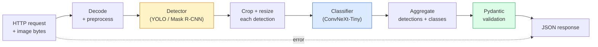

# 16 · 构建完整的视觉流水线——综合实战

> 生产级视觉系统是由模型与规则通过数据契约串联而成的一条链。各个零件本阶段已经备齐，本次综合实战要做的就是把它们端到端地接起来。

**类型：** 构建
**语言：** Python
**前置：** 第 4 阶段 第 01-15 课
**时长：** 约 120 分钟

## 学习目标

- 设计一条生产级视觉流水线，完成目标检测、分类，并输出结构化 JSON——同时处理好每一条失败路径
- 把一个检测器（Mask R-CNN 或 YOLO）、一个分类器（ConvNeXt-Tiny）和一份数据契约（Pydantic）接入同一个服务
- 对端到端流水线做基准测试，找出第一个瓶颈（通常是预处理，其次是检测器）
- 交付一个最小化的 FastAPI 服务，它接收图像上传、运行流水线，并返回带分类结果的检测项

## 问题所在

单个视觉模型有用；而视觉产品则是由它们串成的链。一次零售货架审计是检测器加产品分类器加价格 OCR 流水线。自动驾驶是 2D 检测器加 3D 检测器加分割器加跟踪器加规划器。一次医学预筛查是分割器加区域分类器加临床医生界面。

把这些链路接起来，正是区分「机器学习原型」与「产品」的关键所在。模型与模型之间的每一个接口都是新的 bug 滋生地。每一次坐标变换、每一次归一化、每一次掩膜（mask）缩放都可能是悄无声息的失败点。一条流水线的强度取决于它最薄弱的那个接口。

本次综合实战搭建的是最小可用流水线：检测 + 分类 + 结构化输出 + 一层服务封装。第 4 阶段的其余内容都能嵌进这套骨架里：把 Mask R-CNN 换成 YOLOv8、加一个 OCR 头、加一条分割分支、加一个跟踪器。架构是稳定的，零件是可插拔的。

## 核心概念

### 流水线



共七个阶段。其中两个模型阶段开销很大；而 bug 往往藏在另外五个阶段里。

### 用 Pydantic 定义数据契约（data contract）

每一个模型边界都变成一个带类型的对象。这能把无声的失败变成响亮的报错。

```
Detection(
    box: tuple[float, float, float, float],   # (x1, y1, x2, y2)，绝对像素坐标
    score: float,                              # [0, 1]
    class_id: int,                             # 来自检测器的标签映射
    mask: Optional[list[list[int]]],           # 若存在则为 RLE 编码
)

PipelineResult(
    image_id: str,
    detections: list[Detection],
    classifications: list[Classification],
    inference_ms: float,
)
```

当某个检测器返回的框是 `(cx, cy, w, h)` 而不是 `(x1, y1, x2, y2)` 时，Pydantic 的校验会在边界处直接失败，你会立刻发现问题——而不是去调试一个下游裁剪逻辑，它悄无声息地返回了空区域。

### 延迟去了哪里

几乎在每一条视觉流水线里，下面三条真理都成立：

1. **预处理往往是单块耗时最大的环节。** 解码 JPEG、转换色彩空间、缩放——这些都是 CPU 密集型操作，而且很容易被忽视。
2. **检测器主导着 GPU 时间。** GPU 时间的 70-90% 都花在检测的前向传播上。
3. **后处理（NMS、RLE 编/解码）在 GPU 上很便宜，在 CPU 上很昂贵。** 一定要在真实的目标平台上做性能剖析。

了解这种分布，才能把优化变成一份按优先级排序的清单。

### 失败模式

- **空检测结果**——返回空列表，不要崩溃。记录日志。
- **越界框**——裁剪之前先夹取（clamp）到图像尺寸范围内。
- **过小的裁剪区域**——对于小于分类器最小输入尺寸的框，跳过分类。
- **损坏的上传文件**——返回 400 响应并带上具体的错误码，而不是 500。
- **模型加载失败**——在服务启动时就失败，而不是在第一次请求时才失败。

一条生产级流水线会逐一处理上述每种情况，而不会写一个泛泛的 `try/except` 把失败掩盖掉。每一种失败都对应一个具名的错误码和一个响应。

### 批处理（batching）

生产级服务要同时服务多个客户端。把跨请求的检测和分类合批，能成倍提升吞吐量。代价是：等待一批攒满会带来额外的延迟。典型做法是：收集请求最多 20ms，合批一起处理，再把响应分发回去。`torchserve` 和 `triton` 原生支持这套机制；负载可预测的小型服务则自行实现一个微批处理器（micro-batcher）。

## 动手构建

### 第 1 步：数据契约

```python
from pydantic import BaseModel, Field
from typing import List, Optional, Tuple

class Detection(BaseModel):
    box: Tuple[float, float, float, float]
    score: float = Field(ge=0, le=1)
    class_id: int = Field(ge=0)
    mask_rle: Optional[str] = None


class Classification(BaseModel):
    detection_index: int
    class_id: int
    class_name: str
    score: float = Field(ge=0, le=1)


class PipelineResult(BaseModel):
    image_id: str
    detections: List[Detection]
    classifications: List[Classification]
    inference_ms: float
```

五秒钟写下的代码，能在任何认真做的流水线上省下一小时的调试时间。

### 第 2 步：一个最小化的 Pipeline 类

```python
import time
import numpy as np
import torch
from PIL import Image

class VisionPipeline:
    def __init__(self, detector, classifier, class_names,
                 device="cpu", min_crop=32):
        self.detector = detector.to(device).eval()
        self.classifier = classifier.to(device).eval()
        self.class_names = class_names
        self.device = device
        self.min_crop = min_crop

    def preprocess(self, image):
        """
        image: PIL.Image 或 np.ndarray (H, W, 3) uint8
        返回: 位于 device 上的 CHW float 张量
        """
        if isinstance(image, Image.Image):
            image = np.asarray(image.convert("RGB"))
        tensor = torch.from_numpy(image).permute(2, 0, 1).float() / 255.0
        return tensor.to(self.device)

    @torch.no_grad()
    def detect(self, image_tensor):
        return self.detector([image_tensor])[0]

    @torch.no_grad()
    def classify(self, crops):
        if len(crops) == 0:
            return []
        batch = torch.stack(crops).to(self.device)
        logits = self.classifier(batch)
        probs = logits.softmax(-1)
        scores, cls = probs.max(-1)
        return list(zip(cls.tolist(), scores.tolist()))

    def run(self, image, image_id="anonymous"):
        t0 = time.perf_counter()
        tensor = self.preprocess(image)
        det = self.detect(tensor)

        crops = []
        detections = []
        valid_indices = []
        for i, (box, score, cls) in enumerate(zip(det["boxes"], det["scores"], det["labels"])):
            x1, y1, x2, y2 = [max(0, int(b)) for b in box.tolist()]
            x2 = min(x2, tensor.shape[-1])
            y2 = min(y2, tensor.shape[-2])
            detections.append(Detection(
                box=(x1, y1, x2, y2),
                score=float(score),
                class_id=int(cls),
            ))
            if (x2 - x1) < self.min_crop or (y2 - y1) < self.min_crop:
                continue
            crop = tensor[:, y1:y2, x1:x2]
            crop = torch.nn.functional.interpolate(
                crop.unsqueeze(0),
                size=(224, 224),
                mode="bilinear",
                align_corners=False,
            )[0]
            crops.append(crop)
            valid_indices.append(i)

        class_preds = self.classify(crops)

        classifications = []
        for valid_idx, (cls_id, cls_score) in zip(valid_indices, class_preds):
            classifications.append(Classification(
                detection_index=valid_idx,
                class_id=int(cls_id),
                class_name=self.class_names[cls_id],
                score=float(cls_score),
            ))

        return PipelineResult(
            image_id=image_id,
            detections=detections,
            classifications=classifications,
            inference_ms=(time.perf_counter() - t0) * 1000,
        )
```

每一个接口都有类型约束。每一条失败路径都有明确的处理决策。

### 第 3 步：接入检测器与分类器

```python
from torchvision.models.detection import maskrcnn_resnet50_fpn_v2
from torchvision.models import convnext_tiny

# 使用 ImageNet 预训练权重，无需训练即可得到一条贴近真实的流水线
detector = maskrcnn_resnet50_fpn_v2(weights="DEFAULT")
classifier = convnext_tiny(weights="DEFAULT")
class_names = [f"imagenet_class_{i}" for i in range(1000)]

pipe = VisionPipeline(detector, classifier, class_names)

# 用一张合成图像做冒烟测试
test_image = (np.random.rand(400, 600, 3) * 255).astype(np.uint8)
result = pipe.run(test_image, image_id="demo")
print(result.model_dump_json(indent=2)[:500])
```

### 第 4 步：FastAPI 服务

```python
from fastapi import FastAPI, UploadFile, HTTPException
from io import BytesIO

app = FastAPI()
pipe = None  # 在启动时初始化

@app.on_event("startup")
def load():
    global pipe
    detector = maskrcnn_resnet50_fpn_v2(weights="DEFAULT").eval()
    classifier = convnext_tiny(weights="DEFAULT").eval()
    pipe = VisionPipeline(detector, classifier, class_names=[f"c{i}" for i in range(1000)])

@app.post("/detect")
async def detect_endpoint(file: UploadFile):
    if file.content_type not in {"image/jpeg", "image/png", "image/webp"}:
        raise HTTPException(status_code=400, detail="unsupported image type")
    data = await file.read()
    try:
        img = Image.open(BytesIO(data)).convert("RGB")
    except Exception:
        raise HTTPException(status_code=400, detail="cannot decode image")
    result = pipe.run(img, image_id=file.filename or "upload")
    return result.model_dump()
```

用 `uvicorn main:app --host 0.0.0.0 --port 8000` 启动。用 `curl -F 'file=@dog.jpg' http://localhost:8000/detect` 测试。

### 第 5 步：对流水线做基准测试

```python
import time

def benchmark(pipe, num_runs=20, image_size=(400, 600)):
    img = (np.random.rand(*image_size, 3) * 255).astype(np.uint8)
    pipe.run(img)  # 预热

    stages = {"preprocess": [], "detect": [], "classify": [], "total": []}
    for _ in range(num_runs):
        t0 = time.perf_counter()
        tensor = pipe.preprocess(img)
        t1 = time.perf_counter()
        det = pipe.detect(tensor)
        t2 = time.perf_counter()
        crops = []
        for box in det["boxes"]:
            x1, y1, x2, y2 = [max(0, int(b)) for b in box.tolist()]
            x2 = min(x2, tensor.shape[-1])
            y2 = min(y2, tensor.shape[-2])
            if (x2 - x1) >= pipe.min_crop and (y2 - y1) >= pipe.min_crop:
                crop = tensor[:, y1:y2, x1:x2]
                crop = torch.nn.functional.interpolate(
                    crop.unsqueeze(0), size=(224, 224), mode="bilinear", align_corners=False
                )[0]
                crops.append(crop)
        pipe.classify(crops)
        t3 = time.perf_counter()
        stages["preprocess"].append((t1 - t0) * 1000)
        stages["detect"].append((t2 - t1) * 1000)
        stages["classify"].append((t3 - t2) * 1000)
        stages["total"].append((t3 - t0) * 1000)

    for stage, times in stages.items():
        times.sort()
        print(f"{stage:12s}  p50={times[len(times)//2]:7.1f} ms  p95={times[int(len(times)*0.95)]:7.1f} ms")
```

在 CPU 上的典型输出：preprocess 约 3 ms，detect 300-500 ms，classify 20-40 ms，total 350-550 ms。在 GPU 上，detect 是 20-40 ms，此时 preprocess + classify 在相对占比上开始变得更重要。

## 实际运用

生产环境的模板最终都会收敛到同样的结构，并在此之上加入：

- **模型版本管理**——始终在响应中记录模型名称和权重哈希。
- **每请求追踪 ID（trace ID）**——为每个请求记录每个阶段的耗时，这样你就能把慢响应和具体阶段对应起来。
- **降级路径**——如果分类器超时，就返回不带分类结果的检测项，而不是让整个请求失败。
- **安全过滤器**——NSFW / PII 过滤器在分类之后、响应离开服务之前运行。
- **批量端点**——一个 `/detect_batch`，接收一组图像 URL 用于批量处理。

对于生产级服务，`torchserve`、`Triton Inference Server` 和 `BentoML` 开箱即用地处理了批处理、版本管理、指标和健康检查。直接运行 `FastAPI` 用于原型和小规模产品则完全没问题。

## 交付物

本课产出：

- `outputs/prompt-vision-service-shape-reviewer.md`——一个提示词，用于审查某个视觉服务的代码，找出契约/响应结构（shape）方面的违规之处，并指出第一个会导致崩溃的 bug。
- `outputs/skill-pipeline-budget-planner.md`——一个技能（skill），在给定目标延迟和吞吐量后，为每个流水线阶段分配时间预算，并标记出哪个阶段会最先超出其预算。

## 练习

1. **（简单）** 在任意一个开放数据集的 10 张图像上运行该流水线。报告每个阶段的平均耗时，以及每张图像检测数量的分布情况。
2. **（中等）** 给 `Detection` 加上一个掩膜输出字段，并将其编码为 RLE。验证即使是包含 10 个对象的图像，JSON 也能保持在 1MB 以内。
3. **（困难）** 在分类器前面加一个微批处理器：收集裁剪区域最多 10 ms，用一次 GPU 调用把它们全部分类，再按请求分别返回结果。在每秒 5 个并发请求的情况下，测量吞吐量的提升以及额外增加的延迟。

## 关键术语

| 术语 | 人们怎么说 | 它实际的含义 |
|------|----------------|----------------------|
| Pipeline（流水线） | 「这套系统」 | 由预处理、推理和后处理步骤组成的有序链，每一对步骤之间有带类型的接口 |
| Data contract（数据契约） | 「那个 schema」 | 每个阶段的输入与输出都遵循的 Pydantic / dataclass 定义；在边界处捕获集成 bug |
| Preprocessing（预处理） | 「模型之前的部分」 | 解码、色彩转换、缩放、归一化；通常是最大的 CPU 时间消耗项 |
| Postprocessing（后处理） | 「模型之后的部分」 | NMS、掩膜缩放、阈值化、RLE 编码；在 GPU 上便宜，在 CPU 上昂贵 |
| Microbatcher（微批处理器） | 「先收集再前向」 | 一个聚合器，在固定时间窗口内等待多个请求，再运行一次合批的前向传播 |
| Trace ID（追踪 ID） | 「请求 id」 | 在每个阶段都记录的每请求标识符，让慢请求能被端到端地追踪 |
| Failure code（失败码） | 「具名错误」 | 为每一类失败设定具体的错误码，而非泛泛的 500；让客户端能据此实现重试逻辑 |
| Health check（健康检查） | 「就绪探针」 | 一个轻量端点，报告该服务是否能应答；负载均衡器依赖它 |

## 延伸阅读

- [Full Stack Deep Learning — Deploying Models](https://fullstackdeeplearning.com/course/2022/lecture-5-deployment/)——生产级 ML 部署的经典综述
- [BentoML 文档](https://docs.bentoml.com)——具备批处理、版本管理和指标功能的服务框架
- [torchserve 文档](https://pytorch.org/serve/)——PyTorch 官方的服务库
- [NVIDIA Triton Inference Server](https://developer.nvidia.com/triton-inference-server)——支持批处理和多模型的高吞吐服务系统
