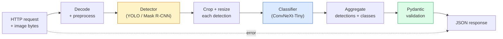

# 建立完整的愿景管道- Capstone

> 生产视觉系统是一系列与数据合同缝合的模型和规则。这些碎片已经处于这个阶段;顶石将它们端到端地连接在一起。

** 类型：** 构建
** 语言：** Python
** 先决条件：** 第4阶段课程01-15
** 时间：** ~120分钟

## Learning Objectives

- 设计一个生产视觉管道，用于检测对象，对其进行分类，并发出结构化JSON -处理每个故障路径
- 将检测器（Mass R-CNN或YOLO）、分类器（ConvNeXt-Tiny）和数据合同（Pydantic）插入一个服务
- 对端到端管道进行基准测试，并确定第一个瓶颈（通常是预处理，然后是检测器）
- 提供最低限度的FastAPI服务，该服务接受图像上传、运行管道并返回带有分类的检测结果

## 问题

个体视觉模型很有用;视觉产品是它们的链条。零售货架审计是一个检测器加上一个产品分类器加上一个价格OCR管道。自动驾驶是一个2D检测器加一个3D检测器加一个分段器加一个跟踪器加一个规划器。医疗预屏幕是一个分割器加上一个区域分类器加上一个临床医生UI。

连接这些链条是将ML原型与产品区分开来的部分。模型之间的每个接口都是错误的新地方。每一次坐标变换、每一次规格化、每一次面罩调整大小都是无声失败的候选者。管道与其最弱的接口一样强大。

这个顶峰建立了最低可行的管道：检测+分类+结构化输出+服务层。第4阶段中的其他所有内容都插入到这个框架中：将Mass R-CNN换成YOLOv 8，添加OCR头，添加分段分支，添加跟踪器。架构稳定;各个部分都是可插入的。

## 概念

### 管道



七个阶段。两个模型阶段很昂贵;其他五个阶段是错误所在的地方。

### 与Pydantic的数据合同

每个模型边界都成为一个类型化对象。这将无声的失败变成了响亮的失败。

```
Detection(
    box: tuple[float, float, float, float],   # (x1, y1, x2, y2), absolute pixels
    score: float,                              # [0, 1]
    class_id: int,                             # from detector's label map
    mask: Optional[list[list[int]]],           # RLE-encoded if present
)

PipelineResult(
    image_id: str,
    detections: list[Detection],
    classifications: list[Classification],
    inference_ms: float,
)
```

当检测器返回“（cx，cy，w，h）”而不是“（x1，y1，x2，y2）”中的框时，Pydantic的验证在边界失败，您会立即发现，而不是调试默默返回空区域的下游作物。

### 延迟去哪里

几乎每个愿景管道中都存在三个真理：

1. ** 预处理通常是最大的单一块。**解码JPEG、转换色彩空间、预设--这些都是受MCU约束的，很容易忘记。
2. **The detector dominates GPU time.** 70-90% of GPU time is in the detection forward pass.
3. ** 后处理（NMC、RLE编码/解码）在图形处理器上很便宜，在图形处理器上很贵。**始终使用实际目标进行侧写。

了解分布可以将优化转化为优先列表。

### Failure modes

- ** 空检测 ** -返回空列表，不会崩溃。Log.
- ** 越界框 ** -在裁剪之前将图像大小夹持。
- ** 微小作物 ** -跳过小于分类器最小输入的方框的分类。
- ** 上传损坏 ** - 400响应，包含特定错误代码，而不是500。
- ** 模型加载失败 ** -服务启动时失败，而不是第一次请求时失败。

生产管道处理这些问题，而不编写隐藏故障的通用“try/except”。每个失败都有一个命名代码和一个响应。

### 配料

生产服务为多个客户提供服务。跨请求批量检测和分类会增加吞吐量。权衡：等待批次填充带来的额外延迟。典型设置：收集长达20 ms的请求、批量处理、分发响应。“Torchserve”和“triton”本身就是这样做的;具有可预测负载的小型服务可以滚动自己的微型批量处理器。

## 建设党

### 第1步：数据合同

```python
from pydantic import BaseModel, Field
from typing import List, Optional, Tuple

class Detection(BaseModel):
    box: Tuple[float, float, float, float]
    score: float = Field(ge=0, le=1)
    class_id: int = Field(ge=0)
    mask_rle: Optional[str] = None


class Classification(BaseModel):
    detection_index: int
    class_id: int
    class_name: str
    score: float = Field(ge=0, le=1)


class PipelineResult(BaseModel):
    image_id: str
    detections: List[Detection]
    classifications: List[Classification]
    inference_ms: float
```

五秒的代码可以在任何严肃的管道上节省一小时的调试。

### 第2步：最小的Pipeline类

```python
import time
import numpy as np
import torch
from PIL import Image

class VisionPipeline:
    def __init__(self, detector, classifier, class_names,
                 device="cpu", min_crop=32):
        self.detector = detector.to(device).eval()
        self.classifier = classifier.to(device).eval()
        self.class_names = class_names
        self.device = device
        self.min_crop = min_crop

    def preprocess(self, image):
        """
        image: PIL.Image or np.ndarray (H, W, 3) uint8
        returns: CHW float tensor on device
        """
        if isinstance(image, Image.Image):
            image = np.asarray(image.convert("RGB"))
        tensor = torch.from_numpy(image).permute(2, 0, 1).float() / 255.0
        return tensor.to(self.device)

    @torch.no_grad()
    def detect(self, image_tensor):
        return self.detector([image_tensor])[0]

    @torch.no_grad()
    def classify(self, crops):
        if len(crops) == 0:
            return []
        batch = torch.stack(crops).to(self.device)
        logits = self.classifier(batch)
        probs = logits.softmax(-1)
        scores, cls = probs.max(-1)
        return list(zip(cls.tolist(), scores.tolist()))

    def run(self, image, image_id="anonymous"):
        t0 = time.perf_counter()
        tensor = self.preprocess(image)
        det = self.detect(tensor)

        crops = []
        detections = []
        valid_indices = []
        for i, (box, score, cls) in enumerate(zip(det["boxes"], det["scores"], det["labels"])):
            x1, y1, x2, y2 = [max(0, int(b)) for b in box.tolist()]
            x2 = min(x2, tensor.shape[-1])
            y2 = min(y2, tensor.shape[-2])
            detections.append(Detection(
                box=(x1, y1, x2, y2),
                score=float(score),
                class_id=int(cls),
            ))
            if (x2 - x1) < self.min_crop or (y2 - y1) < self.min_crop:
                continue
            crop = tensor[:, y1:y2, x1:x2]
            crop = torch.nn.functional.interpolate(
                crop.unsqueeze(0),
                size=(224, 224),
                mode="bilinear",
                align_corners=False,
            )[0]
            crops.append(crop)
            valid_indices.append(i)

        class_preds = self.classify(crops)

        classifications = []
        for valid_idx, (cls_id, cls_score) in zip(valid_indices, class_preds):
            classifications.append(Classification(
                detection_index=valid_idx,
                class_id=int(cls_id),
                class_name=self.class_names[cls_id],
                score=float(cls_score),
            ))

        return PipelineResult(
            image_id=image_id,
            detections=detections,
            classifications=classifications,
            inference_ms=(time.perf_counter() - t0) * 1000,
        )
```

每个界面都被输入。每个故障路径都有特定的处理决策。

### 第3步：连接检测器和分类器

```python
from torchvision.models.detection import maskrcnn_resnet50_fpn_v2
from torchvision.models import convnext_tiny

# Use ImageNet-pretrained weights for a realistic pipeline without training
detector = maskrcnn_resnet50_fpn_v2(weights="DEFAULT")
classifier = convnext_tiny(weights="DEFAULT")
class_names = [f"imagenet_class_{i}" for i in range(1000)]

pipe = VisionPipeline(detector, classifier, class_names)

# Smoke test with a synthetic image
test_image = (np.random.rand(400, 600, 3) * 255).astype(np.uint8)
result = pipe.run(test_image, image_id="demo")
print(result.model_dump_json(indent=2)[:500])
```

### 第4步：FastAPI服务

```python
from fastapi import FastAPI, UploadFile, HTTPException
from io import BytesIO

app = FastAPI()
pipe = None  # initialised on startup

@app.on_event("startup")
def load():
    global pipe
    detector = maskrcnn_resnet50_fpn_v2(weights="DEFAULT").eval()
    classifier = convnext_tiny(weights="DEFAULT").eval()
    pipe = VisionPipeline(detector, classifier, class_names=[f"c{i}" for i in range(1000)])

@app.post("/detect")
async def detect_endpoint(file: UploadFile):
    if file.content_type not in {"image/jpeg", "image/png", "image/webp"}:
        raise HTTPException(status_code=400, detail="unsupported image type")
    data = await file.read()
    try:
        img = Image.open(BytesIO(data)).convert("RGB")
    except Exception:
        raise HTTPException(status_code=400, detail="cannot decode image")
    result = pipe.run(img, image_id=file.filename or "upload")
    return result.model_dump()
```

使用`uvicorn main：app --host 0.0.0.0--port 8000`运行。使用`curl -F 'file=@dog.jpg' http：//localhost：8000/detect`进行测试。

### 第5步：对管道进行基准

```python
import time

def benchmark(pipe, num_runs=20, image_size=(400, 600)):
    img = (np.random.rand(*image_size, 3) * 255).astype(np.uint8)
    pipe.run(img)  # warm up

    stages = {"preprocess": [], "detect": [], "classify": [], "total": []}
    for _ in range(num_runs):
        t0 = time.perf_counter()
        tensor = pipe.preprocess(img)
        t1 = time.perf_counter()
        det = pipe.detect(tensor)
        t2 = time.perf_counter()
        crops = []
        for box in det["boxes"]:
            x1, y1, x2, y2 = [max(0, int(b)) for b in box.tolist()]
            x2 = min(x2, tensor.shape[-1])
            y2 = min(y2, tensor.shape[-2])
            if (x2 - x1) >= pipe.min_crop and (y2 - y1) >= pipe.min_crop:
                crop = tensor[:, y1:y2, x1:x2]
                crop = torch.nn.functional.interpolate(
                    crop.unsqueeze(0), size=(224, 224), mode="bilinear", align_corners=False
                )[0]
                crops.append(crop)
        pipe.classify(crops)
        t3 = time.perf_counter()
        stages["preprocess"].append((t1 - t0) * 1000)
        stages["detect"].append((t2 - t1) * 1000)
        stages["classify"].append((t3 - t2) * 1000)
        stages["total"].append((t3 - t0) * 1000)

    for stage, times in stages.items():
        times.sort()
        print(f"{stage:12s}  p50={times[len(times)//2]:7.1f} ms  p95={times[int(len(times)*0.95)]:7.1f} ms")
```

中央处理器上的典型输出：预处理~3 ms，检测300-500 ms，分类20-40 ms，总共350-550 ms。在图形处理器上，检测时间为20-40 ms，相对而言，预处理+分类开始变得更重要。

## 使用它

生产模板收敛到相同的结构，加上：

- ** 模型版本化 ** -始终在响应中记录模型名称和权重哈希。
- ** 每个请求的跟踪ID ** -记录每个请求的每个阶段计时，以便您可以将缓慢响应与阶段关联起来。
- ** 后备路径 ** -如果分类器超时，则返回不带分类的检测，而不是整个请求失败。
- ** 安全过滤器 ** - NSFW / PII过滤器在分类后、响应离开服务前运行。
- ** 批处理端点 ** - a '/Detect_batch '接受图像URL列表以进行批量处理。

对于生产服务，“torchserve”、“Triton推理服务器”和“BentoML”可以立即处理收件箱、版本控制、指标和健康状况检查。对于原型和小规模产品来说，直接运行“FastAPI”是可以的。

## 把它运

本课产生：

- ' outputes/prompt-vision-service-shape-reviewer.md '-一个提示，用于检查视觉服务的代码是否违反合同/响应形状，并命名第一个突发错误。
- `outputs/skill-pipeline-budget-planner.md` — a skill that, given target latency and throughput, assigns a time budget to every pipeline stage and flags which stage will miss its budget first.

## 演习

1. **（简单）** 在任何开放数据集的10张图像上运行管道。报告每个阶段的平均时间以及每个图像的检测计数分布。
2. **（中）** 将屏蔽输出字段添加到“检测”并将其编码为RLE。验证即使对于包含10个对象的图像，SON也保持在1 MB以下。
3. **（硬）** 在分类器前添加一个微批器：收集作物长达10 ms，在一次图形处理器调用中将它们全部分类，每次请求返回结果。测量每秒5个并发请求和增加的延迟时的吞吐量增加。

## 关键术语

| Term | 别人怎么说 | 它实际上意味着什么 |
|------|----------------|----------------------|
| 管道 | "The system" | 预处理、推理和后处理步骤的有序链，每对步骤之间都有类型化接口 |
| 数据契约 | “模式” | 每个阶段输入和输出都遵守的Pydantic /类定义;在边界捕获集成错误 |
| 预处理 | “模特之前” | 解码、颜色转换、重写、规范化;通常是最大的中央处理器时间损失 |
| 后处理 | “模特之后” | NMC、屏蔽大小、阈值、RLE编码;在图形处理器上便宜，在图形处理器上昂贵 |
| 微型批次机 | “收集然后转发” | 聚集器在固定窗口中等待多个请求，运行单个批量转发 |
| Trace ID | “请求id” | 在每个阶段记录每个请求的标识符，以便可以端到端跟踪缓慢的请求 |
| 故障代码 | “命名错误” | 每个失败类的特定错误代码，而不是通用500;启用客户端再试逻辑 |
| 健康检查 | “准备度探测” | 报告服务是否可以回答的廉价端点;负载平衡器依赖于此 |

## 进一步阅读

- [Full Stack Deep Learning — Deploying Models](https://fullstackdeeplearning.com/course/2022/lecture-5-deployment/) — the canonical overview of production ML deployment
- [BentoML docs]（https：docs.bentoml.com）-提供具有预设、版本控制和指标的框架
- [torchserve docs]（https：//pytorch.org/serve/）- PyTorch的官方服务库
- [NVIDIA Triton Inference-server]（https：//developer.nvidia.com/triton-inference-server）-高吞吐量服务，支持收件箱和多模型
