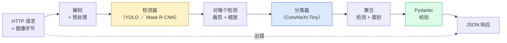

# 搭一条完整的视觉流水线 —— Capstone

> 译注：本文译自同目录 [`en.md`](./en.md)。术语遵循仓根 [TRANSLATION_GUIDE.md](../../../../TRANSLATION_GUIDE.md)。

> 一条上线的视觉系统，是一条由模型和规则串起来、用数据契约缝合的链。零件这一阶段都已经凑齐了；capstone 要做的，是把它们端到端地接通。

**Type:** Build
**Languages:** Python
**Prerequisites:** Phase 4 Lessons 01-15
**Time:** ~120 minutes

## 学习目标（Learning Objectives）

- 设计一条上线级的视觉 pipeline（流水线）：检测物体、对其分类、产出结构化 JSON —— 每条失败路径都要有处理
- 把一个 detector（Mask R-CNN 或 YOLO）、一个 classifier（ConvNeXt-Tiny）、一份数据契约（Pydantic）拼成同一个服务
- 对端到端 pipeline 做 benchmark，找出第一个瓶颈（通常是预处理，其次是 detector）
- 上线一个最小可用的 FastAPI 服务：接收图片上传、跑一遍 pipeline、返回带分类结果的检测

## 问题（The Problem）

单个视觉模型有用；视觉产品却是把一串模型连起来的。零售货架审计 = detector + 商品 classifier + 价格 OCR pipeline。自动驾驶 = 2D detector + 3D detector + segmenter（分割器） + tracker（追踪器） + planner（规划器）。医疗预筛查 = segmenter + 区域 classifier + 给医生看的 UI。

把这些链路接通，是把 ML 原型和真正产品区分开的那一步。**模型与模型之间的每一个接口，都是新一处可能埋 bug 的地方。** 每一次坐标变换、每一次归一化、每一次 mask resize，都是悄无声息出错的候选项。一条 pipeline 的强度，取决于它最弱的那个接口。

这堂 capstone 搭起最小可用的 pipeline：检测 + 分类 + 结构化输出 + serving 层。Phase 4 里的其他东西都能往这副骨架上插：把 Mask R-CNN 换成 YOLOv8、加一个 OCR head（头）、加一条 segmentation 分支、加一个 tracker。架构是稳定的；零件是可插拔的。

## 概念（The Concept）

### 这条 pipeline



七个阶段。两个模型阶段最贵；另外五个阶段，才是 bug 真正的栖息地。

### 用 Pydantic 建数据契约

每一处模型边界都变成一个有类型的对象。这能把「悄悄出错」变成「大声抗议」。

```
Detection(
    box: tuple[float, float, float, float],   # (x1, y1, x2, y2), absolute pixels
    score: float,                              # [0, 1]
    class_id: int,                             # from detector's label map
    mask: Optional[list[list[int]]],           # RLE-encoded if present
)

PipelineResult(
    image_id: str,
    detections: list[Detection],
    classifications: list[Classification],
    inference_ms: float,
)
```

当 detector 返回的框是 `(cx, cy, w, h)` 而不是 `(x1, y1, x2, y2)` 时，Pydantic 会在边界处直接校验失败，你立刻就知道哪里错了 —— 而不是去 debug 一段下游的 crop 代码，发现它默默地返回了空区域。

### 延迟都跑哪去了

几乎每一条视觉 pipeline 都会出现下面三件事：

1. **预处理常常是单块最大头。** 解码 JPEG、转色彩空间、resize —— 这些都是 CPU-bound 的活，又最容易被忽略。
2. **detector 吃掉绝大多数 GPU 时间。** GPU 时间的 70%-90% 花在 detection 的前向传播。
3. **后处理（NMS、RLE 编/解码）在 GPU 上很便宜，在 CPU 上很贵。** 一定要在真实目标硬件上 profile（性能分析）。

知道时间分布在哪里，才能把优化变成一份有优先级的清单。

### 失败模式

- **空 detection** —— 返回空列表，别 crash。打日志。
- **越界框** —— crop 之前先 clamp 到图像尺寸内。
- **太小的 crop** —— 比 classifier 最小输入还小的框，直接跳过分类。
- **损坏的上传** —— 返回 400，带上具体错误码，不要返回 500。
- **模型加载失败** —— 在服务启动时就失败，而不是等到第一个请求来。

一条上线 pipeline 要把这些情况一一处理，**而不是用一个万能的 `try/except` 把失败盖住。** 每种失败都给一个有名字的错误码、一份对应的响应。

### 批处理（Batching）

上线服务要面对多个客户端。把跨请求的 detection 和 classification 打成一个 batch（批），能成倍放大吞吐。代价：要等 batch 攒满，多出一些延迟。典型做法：最多攒 20ms 的请求、合成一个 batch、跑完、再把结果分发回去。`torchserve` 和 `triton` 自带这套机制；负载可预期的小服务则会自己写一个 micro-batcher（微批器）。

## 动手实现（Build It）

### 第 1 步：数据契约

```python
from pydantic import BaseModel, Field
from typing import List, Optional, Tuple

class Detection(BaseModel):
    box: Tuple[float, float, float, float]
    score: float = Field(ge=0, le=1)
    class_id: int = Field(ge=0)
    mask_rle: Optional[str] = None


class Classification(BaseModel):
    detection_index: int
    class_id: int
    class_name: str
    score: float = Field(ge=0, le=1)


class PipelineResult(BaseModel):
    image_id: str
    detections: List[Detection]
    classifications: List[Classification]
    inference_ms: float
```

五秒钟敲完的代码，能在任何一条正经 pipeline 上为你省下一个小时的 debug。

### 第 2 步：一个最小可用的 Pipeline 类

```python
import time
import numpy as np
import torch
from PIL import Image

class VisionPipeline:
    def __init__(self, detector, classifier, class_names,
                 device="cpu", min_crop=32):
        self.detector = detector.to(device).eval()
        self.classifier = classifier.to(device).eval()
        self.class_names = class_names
        self.device = device
        self.min_crop = min_crop

    def preprocess(self, image):
        """
        image: PIL.Image or np.ndarray (H, W, 3) uint8
        returns: CHW float tensor on device
        """
        if isinstance(image, Image.Image):
            image = np.asarray(image.convert("RGB"))
        tensor = torch.from_numpy(image).permute(2, 0, 1).float() / 255.0
        return tensor.to(self.device)

    @torch.no_grad()
    def detect(self, image_tensor):
        return self.detector([image_tensor])[0]

    @torch.no_grad()
    def classify(self, crops):
        if len(crops) == 0:
            return []
        batch = torch.stack(crops).to(self.device)
        logits = self.classifier(batch)
        probs = logits.softmax(-1)
        scores, cls = probs.max(-1)
        return list(zip(cls.tolist(), scores.tolist()))

    def run(self, image, image_id="anonymous"):
        t0 = time.perf_counter()
        tensor = self.preprocess(image)
        det = self.detect(tensor)

        crops = []
        detections = []
        valid_indices = []
        for i, (box, score, cls) in enumerate(zip(det["boxes"], det["scores"], det["labels"])):
            x1, y1, x2, y2 = [max(0, int(b)) for b in box.tolist()]
            x2 = min(x2, tensor.shape[-1])
            y2 = min(y2, tensor.shape[-2])
            detections.append(Detection(
                box=(x1, y1, x2, y2),
                score=float(score),
                class_id=int(cls),
            ))
            if (x2 - x1) < self.min_crop or (y2 - y1) < self.min_crop:
                continue
            crop = tensor[:, y1:y2, x1:x2]
            crop = torch.nn.functional.interpolate(
                crop.unsqueeze(0),
                size=(224, 224),
                mode="bilinear",
                align_corners=False,
            )[0]
            crops.append(crop)
            valid_indices.append(i)

        class_preds = self.classify(crops)

        classifications = []
        for valid_idx, (cls_id, cls_score) in zip(valid_indices, class_preds):
            classifications.append(Classification(
                detection_index=valid_idx,
                class_id=int(cls_id),
                class_name=self.class_names[cls_id],
                score=float(cls_score),
            ))

        return PipelineResult(
            image_id=image_id,
            detections=detections,
            classifications=classifications,
            inference_ms=(time.perf_counter() - t0) * 1000,
        )
```

每一处接口都有类型。每一条失败路径都有明确的处理决定。

### 第 3 步：把 detector 和 classifier 接上

```python
from torchvision.models.detection import maskrcnn_resnet50_fpn_v2
from torchvision.models import convnext_tiny

# Use ImageNet-pretrained weights for a realistic pipeline without training
detector = maskrcnn_resnet50_fpn_v2(weights="DEFAULT")
classifier = convnext_tiny(weights="DEFAULT")
class_names = [f"imagenet_class_{i}" for i in range(1000)]

pipe = VisionPipeline(detector, classifier, class_names)

# Smoke test with a synthetic image
test_image = (np.random.rand(400, 600, 3) * 255).astype(np.uint8)
result = pipe.run(test_image, image_id="demo")
print(result.model_dump_json(indent=2)[:500])
```

### 第 4 步：FastAPI 服务

```python
from fastapi import FastAPI, UploadFile, HTTPException
from io import BytesIO

app = FastAPI()
pipe = None  # initialised on startup

@app.on_event("startup")
def load():
    global pipe
    detector = maskrcnn_resnet50_fpn_v2(weights="DEFAULT").eval()
    classifier = convnext_tiny(weights="DEFAULT").eval()
    pipe = VisionPipeline(detector, classifier, class_names=[f"c{i}" for i in range(1000)])

@app.post("/detect")
async def detect_endpoint(file: UploadFile):
    if file.content_type not in {"image/jpeg", "image/png", "image/webp"}:
        raise HTTPException(status_code=400, detail="unsupported image type")
    data = await file.read()
    try:
        img = Image.open(BytesIO(data)).convert("RGB")
    except Exception:
        raise HTTPException(status_code=400, detail="cannot decode image")
    result = pipe.run(img, image_id=file.filename or "upload")
    return result.model_dump()
```

用 `uvicorn main:app --host 0.0.0.0 --port 8000` 跑起来。用 `curl -F 'file=@dog.jpg' http://localhost:8000/detect` 测试。

### 第 5 步：给 pipeline 做 benchmark

```python
import time

def benchmark(pipe, num_runs=20, image_size=(400, 600)):
    img = (np.random.rand(*image_size, 3) * 255).astype(np.uint8)
    pipe.run(img)  # warm up

    stages = {"preprocess": [], "detect": [], "classify": [], "total": []}
    for _ in range(num_runs):
        t0 = time.perf_counter()
        tensor = pipe.preprocess(img)
        t1 = time.perf_counter()
        det = pipe.detect(tensor)
        t2 = time.perf_counter()
        crops = []
        for box in det["boxes"]:
            x1, y1, x2, y2 = [max(0, int(b)) for b in box.tolist()]
            x2 = min(x2, tensor.shape[-1])
            y2 = min(y2, tensor.shape[-2])
            if (x2 - x1) >= pipe.min_crop and (y2 - y1) >= pipe.min_crop:
                crop = tensor[:, y1:y2, x1:x2]
                crop = torch.nn.functional.interpolate(
                    crop.unsqueeze(0), size=(224, 224), mode="bilinear", align_corners=False
                )[0]
                crops.append(crop)
        pipe.classify(crops)
        t3 = time.perf_counter()
        stages["preprocess"].append((t1 - t0) * 1000)
        stages["detect"].append((t2 - t1) * 1000)
        stages["classify"].append((t3 - t2) * 1000)
        stages["total"].append((t3 - t0) * 1000)

    for stage, times in stages.items():
        times.sort()
        print(f"{stage:12s}  p50={times[len(times)//2]:7.1f} ms  p95={times[int(len(times)*0.95)]:7.1f} ms")
```

CPU 上的典型输出：preprocess ~3 ms，detect 300-500 ms，classify 20-40 ms，总计 350-550 ms。换到 GPU 上，detect 降到 20-40 ms，preprocess 和 classify 在相对占比上反而更显眼了。

## 用起来（Use It）

上线模板基本都会收敛到同一种结构，外加：

- **模型版本化** —— 永远在响应里把模型名和权重 hash 一起记上。
- **每个请求的 trace ID** —— 把每个阶段的耗时都打到日志里，这样你才能把慢响应和具体阶段对上号。
- **降级路径** —— classifier 超时就只返回 detection、不返回分类结果，而不是让整个请求失败。
- **安全过滤器** —— NSFW / PII 过滤跑在分类之后、响应离开服务之前。
- **批量端点** —— 一个 `/detect_batch` 接收一组图片 URL，做批量处理。

至于真正的上线 serving，`torchserve`、`Triton Inference Server`、`BentoML` 都把 batching、版本管理、metrics、健康检查这些开箱即用做好了。直接跑 `FastAPI` 对原型和小规模产品就够了。

## 上线部署（Ship It）

这一课会产出：

- `outputs/prompt-vision-service-shape-reviewer.md` —— 一段 prompt，用来 review 一个视觉服务的代码，找出契约 / 响应结构上的违规、并指出第一个会让系统挂掉的 bug。
- `outputs/skill-pipeline-budget-planner.md` —— 一个 skill，给定目标延迟和吞吐之后，为 pipeline 的每个阶段分配时间预算，并标出哪个阶段最先会超预算。

## 练习（Exercises）

1. **（简单）** 拿任意一个开源数据集里的 10 张图跑一遍 pipeline。报告每个阶段的平均耗时，以及每张图的 detection 数量分布。
2. **（中等）** 给 `Detection` 加一个 mask 输出字段，并用 RLE 编码。验证哪怕是一张含 10 个物体的图，JSON 也能保持在 1MB 以内。
3. **（困难）** 在 classifier 前面加一个 micro-batcher：最多攒 10 ms 的 crop，一次 GPU 调用把它们都分类完，再把结果按请求分发回去。在每秒 5 个并发请求下测一下吞吐提升和增加的延迟。

## 关键术语（Key Terms）

| 术语 | 大家口头怎么说 | 真正含义 |
|------|----------------|----------------------|
| Pipeline（流水线） | "整个系统" | 一条按顺序排列的预处理 + 推理 + 后处理链路，每两段之间都有一个有类型的接口 |
| Data contract（数据契约） | "schema" | Pydantic / dataclass 定义，每个阶段的输入输出都要符合它；能在边界处抓住集成 bug |
| Preprocessing（预处理） | "进模型之前那一段" | 解码、色彩转换、resize、归一化；通常是吃 CPU 时间最多的那一块 |
| Postprocessing（后处理） | "出模型之后那一段" | NMS、mask resize、阈值处理、RLE 编码；GPU 上便宜，CPU 上贵 |
| Microbatcher（微批器） | "先攒一波再一起送" | 一个聚合器，等一个固定时间窗口收集多个请求，跑一次 batched 前向传播 |
| Trace ID | "请求 id" | 每个请求一个标识符，每个阶段都打到日志里，方便对慢请求做端到端追踪 |
| Failure code（失败码） | "命名错误" | 给每一类失败一个具体的错误码，而不是统一返回 500；让客户端能写重试逻辑 |
| Health check（健康检查） | "readiness probe（就绪探针）" | 一个便宜的端点，告诉别人这个服务现在能不能干活；负载均衡器靠它 |

## 延伸阅读（Further Reading）

- [Full Stack Deep Learning — Deploying Models](https://fullstackdeeplearning.com/course/2022/lecture-5-deployment/) —— 上线 ML 部署最经典的一份总览
- [BentoML docs](https://docs.bentoml.com) —— 自带 batching、版本管理和 metrics 的 serving 框架
- [torchserve docs](https://pytorch.org/serve/) —— PyTorch 官方的 serving 库
- [NVIDIA Triton Inference Server](https://developer.nvidia.com/triton-inference-server) —— 高吞吐 serving，支持 batching 和多模型
