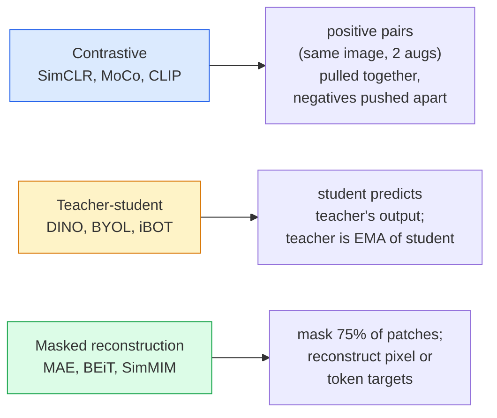

# Self-Supervised Vision — SimCLR, DINO, MAE

> 教師あり vision のボトルネックはラベルです。自己教師あり事前学習はラベルを取り除きます。1億枚のラベルなし画像から視覚特徴を学び、1万枚のラベル付き画像で fine-tune します。

**種別:** 学習 + 構築
**言語:** Python
**前提条件:** Phase 4 Lesson 04 (Image Classification), Phase 4 Lesson 14 (ViT)
**所要時間:** 約75分

## Learning Objectives

- 主要な3つの自己教師ありファミリーである contrastive (SimCLR)、teacher-student (DINO)、masked reconstruction (MAE) をたどり、それぞれが何を最適化するか説明する
- InfoNCE loss をゼロから実装し、batch 512 では機能するのに batch 32 では失敗する理由を説明する
- MAE の 75% masking ratio が任意ではない理由と、テキスト向け BERT の 15% とどう違うかを説明する
- DINOv2 または MAE ImageNet checkpoint を linear probing と zero-shot retrieval に使う

## 問題

教師あり ImageNet には 130万枚のラベル付き画像があり、アノテーション費用は推定 1000万ドルです。医療や産業データセットはより小さく、ラベル付けはさらに高価です。すべての vision チームが同じ問いに直面します。YouTube frames、web crawls、webcam footage、satellite sweeps などの安価なラベルなしデータで事前学習し、その後に小さなラベル付きセットで fine-tune できないか。

その答えが self-supervised learning です。LAION や JFT で学習した現代的な self-supervised ViT は、fine-tune すると教師あり ImageNet accuracy に到達するか上回ります。また、教師あり事前学習よりも downstream tasks (detection, segmentation, depth) へよく転移します。DINOv2 (Meta, 2023) と MAE (Meta, 2022) は、転移可能な vision features の現在の production default です。

概念上の転換は、pretext task、つまりモデルが学習時に解く課題が downstream task と同じである必要はないという点です。重要なのは、それがモデルに有用な特徴を学ばせることです。grayscale images の色を予測する、画像を回転して回転角を分類させる、patches を mask して復元する、といった方法はすべて機能してきました。スケールする3つのアプローチが contrastive learning、teacher-student distillation、masked reconstruction です。

## The Concept

### Three families



### Contrastive learning (SimCLR)

1枚の画像に2つの random augmentations を適用して、2つの views を作ります。両方を同じ encoder と projection head に通します。そして「この2つの embeddings は近くあるべき」「この embedding は batch 内の他のすべての画像 embeddings から遠くあるべき」という loss を最小化します。

```
Loss for positive pair (z_i, z_j) among 2N views per batch:

   L_ij = -log( exp(sim(z_i, z_j) / tau) / sum_k in batch \ {i} exp(sim(z_i, z_k) / tau) )

sim = cosine similarity
tau = temperature (0.1 standard)
```

これが InfoNCE loss です。positive ごとに多くの negatives が必要なので batch size が重要です。SimCLR には 512-8192 が必要です。MoCo は過去 batch の momentum queue を導入し、negative 数を batch size から切り離しました。

### Teacher-student (DINO)

同じ architecture を持つ2つの networks、student と teacher を使います。teacher は student weights の exponential moving average (EMA) です。両方が画像の augmented views を見ます。student の出力は teacher の出力に一致するよう学習されます。明示的な negatives はありません。

```
loss = CE( student_output(view_1),  teacher_output(view_2) )
     + CE( student_output(view_2),  teacher_output(view_1) )

teacher_weights = m * teacher_weights + (1 - m) * student_weights   (m ≈ 0.996)
```

「定数を予測する」状態に collapse しない理由は、teacher output が centered (次元ごとの平均を引く) され、sharpened (小さい temperature で割る) されるためです。Centering は1つの次元が支配的になるのを防ぎ、sharpening は output が一様分布へ collapse するのを防ぎます。

DINOv2 は DINO を 142M 枚の curated images にスケールさせたものです。得られる特徴は zero-shot visual retrieval と dense prediction の現在の SOTA です。

### Masked reconstruction (MAE)

ViT input の patches の 75% を mask します。visible な 25% だけを encoder に通します。小さな decoder は encoder output と masked positions の mask tokens を受け取り、masked patches の pixels を復元するよう学習されます。

```
Encoder:  visible 25% of patches -> features
Decoder:  features + mask tokens at masked positions -> reconstructed pixels
Loss:     MSE between reconstructed and original pixels on masked patches only
```

MAE を機能させる主要な設計選択:

- **75% mask ratio** — 高い値です。encoder に semantic features を学ばせます。25% を復元するだけならほぼ自明です。隣接 pixels は強く相関しているため、CNN でも解けます。
- **Asymmetric encoder/decoder** — 大きな ViT encoder は visible patches だけを見ます。小さな decoder (8-layer, 512-dim) が reconstruction を担当します。naive BEiT より 3x 速い pretraining になります。
- **Pixel-space reconstruction target** — BEiT の tokenised target より単純で、ViT ではよりよく機能します。

事前学習後は decoder を捨てます。encoder が feature extractor です。

### Why 75% and not 15%

BERT は tokens の 15% を mask します。MAE は 75% を mask します。違いは情報密度です。

- Natural language は token あたりの entropy が高いです。masked position ごとに多くの plausible completions があるため、15% の tokens を予測するだけでも難しい課題です。
- Image patches は entropy が低いです。unmasked neighbourhood が masked patch の pixels をほぼ完全に決めることがよくあります。予測に semantic understanding を必要とさせるには、強く mask する必要があります。

75% は単純な spatial extrapolation では解けないほど高く、encoder が image content を表現しなければなりません。

### Linear-probe evaluation

自己教師あり事前学習後の標準評価は **linear probe** です。encoder を freeze し、その上に単一の linear classifier を ImageNet labels で学習します。top-1 accuracy を報告します。

- SimCLR ResNet-50: ~71% (2020)
- DINO ViT-S/16: ~77% (2021)
- MAE ViT-L/16: ~76% (2022)
- DINOv2 ViT-g/14: ~86% (2023)

Linear probe は feature quality の純粋な測定です。fine-tuning は通常 2-5 points 上乗せしますが、head retraining の効果も混ざります。

## 実装

### Step 1: Two-view augmentation pipeline

```python
import torch
import torchvision.transforms as T

two_view_train = lambda: T.Compose([
    T.RandomResizedCrop(96, scale=(0.2, 1.0)),
    T.RandomHorizontalFlip(),
    T.ColorJitter(0.4, 0.4, 0.4, 0.1),
    T.RandomGrayscale(p=0.2),
    T.ToTensor(),
])


class TwoViewDataset(torch.utils.data.Dataset):
    def __init__(self, base):
        self.base = base
        self.aug = two_view_train()

    def __len__(self):
        return len(self.base)

    def __getitem__(self, i):
        img, _ = self.base[i]
        v1 = self.aug(img)
        v2 = self.aug(img)
        return v1, v2
```

各 `__getitem__` は同じ画像の2つの augmented views を返します。labels は不要です。

### Step 2: InfoNCE loss

```python
import torch.nn.functional as F

def info_nce(z1, z2, tau=0.1):
    """
    z1, z2: (N, D) L2-normalised embeddings of paired views
    """
    N, D = z1.shape
    z = torch.cat([z1, z2], dim=0)  # (2N, D)
    sim = z @ z.T / tau              # (2N, 2N)

    mask = torch.eye(2 * N, dtype=torch.bool, device=z.device)
    sim = sim.masked_fill(mask, float("-inf"))

    targets = torch.cat([torch.arange(N, 2 * N), torch.arange(0, N)]).to(z.device)
    return F.cross_entropy(sim, targets)
```

呼び出す前に embeddings を L2-normalise します。`tau=0.1` は SimCLR の default です。低い値ほど loss が sharper になり、より多くの negatives が必要になります。

### Step 3: Sanity check InfoNCE

```python
z1 = F.normalize(torch.randn(16, 32), dim=-1)
z2 = z1.clone()
loss_same = info_nce(z1, z2, tau=0.1).item()
z2_random = F.normalize(torch.randn(16, 32), dim=-1)
loss_random = info_nce(z1, z2_random, tau=0.1).item()
print(f"InfoNCE with identical pairs:  {loss_same:.3f}")
print(f"InfoNCE with random pairs:     {loss_random:.3f}")
```

同一 pairs では低い loss になるはずです。large batch と cold temperature では 0 に近づきます。random pairs では、16-pair batch なら log(2N-1) = ~log(31) = ~3.4 になるはずです。

### Step 4: MAE-style masking

```python
def random_mask_indices(num_patches, mask_ratio=0.75, seed=0):
    g = torch.Generator().manual_seed(seed)
    n_keep = int(num_patches * (1 - mask_ratio))
    perm = torch.randperm(num_patches, generator=g)
    visible = perm[:n_keep]
    masked = perm[n_keep:]
    return visible.sort().values, masked.sort().values


num_patches = 196
visible, masked = random_mask_indices(num_patches, mask_ratio=0.75)
print(f"visible: {len(visible)} / {num_patches}")
print(f"masked:  {len(masked)} / {num_patches}")
```

単純で高速で、同じ seed に対して deterministic です。実際の MAE implementations はこれを batch 化し、sample ごとの masks を保持します。

## Use It

DINOv2 は 2026 年の production standard です。

```python
import torch
from transformers import AutoImageProcessor, AutoModel

processor = AutoImageProcessor.from_pretrained("facebook/dinov2-base")
model = AutoModel.from_pretrained("facebook/dinov2-base")
model.eval()

# Per-image embeddings for zero-shot retrieval
with torch.no_grad():
    inputs = processor(images=[pil_image], return_tensors="pt")
    outputs = model(**inputs)
    embedding = outputs.last_hidden_state[:, 0]  # CLS token
```

得られる 768-dim embedding は、現代的な image retrieval、dense correspondence、zero-shot transfer pipelines の backbone です。downstream task への fine-tuning は linear head だけで済むことがほとんどです。

image-text embeddings では SigLIP または OpenCLIP が対応物です。MAE-style fine-tuning では、`timm` repo がすべての MAE checkpoints を提供しています。

## Ship It

この lesson は次を生成します。

- `outputs/prompt-ssl-pretraining-picker.md` — dataset size、compute、downstream task から SimCLR / MAE / DINOv2 を選ぶ prompt。
- `outputs/skill-linear-probe-runner.md` — 任意の frozen encoder + labelled dataset 向けに linear-probe evaluation を書く skill。

## Exercises

1. **(Easy)** よく aligned された embeddings では temperature を下げると InfoNCE loss が下がり、random embeddings では temperature を下げると loss が上がることを確認してください。`tau in [0.05, 0.1, 0.2, 0.5]` vs loss の plot を作成してください。
2. **(Medium)** DINO-style centre buffer を実装してください。centring がないと、student が数 epochs 以内に constant vector へ collapse することを示してください。
3. **(Hard)** Lesson 10 の TinyUNet を backbone として使い、CIFAR-100 で MAE を学習してください。10, 50, 200 epochs 時点の linear-probe accuracy を報告してください。同じ 1,000-image subset 上で、MAE-pretrained linear probe が from-scratch supervised linear probe を上回ることを示してください。

## Key Terms

| Term | What people say | What it actually means |
|------|----------------|----------------------|
| Self-supervised | 「Label-free」 | ラベルなしデータから有用な表現を作る pretext task |
| Pretext task | 「The fake task」 | SSL 中に使う objective (patches を復元する、views を一致させる)。pretraining 後は捨てる |
| Linear probe | 「Frozen encoder + linear head」 | 標準的な SSL 評価。frozen features の上で linear classifier だけを学習する |
