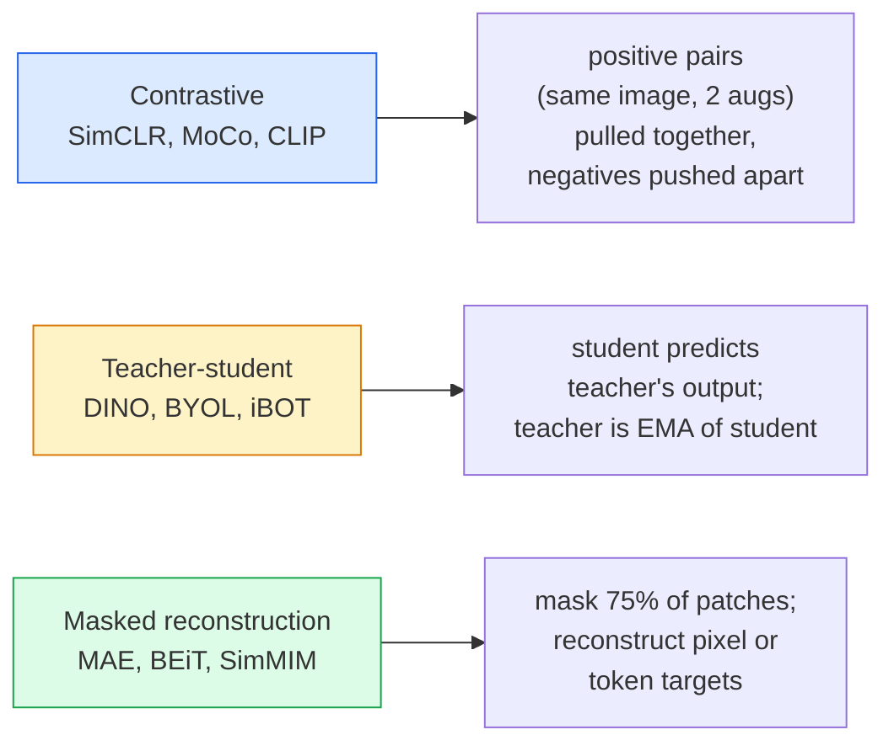

# Kendi Kendini Denetleyen Vizyon — SimCLR, DINO, MAE

> Etiketler denetimli görüşün darboğazıdır. Kendi kendine denetlenen ön eğitim bunları ortadan kaldırır: 100 milyon etiketsiz görüntüden görsel özellikleri öğrenin, 10 bin etiketli görüntüde ince ayar yapın.

**Tür:** Öğren + Oluştur
**Diller:** Python
**Önkoşullar:** Aşama 4 Ders 04 (Görüntü Sınıflandırması), Aşama 4 Ders 14 (ViT)
**Süre:** ~75 dakika

## Öğrenme Hedefleri

- Üç ana kendi kendini denetleyen aileyi (karşıtsal (SimCLR), öğretmen-öğrenci (DINO), maskeli yeniden yapılandırma (MAE)) takip edin ve her birinin neyi optimize ettiğini belirtin
- InfoNCE kaybını sıfırdan uygulayın ve neden 512'lik bir grubun çalıştığını ancak 32'lik bir grubun neden başarısız olduğunu açıklayın
- MAE'nin %75'lik maskeleme oranının neden keyfi olmadığını ve metin için BERT'in %15'lik maskeleme oranından nasıl farklı olduğunu açıklayın
- Doğrusal problama ve sıfır atışlı erişim için DINOv2 veya MAE ImageNet kontrol noktalarını kullanın

## Sorun

Denetimli ImageNet'in 1,3 milyon etiketli resmi var ve bunun da açıklama ekleme maliyeti tahmini olarak 10 milyon dolar. Tıbbi ve endüstriyel dataset'ler daha küçüktür ve etiketlenmesi daha da pahalıdır. Her vizyon ekibi şunu soruyor: YouTube çerçeveleri, web taramaları, web kamerası görüntüleri, uydu taramaları gibi ucuz etiketlenmemiş veriler üzerinde ön eğitim alıp ardından küçük bir etiketli sette ince ayar yapabilir miyiz?

Cevap, kendi kendini denetleyen öğrenmedir. LAION veya JFT üzerinde eğitilmiş, kendi kendini denetleyen modern bir ViT, ince ayar yapıldığında denetimli ImageNet doğruluğuna ulaşır veya onu geçer. Aynı zamanda denetimli ön eğitime göre alt görevlere (tespit, bölümleme, derinlik) daha iyi aktarım sağlar. DINOv2 (Meta, 2023) ve MAE (Meta, 2022), aktarılabilir görüntü özellikleri için mevcut üretim varsayılanlarıdır.

Kavramsal değişim, modelin yapmak üzere eğitildiği bahane görevinin, alt görev olması gerekmemesidir. Önemli olan modeli kullanışlı özellikleri öğrenmeye zorlamasıdır. Gri tonlamalı görüntülerin rengini tahmin edin, görüntüleri döndürün ve modelden döndürmeyi sınıflandırmasını, yamaları maskeleyip yeniden yapılandırmasını isteyin; hepsi işe yaradı. Ölçeklendiren üç yaklaşım, karşılaştırmalı öğrenme, öğretmen-öğrenci ayrıştırması ve maskeli yeniden yapılandırmadır.

## Konsept

### Üç aile



### Karşılaştırmalı öğrenme (SimCLR)

Bir görsel çekin, iki rastgele büyütme uygulayın, iki görünüm elde edin. Her ikisini de aynı kodlayıcıdan ve bir projeksiyon kafasından besleyin. "Bu iki embedding yakın olmalı" ve "bu embedding, gruptaki diğer tüm görüntülerin embedding'lerinden uzak olmalıdır" diyen kaybı en aza indirin.

```
Loss for positive pair (z_i, z_j) among 2N views per batch:

   L_ij = -log( exp(sim(z_i, z_j) / tau) / sum_k in batch \ {i} exp(sim(z_i, z_k) / tau) )

sim = cosine similarity
tau = temperature (0.1 standard)
```

Bu InfoNCE kaybıdır. Pozitif başına çok sayıda negatif gerektirir, bu nedenle parti boyutu önemlidir - SimCLR'nin 512-8192'ye ihtiyacı vardır. MoCo, negatif sayımı parti boyutundan ayırmak için geçmiş partilerden oluşan bir momentum kuyruğu başlattı.

### Öğretmen-öğrenci (DINO)

Aynı mimariye sahip iki ağ: öğrenci ve öğretmen. Öğretmen, öğrencinin ağırlıklarının üstel hareketli ortalamasıdır (EMA). Her ikisi de görüntünün artırılmış görünümlerini görür. Öğrencinin çıktısı öğretmenin çıktısıyla eşleşecek şekilde eğitilir; açık bir olumsuzluk yoktur.

```
loss = CE( student_output(view_1),  teacher_output(view_2) )
     + CE( student_output(view_2),  teacher_output(view_1) )

teacher_weights = m * teacher_weights + (1 - m) * student_weights   (m ≈ 0.996)
```

Neden "bir sabiti tahmin etmek" için çökmüyor: Öğretmenin çıktısı ortalanır (boyut başına ortalamayı çıkarın) ve keskinleştirilir (küçük sıcaklığa bölün). Merkezleme, bir boyutun hakim olmasını engeller; Keskinleştirme, çıktının tekdüze çökmesini önler.

DINO, DINOv2'nin 142 milyon seçilmiş görsel üzerinde ölçeklendirdiği şeydir. Ortaya çıkan özellikler, sıfır atışlı görsel erişim ve yoğun tahmin için mevcut SOTA'dır.

### Maskeli yeniden yapılanma (MAE)

ViT girişinin yamalarının %75'ini maskeleyin. Kodlayıcıdan yalnızca görünen %25'i geçirin. Küçük bir kod çözücü, kodlayıcının çıktısını artı maskelenmiş konumlardaki token maskesini alır ve maskelenmiş yamaların piksellerini yeniden oluşturmak üzere eğitilir.

```
Encoder:  visible 25% of patches -> features
Decoder:  features + mask tokens at masked positions -> reconstructed pixels
Loss:     MSE between reconstructed and original pixels on masked patches only
```

MAE'nin işe yaramasını sağlayan temel tasarım seçenekleri:

- **%75 maske oranı** — yüksek. Kodlayıcıyı anlamsal özellikleri öğrenmeye zorlar; %25'in yeniden oluşturulması neredeyse önemsiz olacaktır (komşu pikseller o kadar ilişkilidir ki bir CNN bunu başarabilir).
- **Asimetrik kodlayıcı/kod çözücü** — büyük ViT kodlayıcı yalnızca görünür parçaları görür; küçük bir kod çözücü (8 katmanlı, 512-dim) yeniden yapılandırmayı yönetir. Saf BEiT'ten 3 kat daha hızlı ön eğitim.
- **Piksel uzayı yeniden yapılandırma hedefi** — BEiT'in tokenised hedefinden daha basittir ve ViT'de daha iyi çalışır.

Ön eğitimden sonra kod çözücüyü atın. Kodlayıcı özellik çıkarıcıdır.

### Neden %15 değil de %75

BERT, token'lerin %15'ini maskeler. MAE maskeleri %75. Aradaki fark bilgi yoğunluğudur.

- Doğal dil token'ye göre yüksek entropiye sahiptir. token'lerin %15'ini tahmin etmek hala zordur çünkü her maskelenmiş konumun birçok makul tamamlaması vardır.
- Görüntü yamalarının entropisi düşüktür; maskesiz bir komşuluk genellikle maskeli yamanın piksellerini neredeyse tam olarak belirler. Tahminin anlamsal anlayış gerektirmesi için agresif bir şekilde maskelemeniz gerekir.

%75, basit uzaysal ekstrapolasyonun görevi çözemeyeceği kadar yüksektir; kodlayıcı görüntü içeriğini temsil etmelidir.

### Doğrusal prob değerlendirmesi

Kendi kendini denetleyen ön eğitimden sonra standart değerlendirme **doğrusal bir araştırmadır**: kodlayıcıyı dondurun, ImageNet etiketlerinin üstüne tek bir doğrusal sınıflandırıcıyı eğitin. İlk 1 doğruluğunu bildirir.

- SimCLR ResNet-50: ~%71 (2020)
- DINO ViT-S/16: ~%77 (2021)
-MAE ViT-L/16: ~%76 (2022)
- DINOv2 ViT-g/14: ~%86 (2023)

Doğrusal prob, özellik kalitesinin saf bir ölçüsüdür; fine-tuning tipik olarak 2-5 puan ekler ancak aynı zamanda kafa yeniden eğitme etkisini de karıştırır.

## İnşa Et

### 1. Adım: İki görünümlü büyütme hattı

```python
import torch
import torchvision.transforms as T

two_view_train = lambda: T.Compose([
    T.RandomResizedCrop(96, scale=(0.2, 1.0)),
    T.RandomHorizontalFlip(),
    T.ColorJitter(0.4, 0.4, 0.4, 0.1),
    T.RandomGrayscale(p=0.2),
    T.ToTensor(),
])


class TwoViewDataset(torch.utils.data.Dataset):
    def __init__(self, base):
        self.base = base
        self.aug = two_view_train()

    def __len__(self):
        return len(self.base)

    def __getitem__(self, i):
        img, _ = self.base[i]
        v1 = self.aug(img)
        v2 = self.aug(img)
        return v1, v2
```

Her __getitem__ aynı görüntünün iki genişletilmiş görünümünü döndürür; etiketlere ihtiyaç yoktur.

### Adım 2: InfoNCE kaybı

```python
import torch.nn.functional as F

def info_nce(z1, z2, tau=0.1):
    """
    z1, z2: (N, D) L2-normalised embeddings of paired views
    """
    N, D = z1.shape
    z = torch.cat([z1, z2], dim=0)  # (2N, D)
    sim = z @ z.T / tau              # (2N, 2N)

    mask = torch.eye(2 * N, dtype=torch.bool, device=z.device)
    sim = sim.masked_fill(mask, float("-inf"))

    targets = torch.cat([torch.arange(N, 2 * N), torch.arange(0, N)]).to(z.device)
    return F.cross_entropy(sim, targets)
```

L2-çağırmadan önce embedding'leri normalleştirin. `tau=0.1` SimCLR varsayılanıdır; Daha düşük olması kaybı daha keskin hale getirir ve daha fazla olumsuzluk gerektirir.

### 3. Adım: Sağlıklılık kontrolü InfoNCE

```python
z1 = F.normalize(torch.randn(16, 32), dim=-1)
z2 = z1.clone()
loss_same = info_nce(z1, z2, tau=0.1).item()
z2_random = F.normalize(torch.randn(16, 32), dim=-1)
loss_random = info_nce(z1, z2_random, tau=0.1).item()
print(f"InfoNCE with identical pairs:  {loss_same:.3f}")
print(f"InfoNCE with random pairs:     {loss_random:.3f}")
```

Aynı çiftler düşük bir kayıp vermelidir (büyük bir parti ve soğuk sıcaklık için 0'a yakın). Rastgele çiftler, 16 çiftli bir grupla log(2N-1) = ~log(31) = ~3,4 değerini vermelidir.

### Adım 4: MAE tarzı maskeleme

```python
def random_mask_indices(num_patches, mask_ratio=0.75, seed=0):
    g = torch.Generator().manual_seed(seed)
    n_keep = int(num_patches * (1 - mask_ratio))
    perm = torch.randperm(num_patches, generator=g)
    visible = perm[:n_keep]
    masked = perm[n_keep:]
    return visible.sort().values, masked.sort().values


num_patches = 196
visible, masked = random_mask_indices(num_patches, mask_ratio=0.75)
print(f"visible: {len(visible)} / {num_patches}")
print(f"masked:  {len(masked)} / {num_patches}")
```

Belirli bir tohum için basit, hızlı ve deterministik. Gerçek MAE uygulamaları bunu gruplandırır ve örnek başına maskeler tutar.

## Kullan onu

DINOv2, 2026'daki üretim standardıdır:

```python
import torch
from transformers import AutoImageProcessor, AutoModel

processor = AutoImageProcessor.from_pretrained("facebook/dinov2-base")
model = AutoModel.from_pretrained("facebook/dinov2-base")
model.eval()

# Per-image embeddings for zero-shot retrieval
with torch.no_grad():
    inputs = processor(images=[pil_image], return_tensors="pt")
    outputs = model(**inputs)
    embedding = outputs.last_hidden_state[:, 0]  # CLS token
```

Ortaya çıkan 768-dim embedding, modern görüntü almanın, yoğun yazışmaların ve sıfır atışlı aktarım ardışık düzenlerinin omurgasını oluşturur. Aşağı yönlü bir görevde Fine-tuning nadiren doğrusal bir kafadan fazlasına ihtiyaç duyar.

Resim metni embedding'ler için SigLIP veya OpenCLIP eşdeğerdir; MAE tarzı fine-tuning için `timm` deposu her MAE kontrol noktasını gönderir.

## Gönderin

Bu ders şunları üretir:

- `outputs/prompt-ssl-pretraining-picker.md` — dataset boyutu, hesaplama ve aşağı akış görevi göz önüne alındığında SimCLR / MAE / DINOv2'yi seçen bir prompt.
- `outputs/skill-linear-probe-runner.md` — herhangi bir dondurulmuş kodlayıcı için doğrusal prob değerlendirmesini yazan + dataset etiketli bir beceri.

## Egzersizler

1. **(Kolay)** İyi hizalanmış embedding'ler için sıcaklığı düşürdüğünüzde InfoNCE kaybının düştüğünü ve rastgele embedding'ler için sıcaklığı düşürdüğünüzde arttığını doğrulayın. Kayıplara karşı `tau in [0.05, 0.1, 0.2, 0.5]` grafiğini oluşturun.
2. **(Orta)** DINO tarzı bir merkez tamponu uygulayın. Merkezleme olmadan öğrencinin birkaç dönem içinde sabit bir vektöre çökeceğini gösterin.
3. **(Zor)** Ders 10'daki TinyUNet'i omurga olarak kullanarak MAE'yi CIFAR-100 üzerinde eğitin. 10, 50 ve 200 çağda doğrusal prob doğruluğunu raporlayın. MAE ile önceden eğitilmiş bir doğrusal probun, aynı 1000 görüntü alt kümesinde sıfırdan denetlenen bir doğrusal probdan daha üstün olduğunu gösterin.

## Anahtar Terimler

| Dönem | İnsanlar ne diyor | Aslında ne anlama geliyor |
|------|----------------|----------------------|
| Kendi kendini denetleyen | "Etiketsiz" | Etiketlenmemiş verilerden yararlı temsiller üreten bir bahane görevi |
| Bahane görevi | "Sahte görev" | SSL sırasında kullanılan amaç (yamaları yeniden yapılandırma, görünümleri eşleştirme); ön eğitimden sonra atılıyor |
| Doğrusal prob | "Dondurulmuş kodlayıcı + doğrusal kafa" | Standart SSL değerlendirmesi: Dondurulmuş özelliklerin üzerinde yalnızca doğrusal bir sınıflandırıcı eğitin |
| BilgiNCE | "Karşılaştırmalı kayıp" | softmax/kosinüs benzerlikleri; pozitif çift hedef sınıftır, diğerlerinin tümü negatiftir |
| EMA öğretmeni | "Hareketli ortalamalı öğretmen" | Ağırlıkları öğrencinin üstel hareketli ortalaması olan öğretmen; BYOL, MoCo, DINO tarafından kullanılıyor |
| Maske oranı | "Gizlenen yamaların yüzdesi" | MAE sırasında maskelenen yamaların oranı; Görme için %75, metin için %15 |
| Temsil çöküşü | "Sabit çıktı" | Kodlayıcının tüm girişler için sabit bir vektör çıkardığı SSL hatası; merkezleme, keskinleştirme veya negatiflerle engellenir |
| DINOv2 | "Üretim SSL omurgası" | Meta'nın 2023 kendi kendini denetleyen ViT'si; 2026'nın en güçlü genel amaçlı görüntü özellikleri |

## Daha Fazla Okuma

- [SimCLR (Chen ve diğerleri, 2020)](https://arxiv.org/abs/2002.05709) — karşılaştırmalı öğrenme referansı
- [DINO (Caron ve diğerleri, 2021)](https://arxiv.org/abs/2104.14294) — ivme, merkezleme, keskinleştirme ile öğretmen-öğrenci
- [MAE (He ve diğerleri, 2022)](https://arxiv.org/abs/2111.06377) — ViT için maskelenmiş otomatik kodlayıcı ön eğitimi
- [DINOv2 (Oquab ve diğerleri, 2023)](https://arxiv.org/abs/2304.07193) — kendi kendini denetleyen ViT'yi üretim özelliklerine ölçeklendirme
