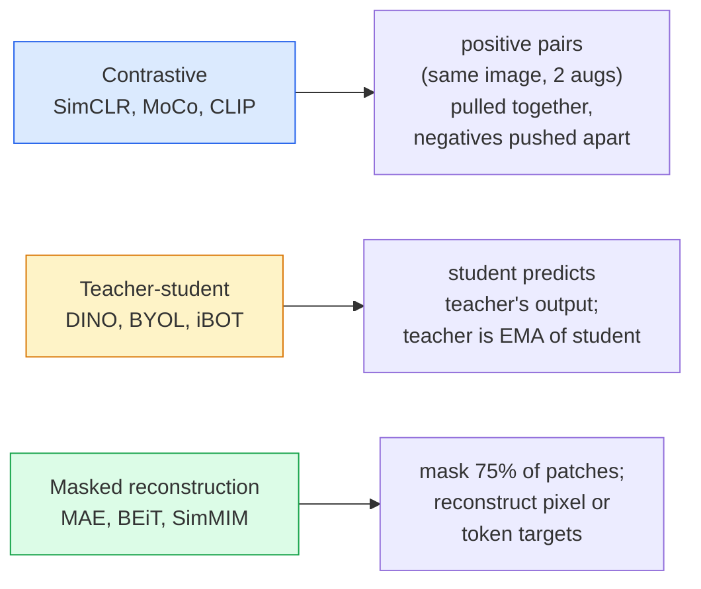

# 17 · 自监督视觉——SimCLR、DINO、MAE

> 标签是有监督视觉的瓶颈。自监督预训练把它去掉了：从 1 亿张无标注图像中学习视觉特征，再在 1 万张有标注图像上微调。

**类型：** 学习 + 构建
**语言：** Python
**前置：** 第 4 阶段第 04 课（图像分类）、第 4 阶段第 14 课（ViT）
**时长：** 约 75 分钟

## 学习目标

- 梳理三大自监督流派——对比式（contrastive，SimCLR）、师生式（teacher-student，DINO）、掩码重建式（masked reconstruction，MAE）——并说明每一种各自优化什么目标
- 从零实现 InfoNCE 损失，并解释为何 512 的批大小有效而 32 的批大小会失败
- 解释为什么 MAE 的 75% 掩码比例并非随意设定，以及它与文本 BERT 的 15% 有何不同
- 使用 DINOv2 或 MAE 的 ImageNet 检查点（checkpoint）进行线性探测（linear probing）和零样本检索（zero-shot retrieval）

## 问题所在

有监督的 ImageNet 拥有 130 万张有标注图像，据估算其标注成本约为 1000 万美元。医学和工业数据集规模更小，标注成本却更高。每个视觉团队都会问：我们能否在廉价的无标注数据上预训练——YouTube 帧、网页爬取、网络摄像头录像、卫星扫描——然后再在一个小的有标注数据集上微调？

自监督学习（self-supervised learning）就是答案。一个在 LAION 或 JFT 上训练的现代自监督 ViT，经微调后可以达到甚至超过有监督 ImageNet 的准确率。它在下游任务（检测、分割、深度估计）上的迁移效果也优于有监督预训练。DINOv2（Meta，2023）和 MAE（Meta，2022）是当前生产环境中可迁移视觉特征的默认选择。

观念上的转变在于：预训练任务（pretext task，即模型被训练去完成的那件事）不必等同于下游任务。真正重要的是，它能迫使模型学到有用的特征。预测灰度图的颜色、旋转图像并让模型分类旋转角度、掩盖图块并重建它们——这些方法都奏效过。真正可规模化的三种方法是对比学习、师生蒸馏，以及掩码重建。

## 核心概念

### 三大流派



### 对比学习（SimCLR）

取一张图像，施加两种随机数据增强，得到两个视图。把两者都送入同一个编码器加一个投影头（projection head）。最小化一个损失，它表达的含义是：「这两个嵌入应当靠近」以及「这个嵌入应当远离该批次中其他每一张图像的嵌入」。

```
Loss for positive pair (z_i, z_j) among 2N views per batch:

   L_ij = -log( exp(sim(z_i, z_j) / tau) / sum_k in batch \ {i} exp(sim(z_i, z_k) / tau) )

sim = cosine similarity
tau = temperature (0.1 standard)
```

这就是 InfoNCE 损失。它要求每个正样本对应许多负样本，因此批大小至关重要——SimCLR 需要 512 到 8192。MoCo 引入了一个由过去批次构成的动量队列（momentum queue），从而把负样本数量与批大小解耦。

### 师生式（DINO）

两个架构相同的网络：学生（student）和教师（teacher）。教师是学生权重的指数移动平均（exponential moving average，EMA）。两者都看到图像的增强视图。学生的输出被训练去匹配教师的输出——没有显式的负样本。

```
loss = CE( student_output(view_1),  teacher_output(view_2) )
     + CE( student_output(view_2),  teacher_output(view_1) )

teacher_weights = m * teacher_weights + (1 - m) * student_weights   (m ≈ 0.996)
```

它为何不会坍缩为「预测一个常数」：教师的输出会被居中化（centering，减去逐维度的均值）并被锐化（sharpening，除以一个很小的温度）。居中化防止某一维度占据主导；锐化防止输出坍缩为均匀分布。

DINO 正是 DINOv2 所放大的对象，后者在 1.42 亿张精选图像上训练。由此得到的特征是当前零样本视觉检索和稠密预测（dense prediction）的最先进水平（SOTA）。

### 掩码重建（MAE）

掩盖 ViT 输入中 75% 的图块。只把可见的那 25% 送入编码器。一个小型解码器接收编码器的输出，再加上掩码位置上的掩码标记（mask token），被训练去重建被掩盖图块的像素。

```
Encoder:  visible 25% of patches -> features
Decoder:  features + mask tokens at masked positions -> reconstructed pixels
Loss:     MSE between reconstructed and original pixels on masked patches only
```

让 MAE 奏效的关键设计选择：

- **75% 掩码比例**——很高。它迫使编码器学习语义特征；只重建 25% 几乎是平凡任务（相邻像素相关性极高，连 CNN 都能搞定）。
- **非对称的编码器/解码器**——庞大的 ViT 编码器只看可见图块；一个小型解码器（8 层、512 维）负责重建。预训练速度比朴素的 BEiT 快 3 倍。
- **像素空间的重建目标**——比 BEiT 的标记化（tokenised）目标更简单，且在 ViT 上效果更好。

预训练完成后，丢弃解码器。编码器即为特征提取器。

### 为何是 75% 而不是 15%

BERT 掩盖 15% 的标记。MAE 掩盖 75%。差异在于信息密度。

- 自然语言每个标记的熵很高。预测 15% 的标记仍然很难，因为每个被掩盖位置都有许多合理的补全方式。
- 图像图块的熵很低——一块未被掩盖的邻域往往几乎精确地决定了被掩盖图块的像素。要让预测必须依赖语义理解，你就得激进地掩盖。

75% 高到使简单的空间外推无法解决该任务；编码器必须真正表征图像内容。

### 线性探测评估

自监督预训练之后，标准的评估方式是**线性探测（linear probe）**：冻结编码器，在其顶部用 ImageNet 标签训练一个单层线性分类器，报告 top-1 准确率。

- SimCLR ResNet-50：约 71%（2020）
- DINO ViT-S/16：约 77%（2021）
- MAE ViT-L/16：约 76%（2022）
- DINOv2 ViT-g/14：约 86%（2023）

线性探测是对特征质量的纯粹度量；微调通常会再带来 2 到 5 个百分点的提升，但同时也混入了重新训练分类头所带来的效果。

## 动手构建

### 第 1 步：双视图数据增强流水线

```python
import torch
import torchvision.transforms as T

two_view_train = lambda: T.Compose([
    T.RandomResizedCrop(96, scale=(0.2, 1.0)),
    T.RandomHorizontalFlip(),
    T.ColorJitter(0.4, 0.4, 0.4, 0.1),
    T.RandomGrayscale(p=0.2),
    T.ToTensor(),
])


class TwoViewDataset(torch.utils.data.Dataset):
    def __init__(self, base):
        self.base = base
        self.aug = two_view_train()

    def __len__(self):
        return len(self.base)

    def __getitem__(self, i):
        img, _ = self.base[i]
        v1 = self.aug(img)
        v2 = self.aug(img)
        return v1, v2
```

每次调用 __getitem__ 都返回同一张图像的两个增强视图；不需要标签。

### 第 2 步：InfoNCE 损失

```python
import torch.nn.functional as F

def info_nce(z1, z2, tau=0.1):
    """
    z1, z2: (N, D) 成对视图的 L2 归一化嵌入
    """
    N, D = z1.shape
    z = torch.cat([z1, z2], dim=0)  # (2N, D)
    sim = z @ z.T / tau              # (2N, 2N)

    mask = torch.eye(2 * N, dtype=torch.bool, device=z.device)
    sim = sim.masked_fill(mask, float("-inf"))

    targets = torch.cat([torch.arange(N, 2 * N), torch.arange(0, N)]).to(z.device)
    return F.cross_entropy(sim, targets)
```

调用前先对嵌入做 L2 归一化。`tau=0.1` 是 SimCLR 的默认值；更低的温度会让损失更尖锐，并要求更多的负样本。

### 第 3 步：对 InfoNCE 做合理性检查

```python
z1 = F.normalize(torch.randn(16, 32), dim=-1)
z2 = z1.clone()
loss_same = info_nce(z1, z2, tau=0.1).item()
z2_random = F.normalize(torch.randn(16, 32), dim=-1)
loss_random = info_nce(z1, z2_random, tau=0.1).item()
print(f"InfoNCE with identical pairs:  {loss_same:.3f}")
print(f"InfoNCE with random pairs:     {loss_random:.3f}")
```

相同的样本对应当给出较低的损失（在大批次和低温度下接近 0）。随机样本对在 16 对的批次下应给出 log(2N-1) = ~log(31) = ~3.4。

### 第 4 步：MAE 风格的掩码

```python
def random_mask_indices(num_patches, mask_ratio=0.75, seed=0):
    g = torch.Generator().manual_seed(seed)
    n_keep = int(num_patches * (1 - mask_ratio))
    perm = torch.randperm(num_patches, generator=g)
    visible = perm[:n_keep]
    masked = perm[n_keep:]
    return visible.sort().values, masked.sort().values


num_patches = 196
visible, masked = random_mask_indices(num_patches, mask_ratio=0.75)
print(f"visible: {len(visible)} / {num_patches}")
print(f"masked:  {len(masked)} / {num_patches}")
```

简单、快速，且对给定种子是确定性的。真实的 MAE 实现会对其做批量处理，并为每个样本保留各自的掩码。

## 上手使用

DINOv2 是 2026 年的生产标准：

```python
import torch
from transformers import AutoImageProcessor, AutoModel

processor = AutoImageProcessor.from_pretrained("facebook/dinov2-base")
model = AutoModel.from_pretrained("facebook/dinov2-base")
model.eval()

# 用于零样本检索的逐图像嵌入
with torch.no_grad():
    inputs = processor(images=[pil_image], return_tensors="pt")
    outputs = model(**inputs)
    embedding = outputs.last_hidden_state[:, 0]  # CLS token
```

由此得到的 768 维嵌入是现代图像检索、稠密对应（dense correspondence）和零样本迁移流水线的主干。在下游任务上微调，往往只需要一个线性头就够了。

对于图文嵌入，SigLIP 或 OpenCLIP 是对应的方案；对于 MAE 风格的微调，`timm` 仓库提供了每一个 MAE 检查点。

## 交付物

本课产出：

- `outputs/prompt-ssl-pretraining-picker.md`——一个提示词，根据数据集规模、算力和下游任务来挑选 SimCLR / MAE / DINOv2。
- `outputs/skill-linear-probe-runner.md`——一个技能，为任意冻结编码器 + 有标注数据集编写线性探测评估。

## 练习

1. **（简单）** 验证：对于对齐良好的嵌入，降低温度时 InfoNCE 损失下降；而对于随机嵌入，降低温度时损失上升。画出 `tau in [0.05, 0.1, 0.2, 0.5]` 与损失的关系图。
2. **（中等）** 实现一个 DINO 风格的居中缓冲区（centre buffer）。展示：若不做居中化，学生会在几个 epoch 内坍缩为一个常数向量。
3. **（困难）** 以第 10 课的 TinyUNet 作为主干，在 CIFAR-100 上训练 MAE。报告在第 10、50、200 个 epoch 时的线性探测准确率。展示：在同一个 1000 张图像的子集上，经 MAE 预训练的线性探测优于从零开始的有监督线性探测。

## 关键术语

| 术语 | 人们怎么说 | 实际含义 |
|------|----------------|----------------------|
| 自监督（Self-supervised） | 「无标签」 | 一种从无标注数据中产生有用表征的预训练任务 |
| 预训练任务（Pretext task） | 「假任务」 | SSL 期间使用的目标（重建图块、匹配视图）；预训练后丢弃 |
| 线性探测（Linear probe） | 「冻结编码器 + 线性头」 | 标准的 SSL 评估：仅在冻结特征之上训练一个线性分类器 |
| InfoNCE | 「对比损失」 | 对余弦相似度做 softmax；正样本对是目标类别，其余皆为负样本 |
| EMA 教师（EMA teacher） | 「移动平均教师」 | 权重为学生权重指数移动平均的教师；被 BYOL、MoCo、DINO 采用 |
| 掩码比例（Mask ratio） | 「被隐藏图块的百分比」 | MAE 期间被掩盖的图块比例；视觉为 75%，文本为 15% |
| 表征坍缩（Representation collapse） | 「常数输出」 | 一种 SSL 失败模式，编码器对所有输入都输出同一个常数向量；通过居中化、锐化或负样本来防止 |
| DINOv2 | 「生产级 SSL 主干」 | Meta 2023 年的自监督 ViT；2026 年最强的通用图像特征 |

## 延伸阅读

- [SimCLR (Chen et al., 2020)](https://arxiv.org/abs/2002.05709)——对比学习的参考文献
- [DINO (Caron et al., 2021)](https://arxiv.org/abs/2104.14294)——带动量、居中化、锐化的师生式方法
- [MAE (He et al., 2022)](https://arxiv.org/abs/2111.06377)——面向 ViT 的掩码自编码器预训练
- [DINOv2 (Oquab et al., 2023)](https://arxiv.org/abs/2304.07193)——将自监督 ViT 规模化为生产级特征
