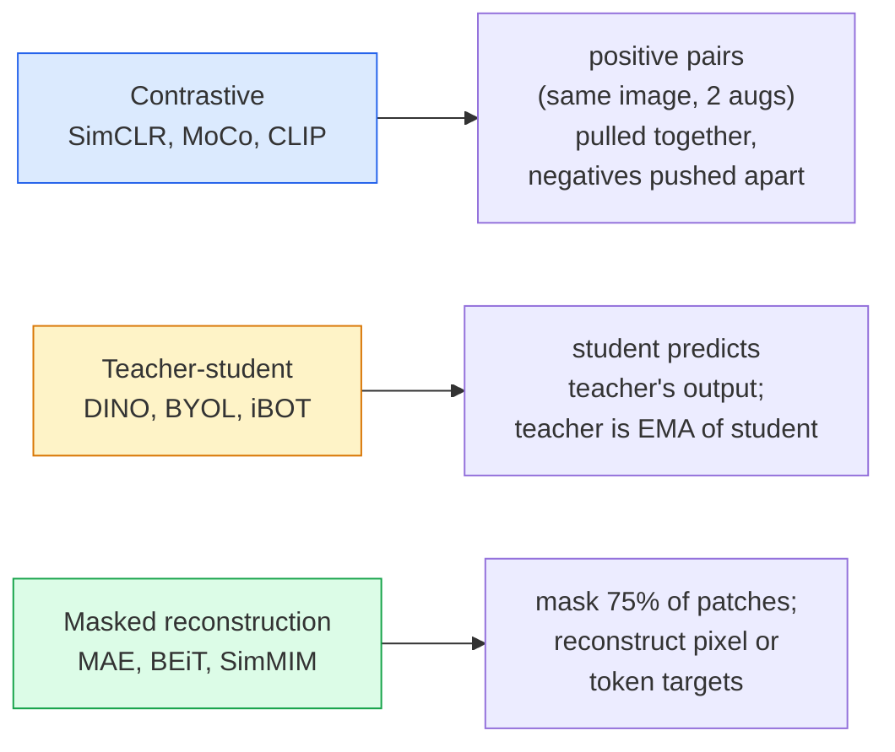

# 自我监督的愿景-Simpline、DINO、MAE

> 标签是监督视觉的瓶颈。自我监督的预训练删除了它们：从1亿个未标记的图像中学习视觉特征，对1万个已标记的图像进行微调。

** 类型：** 学习+构建
** 语言：** Python
** 先决条件：** 第4阶段第04课（图像分类）、第4阶段第14课（ViT）
** 时间：** ~75分钟

## Learning Objectives

- 追踪三个主要的自我监督家庭--对比家庭（Simpletitive）、师生家庭（DINO）、蒙面重建家庭（MAE）--并说明每个家庭的优化
- 从头开始实施InfoNSO丢失并解释为什么一批512可以工作，但一批32失败
- 解释为什么MAE的75%掩蔽率不是任意的，以及它与BERT的15%文本有何不同
- 使用DINOv2或MAE ImageNet检查点进行线性探测和零射击检索

## 问题

监督ImageNet拥有130万张已标记的图像，注释费用估计为1000万美元。医疗和工业数据集更小，标记成本更高。每个愿景团队都会问：我们可以在廉价的未标记数据（YouTube框架、网络搜索、网络摄像头镜头、卫星扫描）上进行预训练，然后在小的标签集上进行微调吗？

自我监督学习就是答案。在LAION或JFT上训练的现代自我监督ViT在微调时可以达到或超过监督ImageNet的准确性。它还比监督预训练更好地转移到下游任务（检测、分割、深度）。DINOv2（Meta，2023）和MAE（Meta，2022）是可转移视觉功能的当前生产默认设置。

概念上的转变是，借口任务--模型被训练要做的事情--不一定是下游任务。重要的是它迫使模型学习有用的功能。预测灰度图像的颜色、旋转图像并要求模型对旋转进行分类、掩蔽补丁并重建它们--所有这些都有效。衡量标准的三种方法是对比学习、师生提炼和掩蔽重建。

## 概念

### 三个家庭



### 对比学习（Simpson）

拍摄一张图像，应用两个随机增强，获得两个视图。两者都通过同一个编码器和投影头进行输入。最大限度地减少“这两个嵌入应该很接近”和“该嵌入应该远离批次中的所有其他图像的嵌入”的损失。"

```
Loss for positive pair (z_i, z_j) among 2N views per batch:

   L_ij = -log( exp(sim(z_i, z_j) / tau) / sum_k in batch \ {i} exp(sim(z_i, z_k) / tau) )

sim = cosine similarity
tau = temperature (0.1 standard)
```

这是InfoNSO的损失。每一个阳性需要多个阴性，因此批量大小很重要-Simpline需要512-8192。MoCo引入了过去批次的动量队列，以将负计数与批次大小脱钩。

### 师生（DINO）

两个具有相同架构的网络：学生和教师。老师是学生权重的指数移动平均值（EMA）。两者都看到了图像的增强视图。学生的输出经过训练以与老师的输出相匹配-没有明确的否定。

```
loss = CE( student_output(view_1),  teacher_output(view_2) )
     + CE( student_output(view_2),  teacher_output(view_1) )

teacher_weights = m * teacher_weights + (1 - m) * student_weights   (m ≈ 0.996)
```

为什么它不会崩溃到“预测一个常数”：教师的输出是集中的（减去每维平均值）和锐化（除以小温度）。居中防止一维占主导地位;锐化防止输出塌陷为均匀。

DINO是DINOv2在1.42亿张策展图像上进行扩展的对象。由此产生的功能是当前的SOTA，用于零镜头视觉检索和密集预测。

### 掩蔽重建（MAE）

屏蔽ViT输入的75%补丁。仅将可见的25%通过编码器。小型解码器接收编码器的输出加上掩蔽位置的掩蔽令牌，并接受训练以重建掩蔽补丁的像素。

```
Encoder:  visible 25% of patches -> features
Decoder:  features + mask tokens at masked positions -> reconstructed pixels
Loss:     MSE between reconstructed and original pixels on masked patches only
```

使MAE发挥作用的关键设计选择：

- **75%口罩比例 ** -高。迫使编码器学习语义特征;重建25%几乎是微不足道的（邻近像素的相关性如此之大，CNN可以确定它）。
- ** 不对称编码器/解码器 ** -大型ViT编码器仅看到可见补丁;小型解码器（8层，512-dim）处理重建。预训练速度比原始BEiT快3倍。
- ** 像素空间重建目标 ** -比BEiT的标记化目标更简单，并且在ViT上效果更好。

After pretraining, discard the decoder. The encoder is the feature extractor.

### 为什么75%而不是15%

BERT掩盖了15%的代币。MAE口罩75%。区别在于信息密度。

- 自然语言的每个符号具有很高的熵。预测15%的代币仍然很困难，因为每个掩蔽头寸都有许多看似合理的完成。
- 图像块具有低熵-未掩蔽的邻域通常几乎精确地确定掩蔽块的像素。为了做出需要语义理解的预测，你必须积极地进行伪装。

75%足够高，简单的空间外推无法解决任务;编码器必须表示图像内容。

### Linear-probe evaluation

自我监督预训练后，标准评估是 ** 线性探测 **：冻结编码器，在ImageNet标签上训练单个线性分类器。报告前一名的准确性。

- Simpline ResNet-50：~71%（2020年）
- DINO ViT-S/16: ~77% (2021)
- MAE ViT-L/16：~76%（2022年）
- DINOv 2 ViT-g/14：~86%（2023年）

线性探头是特征质量的纯粹衡量标准;微调通常会增加2-5个点，但也会混合头部再训练的效果。

## 建设党

### 步骤1：双视图增强管道

```python
import torch
import torchvision.transforms as T

two_view_train = lambda: T.Compose([
    T.RandomResizedCrop(96, scale=(0.2, 1.0)),
    T.RandomHorizontalFlip(),
    T.ColorJitter(0.4, 0.4, 0.4, 0.1),
    T.RandomGrayscale(p=0.2),
    T.ToTensor(),
])


class TwoViewDataset(torch.utils.data.Dataset):
    def __init__(self, base):
        self.base = base
        self.aug = two_view_train()

    def __len__(self):
        return len(self.base)

    def __getitem__(self, i):
        img, _ = self.base[i]
        v1 = self.aug(img)
        v2 = self.aug(img)
        return v1, v2
```

每个__getitem__返回同一图像的两个增强视图;不需要标签。

### 第2步：InfoNSO丢失

```python
import torch.nn.functional as F

def info_nce(z1, z2, tau=0.1):
    """
    z1, z2: (N, D) L2-normalised embeddings of paired views
    """
    N, D = z1.shape
    z = torch.cat([z1, z2], dim=0)  # (2N, D)
    sim = z @ z.T / tau              # (2N, 2N)

    mask = torch.eye(2 * N, dtype=torch.bool, device=z.device)
    sim = sim.masked_fill(mask, float("-inf"))

    targets = torch.cat([torch.arange(N, 2 * N), torch.arange(0, N)]).to(z.device)
    return F.cross_entropy(sim, targets)
```

L2-在调用之前正常化嵌入。' tau=0.1 '是Simpson默认值;较低会导致损失更大，并且需要更多的负值。

### 步骤3：健全性检查InfoNCE

```python
z1 = F.normalize(torch.randn(16, 32), dim=-1)
z2 = z1.clone()
loss_same = info_nce(z1, z2, tau=0.1).item()
z2_random = F.normalize(torch.randn(16, 32), dim=-1)
loss_random = info_nce(z1, z2_random, tau=0.1).item()
print(f"InfoNCE with identical pairs:  {loss_same:.3f}")
print(f"InfoNCE with random pairs:     {loss_random:.3f}")
```

Identical pairs should give a low loss (close to 0 for a large batch and cold temperature). Random pairs should give log(2N-1) = ~log(31) = ~3.4 with a 16-pair batch.

### 步骤4：MAE式掩蔽

```python
def random_mask_indices(num_patches, mask_ratio=0.75, seed=0):
    g = torch.Generator().manual_seed(seed)
    n_keep = int(num_patches * (1 - mask_ratio))
    perm = torch.randperm(num_patches, generator=g)
    visible = perm[:n_keep]
    masked = perm[n_keep:]
    return visible.sort().values, masked.sort().values


num_patches = 196
visible, masked = random_mask_indices(num_patches, mask_ratio=0.75)
print(f"visible: {len(visible)} / {num_patches}")
print(f"masked:  {len(masked)} / {num_patches}")
```

对于给定种子来说简单、快速且确定性。真正的MAE实现对此进行批量处理并保留每个样本的屏蔽。

## 使用它

DINOv2是2026年的生产标准：

```python
import torch
from transformers import AutoImageProcessor, AutoModel

processor = AutoImageProcessor.from_pretrained("facebook/dinov2-base")
model = AutoModel.from_pretrained("facebook/dinov2-base")
model.eval()

# Per-image embeddings for zero-shot retrieval
with torch.no_grad():
    inputs = processor(images=[pil_image], return_tensors="pt")
    outputs = model(**inputs)
    embedding = outputs.last_hidden_state[:, 0]  # CLS token
```

由此产生的768-dim嵌入是现代图像检索、密集通信和零镜头传输管道的支柱。下游任务的微调很少需要比线性头更多的东西。

对于图像-文本嵌入，SigLIP或OpenCLIP是等效的;对于MAE风格的微调，“tim”repo会运送每个MAE检查点。

## 把它运

本课产生：

- ' outputes/prompt-ssl-pretraining-picker.md '-一个提示，在给定数据集大小、计算和下游任务的情况下选择Simploy/ MAE /DINOv 2。
- '输出/skill-linear-probe-runner.md '-一种为任何冻结编码器+标记数据集编写线性探测评估的技能。

## 演习

1. **（简单）** 验证当您降低温度以实现良好对齐的嵌入时，InfoNSO损失是否会下降，而当您降低温度以实现随机嵌入时，InfoNSO损失是否会上升。在[0.05，0.1，0.2，0.5]中生成一个图'与损失。
2. **（中等）** 实施DINO风格的中心缓冲区。表明，如果没有定心，学生会在几个时期内崩溃为一个恒定的载体。
3. **（困难）** 使用第10课的TinyUNet作为主干，在CIFAR-100上训练MAE。报告10、50和200个历元时的线性探头准确度。表明MAE预训练的线性探测器在相同的1，000个图像子集上击败了从头开始的监督线性探测器。

## Key Terms

| Term | 别人怎么说 | 它实际上意味着什么 |
|------|----------------|----------------------|
| Self-supervised | “无标签” | 从未标记的数据中生成有用的表示的借口任务 |
| 前置任务 | “假任务” | SSL期间使用的目标（重建补丁、匹配视图）;预训练后丢弃 |
| Linear probe | “冻结编码器+线性头” | 标准SSL评估：仅在冻结特征之上训练线性分类器 |
| InfoNSO | “对比损失” | softmax基于cos相似性;正对是目标类，所有其他都是负对 |
| EMA老师 | “移动平均教师” | 权重为学生指数移动平均值的老师;由BYOL、MoCo、DINO使用 |
| Mask ratio | “隐藏补丁的百分比” | MAE期间掩蔽的贴片比例;视觉为75%，文本为15% |
| 代表崩溃 | “持续产出” | SSL故障，编码器为所有输入输出恒定矢量;通过居中、锐化或负片防止 |
| DINOv2 | "Production SSL backbone" | Meta的2023年自我监督ViT; 2026年最强通用图像功能 |

## 进一步阅读

- [Simpline（Chen等人，2020）]（https：//arxiv.org/ab/2002.05709）-对比学习参考
- [DINO (Caron et al., 2021)](https://arxiv.org/abs/2104.14294) — teacher-student with momentum, centring, sharpening
- [MAE（He等人，2022）]（https：//arxiv.org/abs/2111.06377）-针对ViT的掩码自动编码器预训练
- [DINOv 2（Oquab等人，2023）]（https：//arxiv.org/abs/2304.07193）-将自我监督的ViT扩展到生产功能
