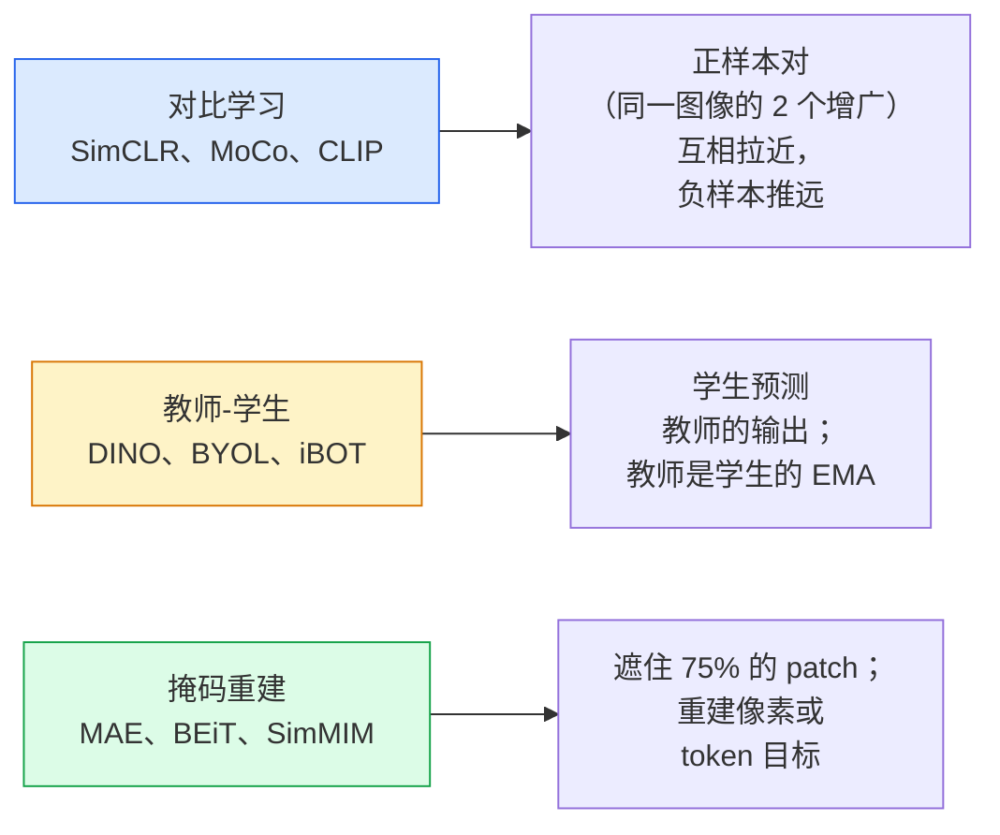

# 自监督视觉 —— SimCLR、DINO、MAE

> 译注：本文译自同目录 [`en.md`](./en.md)。术语遵循仓根 [TRANSLATION_GUIDE.md](../../../../TRANSLATION_GUIDE.md)。

> 标签是有监督视觉的瓶颈。自监督预训练（pretraining）把这个瓶颈拿掉：在 1 亿张无标签图像上学到视觉特征，再用 1 万张有标签图像微调（fine-tune）。

**Type:** Learn + Build
**Languages:** Python
**Prerequisites:** Phase 4 Lesson 04 (Image Classification), Phase 4 Lesson 14 (ViT)
**Time:** ~75 minutes

## 学习目标（Learning Objectives）

- 梳理自监督的三大家族 —— 对比式（SimCLR）、师生式（DINO）、掩码重建（MAE），并说出每一种到底在优化什么
- 从零实现 InfoNCE 损失（loss），并解释为什么 batch 取 512 能跑通而 batch 取 32 会失败
- 解释为什么 MAE 的 75% 掩码比例不是随便定的，以及它跟 BERT 文本任务里 15% 有什么区别
- 用 DINOv2 或 MAE 的 ImageNet checkpoint 做 linear probing（线性探针）和 zero-shot 检索

## 问题（The Problem）

有监督的 ImageNet 有 130 万张标注图像，标注成本估计在 1000 万美元量级。医学和工业数据集规模更小，标注更贵。每个视觉团队都会问同一个问题：能不能在便宜的无标签数据上做预训练 —— YouTube 视频帧、网络爬虫、摄像头录像、卫星扫描 —— 然后在小规模有标签数据上微调？

自监督学习就是答案。一个在 LAION 或 JFT 上训练好的现代自监督 ViT，微调之后能追平甚至超过有监督 ImageNet 的精度。它在下游任务（检测、分割、深度估计）上的迁移能力也比有监督预训练更好。DINOv2（Meta，2023）和 MAE（Meta，2022）是当前可迁移视觉特征的生产默认选择。

观念上的转变是：pretext task（前置任务，也就是模型被训练去做的那件事）不必跟下游任务一致。重要的是它能逼模型学到有用的特征。预测灰度图的颜色、把图像旋转后让模型分类旋转角度、掩盖图块再重建 —— 这些都跑通过。能 scale 起来的三种思路是对比学习、师生蒸馏、掩码重建。

## 概念（The Concept）

### 三大家族（Three families）



### 对比学习（Contrastive learning，SimCLR）

拿一张图像，对它做两次随机增广，得到两个视图。两个视图都过同一个 encoder 加一个投影头（projection head）。最小化的 loss 大致说："这两个 embedding 应该靠近"以及"这个 embedding 应该远离同 batch 里其它每张图像的 embedding"。

```
Loss for positive pair (z_i, z_j) among 2N views per batch:

   L_ij = -log( exp(sim(z_i, z_j) / tau) / sum_k in batch \ {i} exp(sim(z_i, z_k) / tau) )

sim = cosine similarity
tau = temperature (0.1 standard)
```

这就是 InfoNCE 损失。它要求每个正样本对配上很多负样本，所以 batch size 很关键 —— SimCLR 需要 512–8192。MoCo 引入了一个动量队列（momentum queue）来存历史 batch，从而把负样本数量和 batch size 解耦。

### 师生式（Teacher-student，DINO）

两个网络结构相同：student 和 teacher。teacher 的权重是 student 权重的指数滑动平均（EMA）。两者都看图像的增广视图。student 的输出被训练去匹配 teacher 的输出 —— 没有显式的负样本。

```
loss = CE( student_output(view_1),  teacher_output(view_2) )
     + CE( student_output(view_2),  teacher_output(view_1) )

teacher_weights = m * teacher_weights + (1 - m) * student_weights   (m ≈ 0.996)
```

为什么它不会塌缩成"输出一个常量"：teacher 的输出会被中心化（每一维减去均值）和锐化（除以一个很小的 temperature）。中心化阻止某一维独占主导；锐化阻止输出塌缩到均匀分布。

DINO 就是 DINOv2 在 1.42 亿张精挑数据上 scale 起来的那一套。最终得到的特征是当前 zero-shot 视觉检索和稠密预测的 SOTA。

### 掩码重建（Masked reconstruction，MAE）

把 ViT 输入的 75% patches 掩掉。只把可见的 25% 喂进 encoder。一个小 decoder 拿到 encoder 的输出，再在被掩位置插入 mask token，被训练去重建被掩 patch 的像素。

```
Encoder:  visible 25% of patches -> features
Decoder:  features + mask tokens at masked positions -> reconstructed pixels
Loss:     MSE between reconstructed and original pixels on masked patches only
```

让 MAE 真正能跑起来的几个关键设计：

- **75% 掩码比例** —— 偏高。逼 encoder 去学语义特征；只重建 25% 几乎是平凡的（相邻像素强相关，CNN 都能搞定）。
- **非对称 encoder/decoder** —— 大 ViT encoder 只看可见 patch；一个小 decoder（8 层、512 维）负责重建。比朴素 BEiT 预训练快 3 倍。
- **像素空间重建目标** —— 比 BEiT 的 tokenized 目标更简单，并且在 ViT 上效果更好。

预训练完成后丢掉 decoder。encoder 就是特征提取器。

### 为什么是 75% 而不是 15%（Why 75% and not 15%）

BERT 掩 15% 的 token。MAE 掩 75%。差别在于信息密度。

- 自然语言每个 token 的熵很高。即使只掩 15%，预测仍然很难，因为每个被掩位置都有很多合理的填法。
- 图像 patch 的熵很低 —— 周围未掩区域往往几乎可以决定被掩 patch 的像素。要让预测真的需要语义理解，就必须激进地掩。

75% 高到简单的空间外推搞不定这个任务；encoder 必须把图像内容真正表征出来。

### 线性探针评估（Linear-probe evaluation）

自监督预训练之后的标准评估方式是 **linear probe**：冻结 encoder，在它之上接一个线性分类器，用 ImageNet 标签训练。报告 top-1 准确率。

- SimCLR ResNet-50：~71%（2020）
- DINO ViT-S/16：~77%（2021）
- MAE ViT-L/16：~76%（2022）
- DINOv2 ViT-g/14：~86%（2023）

linear probe 是对特征质量的纯粹度量；微调通常能再多 2–5 分，但也混入了头部重训的效应。

## 动手实现（Build It）

### Step 1：双视图增广流水线（Two-view augmentation pipeline）

```python
import torch
import torchvision.transforms as T

two_view_train = lambda: T.Compose([
    T.RandomResizedCrop(96, scale=(0.2, 1.0)),
    T.RandomHorizontalFlip(),
    T.ColorJitter(0.4, 0.4, 0.4, 0.1),
    T.RandomGrayscale(p=0.2),
    T.ToTensor(),
])


class TwoViewDataset(torch.utils.data.Dataset):
    def __init__(self, base):
        self.base = base
        self.aug = two_view_train()

    def __len__(self):
        return len(self.base)

    def __getitem__(self, i):
        img, _ = self.base[i]
        v1 = self.aug(img)
        v2 = self.aug(img)
        return v1, v2
```

每次 `__getitem__` 返回同一张图像的两个增广视图；不需要标签。

### Step 2：InfoNCE 损失（InfoNCE loss）

```python
import torch.nn.functional as F

def info_nce(z1, z2, tau=0.1):
    """
    z1, z2: (N, D) L2-normalised embeddings of paired views
    """
    N, D = z1.shape
    z = torch.cat([z1, z2], dim=0)  # (2N, D)
    sim = z @ z.T / tau              # (2N, 2N)

    mask = torch.eye(2 * N, dtype=torch.bool, device=z.device)
    sim = sim.masked_fill(mask, float("-inf"))

    targets = torch.cat([torch.arange(N, 2 * N), torch.arange(0, N)]).to(z.device)
    return F.cross_entropy(sim, targets)
```

调用前先把 embedding 做 L2 归一化。`tau=0.1` 是 SimCLR 默认值；temperature 越低，loss 越锐，对负样本数量的需求也越大。

### Step 3：InfoNCE 自检（Sanity check InfoNCE）

```python
z1 = F.normalize(torch.randn(16, 32), dim=-1)
z2 = z1.clone()
loss_same = info_nce(z1, z2, tau=0.1).item()
z2_random = F.normalize(torch.randn(16, 32), dim=-1)
loss_random = info_nce(z1, z2_random, tau=0.1).item()
print(f"InfoNCE with identical pairs:  {loss_same:.3f}")
print(f"InfoNCE with random pairs:     {loss_random:.3f}")
```

完全相同的对应该给出很低的 loss（在大 batch + 低 temperature 下接近 0）。随机对在 16 对的 batch 下应该给出 log(2N-1) = log(31) ≈ 3.4。

### Step 4：MAE 风格的掩码（MAE-style masking）

```python
def random_mask_indices(num_patches, mask_ratio=0.75, seed=0):
    g = torch.Generator().manual_seed(seed)
    n_keep = int(num_patches * (1 - mask_ratio))
    perm = torch.randperm(num_patches, generator=g)
    visible = perm[:n_keep]
    masked = perm[n_keep:]
    return visible.sort().values, masked.sort().values


num_patches = 196
visible, masked = random_mask_indices(num_patches, mask_ratio=0.75)
print(f"visible: {len(visible)} / {num_patches}")
print(f"masked:  {len(masked)} / {num_patches}")
```

简单、快，对给定 seed 是确定的。真实 MAE 实现会把这一步 batch 化，并为每个样本保留各自的 mask。

## 用起来（Use It）

DINOv2 是 2026 年的生产标准：

```python
import torch
from transformers import AutoImageProcessor, AutoModel

processor = AutoImageProcessor.from_pretrained("facebook/dinov2-base")
model = AutoModel.from_pretrained("facebook/dinov2-base")
model.eval()

# Per-image embeddings for zero-shot retrieval
with torch.no_grad():
    inputs = processor(images=[pil_image], return_tensors="pt")
    outputs = model(**inputs)
    embedding = outputs.last_hidden_state[:, 0]  # CLS token
```

得到的 768 维 embedding 是现代图像检索、稠密对应、zero-shot 迁移流水线的主干。要在下游任务上微调，通常加一个线性头就够了。

要做图文 embedding，SigLIP 或 OpenCLIP 是对应的选择；要做 MAE 风格的微调，`timm` 仓里现成提供了所有 MAE checkpoint。

## 上线部署（Ship It）

本节产出：

- `outputs/prompt-ssl-pretraining-picker.md` —— 一个 prompt，根据数据集规模、算力和下游任务，在 SimCLR / MAE / DINOv2 之间挑选。
- `outputs/skill-linear-probe-runner.md` —— 一个 skill，针对任意冻结 encoder + 有标签数据集自动生成 linear-probe 评估脚本。

## 练习（Exercises）

1. **（Easy）** 验证：在 embedding 对齐良好时，降低 temperature 会让 InfoNCE loss 下降；在 embedding 随机时，降低 temperature 反而让 loss 上升。画一张 `tau in [0.05, 0.1, 0.2, 0.5]` 对应 loss 的图。
2. **（Medium）** 实现一个 DINO 风格的中心缓冲区（centre buffer）。展示去掉 centring 之后，student 在几个 epoch 内就塌缩到一个常量向量。
3. **（Hard）** 用 Lesson 10 的 TinyUNet 作为 backbone，在 CIFAR-100 上训练 MAE。在 10、50、200 个 epoch 报告 linear-probe 精度。展示在同一个 1,000 张图像子集上，MAE 预训练后的 linear probe 能打过从零开始的有监督 linear probe。

## 关键术语（Key Terms）

| Term | What people say | What it actually means |
|------|----------------|----------------------|
| Self-supervised | "Label-free" | 一个 pretext task，能从无标签数据里产出有用的表征 |
| Pretext task | "The fake task" | SSL 训练时使用的目标（重建 patch、匹配视图）；预训练完就丢掉 |
| Linear probe | "Frozen encoder + linear head" | SSL 标准评估：在冻结特征之上只训练一个线性分类器 |
| InfoNCE | "Contrastive loss" | 在 cosine 相似度上做 softmax；正样本对是目标类，其它都是负样本 |
| EMA teacher | "Moving-average teacher" | 权重为 student 权重指数滑动平均的 teacher；BYOL、MoCo、DINO 都在用 |
| Mask ratio | "% of patches hidden" | MAE 中被掩 patch 的占比；视觉 75%，文本 15% |
| Representation collapse | "Constant output" | SSL 的失败模式：encoder 对所有输入输出一个常量；用中心化、锐化或负样本来防止 |
| DINOv2 | "Production SSL backbone" | Meta 在 2023 年的自监督 ViT；2026 年最强的通用图像特征 |

## 延伸阅读（Further Reading）

- [SimCLR (Chen et al., 2020)](https://arxiv.org/abs/2002.05709) —— 对比学习参考论文
- [DINO (Caron et al., 2021)](https://arxiv.org/abs/2104.14294) —— 师生 + 动量 + 中心化 + 锐化
- [MAE (He et al., 2022)](https://arxiv.org/abs/2111.06377) —— ViT 的掩码自编码预训练
- [DINOv2 (Oquab et al., 2023)](https://arxiv.org/abs/2304.07193) —— 把自监督 ViT scale 到生产级特征
