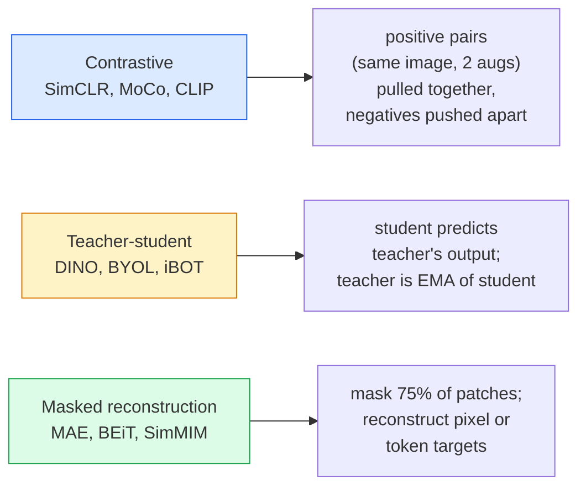

# 自监督视觉 — SimCLR、DINO、MAE

> 标签是有监督视觉的瓶颈。自监督预训练消除了这一点：从 1 亿张无标签图像中学习视觉特征，然后在 1 万张有标签图像上进行微调。

**类型：** 学习 + 构建
**语言：** Python
**前置条件：** 阶段 4 第 04 课（图像分类），阶段 4 第 14 课（ViT）
**时间：** ~75 分钟

## 学习目标

- 追踪三个主要的自监督家族——对比学习（SimCLR）、师生架构（DINO）、掩码重建（MAE）——并说明每个家族优化什么
- 从头实现 InfoNCE 损失，并解释为什么 batch size 为 512 时有效而 32 时失败
- 解释 MAE 的 75% 掩码率为何不是随意的，以及它与 BERT 对文本使用 15% 有何不同
- 使用 DINOv2 或 MAE ImageNet 检查点进行 linear probing 和零样本检索

## 问题

有监督的 ImageNet 有 130 万张标注图像，估计标注成本为 1000 万美元。医学和工业数据集更小，标注成本更高。每个视觉团队都会问：我们能否在廉价的无标签数据（YouTube 帧、网络爬取、网络摄像头画面、卫星扫描）上进行预训练，然后在小型标注集上微调？

自监督学习就是答案。在 LAION 或 JFT 上训练的现代自监督 ViT 在微调后达到或超过有监督的 ImageNet 精度。它在下游任务（检测、分割、深度估计）上的迁移效果也优于有监督预训练。DINOv2（Meta, 2023）和 MAE（Meta, 2022）是当前可迁移视觉特征的生产默认选择。

概念上的转变在于：前置任务——模型被训练去做的事情——不必是下游任务。重要的是它迫使模型学习有用的特征。预测灰度图像的颜色、旋转图像并要求模型分类旋转角度、掩码 patch 并重建它们——所有这些都有效。可扩展的三种方法是对比学习、师生蒸馏和掩码重建。

## 概念

### 三个家族


```mermaid
flowchart LR
    A["Contrastive<br/>SimCLR, MoCo, CLIP"] --> AT["positive pairs<br/>(same image, 2 augs)<br/>pulled together,<br/>negatives pushed apart"]
    B["Teacher-student<br/>DINO, BYOL, iBOT"] --> BT["student predicts<br/>teacher's output;<br/>teacher is EMA of student"]
    C["Masked reconstruction<br/>MAE, BEiT, SimMIM"] --> CT["mask 75% of patches;<br/>reconstruct pixel or<br/>token targets"]

    style A fill:#dbeafe,stroke:#2563eb
    style B fill:#fef3c7,stroke:#d97706
    style C fill:#dcfce7,stroke:#16a34a
```

### 对比学习（SimCLR）

取一张图像，应用两种随机数据增强，得到两个视图。通过同一个编码器加投影头输入两者。最小化一个损失函数，该函数表示"这两个嵌入应该接近"且"这个嵌入应该与批次中所有其他图像的嵌入远离"。

```
在 2N 个视图的批次中，正样本对 (z_i, z_j) 的损失：

   L_ij = -log( exp(sim(z_i, z_j) / tau) / sum_k in batch \ {i} exp(sim(z_i, z_k) / tau) )

sim = 余弦相似度
tau = 温度（标准值为 0.1）
```

这就是 InfoNCE 损失。它需要每个正样本对有很多负样本，因此 batch size 很重要——SimCLR 需要 512-8192。MoCo 引入了一个过去批次的动量队列，将负样本数量与 batch size 解耦。

### 师生架构（DINO）

两个架构相同的网络：学生和教师。教师是学生权重的指数移动平均（EMA）。两者都看到图像的增强视图。学生的输出被训练来匹配教师的输出——没有显式的负样本。

```
loss = CE( student_output(view_1),  teacher_output(view_2) )
     + CE( student_output(view_2),  teacher_output(view_1) )

teacher_weights = m * teacher_weights + (1 - m) * student_weights   (m ≥ 0.996)
```

为什么它不会坍缩为"预测一个常数"：教师的输出被居中（减去每个维度的均值）并锐化（除以较小的温度）。居中防止一个维度主导；锐化防止输出坍缩为均匀分布。

DINO 是 DINOv2 扩展的基础，在 1.42 亿张精选图像上训练。由此产生的特征是当前零样本视觉检索和密集预测的 SOTA。

### 掩码重建（MAE）

掩码 ViT 输入中 75% 的 patch。仅将可见的 25% 传入编码器。一个小的解码器接收编码器的输出加上掩码位置的 mask tokens，并训练来重建掩码 patch 的像素。

```
Encoder:  visible 25% of patches -> features
Decoder:  features + mask tokens at masked positions -> reconstructed pixels
Loss:     MSE between reconstructed and original pixels on masked patches only
```

使 MAE 有效关键设计选择：

- **75% 掩码率**——很高。迫使编码器学习语义特征；重建 25% 几乎是平凡的（相邻像素高度相关，CNN 可以轻松完成）。
- **非对称编码器/解码器**——大型 ViT 编码器仅看到可见 patch；小型解码器（8 层，512 维）处理重建。预训练比朴素的 BEiT 快 3 倍。
- **像素空间重建目标**——比 BEiT 的 tokenized 目标更简单，在 ViT 上效果更好。

预训练后，丢弃解码器。编码器就是特征提取器。

### 为什么是 75% 而不是 15%

BERT 掩码 15% 的 token。MAE 掩码 75%。区别在于信息密度。

- 自然语言每个 token 的熵很高。预测 15% 的 token 仍然困难，因为每个掩码位置有许多合理的补全。
- 图像 patch 的熵较低——未掩码的邻域通常几乎完全决定了掩码 patch 的像素。要使预测需要语义理解，你必须激进地掩码。

75% 高到简单空间外推无法解决任务；编码器必须表示图像内容。

### Linear probe 评估

自监督预训练后，标准评估是 **linear probe**：冻结编码器，在顶部训练一个线性分类器（使用 ImageNet 标签）。报告 top-1 精度。

- SimCLR ResNet-50：~71%（2020）
- DINO ViT-S/16：~77%（2021）
- MAE ViT-L/16：~76%（2022）
- DINOv2 ViT-g/14：~86%（2023）

Linear probe 是对特征质量的纯度量；微调通常增加 2-5 个点，但也混合了头部重新训练的效果。

## 构建

### 步骤 1：双视图增强流水线

```python
import torch
import torchvision.transforms as T

two_view_train = lambda: T.Compose([
    T.RandomResizedCrop(96, scale=(0.2, 1.0)),
    T.RandomHorizontalFlip(),
    T.ColorJitter(0.4, 0.4, 0.4, 0.1),
    T.RandomGrayscale(p=0.2),
    T.ToTensor(),
])


class TwoViewDataset(torch.utils.data.Dataset):
    def __init__(self, base):
        self.base = base
        self.aug = two_view_train()

    def __len__(self):
        return len(self.base)

    def __getitem__(self, i):
        img, _ = self.base[i]
        v1 = self.aug(img)
        v2 = self.aug(img)
        return v1, v2
```

每个 `__getitem__` 返回同一张图像的两个增强视图；不需要标签。

### 步骤 2：InfoNCE 损失

```python
import torch.nn.functional as F

def info_nce(z1, z2, tau=0.1):
    """
    z1, z2: (N, D) 已 L2 归一化的配对视图嵌入
    """
    N, D = z1.shape
    z = torch.cat([z1, z2], dim=0)  # (2N, D)
    sim = z @ z.T / tau              # (2N, 2N)

    mask = torch.eye(2 * N, dtype=torch.bool, device=z.device)
    sim = sim.masked_fill(mask, float("-inf"))

    targets = torch.cat([torch.arange(N, 2 * N), torch.arange(0, N)]).to(z.device)
    return F.cross_entropy(sim, targets)
```

在调用前对嵌入进行 L2 归一化。`tau=0.1` 是 SimCLR 的默认值；更低的温度使损失更尖锐，需要更多负样本。

### 步骤 3：InfoNCE 的冒烟测试

```python
z1 = F.normalize(torch.randn(16, 32), dim=-1)
z2 = z1.clone()
loss_same = info_nce(z1, z2, tau=0.1).item()
z2_random = F.normalize(torch.randn(16, 32), dim=-1)
loss_random = info_nce(z1, z2_random, tau=0.1).item()
print(f"InfoNCE with identical pairs:  {loss_same:.3f}")
print(f"InfoNCE with random pairs:     {loss_random:.3f}")
```

相同对应该给出低损失（对于大批量和冷温度接近 0）。随机对应该给出 log(2N-1) = ~log(31) = ~3.4（对于一个 16 对批次）。

### 步骤 4：MAE 风格的掩码

```python
def random_mask_indices(num_patches, mask_ratio=0.75, seed=0):
    g = torch.Generator().manual_seed(seed)
    n_keep = int(num_patches * (1 - mask_ratio))
    perm = torch.randperm(num_patches, generator=g)
    visible = perm[:n_keep]
    masked = perm[n_keep:]
    return visible.sort().values, masked.sort().values


num_patches = 196
visible, masked = random_mask_indices(num_patches, mask_ratio=0.75)
print(f"visible: {len(visible)} / {num_patches}")
print(f"masked:  {len(masked)} / {num_patches}")
```

简单、快速，对于给定种子是确定性的。真正的 MAE 实现会批量处理并保持每个样本的掩码。

## 使用

DINOv2 是 2026 年的生产标准：

```python
import torch
from transformers import AutoImageProcessor, AutoModel

processor = AutoImageProcessor.from_pretrained("facebook/dinov2-base")
model = AutoModel.from_pretrained("facebook/dinov2-base")
model.eval()

# 用于零样本检索的每图像嵌入
with torch.no_grad():
    inputs = processor(images=[pil_image], return_tensors="pt")
    outputs = model(**inputs)
    embedding = outputs.last_hidden_state[:, 0]  # CLS token
```

生成的 768 维嵌入是现代图像检索、密集对应和零样本迁移流水线的骨干。在下游任务上微调很少需要线性头之外的更多组件。

对于图像-文本嵌入，等效的是 SigLIP 或 OpenCLIP；对于 MAE 风格的微调，`timm` 仓库提供了所有 MAE 检查点。

## 交付

本课产出：

- `outputs/prompt-ssl-pretraining-picker.md`——一个 prompt，根据数据集大小、计算资源和下游任务选择 SimCLR / MAE / DINOv2。
- `outputs/skill-linear-probe-runner.md`——一个技能，为任何冻结的编码器 + 标注数据集编写 linear-probe 评估。

## 练习

1. **（简单）** 验证对于对齐良好的嵌入，降低温度会使 InfoNCE 损失下降；对于随机嵌入，降低温度会使损失上升。生成一张 `tau in [0.05, 0.1, 0.2, 0.5]` vs loss 的图。
2. **（中等）** 实现一个 DINO 风格的居中缓冲区。展示如果没有居中，学生会在几个 epoch 内坍缩为一个常数向量。
3. **（困难）** 使用第 10 课的 TinyUNet 作为 backbone，在 CIFAR-100 上训练 MAE。报告在 10、50 和 200 个 epoch 时的 linear-probe 精度。展示 MAE 预训练的 linear probe 在下游同一 1000 张图像子集上优于从头开始的有监督 linear probe。

## 关键术语

| 术语 | 人们说的 | 实际含义 |
|------|----------------|----------------------|
| 自监督 | "无标签" | 一种从无标签数据中产生有用表示的前置任务 |
| 前置任务 | "假任务" | SSL 期间使用的目标（重建 patch、匹配视图）；预训练后丢弃 |
| Linear probe | "冻结编码器 + 线性头" | 标准 SSL 评估：仅在冻结特征之上训练线性分类器 |
| InfoNCE | "对比损失" | 对余弦相似度进行 softmax；正样本对是目标类，所有其他都是负样本 |
| EMA 教师 | "移动平均教师" | 权重是学生权重的指数移动平均的教师；由 BYOL、MoCo、DINO 使用 |
| 掩码率 | "隐藏的 patch 百分比" | MAE 期间被掩码的 patch 比例；视觉为 75%，文本为 15% |
| 表示坍缩 | "恒定输出" | SSL 失败情况，编码器对所有输入输出恒定向量；通过居中、锐化或负样本防止 |
| DINOv2 | "生产级 SSL backbone" | Meta 2023 年的自监督 ViT；2026 年最强的通用图像特征 |

## 延伸阅读

- [SimCLR（Chen 等人, 2020）](https://arxiv.org/abs/2002.05709)——对比学习参考
- [DINO（Caron 等人, 2021）](https://arxiv.org/abs/2104.14294)——具有动量、居中、锐化的师生架构
- [MAE（He 等人, 2022）](https://arxiv.org/abs/2111.06377)——ViT 的掩码自编码器预训练
- [DINOv2（Oquab 等人, 2023）](https://arxiv.org/abs/2304.07193)——将自监督 ViT 扩展到生产级特征
