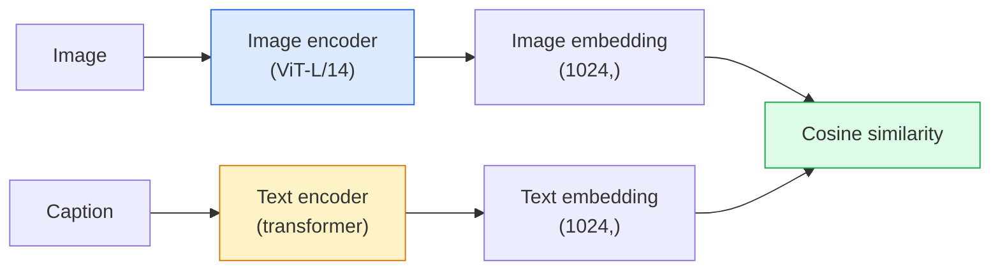

# Open-Vocabulary Vision — CLIP

> image encoder と text encoder を一緒に学習し、一致する (image, caption) pairs が shared space の同じ場所に来るようにします。仕組みはそれだけです。

**種別:** 構築 + Use
**言語:** Python
**前提条件:** Phase 4 Lesson 14 (ViT), Phase 4 Lesson 17 (Self-Supervised)
**所要時間:** 約45分

## Learning Objectives

- CLIP の two-tower architecture と contrastive training objective を説明する
- pretrained CLIP (または SigLIP) を使い、task-specific training なしで zero-shot classification を行う
- zero-shot classification をゼロから実装する。class prompts を encode し、cosine similarity を計算し、argmax を取る
- CLIP、SigLIP、OpenCLIP、LLaVA/LLaMA-vision models を区別し、2026 年時点でそれぞれ何に使うかを説明する

## 問題

従来の classifiers は closed-vocabulary です。1000-class ImageNet model は 1000 labels しか予測できません。新しい category ごとに labelled data と retrained head が必要です。

CLIP (Radford et al., OpenAI 2021) は、web から収集した 400M の (image, caption) pairs で学習すると、自然言語だけで記述された任意の categories に inference 時に分類できる model が得られることを示しました。新しい class は sentence を書くだけで与えられます。

この能力、つまり zero-shot transfer により、現代の vision system はほぼすべて CLIP-family checkpoint から始まります。Detection (Grounding DINO, OWL-ViT)、segmentation (CLIPSeg, SAM)、retrieval、content moderation、VLMs、text-to-image generation はすべて CLIP-style joint embeddings の上に構築されています。

## The Concept

### Two towers



両方の encoders は、同じ embedding dimension への linear projection で終わります (CLIP-B/32 では 512、CLIP-L/14 では 1024)。L2-normalise して cosine similarity を計算します。

### The objective

N 個の (image, caption) pairs の batch が与えられたら、NxN similarity matrix を作ります。diagonal (matching pairs) が高い similarity を持ち、off-diagonals (non-matching) が低い similarity を持つように両方の encoders を学習します。

```
sim_matrix = image_embeddings @ text_embeddings.T / tau

loss_i2t = cross_entropy(sim_matrix,       targets=arange(N))
loss_t2i = cross_entropy(sim_matrix.T,     targets=arange(N))
loss = (loss_i2t + loss_t2i) / 2
```

image-to-text と text-to-image retrieval の両方が機能するべきなので symmetric です。`tau` (temperature) は通常 scalar parameter として学習され、0.07 で初期化されます。

### SigLIP: a better loss

SigLIP (Zhai et al., 2023) は softmax を per-pair sigmoid に置き換えました。

```
loss = mean over pairs of log(1 + exp(-y_ij * sim_ij))
y_ij = +1 if matching, -1 otherwise
```

Per-pair loss は CLIP が必要とする batch-level normalisation を取り除きます。SigLIP は小さな batch sizes でもよく学習し、同じ data では CLIP に匹敵するか上回ります。

### Zero-shot classification

学習済み CLIP があるとします。

1. 各 class について prompt を作る: "a photo of a {class}"。
2. すべての class prompts を text encoder で encode する -> `T` shape (C, d)。
3. test image を encode する -> `I` shape (1, d)。
4. Similarity = `I @ T.T` shape (1, C)。
5. Argmax -> predicted class。

Prompt engineering は重要です。OpenAI は ImageNet 向けに 80 個の prompt templates ("a photo of a {}", "a blurry photo of a {}", "a sketch of a {}", ...) を公開しました。class ごとに全 templates の embeddings を平均すると、top-1 accuracy がさらに 1-3% 上がります。

### Where CLIP-style models are used in 2026

- **Zero-shot classification** — そのまま使う。
- **Image retrieval** — すべての images を一度 encode し、inference 時に query を embed する。
- **Text-conditioned detection** — Grounding DINO、OWL-ViT は detector の周りに CLIP text tower を組み込む。
- **Text-conditioned segmentation** — CLIPSeg。SAM は CLIP 経由で text-prompt inputs を使う。
- **VLMs** — LLaVA、Qwen-VL、InternVL は CLIP-family vision encoder を LLM に接続する。
- **Text-to-image gen** — Stable Diffusion、DALL-E 3 は CLIP text embeddings で condition する。

shared embedding space があれば、すべての vision+language task は distance computation になります。

## 実装

### Step 1: A tiny two-tower model

実際の CLIP は ViT + transformer です。この lesson では CPU 上でも training signal が見えるよう、pre-extracted features に対する小さな MLPs を towers として使います。

```python
import torch
import torch.nn as nn
import torch.nn.functional as F


class TwoTower(nn.Module):
    def __init__(self, img_in=128, txt_in=64, emb=64):
        super().__init__()
        self.image_proj = nn.Sequential(nn.Linear(img_in, 128), nn.ReLU(), nn.Linear(128, emb))
        self.text_proj = nn.Sequential(nn.Linear(txt_in, 128), nn.ReLU(), nn.Linear(128, emb))
        self.logit_scale = nn.Parameter(torch.ones([]) * 2.6592)  # ln(1/0.07)

    def forward(self, img_feats, txt_feats):
        i = F.normalize(self.image_proj(img_feats), dim=-1)
        t = F.normalize(self.text_proj(txt_feats), dim=-1)
        return i, t, self.logit_scale.exp()
```

2つの projections、shared-dim output、learned temperature です。実際の CLIP API と同じ shape です。

### Step 2: Contrastive loss

```python
def clip_loss(image_emb, text_emb, logit_scale):
    N = image_emb.size(0)
    sim = logit_scale * image_emb @ text_emb.T
    targets = torch.arange(N, device=sim.device)
    l_i = F.cross_entropy(sim, targets)
    l_t = F.cross_entropy(sim.T, targets)
    return (l_i + l_t) / 2
```

Symmetric です。logit_scale が高いほど softmax は sharper になり confidence は上がりますが、instability の risk もあります。

### Step 3: Zero-shot classifier

```python
@torch.no_grad()
def zero_shot_classify(model, image_feats, class_text_feats, class_names):
    """
    image_feats:      (N, img_in)
    class_text_feats: (C, txt_in)   one averaged embedding per class
    """
    i = F.normalize(model.image_proj(image_feats), dim=-1)
    t = F.normalize(model.text_proj(class_text_feats), dim=-1)
    sim = i @ t.T
    pred = sim.argmax(dim=-1)
    return [class_names[p] for p in pred.tolist()]
```

step ごとに1行です。production CLIP checkpoint で使われる zero-shot 手順そのものです。

### Step 4: Sanity check

```python
torch.manual_seed(0)
model = TwoTower()

img = torch.randn(8, 128)
txt = torch.randn(8, 64)
i, t, scale = model(img, txt)
loss = clip_loss(i, t, scale)
print(f"batch size: {i.size(0)}   loss: {loss.item():.3f}")
```

randomly initialised model では、loss は `log(N) = log(8) = 2.08` に近いはずです。構造がまだ学習されていないときの symmetric cross-entropy target です。

## Use It

OpenCLIP は 2026 年の community default です。

```python
import open_clip
import torch
from PIL import Image

model, _, preprocess = open_clip.create_model_and_transforms("ViT-B-32", pretrained="laion2b_s34b_b79k")
tokenizer = open_clip.get_tokenizer("ViT-B-32")

image = preprocess(Image.open("dog.jpg")).unsqueeze(0)
text = tokenizer(["a photo of a dog", "a photo of a cat", "a photo of a car"])

with torch.no_grad():
    image_features = model.encode_image(image)
    text_features = model.encode_text(text)
    image_features = image_features / image_features.norm(dim=-1, keepdim=True)
    text_features = text_features / text_features.norm(dim=-1, keepdim=True)
    probs = (100.0 * image_features @ text_features.T).softmax(dim=-1)

print(probs)
```

SigLIP はより新しく、小規模でもよく学習し、新しい work では好まれます: `google/siglip-base-patch16-224`。Hugging Face は両方を提供しています。

## Ship It

この lesson は次を生成します。

- `outputs/prompt-zero-shot-class-picker.md` — classes の list と domain から zero-shot CLIP 向け class templates を設計する prompt。
- `outputs/skill-image-text-retriever.md` — 任意の CLIP checkpoint で image embedding index を構築し、query-by-text と query-by-image をサポートする skill。

## Exercises

1. **(Easy)** pretrained OpenCLIP ViT-B/32 を使い、80-template prompt set で CIFAR-10 の zero-shot classification を行ってください。top-1 accuracy を報告してください。85-90% 前後になるはずです。
2. **(Medium)** 同じ CIFAR-10 task で、single-template ("a photo of a {}") と 80-template averaged embeddings を比較してください。差を定量化し、templates が役立つ理由を説明してください。
3. **(Hard)** zero-shot image retrieval index を構築してください。CLIP で 1,000 images を embed し、FAISS index を作り、natural language description で query します。手で書いた 20 個の held-out queries について retrieval recall@5 を報告してください。

## Key Terms

| Term | What people say | What it actually means |
|------|----------------|----------------------|
| Two-tower | 「Dual encoder」 | image encoder と text encoder を分け、shared-dim projection head で終える構成 |
| Zero-shot | 「No task-specific training」 | inference 時に text だけで記述された classes に分類すること。labels は触らない |
| Temperature / logit_scale | 「tau」 | softmax 前に similarity matrix を scale する learned scalar |
| Prompt template | 「A photo of a {}」 | class names を包む natural-language wrapper。多くの templates を平均すると zero-shot accuracy が上がる |
| CLIP | 「Image+text model」 | 2021 年の OpenAI model。2026 年時点でも分野の語彙の中心 |
| SigLIP | 「Sigmoid CLIP」 | softmax を per-pair sigmoid に置き換える。小さな batches でよりよく学習する |
| OpenCLIP | 「Open reproduction」 | LAION 上で community が学習した CLIP variants。open-source pipelines の production default |
| VLM | 「Vision-language model」 | CLIP-family encoder と LLM を組み合わせ、images について質問に答えるよう学習した model |

## 参考文献

- [CLIP: Learning Transferable Visual Models from Natural Language Supervision (Radford et al., 2021)](https://arxiv.org/abs/2103.00020)
- [SigLIP: Sigmoid Loss for Language-Image Pre-Training (Zhai et al., 2023)](https://arxiv.org/abs/2303.15343)
- [OpenCLIP](https://github.com/mlfoundations/open_clip) — community codebase
- [DINOv2 vs CLIP vs MAE: a features comparison](https://huggingface.co/blog/dinov2) — side-by-side use cases を含む HF guide
