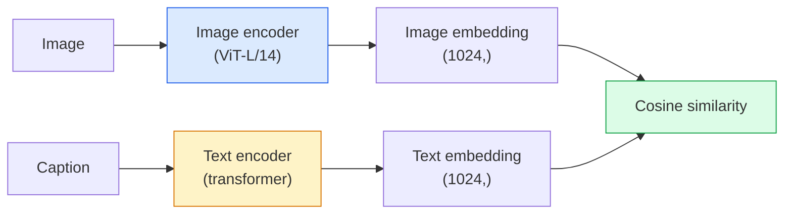

# Açık Kelime Vizyonu — CLIP

> Eşleşen (resim, başlık) çiftlerin paylaşılan alanda aynı noktaya gelmesi için bir görüntü kodlayıcıyı ve bir metin kodlayıcıyı birlikte eğitin. Bütün hile bu.

**Tür:** Oluştur + Kullan
**Diller:** Python
**Önkoşullar:** Aşama 4 Ders 14 (ViT), Aşama 4 Ders 17 (Kendi Kendini Denetlemeli)
**Süre:** ~45 dakika

## Öğrenme Hedefleri

- CLIP'in iki kule mimarisini ve karşılaştırmalı eğitim hedefini açıklayın
- Göreve özel herhangi bir eğitim gerektirmeden sıfır atış sınıflandırması için önceden eğitilmiş bir CLIP (veya SigLIP) kullanın
- Sıfır atış sınıflandırmasını sıfırdan uygulayın: prompt sınıfını kodlayın, kosinüs benzerliğini hesaplayın, argmax'ı alın
- CLIP, SigLIP, OpenCLIP ve LLaVA/LLaMA-vision modellerini ayırt edin - her biri 2026'da ne işe yarar?

## Sorun

Geleneksel sınıflandırıcılar kapalı kelime dağarcığına sahiptir: 1000 sınıflı bir ImageNet modeli yalnızca 1000 etiketi tahmin edebilir. Her yeni kategori, etiketlenmiş verilere ve yeniden eğitilmiş bir kafaya ihtiyaç duyar.

CLIP (Radford ve diğerleri, OpenAI 2021), web'den alınan 400 milyon (resim, başlık) çift üzerinde yapılan eğitimin, inference'de tamamen doğal dilde açıklanan herhangi bir kategori kümesinde sınıflandırılabilen bir model ürettiğini gösterdi. Bir cümle yazarak ona yeni bir sınıf verirsiniz.

Bu yetenek (sıfır atış aktarımı) her modern görüntü sisteminin CLIP ailesi kontrol noktasıyla başlamasının nedenidir. Algılama (Topraklama DINO, OWL-ViT), segmentasyon (CLIPSeg, SAM), erişim, içerik denetimi, VLM'ler ve metinden görüntüye oluşturma işlemlerinin tümü CLIP tarzı ortak embedding'ler üzerine kuruludur.

## Konsept

### İki kule



Her iki kodlayıcı da aynı embedding boyutuna (CLIP-B/32 için 512, CLIP-L/14 için 1024) doğrusal bir projeksiyonla biter. L2-normalleştirme ve kosinüs benzerliğini hesaplama.

### Amaç

N (resim, başlık) çiftten oluşan bir grup verildiğinde, bir NxN benzerlik matrisi oluşturun. Her iki kodlayıcıyı da çapraz (eşleşen çiftler) yüksek benzerliğe sahip olacak ve köşegen dışı (eşleşmeyen) düşük benzerliğe sahip olacak şekilde eğitin.

```
sim_matrix = image_embeddings @ text_embeddings.T / tau

loss_i2t = cross_entropy(sim_matrix,       targets=arange(N))
loss_t2i = cross_entropy(sim_matrix.T,     targets=arange(N))
loss = (loss_i2t + loss_t2i) / 2
```

Simetrik çünkü hem görüntüden metne hem de metinden görüntüye erişim çalışmalıdır. `tau` (sıcaklık) genellikle skaler bir parametre olarak öğrenilir ve 0,07 olarak başlatılır.

### SigLIP: daha iyi bir kayıp

SigLIP (Zhai ve diğerleri, 2023) softmax'ı çift başına sigmoid ile değiştirdi:

```
loss = mean over pairs of log(1 + exp(-y_ij * sim_ij))
y_ij = +1 if matching, -1 otherwise
```

Çift başına kayıp, CLIP'in gerektirdiği toplu düzeyde normalleştirmeyi ortadan kaldırır. SigLIP, küçük parti boyutlarında daha iyi eğitim verir ve eşit verilerde CLIP'e uyar veya onu aşar.

### Sıfır atış sınıflandırması

Eğitimli bir CLIP verildiğinde:

1. Her sınıf için bir prompt oluşturun: "bir {sınıfın} fotoğrafı".
2. Tüm sınıf prompt'leri metin kodlayıcı -> `T` şekli (C, d) ile kodlayın.
3. Test görüntüsünü kodlayın -> `I` şekli (1, d).
4. Benzerlik = `I @ T.T` şekli (1, C).
5. Argmax -> tahmin edilen sınıf.

Prompt mühendislik önemlidir. OpenAI, ImageNet için 80 prompt şablonu yayınladı ("bir {}'in fotoğrafı", "bir {}'in bulanık fotoğrafı", "bir {}'in taslağı", ...). Ekstra %1-3 ilk 1 doğruluk için sınıf başına tüm şablonların embedding'lerinin ortalamasını alın.

### 2026'da CLIP tarzı modellerin kullanıldığı yerler

- **Sıfır atış sınıflandırması** — doğrudan kullanım.
- **Görüntü alma** — tüm görüntüleri bir kez kodlayın, sorguyu inference'ye yerleştirin.
- **Metin koşullu algılama** — DINO ve OWL-ViT'nin topraklanması, bir dedektörün etrafına bir CLIP metin kulesi sarar.
- **Metin koşullu segmentasyon** — CLIPSeg; SAM, CLIP aracılığıyla metin-prompt girişlerini kullanır.
- **VLM'ler** — LLaVA, Qwen-VL, InternVL, CLIP ailesi görüntü kodlayıcısını bir LLM'ye bağlar.
- **Metinden görüntü oluşturma** — Kararlı Difüzyon, CLIP metni embedding'de DALL-E 3 durumu.

Paylaşılan bir embedding alanına sahip olduğunuzda, her görüş+dil görevi bir mesafe hesaplamasına dönüşür.

## İnşa Et

### 1. Adım: İki kuleli küçük bir model

Gerçek KLİP ViT + transformer'dir. Bu ders için kuleler, önceden çıkarılmış özellikler üzerindeki küçük MLP'lerdir, böylece eğitim sinyali CPU'da görünür.

```python
import torch
import torch.nn as nn
import torch.nn.functional as F


class TwoTower(nn.Module):
    def __init__(self, img_in=128, txt_in=64, emb=64):
        super().__init__()
        self.image_proj = nn.Sequential(nn.Linear(img_in, 128), nn.ReLU(), nn.Linear(128, emb))
        self.text_proj = nn.Sequential(nn.Linear(txt_in, 128), nn.ReLU(), nn.Linear(128, emb))
        self.logit_scale = nn.Parameter(torch.ones([]) * 2.6592)  # ln(1/0.07)

    def forward(self, img_feats, txt_feats):
        i = F.normalize(self.image_proj(img_feats), dim=-1)
        t = F.normalize(self.text_proj(txt_feats), dim=-1)
        return i, t, self.logit_scale.exp()
```

İki projeksiyon, paylaşılan karartma çıkışı, öğrenilen sıcaklık. Gerçek CLIP API ile aynı şekle sahiptir.

### Adım 2: Karşılaştırmalı kayıp

```python
def clip_loss(image_emb, text_emb, logit_scale):
    N = image_emb.size(0)
    sim = logit_scale * image_emb @ text_emb.T
    targets = torch.arange(N, device=sim.device)
    l_i = F.cross_entropy(sim, targets)
    l_t = F.cross_entropy(sim.T, targets)
    return (l_i + l_t) / 2
```

Simetrik. Daha yüksek logit_scale = daha keskin softmax = daha güvenli ancak kararsızlık riski.

### Adım 3: Sıfır atışlı sınıflandırıcı

```python
@torch.no_grad()
def zero_shot_classify(model, image_feats, class_text_feats, class_names):
    """
    image_feats:      (N, img_in)
    class_text_feats: (C, txt_in)   one averaged embedding per class
    """
    i = F.normalize(model.image_proj(image_feats), dim=-1)
    t = F.normalize(model.text_proj(class_text_feats), dim=-1)
    sim = i @ t.T
    pred = sim.argmax(dim=-1)
    return [class_names[p] for p in pred.tolist()]
```

Adım başına bir satır. Bu, üretim CLIP kontrol noktasında kullanılan tam sıfır atış prosedürüdür.

### Adım 4: Sağlıklılık kontrolü

```python
torch.manual_seed(0)
model = TwoTower()

img = torch.randn(8, 128)
txt = torch.randn(8, 64)
i, t, scale = model(img, txt)
loss = clip_loss(i, t, scale)
print(f"batch size: {i.size(0)}   loss: {loss.item():.3f}")
```

Rastgele başlatılan bir model için kayıp, henüz hiçbir yapı öğrenilmediğinde simetrik çapraz entropi hedefi olan `log(N) = log(8) = 2.08`'ye yakın olmalıdır.

## Kullan onu

OpenCLIP, 2026'da topluluğun varsayılanıdır:

```python
import open_clip
import torch
from PIL import Image

model, _, preprocess = open_clip.create_model_and_transforms("ViT-B-32", pretrained="laion2b_s34b_b79k")
tokenizer = open_clip.get_tokenizer("ViT-B-32")

image = preprocess(Image.open("dog.jpg")).unsqueeze(0)
text = tokenizer(["a photo of a dog", "a photo of a cat", "a photo of a car"])

with torch.no_grad():
    image_features = model.encode_image(image)
    text_features = model.encode_text(text)
    image_features = image_features / image_features.norm(dim=-1, keepdim=True)
    text_features = text_features / text_features.norm(dim=-1, keepdim=True)
    probs = (100.0 * image_features @ text_features.T).softmax(dim=-1)

print(probs)
```

SigLIP daha yenidir, küçük ölçeklerde daha iyi eğitim verir ve yeni işler için tercih edilir: `google/siglip-base-patch16-224`. Hugging Face ikisini de gönderiyor.

## Gönderin

Bu ders şunları üretir:

- `outputs/prompt-zero-shot-class-picker.md` — bir sınıf listesi ve bir etki alanı verilen sıfır atışlı CLIP için sınıf şablonları tasarlayan bir prompt.
- `outputs/skill-image-text-retriever.md` — herhangi bir CLIP kontrol noktasıyla bir görüntü embedding dizini oluşturan, metne göre sorgulamayı ve görüntüye göre sorgulamayı destekleyen bir beceri.

## Egzersizler

1. **(Kolay)** Önceden eğitilmiş bir OpenCLIP ViT-B/32 kullanın ve 80 şablonlu prompt seti ile CIFAR-10 üzerinde sıfır atış sınıflandırması yapın. İlk 1 doğruluğu bildirin; %85-90 civarında olması lazım.
2. **(Orta)** Aynı CIFAR-10 görevindeki tek şablonu ("bir {} fotoğrafı") ile 80 şablonun ortalaması alınan embedding'leri karşılaştırın. Boşluğu ölçün ve şablonların neden yardımcı olduğunu açıklayın.
3. **(Zor)** Sıfır çekimli bir görüntü alma dizini oluşturun: CLIP ile 1.000 görüntüyü yerleştirin, bir FAISS dizini oluşturun, doğal dil açıklamasıyla sorgulayın. Elle yazdığınız 20 bekletilen sorgu için rapor alma geri çağırma@5.

## Anahtar Terimler

| Dönem | İnsanlar ne diyor | Aslında ne anlama geliyor |
|------|----------------|----------------------|
| İki kule | "Çift kodlayıcı" | Paylaşılan loş projeksiyon kafasında biten ayrı görüntü ve metin kodlayıcılar |
| Sıfır atış | "Göreve özel eğitim yok" | inference'de yalnızca metinle açıklanan sınıflara ayırın; hiçbir etikete dokunulmadı |
| Sıcaklık / logit_scale | "tau" | Softmax'tan önce benzerlik matrisini ölçeklendiren skaler öğrenildi |
| Prompt şablonu | "Bir {} fotoğrafı" | Sınıf adlarının etrafındaki doğal dil sarmalayıcı; birçok şablonun ortalamasını almak sıfır atış doğruluğunu artırır |
| KLİP | "Resim+metin modeli" | 2021 OpenAI modeli; 2026'da alanın sözlüğü |
| SigLIP | "Sigmoid KLİP" | Çift başına sigmoid için softmax'ı değiştirir; küçük gruplar halinde daha iyi trenler |
| OpenCLIP | "Açık üreme" | LAION'da topluluk tarafından eğitilmiş CLIP çeşitleri; açık kaynak boru hatları için üretim varsayılanı |
| VLM | "Vizyon-dil modeli" | CLIP ailesi kodlayıcıya ek olarak görüntülerle ilgili soruları yanıtlamak üzere eğitilmiş bir Yüksek Lisans |

## Daha Fazla Okuma

- [CLIP: Doğal Dil Denetiminden Aktarılabilir Görsel Modellerin Öğrenilmesi (Radford ve diğerleri, 2021)](https://arxiv.org/abs/2103.00020)
- [SigLIP: Dil-Görüntü Ön Eğitimi için Sigmoid Kaybı (Zhai ve diğerleri, 2023)](https://arxiv.org/abs/2303.15343)
- [OpenCLIP](https://github.com/mlfoundations/open_clip) — topluluk kod tabanı
- [DINOv2 vs CLIP vs MAE: bir özellik karşılaştırması](https://huggingface.co/blog/dinov2) — Yan yana kullanım senaryolarıyla HF kılavuzu
