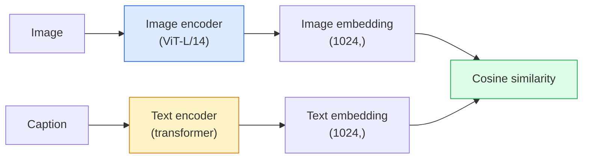

# 18 · 开放词表视觉——CLIP

> 联合训练一个图像编码器和一个文本编码器，使得匹配的（图像，描述文本）对落在同一个共享空间中的同一个点上。整个核心技巧就这么简单。

**类型：** 构建 + 使用
**语言：** Python
**前置：** 第 4 阶段第 14 课（ViT）、第 4 阶段第 17 课（自监督）
**时长：** 约 45 分钟

## 学习目标

- 阐释 CLIP 的双塔（two-tower）架构与对比训练（contrastive training）目标
- 使用预训练的 CLIP（或 SigLIP）进行零样本分类（zero-shot classification），无需任何针对特定任务的训练
- 从零实现零样本分类：编码类别提示词、计算余弦相似度（cosine similarity）、取 argmax
- 区分 CLIP、SigLIP、OpenCLIP 与 LLaVA/LLaMA-vision 模型——在 2026 年它们各自的用途是什么

## 问题所在

传统分类器是闭词表（closed-vocabulary）的：一个 1000 类的 ImageNet 模型只能预测 1000 个标签。每新增一个类别都需要标注数据并重新训练分类头。

CLIP（Radford 等人，OpenAI 2021）表明：在从网络爬取的 4 亿（image, caption）对上训练，可以得到一个在推理时能分类到任意类别集合的模型，而这些类别完全用自然语言描述。你只需写一个句子，就给它定义了一个新类别。

这种能力——零样本迁移（zero-shot transfer）——正是为什么所有现代视觉系统都从 CLIP 家族的检查点（checkpoint）起步。检测（Grounding DINO、OWL-ViT）、分割（CLIPSeg、SAM）、检索、内容审核、VLM 以及文生图生成，全都建立在 CLIP 式的联合嵌入（joint embedding）之上。

## 核心概念

### 两座塔



两个编码器都以一个线性投影（linear projection）结尾，投影到相同的嵌入维度（CLIP-B/32 为 512，CLIP-L/14 为 1024）。做 L2 归一化（L2-normalise），然后计算余弦相似度。

### 训练目标

给定一批 N 个（image, caption）对，构建一个 NxN 的相似度矩阵。训练两个编码器，使对角线（匹配对）具有高相似度，而非对角线（不匹配对）具有低相似度。

```
sim_matrix = image_embeddings @ text_embeddings.T / tau

loss_i2t = cross_entropy(sim_matrix,       targets=arange(N))
loss_t2i = cross_entropy(sim_matrix.T,     targets=arange(N))
loss = (loss_i2t + loss_t2i) / 2
```

之所以是对称的，是因为图到文（image-to-text）和文到图（text-to-image）的检索都应当奏效。`tau`（温度）通常作为一个标量参数被学习得到，初始化为 0.07。

### SigLIP：一个更好的损失

SigLIP（Zhai 等人，2023）用逐对（per-pair）sigmoid 替换了 softmax：

```
loss = mean over pairs of log(1 + exp(-y_ij * sim_ij))
y_ij = +1 if matching, -1 otherwise
```

逐对损失去掉了 CLIP 所要求的批级别（batch-level）归一化。SigLIP 在小批量大小（batch size）下训练效果更好，在相同数据量下与 CLIP 持平或更优。

### 零样本分类

给定一个训练好的 CLIP：

1. 对每个类别，构造一个提示词：「a photo of a {class}」。
2. 用文本编码器编码所有类别提示词 -> `T`，形状为 (C, d)。
3. 编码测试图像 -> `I`，形状为 (1, d)。
4. 相似度 = `I @ T.T`，形状为 (1, C)。
5. 取 Argmax -> 预测类别。

提示词工程（prompt engineering）很重要。OpenAI 为 ImageNet 发布了 80 个提示词模板（「a photo of a {}」、「a blurry photo of a {}」、「a sketch of a {}」……）。对每个类别取所有模板嵌入的平均，可额外带来 1-3% 的 top-1 准确率提升。

### 2026 年 CLIP 式模型用在哪里

- **零样本分类**——直接使用。
- **图像检索**——一次性编码所有图像，在推理时再嵌入查询。
- **文本条件检测**——Grounding DINO、OWL-ViT 在检测器外包裹一个 CLIP 文本塔。
- **文本条件分割**——CLIPSeg；SAM 通过 CLIP 接受文本提示输入。
- **VLM**——LLaVA、Qwen-VL、InternVL 将 CLIP 家族的视觉编码器接入一个 LLM。
- **文生图生成**——Stable Diffusion、DALL-E 3 以 CLIP 文本嵌入作为条件。

一旦你拥有一个共享的嵌入空间，每一个视觉 + 语言任务都变成了一次距离计算。

## 动手构建

### 第 1 步：一个极小的双塔模型

真正的 CLIP 是 ViT + transformer。本课中两座塔是建立在预先提取好的特征之上的小型 MLP，这样训练信号在 CPU 上就能看得见。

```python
import torch
import torch.nn as nn
import torch.nn.functional as F


class TwoTower(nn.Module):
    def __init__(self, img_in=128, txt_in=64, emb=64):
        super().__init__()
        self.image_proj = nn.Sequential(nn.Linear(img_in, 128), nn.ReLU(), nn.Linear(128, emb))
        self.text_proj = nn.Sequential(nn.Linear(txt_in, 128), nn.ReLU(), nn.Linear(128, emb))
        self.logit_scale = nn.Parameter(torch.ones([]) * 2.6592)  # ln(1/0.07)

    def forward(self, img_feats, txt_feats):
        i = F.normalize(self.image_proj(img_feats), dim=-1)
        t = F.normalize(self.text_proj(txt_feats), dim=-1)
        return i, t, self.logit_scale.exp()
```

两个投影、共享维度的输出、可学习的温度。与真实 CLIP 的 API 形状完全一致。

### 第 2 步：对比损失

```python
def clip_loss(image_emb, text_emb, logit_scale):
    N = image_emb.size(0)
    sim = logit_scale * image_emb @ text_emb.T
    targets = torch.arange(N, device=sim.device)
    l_i = F.cross_entropy(sim, targets)
    l_t = F.cross_entropy(sim.T, targets)
    return (l_i + l_t) / 2
```

对称。logit_scale 越大 = softmax 越尖锐 = 越自信，但有不稳定的风险。

### 第 3 步：零样本分类器

```python
@torch.no_grad()
def zero_shot_classify(model, image_feats, class_text_feats, class_names):
    """
    image_feats:      (N, img_in)
    class_text_feats: (C, txt_in)   每个类别一个平均嵌入
    """
    i = F.normalize(model.image_proj(image_feats), dim=-1)
    t = F.normalize(model.text_proj(class_text_feats), dim=-1)
    sim = i @ t.T
    pred = sim.argmax(dim=-1)
    return [class_names[p] for p in pred.tolist()]
```

每个步骤一行代码。这正是配合生产级 CLIP 检查点所使用的零样本流程。

### 第 4 步：合理性检查

```python
torch.manual_seed(0)
model = TwoTower()

img = torch.randn(8, 128)
txt = torch.randn(8, 64)
i, t, scale = model(img, txt)
loss = clip_loss(i, t, scale)
print(f"batch size: {i.size(0)}   loss: {loss.item():.3f}")
```

对于一个随机初始化的模型，损失应接近 `log(N) = log(8) = 2.08`——这是在尚未学到任何结构时对称交叉熵的目标值。

## 实际使用

OpenCLIP 是 2026 年社区的默认选择：

```python
import open_clip
import torch
from PIL import Image

model, _, preprocess = open_clip.create_model_and_transforms("ViT-B-32", pretrained="laion2b_s34b_b79k")
tokenizer = open_clip.get_tokenizer("ViT-B-32")

image = preprocess(Image.open("dog.jpg")).unsqueeze(0)
text = tokenizer(["a photo of a dog", "a photo of a cat", "a photo of a car"])

with torch.no_grad():
    image_features = model.encode_image(image)
    text_features = model.encode_text(text)
    image_features = image_features / image_features.norm(dim=-1, keepdim=True)
    text_features = text_features / text_features.norm(dim=-1, keepdim=True)
    probs = (100.0 * image_features @ text_features.T).softmax(dim=-1)

print(probs)
```

SigLIP 更新，在小规模下训练效果更好，是新项目的首选：`google/siglip-base-patch16-224`。Hugging Face 两者都提供。

## 交付成果

本课产出：

- `outputs/prompt-zero-shot-class-picker.md`——一个提示词，在给定类别列表和领域的情况下为零样本 CLIP 设计类别模板。
- `outputs/skill-image-text-retriever.md`——一个技能（skill），可用任意 CLIP 检查点构建图像嵌入索引，支持按文本查询（query-by-text）和按图像查询（query-by-image）。

## 练习

1. **（简单）** 使用预训练的 OpenCLIP ViT-B/32，配合 80 模板提示词集，在 CIFAR-10 上做零样本分类。报告 top-1 准确率；它应当在 85-90% 左右。
2. **（中等）** 在同一个 CIFAR-10 任务上，对比单模板（「a photo of a {}」）与 80 模板平均嵌入。量化二者的差距，并解释为什么模板有帮助。
3. **（困难）** 构建一个零样本图像检索索引：用 CLIP 嵌入 1,000 张图像，建立一个 FAISS 索引，用一段自然语言描述进行查询。对你手写的 20 个留出（held-out）查询，报告检索的 recall@5。

## 关键术语

| 术语 | 人们怎么说 | 它真正的含义 |
|------|----------------|----------------------|
| Two-tower（双塔） | 「Dual encoder（双编码器）」 | 独立的图像和文本编码器，各自以一个共享维度的投影头结尾 |
| Zero-shot（零样本） | 「无需针对特定任务的训练」 | 推理时分类到仅用文本描述的类别；完全不接触标签 |
| Temperature / logit_scale（温度） | 「tau」 | 在 softmax 之前对相似度矩阵进行缩放的可学习标量 |
| Prompt template（提示词模板） | 「A photo of a {}」 | 围绕类别名的自然语言包装；平均多个模板可提升零样本准确率 |
| CLIP | 「图像 + 文本模型」 | 2021 年 OpenAI 的模型；2026 年这一领域的通用术语 |
| SigLIP | 「Sigmoid CLIP」 | 用逐对 sigmoid 替换 softmax；在小批量下训练效果更好 |
| OpenCLIP | 「开源复现」 | 社区在 LAION 上训练的 CLIP 变体；开源流水线的生产默认选择 |
| VLM | 「视觉-语言模型」 | 一个 CLIP 家族编码器加上一个 LLM，训练用于回答关于图像的问题 |

## 延伸阅读

- [CLIP: Learning Transferable Visual Models from Natural Language Supervision (Radford et al., 2021)](https://arxiv.org/abs/2103.00020)
- [SigLIP: Sigmoid Loss for Language-Image Pre-Training (Zhai et al., 2023)](https://arxiv.org/abs/2303.15343)
- [OpenCLIP](https://github.com/mlfoundations/open_clip)——社区代码库
- [DINOv2 vs CLIP vs MAE: a features comparison](https://huggingface.co/blog/dinov2)——HF 指南，附带逐项对照的用例
