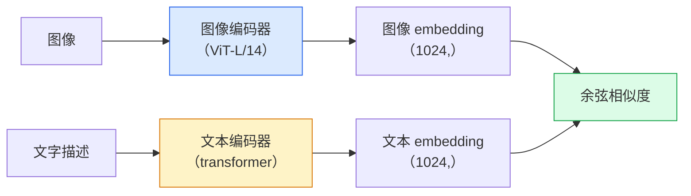

# 开放词汇视觉 —— CLIP

> 译注：本文译自同目录 [`en.md`](./en.md)。术语遵循仓根 [TRANSLATION_GUIDE.md](../../../../TRANSLATION_GUIDE.md)。

> 同时训练一个图像 encoder 和一个文本 encoder，让匹配的（图像，caption）对在共享空间里落到同一点。整个 trick 就这么简单。

**Type:** Build + Use
**Languages:** Python
**Prerequisites:** Phase 4 Lesson 14 (ViT), Phase 4 Lesson 17 (Self-Supervised)
**Time:** ~45 minutes

## 学习目标（Learning Objectives）

- 解释 CLIP 的双塔（two-tower）架构与对比式（contrastive）训练目标
- 直接使用预训练 CLIP（或 SigLIP）做 zero-shot 分类，无需任何任务特定的训练
- 从零实现 zero-shot 分类：编码类别 prompt、计算余弦相似度、取 argmax
- 区分 CLIP、SigLIP、OpenCLIP、LLaVA / LLaMA-vision 等模型 —— 在 2026 年它们各自的用途

## 问题（The Problem）

传统分类器是封闭词汇表的：一个 1000 类的 ImageNet 模型只能预测 1000 个标签。每加一个新类别都需要标注数据并重新训练分类头。

CLIP（Radford 等，OpenAI 2021）证明了：在从网上抓取的 4 亿（图像，caption）对上训练，可以得到一个在推理时能分类到**任意**类别集合的模型，类别用纯自然语言描述即可。给它一个新类别，你只需要写一句话。

这种能力 —— zero-shot 迁移 —— 正是为什么所有现代视觉系统都从一个 CLIP 家族 checkpoint 起步。检测（Grounding DINO、OWL-ViT）、分割（CLIPSeg、SAM）、检索、内容审核、VLM、文生图，全部建立在 CLIP 风格的联合 embedding 之上。

## 概念（The Concept）

### 双塔（Two towers）



两个 encoder 末端都有一个线性投影到相同的 embedding 维度（CLIP-B/32 是 512，CLIP-L/14 是 1024）。L2 归一化后计算余弦相似度。

### 训练目标（The objective）

给定一个 batch 的 N 个（图像，caption）对，构建一个 N×N 的相似度矩阵。训练两个 encoder，让对角线（匹配对）有高相似度，非对角线（不匹配）有低相似度。

```
sim_matrix = image_embeddings @ text_embeddings.T / tau

loss_i2t = cross_entropy(sim_matrix,       targets=arange(N))
loss_t2i = cross_entropy(sim_matrix.T,     targets=arange(N))
loss = (loss_i2t + loss_t2i) / 2
```

之所以对称，是因为图到文检索和文到图检索都得能用。`tau`（温度，temperature）通常学成一个标量参数，初始化为 0.07。

### SigLIP：更好的 loss

SigLIP（Zhai 等，2023）把 softmax 换成了逐对的 sigmoid：

```
loss = mean over pairs of log(1 + exp(-y_ij * sim_ij))
y_ij = +1 if matching, -1 otherwise
```

逐对的 loss 去掉了 CLIP 必需的 batch 级归一化。SigLIP 在小 batch size 下训练得更好，在数据量相同时能匹配甚至超过 CLIP。

### Zero-shot 分类

给定一个训练好的 CLIP：

1. 给每个类别拼一个 prompt：`"a photo of a {class}"`。
2. 用文本 encoder 编码所有类别 prompt -> `T`，shape `(C, d)`。
3. 编码测试图像 -> `I`，shape `(1, d)`。
4. 相似度 = `I @ T.T`，shape `(1, C)`。
5. Argmax -> 预测类别。

Prompt engineering 很重要。OpenAI 为 ImageNet 发布了 80 个 prompt 模板（`"a photo of a {}"`、`"a blurry photo of a {}"`、`"a sketch of a {}"`、……）。把每个类别在所有模板下的 embedding 求平均，能再多换 1-3% 的 top-1 accuracy。

### 2026 年 CLIP 风格模型用在哪里

- **Zero-shot 分类** —— 直接用。
- **图像检索** —— 一次性把所有图像编码完，推理时只编码 query。
- **文本条件检测** —— Grounding DINO、OWL-ViT 在检测器外面套一个 CLIP 文本塔。
- **文本条件分割** —— CLIPSeg；SAM 通过 CLIP 接受文本 prompt 输入。
- **VLM** —— LLaVA、Qwen-VL、InternVL 把 CLIP 家族的视觉 encoder 接进 LLM。
- **文生图** —— Stable Diffusion、DALL-E 3 以 CLIP 文本 embedding 作为条件。

只要有了共享 embedding 空间，所有视觉 + 语言任务都变成一次距离计算。

## 动手实现（Build It）

### Step 1：一个迷你双塔模型

真正的 CLIP 是 ViT + transformer。本节为了让训练信号在 CPU 上肉眼可见，两个塔都退化成在预提取特征上的小 MLP。

```python
import torch
import torch.nn as nn
import torch.nn.functional as F


class TwoTower(nn.Module):
    def __init__(self, img_in=128, txt_in=64, emb=64):
        super().__init__()
        self.image_proj = nn.Sequential(nn.Linear(img_in, 128), nn.ReLU(), nn.Linear(128, emb))
        self.text_proj = nn.Sequential(nn.Linear(txt_in, 128), nn.ReLU(), nn.Linear(128, emb))
        self.logit_scale = nn.Parameter(torch.ones([]) * 2.6592)  # ln(1/0.07)

    def forward(self, img_feats, txt_feats):
        i = F.normalize(self.image_proj(img_feats), dim=-1)
        t = F.normalize(self.text_proj(txt_feats), dim=-1)
        return i, t, self.logit_scale.exp()
```

两个投影、共享维度的输出、可学习的 temperature。和真正 CLIP 的 API 形状一致。

### Step 2：对比 loss

```python
def clip_loss(image_emb, text_emb, logit_scale):
    N = image_emb.size(0)
    sim = logit_scale * image_emb @ text_emb.T
    targets = torch.arange(N, device=sim.device)
    l_i = F.cross_entropy(sim, targets)
    l_t = F.cross_entropy(sim.T, targets)
    return (l_i + l_t) / 2
```

对称。`logit_scale` 越大 = softmax 越尖锐 = 更自信，但也有不稳定的风险。

### Step 3：Zero-shot 分类器

```python
@torch.no_grad()
def zero_shot_classify(model, image_feats, class_text_feats, class_names):
    """
    image_feats:      (N, img_in)
    class_text_feats: (C, txt_in)   one averaged embedding per class
    """
    i = F.normalize(model.image_proj(image_feats), dim=-1)
    t = F.normalize(model.text_proj(class_text_feats), dim=-1)
    sim = i @ t.T
    pred = sim.argmax(dim=-1)
    return [class_names[p] for p in pred.tolist()]
```

每一步一行。这就是在生产 CLIP checkpoint 上做 zero-shot 的全部流程。

### Step 4：Sanity check

```python
torch.manual_seed(0)
model = TwoTower()

img = torch.randn(8, 128)
txt = torch.randn(8, 64)
i, t, scale = model(img, txt)
loss = clip_loss(i, t, scale)
print(f"batch size: {i.size(0)}   loss: {loss.item():.3f}")
```

对随机初始化的模型，loss 应接近 `log(N) = log(8) = 2.08` —— 当还没学到任何结构时，对称交叉熵的目标值就是这个。

## 用起来（Use It）

OpenCLIP 是 2026 年社区的默认选择：

```python
import open_clip
import torch
from PIL import Image

model, _, preprocess = open_clip.create_model_and_transforms("ViT-B-32", pretrained="laion2b_s34b_b79k")
tokenizer = open_clip.get_tokenizer("ViT-B-32")

image = preprocess(Image.open("dog.jpg")).unsqueeze(0)
text = tokenizer(["a photo of a dog", "a photo of a cat", "a photo of a car"])

with torch.no_grad():
    image_features = model.encode_image(image)
    text_features = model.encode_text(text)
    image_features = image_features / image_features.norm(dim=-1, keepdim=True)
    text_features = text_features / text_features.norm(dim=-1, keepdim=True)
    probs = (100.0 * image_features @ text_features.T).softmax(dim=-1)

print(probs)
```

SigLIP 更新，在小规模下训练效果更好，新项目优先选它：`google/siglip-base-patch16-224`。Hugging Face 两者都有。

## 上线部署（Ship It）

本节产出：

- `outputs/prompt-zero-shot-class-picker.md` —— 一个 prompt：给定一组类别和一个领域，为 zero-shot CLIP 设计类别模板。
- `outputs/skill-image-text-retriever.md` —— 一个 skill：用任意 CLIP checkpoint 构建图像 embedding 索引，支持以文搜图和以图搜图。

## 练习（Exercises）

1. **（简单）** 用预训练的 OpenCLIP ViT-B/32，配合 80 模板 prompt 集，对 CIFAR-10 做 zero-shot 分类。报告 top-1 accuracy；应该在 85-90% 左右。
2. **（中等）** 在同一个 CIFAR-10 任务上对比单模板（`"a photo of a {}"`）和 80 模板平均 embedding 的效果。量化两者差距并解释模板为什么有用。
3. **（困难）** 构建一个 zero-shot 图像检索索引：用 CLIP 编码 1,000 张图像、建一个 FAISS 索引、用一段自然语言描述去 query。对你手写的 20 个 held-out query 报告 retrieval recall@5。

## 关键术语（Key Terms）

| 术语 | 大家嘴上怎么叫 | 实际指什么 |
|------|----------------|----------------------|
| Two-tower（双塔） | "Dual encoder" | 各自独立的图像和文本 encoder，末端接一个共享维度的投影头 |
| Zero-shot | "No task-specific training" | 推理时把图像分类到只用文本描述的类别集合；不碰任何标签 |
| Temperature / logit_scale | "tau" | 一个可学习的标量，softmax 之前用它缩放相似度矩阵 |
| Prompt template（prompt 模板） | "A photo of a {}" | 套在类别名外面的自然语言外壳；多模板平均能提升 zero-shot accuracy |
| CLIP | "图文模型" | 2021 年 OpenAI 那篇模型；2026 年这个领域的通用词汇 |
| SigLIP | "Sigmoid CLIP" | 把 softmax 换成逐对 sigmoid；小 batch 下训练更好 |
| OpenCLIP | "开源复现" | 社区在 LAION 上训练的 CLIP 变体；开源管线的生产默认选择 |
| VLM | "视觉-语言模型" | CLIP 家族 encoder 加一个 LLM，训练它回答关于图像的问题 |

## 延伸阅读（Further Reading）

- [CLIP: Learning Transferable Visual Models from Natural Language Supervision (Radford et al., 2021)](https://arxiv.org/abs/2103.00020)
- [SigLIP: Sigmoid Loss for Language-Image Pre-Training (Zhai et al., 2023)](https://arxiv.org/abs/2303.15343)
- [OpenCLIP](https://github.com/mlfoundations/open_clip) —— 社区代码库
- [DINOv2 vs CLIP vs MAE: a features comparison](https://huggingface.co/blog/dinov2) —— HF 官方指南，并排对比使用场景
