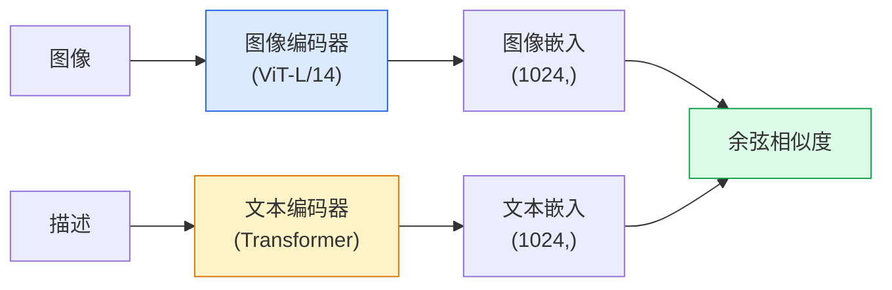

# 开放词汇视觉模型——CLIP

> 将图像编码器和文本编码器联合训练，使得匹配的（图像，描述）对在共享空间中映射到相同位置。这就是整条技巧。

**类型：** 构建 + 使用  
**语言：** Python  
**前置知识：** 阶段4 第14课（ViT）、阶段4 第17课（自监督学习）  
**时长：** 约45分钟

## 学习目标

- 解释CLIP的双塔架构和对比学习训练目标
- 使用预训练的CLIP（或SigLIP）进行零样本分类，无需任何任务特定训练
- 从头实现零样本分类：编码类别提示（class prompts），计算余弦相似度，取argmax
- 区分CLIP、SigLIP、OpenCLIP和LLaVA/LLaMA视觉模型——到2026年它们各自的用途

## 问题所在

传统分类器是封闭词汇的：一个1000类的ImageNet模型只能预测1000个标签。每个新类别都需要标注数据和重新训练分类头。

CLIP（Radford等人，OpenAI 2021）表明，在4亿（图像，描述）对（从网络抓取）上训练，可以产生一个模型，在推理时能够对任意类别集合进行分类，这些类别完全由自然语言描述。你只需写一个句子即可提供新类别。

这种能力——零样本迁移（Zero-shot Transfer）——正是为什么每个现代视觉系统都从CLIP系列检查点（checkpoint）开始。检测（Grounding DINO, OWL-ViT）、分割（CLIPSeg, SAM）、检索、内容审核、视觉语言模型（VLM）和文生图生成都建立在CLIP风格的联合嵌入基础上。

## 核心概念

### 双塔



两个编码器都以线性投影结束，投影到相同的嵌入维度（CLIP-B/32为512，CLIP-L/14为1024）。L2归一化后计算余弦相似度。

### 训练目标

给定一个包含N个（图像，描述）对的批次，构建NxN相似度矩阵。训练两个编码器，使得对角线（匹配对）具有高相似度，非对角线（非匹配）具有低相似度。

```
sim_matrix = image_embeddings @ text_embeddings.T / tau

loss_i2t = cross_entropy(sim_matrix,       targets=arange(N))
loss_t2i = cross_entropy(sim_matrix.T,     targets=arange(N))
loss = (loss_i2t + loss_t2i) / 2
```

对称性是为了让图像到文本和文本到图像的检索都正常工作。`tau`（温度）通常作为一个标量参数学习得到，初始化为0.07。

### SigLIP：更好的损失函数

SigLIP（Zhai等人，2023）将softmax替换为逐对sigmoid：

```
loss = mean over pairs of log(1 + exp(-y_ij * sim_ij))
y_ij = +1 if matching, -1 otherwise
```

逐对损失消除了CLIP所需的批次级归一化。SigLIP在小的批大小下训练效果更好，在同等数据量下达到或超过CLIP。

### 零样本分类

给定一个训练好的CLIP：

1. 对每个类别，构建一个提示："a photo of a {class}"。
2. 用文本编码器编码所有类别提示 -> 形状为`T` (C, d)。
3. 编码测试图像 -> 形状为`I` (1, d)。
4. 相似度 = `I @ T.T` 形状 (1, C)。
5. Argmax -> 预测的类别。

提示工程很重要。OpenAI发布了80个ImageNet提示模板（"a photo of a {}", "a blurry photo of a {}", "a sketch of a {}", ...）。对每个类别取所有模板嵌入的平均值，可以额外提升1-3%的Top-1准确率。

### 2026年CLIP风格模型的用途

- **零样本分类** —— 直接使用。
- **图像检索** —— 一次编码所有图像，推理时嵌入查询。
- **文本条件检测** —— Grounding DINO、OWL-ViT将CLIP文本塔包裹在检测器周围。
- **文本条件分割** —— CLIPSeg；SAM通过CLIP使用文本提示输入。
- **视觉语言模型（VLM）** —— LLaVA、Qwen-VL、InternVL将CLIP系列视觉编码器连接到LLM。
- **文生图生成** —— Stable Diffusion、DALL-E 3以CLIP文本嵌入为条件。

一旦你有了一个共享的嵌入空间，每个视觉+语言任务都变成了距离计算。

## 动手构建

### 第一步：微型双塔模型

真正的CLIP是ViT + Transformer。本课程中，塔是小型MLP，作用于预提取的特征上，这样训练信号在CPU上可见。

```python
import torch
import torch.nn as nn
import torch.nn.functional as F


class TwoTower(nn.Module):
    def __init__(self, img_in=128, txt_in=64, emb=64):
        super().__init__()
        self.image_proj = nn.Sequential(nn.Linear(img_in, 128), nn.ReLU(), nn.Linear(128, emb))
        self.text_proj = nn.Sequential(nn.Linear(txt_in, 128), nn.ReLU(), nn.Linear(128, emb))
        self.logit_scale = nn.Parameter(torch.ones([]) * 2.6592)  # ln(1/0.07)

    def forward(self, img_feats, txt_feats):
        i = F.normalize(self.image_proj(img_feats), dim=-1)
        t = F.normalize(self.text_proj(txt_feats), dim=-1)
        return i, t, self.logit_scale.exp()
```

两个投影，共享维度输出，学习到的温度。与真实CLIP API形状相同。

### 第二步：对比损失

```python
def clip_loss(image_emb, text_emb, logit_scale):
    N = image_emb.size(0)
    sim = logit_scale * image_emb @ text_emb.T
    targets = torch.arange(N, device=sim.device)
    l_i = F.cross_entropy(sim, targets)
    l_t = F.cross_entropy(sim.T, targets)
    return (l_i + l_t) / 2
```

对称。logit_scale越高 = softmax越尖锐 = 更自信但存在不稳定性风险。

### 第三步：零样本分类器

```python
@torch.no_grad()
def zero_shot_classify(model, image_feats, class_text_feats, class_names):
    """
    image_feats:      (N, img_in)
    class_text_feats: (C, txt_in)   each class averaged embedding
    """
    i = F.normalize(model.image_proj(image_feats), dim=-1)
    t = F.normalize(model.text_proj(class_text_feats), dim=-1)
    sim = i @ t.T
    pred = sim.argmax(dim=-1)
    return [class_names[p] for p in pred.tolist()]
```

每步一行。这正是生产级CLIP检查点使用的精确零样本过程。

### 第四步：合理性检查

```python
torch.manual_seed(0)
model = TwoTower()

img = torch.randn(8, 128)
txt = torch.randn(8, 64)
i, t, scale = model(img, txt)
loss = clip_loss(i, t, scale)
print(f"batch size: {i.size(0)}   loss: {loss.item():.3f}")
```

对于随机初始化的模型，损失应接近于 `log(N) = log(8) = 2.08` —— 尚未学习到任何结构时的对称交叉熵目标。

## 使用它

OpenCLIP是2026年社区默认方案：

```python
import open_clip
import torch
from PIL import Image

model, _, preprocess = open_clip.create_model_and_transforms("ViT-B-32", pretrained="laion2b_s34b_b79k")
tokenizer = open_clip.get_tokenizer("ViT-B-32")

image = preprocess(Image.open("dog.jpg")).unsqueeze(0)
text = tokenizer(["a photo of a dog", "a photo of a cat", "a photo of a car"])

with torch.no_grad():
    image_features = model.encode_image(image)
    text_features = model.encode_text(text)
    image_features = image_features / image_features.norm(dim=-1, keepdim=True)
    text_features = text_features / text_features.norm(dim=-1, keepdim=True)
    probs = (100.0 * image_features @ text_features.T).softmax(dim=-1)

print(probs)
```

SigLIP更新，在小规模上训练更好，是新工作的首选：`google/siglip-base-patch16-224`。Hugging Face同时提供两者。

## 交付物

本课程产出：

- `outputs/prompt-zero-shot-class-picker.md` —— 一个提示，给定类别列表和领域，用于设计零样本CLIP的类别模板。
- `outputs/skill-image-text-retriever.md` —— 一项技能，使用任何CLIP检查点构建图像嵌入索引，支持文本查询和图像查询。

## 练习

1. **（简单）** 使用预训练的OpenCLIP ViT-B/32，在CIFAR-10上使用80模板提示集进行零样本分类。报告Top-1准确率，应在85-90%左右。
2. **（中等）** 在同一CIFAR-10任务上，比较单一模板（"a photo of a {}"）与80模板平均嵌入。量化差距并解释为什么模板有帮助。
3. **（困难）** 构建一个零样本图像检索索引：使用CLIP嵌入1000张图像，构建FAISS索引，用自然语言描述进行查询。针对你手动编写的20个保留查询，报告召回率@5。

## 关键术语

| 术语 | 人们常说的 | 实际含义 |
|------|-----------|----------|
| 双塔（Two-tower） | "双编码器" | 独立的图像和文本编码器，末端共享维度的投影头 |
| 零样本（Zero-shot） | "无需任务特定训练" | 在推理时对仅由文本描述的类别进行分类，无需接触标签 |
| 温度 / logit_scale | "tau" | 可学习的标量，在softmax之前对相似度矩阵进行缩放 |
| 提示模板（Prompt template） | "一张{}的照片" | 围绕类别名称的自然语言包装；对多个模板求平均可提升零样本准确率 |
| CLIP | "图像+文本模型" | 2021年OpenAI模型；2026年该领域的词汇 |
| SigLIP | "Sigmoid CLIP" | 用逐对sigmoid替换softmax；小批次下训练更好 |
| OpenCLIP | "开放复现" | 社区在LAION上训练的CLIP变体；开源管线的生产默认方案 |
| VLM | "视觉语言模型" | CLIP系列编码器加上一个LLM，训练用于回答关于图像的问题 |

## 进一步阅读

- [CLIP：从自然语言监督中学习可迁移的视觉模型（Radford等人，2021）](https://arxiv.org/abs/2103.00020)
- [SigLIP：语言-图像预训练的Sigmoid损失（Zhai等人，2023）](https://arxiv.org/abs/2303.15343)
- [OpenCLIP](https://github.com/mlfoundations/open_clip) —— 社区代码库
- [DINOv2 vs CLIP vs MAE：特征比较](https://huggingface.co/blog/dinov2) —— Hugging Face指南，附并列使用案例