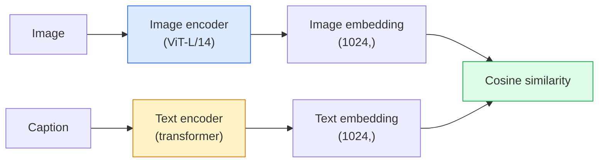

# 开放词汇愿景- CLIP

> 一起训练图像编码器和文本编码器，以便匹配（图像、标题）对位于共享空间的同一点。这就是全部技巧。

** 类型：** 构建+使用
** 语言：** Python
** 先决条件：** 第4阶段第14课（ViT）、第4阶段第17课（自我监督）
** 时间：** ~45分钟

## 学习目标

- Explain CLIP's two-tower architecture and contrastive training objective
- 使用预训练的CLIP（或SigLIP）进行零炮分类，无需任何特定于任务的训练
- 从头开始实现零次分类：编码类提示，计算余弦相似度，取argmax
- 区分CLIP、SigLIP、OpenCLIP和LLaVA/LLaMA视觉模型-每种模型在2026年的用途

## 问题

传统的分类器是封闭词汇的：1000个类的ImageNet模型只能预测1000个标签。每个新类别都需要标记数据和重新训练的头脑。

CLIP（雷德福等人，OpenAI 2021）表明，对从网络上抓取的4亿个（图像、标题）对进行训练会产生一个模型，该模型可以在推理时分类为任何类别集，纯粹用自然语言描述。你通过写一个句子给它一个新的类。

That capability — zero-shot transfer — is why every modern vision system starts with a CLIP-family checkpoint. Detection (Grounding DINO, OWL-ViT), segmentation (CLIPSeg, SAM), retrieval, content moderation, VLMs, and text-to-image generation all build on CLIP-style joint embeddings.

## 概念

### 两座塔



Both encoders end with a linear projection to the same embedding dimension (512 for CLIP-B/32, 1024 for CLIP-L/14). L2-normalise and compute cosine similarity.

### The objective

给定一批N个（图像、标题）对，构建Nxon相似性矩阵。训练两个编码器，使对角线（匹配对）具有高相似性，而非对角线（非匹配）具有低相似性。

```
sim_matrix = image_embeddings @ text_embeddings.T / tau

loss_i2t = cross_entropy(sim_matrix,       targets=arange(N))
loss_t2i = cross_entropy(sim_matrix.T,     targets=arange(N))
loss = (loss_i2t + loss_t2i) / 2
```

对称性，因为图像到文本和文本到图像检索都应该起作用。“tau”（温度）通常作为纯量参数学习，初始化为0.07。

### SigLIP：更好的损失

SigLIP（Zhai等人，2023）用每对Sigmoid替换了softmax：

```
loss = mean over pairs of log(1 + exp(-y_ij * sim_ij))
y_ij = +1 if matching, -1 otherwise
```

每对损失消除了CLIP所需的批级标准化。SigLIP在小批量时训练得更好，并在同等数据下匹配或超过CLIP。

### 零镜头分类

Given a trained CLIP:

1. 为每个课程编写一个提示：“一张{类}的照片”。
2. 使用文本编码器->& T & shape（C，d）对所有类提示进行编码。
3. 编码测试图像->' I ' shape（1，d）。
4. 相似性=“I @ T.T”形状（1，C）。
5. Argmax ->预测类。

即时工程问题。OpenAI发布了ImageNet的80个提示模板（“一张{}的照片”、“一张{}的模糊照片”、“一张{}的草图”、.）。平均每个类别所有模板的嵌入，可额外获得1-3%的前1准确率。

### 2026年使用CLIP风格车型的地方

- ** 零镜头分类 ** -直接使用。
- ** 图像检索 ** -对所有图像进行一次编码，在推断时嵌入查询。
- ** 文本条件检测 ** -接地DINO，OWL-ViT将CLIP文本塔包裹在检测器周围。
- ** 文本条件分段 ** - CLIPSeg; Sam通过CLIP使用文本提示输入。
- **VLMS** - LLaVA、Qwen-BL、InternVLL将CLIP系列视觉编码器连接到LLM中。
- ** 文本到图像生成 ** -稳定扩散，CLIP文本嵌入的DALL-E 3条件。

一旦拥有共享嵌入空间，每个视觉+语言任务都会变成距离计算。

## 建设党

### 第1步：微型两塔模型

Real CLIP是ViT + Transformer。在本课中，塔是预先提取的特征上的小型MLP，因此训练信号在中央处理器上可见。

```python
import torch
import torch.nn as nn
import torch.nn.functional as F


class TwoTower(nn.Module):
    def __init__(self, img_in=128, txt_in=64, emb=64):
        super().__init__()
        self.image_proj = nn.Sequential(nn.Linear(img_in, 128), nn.ReLU(), nn.Linear(128, emb))
        self.text_proj = nn.Sequential(nn.Linear(txt_in, 128), nn.ReLU(), nn.Linear(128, emb))
        self.logit_scale = nn.Parameter(torch.ones([]) * 2.6592)  # ln(1/0.07)

    def forward(self, img_feats, txt_feats):
        i = F.normalize(self.image_proj(img_feats), dim=-1)
        t = F.normalize(self.text_proj(txt_feats), dim=-1)
        return i, t, self.logit_scale.exp()
```

两个投影，共享昏暗输出，学习温度。与真正的CLIP API形状相同。

### 第2步：对比损失

```python
def clip_loss(image_emb, text_emb, logit_scale):
    N = image_emb.size(0)
    sim = logit_scale * image_emb @ text_emb.T
    targets = torch.arange(N, device=sim.device)
    l_i = F.cross_entropy(sim, targets)
    l_t = F.cross_entropy(sim.T, targets)
    return (l_i + l_t) / 2
```

Symmetric. Higher logit_scale = sharper softmax = more confident but risk of instability.

### 第3步：零镜头分类器

```python
@torch.no_grad()
def zero_shot_classify(model, image_feats, class_text_feats, class_names):
    """
    image_feats:      (N, img_in)
    class_text_feats: (C, txt_in)   one averaged embedding per class
    """
    i = F.normalize(model.image_proj(image_feats), dim=-1)
    t = F.normalize(model.text_proj(class_text_feats), dim=-1)
    sim = i @ t.T
    pred = sim.argmax(dim=-1)
    return [class_names[p] for p in pred.tolist()]
```

每步一行。这是与生产CLIP检查点一起使用的精确零射击过程。

### 第4步：健全检查

```python
torch.manual_seed(0)
model = TwoTower()

img = torch.randn(8, 128)
txt = torch.randn(8, 64)
i, t, scale = model(img, txt)
loss = clip_loss(i, t, scale)
print(f"batch size: {i.size(0)}   loss: {loss.item():.3f}")
```

对于随机初始化的模型，损失应该接近“log（N）= log（8）= 2.08”--当尚未学习到结构时，这是对称的交叉熵目标。

## 使用它

OpenCLIP是2026年社区默认设置：

```python
import open_clip
import torch
from PIL import Image

model, _, preprocess = open_clip.create_model_and_transforms("ViT-B-32", pretrained="laion2b_s34b_b79k")
tokenizer = open_clip.get_tokenizer("ViT-B-32")

image = preprocess(Image.open("dog.jpg")).unsqueeze(0)
text = tokenizer(["a photo of a dog", "a photo of a cat", "a photo of a car"])

with torch.no_grad():
    image_features = model.encode_image(image)
    text_features = model.encode_text(text)
    image_features = image_features / image_features.norm(dim=-1, keepdim=True)
    text_features = text_features / text_features.norm(dim=-1, keepdim=True)
    probs = (100.0 * image_features @ text_features.T).softmax(dim=-1)

print(probs)
```

SigLIP较新，在小规模上训练更好，并且是新作品的首选：“google/siglip-base-patch 16 -224”。拥抱脸两者都有。

## 把它运

本课产生：

- ' outputes/prompt-zero-shot-class-picker.md '-一个提示，为零镜头CLIP设计类模板，给出类列表和域。
- ' outputes/skill-image-text-retriever.md '-一种使用任何CLIP检查点构建图像嵌入索引的技能，支持逐文本查询和逐图像查询。

## 演习

1. **(Easy)** Use a pretrained OpenCLIP ViT-B/32 and do zero-shot classification on CIFAR-10 with the 80-template prompt set. Report top-1 accuracy; it should be around 85-90%.
2. **（中等）** 比较同一CIFAR-10任务上的单模板（“一张{}的照片”）与80个模板平均嵌入。量化差距并解释模板为何有帮助。
3. **（Hard）** 构建零镜头图像检索索引：使用CLIP嵌入1，000张图像，构建FAISS索引，使用自然语言描述进行查询。报告检索回顾@5，以获取您手写的20个保留的查询。

## 关键术语

| Term | 别人怎么说 | 它实际上意味着什么 |
|------|----------------|----------------------|
| 双塔 | “双编码器” | 独立的图像和文本编码器以共享调暗投影头结束 |
| Zero-shot | “没有针对特定任务的培训” | Classify into classes described only by text at inference; no labels touched |
| 温度/ logit_scale | “tau” | 在softmax之前缩放相似性矩阵的学习到的纯量 |
| 提示模板 | “一张{}的照片” | 围绕类名称的自然语言包装;平均多个模板可提高零射击准确性 |
| 夹 | “图像+文本模型” | 2021年OpenAI模型; 2026年该领域词汇 |
| SigLIP | “Sigmoid剪辑” | Swaps softmax for per-pair sigmoid; trains better at small batches |
| OpenCLIP | “开放复制” | LAION上经过社区培训的CLIP变体;开源管道的默认生产 |
| VLM | “视觉语言模型” | CLIP系列编码器加上LLM，经过训练可回答有关图像的问题 |

## Further Reading

- [CLIP：从自然语言监督中学习可移植视觉模型（Radford等人，2021）]（https：//arxiv.org/abs/2103.00020）
- [SigLIP：图像预训练的Sigmoid丢失（Zhai等人，2023）]（https：//arxiv.org/abs/2303.15343）
- [OpenCLIP]（https：//github.com/mlfoundations/open_clip）-社区代码库
- [DINOv 2 vs CLIP vs MAE：功能比较]（https：//huggingface.co/blog/dinov2）-具有并排用例的HF指南
