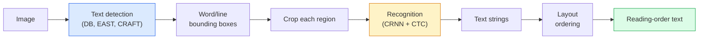

# OCR & Document Understanding

> OCR は3段階の pipeline です。text boxes を detect し、characters を recognise し、それらを layout します。現代の OCR system は、この段階を並べ替えるか統合します。

**種別:** 学習 + 活用
**言語:** Python
**前提条件:** Phase 4 Lesson 06 (Detection), Phase 7 Lesson 02 (Self-Attention)
**所要時間:** 約45分

## Learning Objectives

- 古典的な OCR pipeline (detect -> recognise -> layout) と現代の end-to-end alternatives (Donut, Qwen-VL-OCR) をたどる
- sequence-to-sequence OCR training のための CTC (Connectionist Temporal Classification) loss を実装する
- training なしで production document parsing に PaddleOCR または EasyOCR を使う
- OCR、layout parsing、document understanding を区別し、task ごとに適切な tool を選ぶ

## 問題

text で埋まった images は至る所にあります。receipts、invoices、IDs、scanned books、forms、whiteboards、signs、screenshots。そこから structured data を抽出すること、つまり characters だけでなく「これは total amount である」と取り出すことは、最も価値の高い applied-vision problems の1つです。

この分野は3つの skill layers に分かれます。

1. **OCR proper**: pixels を text に変換する。
2. **Layout parsing**: OCR output を regions (title, body, table, header) にまとめる。
3. **Document understanding**: layout から structured fields ("invoice_total = $42.50") を抽出する。

各 layer には classical approaches と modern approaches があり、「image から text が欲しい」と「この receipt から total amount が必要」の間の差は、多くの teams が思うより大きいです。

## The Concept

### The classical pipeline



- **Text detection** は line ごと、または word ごとの quadrilaterals を生成します。
- **Recognition** は各 region を fixed height に crop し、CNN + BiLSTM + CTC を実行して character sequence を生成します。
- **Layout** は reading order を再構築します。Latin では top-to-bottom, left-to-right、Arabic や Japanese では異なります。

### CTC in one paragraph

OCR recognition は fixed-length feature map から variable-length sequence を生成します。CTC (Graves et al., 2006) により、character-level alignment なしでこれを学習できます。model は各 time step で (vocab + blank) 上の distribution を出力します。CTC loss は、repeats を merge し blanks を除去した後に target text へ reduce されるすべての alignments を marginalise します。

```
raw output: "h h h _ _ e e l l _ l l o _ _"
after merge repeats and remove blanks: "hello"
```

CTC は 2015 年に CRNN が機能した理由であり、2026 年でも多くの production OCR models を学習させています。

### Modern end-to-end models

- **Donut** (Kim et al., 2022) — ViT encoder + text decoder。image を読み、JSON を直接出力します。text detector も layout module もありません。
- **TrOCR** — line-level OCR 向けの ViT + transformer decoder。
- **Qwen-VL-OCR / InternVL** — OCR tasks に fine-tune された full vision-language models。complex documents では 2026 年時点で最高 accuracy。
- **PaddleOCR** — mature production package に入った古典的な DB + CRNN pipeline。今でも open-source の主力です。

End-to-end models はより多くの data と compute を必要としますが、multi-stage pipelines の error accumulation を避けられます。

### Layout parsing

structured documents では、各 region を Title、Paragraph、Figure、Table、Footnote と label する layout detector (LayoutLMv3, DocLayNet) を実行します。Reading order は「layout order で regions を iterate し、concatenate する」になります。

forms では **Key-Value extraction** models を使います。visually-rich documents には Donut、plain scans には LayoutLMv3 です。これらは image + detected text + positions を受け取り、structured key-value pairs を予測します。

### Evaluation metrics

- **Character Error Rate (CER)** — Levenshtein distance / reference length。低いほど良いです。production target は clean scans で < 2%。
- **Word Error Rate (WER)** — word level で同じもの。
- **F1 on structured fields** — key-value tasks 向け。`{invoice_total: 42.50}` が正しく現れるかを測ります。
- **Edit distance on JSON** — end-to-end document parsing 向け。Donut paper は normalised tree edit distance を導入しました。

## 実装

### Step 1: CTC loss + greedy decoder

```python
import torch
import torch.nn as nn
import torch.nn.functional as F


def ctc_loss(log_probs, targets, input_lengths, target_lengths, blank=0):
    """
    log_probs:      (T, N, C) log-softmax over vocab including blank at index 0
    targets:        (N, S) int targets (no blanks)
    input_lengths:  (N,) per-sample time steps used
    target_lengths: (N,) per-sample target length
    """
    return F.ctc_loss(log_probs, targets, input_lengths, target_lengths,
                      blank=blank, reduction="mean", zero_infinity=True)


def greedy_ctc_decode(log_probs, blank=0):
    """
    log_probs: (T, N, C) log-softmax
    returns: list of index sequences (blanks removed, repeats merged)
    """
    preds = log_probs.argmax(dim=-1).transpose(0, 1).cpu().tolist()
    out = []
    for seq in preds:
        decoded = []
        prev = None
        for idx in seq:
            if idx != prev and idx != blank:
                decoded.append(idx)
            prev = idx
        out.append(decoded)
    return out
```

`F.ctc_loss` は利用可能な場合、efficient CuDNN implementation を使います。greedy decoder は beam search より単純で、通常 CER は 1% 以内に収まります。

### Step 2: Tiny CRNN recogniser

line OCR 向けの最小 CNN + BiLSTM です。

```python
class TinyCRNN(nn.Module):
    def __init__(self, vocab_size=40, hidden=128, feat=32):
        super().__init__()
        self.cnn = nn.Sequential(
            nn.Conv2d(1, feat, 3, 1, 1), nn.BatchNorm2d(feat), nn.ReLU(inplace=True),
            nn.MaxPool2d(2),
            nn.Conv2d(feat, feat * 2, 3, 1, 1), nn.BatchNorm2d(feat * 2), nn.ReLU(inplace=True),
            nn.MaxPool2d(2),
            nn.Conv2d(feat * 2, feat * 4, 3, 1, 1), nn.BatchNorm2d(feat * 4), nn.ReLU(inplace=True),
            nn.MaxPool2d((2, 1)),
            nn.Conv2d(feat * 4, feat * 4, 3, 1, 1), nn.BatchNorm2d(feat * 4), nn.ReLU(inplace=True),
            nn.MaxPool2d((2, 1)),
        )
        self.rnn = nn.LSTM(feat * 4, hidden, bidirectional=True, batch_first=True)
        self.head = nn.Linear(hidden * 2, vocab_size)

    def forward(self, x):
        # x: (N, 1, H, W)
        f = self.cnn(x)                # (N, C, H', W')
        f = f.mean(dim=2).transpose(1, 2)  # (N, W', C)
        h, _ = self.rnn(f)
        return F.log_softmax(self.head(h).transpose(0, 1), dim=-1)  # (W', N, vocab)
```

入力は fixed-height です。CNN max-pools により height は 1 になります。width が CTC の time dimension です。

### Step 3: Synthetic OCR

end-to-end smoke test のために、白地に黒の digit strings を生成します。

```python
import numpy as np

def synthetic_line(text, height=32, char_width=16):
    W = char_width * len(text)
    img = np.ones((height, W), dtype=np.float32)
    for i, c in enumerate(text):
        x = i * char_width
        shade = 0.0 if c.isalnum() else 0.5
        img[6:height - 6, x + 2:x + char_width - 2] = shade
    return img


def build_batch(strings, vocab):
    H = 32
    W = 16 * max(len(s) for s in strings)
    imgs = np.ones((len(strings), 1, H, W), dtype=np.float32)
    target_lengths = []
    targets = []
    for i, s in enumerate(strings):
        imgs[i, 0, :, :16 * len(s)] = synthetic_line(s)
        ids = [vocab.index(c) for c in s]
        targets.extend(ids)
        target_lengths.append(len(ids))
    return torch.from_numpy(imgs), torch.tensor(targets), torch.tensor(target_lengths)


vocab = ["_"] + list("0123456789abcdefghijklmnopqrstuvwxyz")
imgs, targets, lengths = build_batch(["hello", "world"], vocab)
print(f"images: {imgs.shape}   targets: {targets.shape}   lengths: {lengths.tolist()}")
```

実際の OCR dataset では fonts、noise、rotation、blur、colour を追加します。上の pipeline は同一です。

### Step 4: Training sketch

```python
model = TinyCRNN(vocab_size=len(vocab))
opt = torch.optim.Adam(model.parameters(), lr=1e-3)

for step in range(200):
    strings = ["abc" + str(step % 10)] * 4 + ["xyz" + str((step + 1) % 10)] * 4
    imgs, targets, target_lens = build_batch(strings, vocab)
    log_probs = model(imgs)  # (W', 8, vocab)
    input_lens = torch.full((8,), log_probs.size(0), dtype=torch.long)
    loss = ctc_loss(log_probs, targets, input_lens, target_lens, blank=0)
    opt.zero_grad(); loss.backward(); opt.step()
```

この自明な synthetic data では、loss は 200 steps で ~3 から ~0.2 まで下がるはずです。

## Use It

3つの production paths があります。

- **PaddleOCR** — mature、fast、multilingual。one-line usage: `paddleocr.PaddleOCR(lang="en").ocr(image_path)`。
- **EasyOCR** — Python-native、multilingual、PyTorch backbone。
- **Tesseract** — classical。models が苦戦する古い scanned documents では今でも有用です。

end-to-end document parsing には Donut または VLM を使います。

```python
from transformers import DonutProcessor, VisionEncoderDecoderModel

processor = DonutProcessor.from_pretrained("naver-clova-ix/donut-base-finetuned-cord-v2")
model = VisionEncoderDecoderModel.from_pretrained("naver-clova-ix/donut-base-finetuned-cord-v2")
```

repeatable structure を持つ receipts、invoices、forms では Donut を fine-tune します。arbitrary documents や reasoning を伴う OCR では、Qwen-VL-OCR のような VLM が現在の default です。

## Ship It

この lesson は次を生成します。

- `outputs/prompt-ocr-stack-picker.md` — document type、language、structure に基づいて Tesseract / PaddleOCR / Donut / VLM-OCR を選ぶ prompt。
- `outputs/skill-ctc-decoder.md` — greedy と beam-search CTC decoders を scratch から書く skill。length normalisation を含む。

## Exercises

1. **(Easy)** TinyCRNN を 5-digit random numeric strings で 500 steps 学習してください。held-out set 上の CER を報告してください。
2. **(Medium)** greedy decoding を beam search (beam_width=5) に置き換えてください。CER delta を報告してください。どの inputs で beam search が勝ちますか？
3. **(Hard)** 20 receipts の set に PaddleOCR を使い、line items を抽出し、{item_name, price} pairs の hand-labelled ground truth に対して F1 を計算してください。

## Key Terms

| Term | What people say | What it actually means |
|------|----------------|----------------------|
| OCR | 「Text from pixels」 | image regions を character sequences に変換すること |
| CTC | 「Alignment-free loss」 | per-timestep labels なしで sequence model を学習する loss。alignments を marginalise する |
| CRNN | 「Classic OCR model」 | Conv feature extractor + BiLSTM + CTC。2015 年の baseline だが production で今も使われる |
| Donut | 「End-to-end OCR」 | ViT encoder + text decoder。image から JSON を直接出力する |
| Layout parsing | 「Find regions」 | document 内の Title/Table/Figure/Paragraph regions を detect して label する |
| Reading order | 「Text sequence」 | recognised regions を文として並べる順序。Latin では自明、mixed layouts では難しい |
| CER / WER | 「Error rates」 | character または word granularity での Levenshtein distance / reference length |
| VLM-OCR | 「LLM that reads」 | OCR tasks 向けに学習または prompt された vision-language model。complex documents では現在の SOTA |

## 参考文献

- [CRNN (Shi et al., 2015)](https://arxiv.org/abs/1507.05717) — original CNN+RNN+CTC architecture
- [CTC (Graves et al., 2006)](https://www.cs.toronto.edu/~graves/icml_2006.pdf) — original CTC paper。algorithmic ideas が濃縮されています
