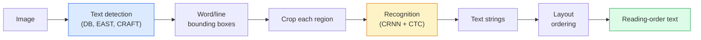

# OCR ve Belge Anlama

> OCR üç aşamalı bir işlem hattıdır — metin kutularını tespit edin, karakterleri tanıyın ve ardından bunları düzenleyin. Her modern OCR sistemi bu aşamaları yeniden sıralar veya birleştirir.

**Tür:** Öğren + Kullan
**Diller:** Python
**Önkoşullar:** Aşama 4 Ders 06 (Algılama), Aşama 7 Ders 02 (Kişisel Dikkat)
**Süre:** ~45 dakika

## Öğrenme Hedefleri

- Klasik OCR hattını (algıla -> tanı -> düzen) ve modern uçtan uca alternatifleri (Donut, Qwen-VL-OCR) takip edin
- Sıradan diziye OCR eğitimi için CTC (Bağlantıcı Geçici Sınıflandırma) kaybını uygulayın
- Eğitim gerektirmeden üretim belgesi ayrıştırma için PaddleOCR veya EasyOCR kullanın
- OCR, düzen ayrıştırma ve belge anlama arasında ayrım yapın ve görev başına doğru aracı seçin

## Sorun

Metin dolu görseller her yerde: makbuzlar, faturalar, kimlikler, taranmış kitaplar, formlar, beyaz tahtalar, tabelalar, ekran görüntüleri. Onlardan yapılandırılmış veri çıkarmak (yalnızca karakterleri değil, aynı zamanda "toplam miktar budur") en yüksek değere sahip uygulamalı görme sorunlarından biridir.

Alan üç beceri katmanına ayrılır:

1. **Uygun OCR**: pikselleri metne dönüştürün.
2. **Düzen ayrıştırma**: OCR çıktısını bölgelere göre gruplayın (başlık, gövde, tablo, başlık).
3. **Belgeyi anlama**: Düzenden yapılandırılmış alanları ("invoice_total = 42,50 $") çıkarın.

Her katmanın klasik ve modern yaklaşımları var ve "Bir görselden metin istiyorum" ile "Bu makbuzun toplam tutarına ihtiyacım var" arasındaki fark çoğu ekibin düşündüğünden daha büyük.

## Konsept

### Klasik boru hattı



- **Metin algılama** satır başına veya kelime başına dörtgenler üretir.
- **Tanıma** her bölgeyi sabit bir yüksekliğe kırpar, bir karakter dizisi oluşturmak için CNN + BiLSTM + CTC'yi çalıştırır.
- **Düzen** okuma sırasını yeniden oluşturur (Latince için yukarıdan aşağıya, soldan sağa; Arapça ve Japonca için farklıdır).

### Bir paragrafta CTC

OCR tanıma, sabit uzunluklu bir özellik haritasından değişken uzunlukta bir dizi üretir. CTC (Graves ve diğerleri, 2006), bunu karakter düzeyinde hizalama olmadan eğitmenize olanak tanır. Model, her zaman adımında (kelime + boş) üzerinden bir dağılım üretir; CTC kaybı, tekrarları birleştirdikten ve boşlukları kaldırdıktan sonra hedef metne indirgenen tüm hizalamaları marjinalleştirir.

```
raw output: "h h h _ _ e e l l _ l l o _ _"
after merge repeats and remove blanks: "hello"
```

CTC, CRNN'nin 2015'te çalışmasının nedenidir ve 2026'da hala çoğu üretim OCR modelini eğitmektedir.

### Modern uçtan uca modeller

- **Donut** (Kim ve diğerleri, 2022) — bir ViT kodlayıcı + bir metin kod çözücü; bir görüntüyü okur ve doğrudan JSON'u yayar. Metin algılayıcı yok, düzen modülü yok.
- **TrOCR** — Hat düzeyinde OCR için ViT + transformer kod çözücü.
- **Qwen-VL-OCR / InternVL** — OCR görevleri için hassas şekilde ayarlanmış tam görüş dili modelleri; 2026'da karmaşık belgelerde en iyi doğruluk.
- **PaddleOCR** — olgun bir üretim paketinde klasik DB + CRNN ardışık düzeni; hâlâ açık kaynak iş gücü.

Uçtan uca modeller daha fazla veriye ve hesaplamaya ihtiyaç duyar ancak çok aşamalı işlem hatlarının hata birikimini atlar.

### Düzen ayrıştırma

Yapılandırılmış belgeler için her bölgeyi etiketleyen bir düzen algılayıcı (LayoutLMv3, DocLayNet) çalıştırın: Başlık, Paragraf, Şekil, Tablo, Dipnot. Okuma sırası daha sonra "düzen sırasına göre bölgeler arasında yineleme, birleştirme" haline gelir.

Formlar için **Anahtar-Değer çıkarma** modellerini kullanın (görsel olarak zengin belgeler için Donut, düz taramalar için LayoutLMv3). Görüntü + algılanan metin + konumları alırlar ve yapılandırılmış anahtar/değer çiftlerini tahmin ederler.

### Değerlendirme metrikleri

- **Karakter Hata Oranı (CER)** — Levenshtein mesafesi / referans uzunluğu. Daha düşük olması daha iyidir. Üretim hedefi: Temiz taramalarda < %2.
- **Kelime Hata Oranı (WER)** — kelime düzeyinde aynıdır.
- **yapılandırılmış alanlarda F1** — anahtar/değer görevleri için; `{invoice_total: 42.50}`'nin doğru görünüp görünmediğini ölçer.
- **JSON'da mesafeyi düzenleyin** — uçtan uca belge ayrıştırma için; Donut makalesi normalleştirilmiş ağaç düzenleme mesafesini tanıttı.

## İnşa Et

### Adım 1: CTC kaybı + açgözlü kod çözücü

```python
import torch
import torch.nn as nn
import torch.nn.functional as F


def ctc_loss(log_probs, targets, input_lengths, target_lengths, blank=0):
    """
    log_probs:      (T, N, C) log-softmax over vocab including blank at index 0
    targets:        (N, S) int targets (no blanks)
    input_lengths:  (N,) per-sample time steps used
    target_lengths: (N,) per-sample target length
    """
    return F.ctc_loss(log_probs, targets, input_lengths, target_lengths,
                      blank=blank, reduction="mean", zero_infinity=True)


def greedy_ctc_decode(log_probs, blank=0):
    """
    log_probs: (T, N, C) log-softmax
    returns: list of index sequences (blanks removed, repeats merged)
    """
    preds = log_probs.argmax(dim=-1).transpose(0, 1).cpu().tolist()
    out = []
    for seq in preds:
        decoded = []
        prev = None
        for idx in seq:
            if idx != prev and idx != blank:
                decoded.append(idx)
            prev = idx
        out.append(decoded)
    return out
```

`F.ctc_loss`, mümkün olduğunda verimli CuDNN uygulamasını kullanır. Açgözlü kod çözücü, ışın aramasından daha basittir ve genellikle bunun %1 CER'si dahilindedir.

### Adım 2: Minik CRNN tanıyıcı

Satır OCR'si için minimum CNN + BiLSTM.

```python
class TinyCRNN(nn.Module):
    def __init__(self, vocab_size=40, hidden=128, feat=32):
        super().__init__()
        self.cnn = nn.Sequential(
            nn.Conv2d(1, feat, 3, 1, 1), nn.BatchNorm2d(feat), nn.ReLU(inplace=True),
            nn.MaxPool2d(2),
            nn.Conv2d(feat, feat * 2, 3, 1, 1), nn.BatchNorm2d(feat * 2), nn.ReLU(inplace=True),
            nn.MaxPool2d(2),
            nn.Conv2d(feat * 2, feat * 4, 3, 1, 1), nn.BatchNorm2d(feat * 4), nn.ReLU(inplace=True),
            nn.MaxPool2d((2, 1)),
            nn.Conv2d(feat * 4, feat * 4, 3, 1, 1), nn.BatchNorm2d(feat * 4), nn.ReLU(inplace=True),
            nn.MaxPool2d((2, 1)),
        )
        self.rnn = nn.LSTM(feat * 4, hidden, bidirectional=True, batch_first=True)
        self.head = nn.Linear(hidden * 2, vocab_size)

    def forward(self, x):
        # x: (N, 1, H, W)
        f = self.cnn(x)                # (N, C, H', W')
        f = f.mean(dim=2).transpose(1, 2)  # (N, W', C)
        h, _ = self.rnn(f)
        return F.log_softmax(self.head(h).transpose(0, 1), dim=-1)  # (W', N, vocab)
```

Sabit yükseklikte giriş (CNN maksimum havuz yüksekliği 1'e kadar). Genişlik, CTC'nin zaman boyutudur.

### Adım 3: Sentetik OCR

Uçtan uca duman testi için beyaz üzerine siyah rakam dizileri oluşturun.

```python
import numpy as np

def synthetic_line(text, height=32, char_width=16):
    W = char_width * len(text)
    img = np.ones((height, W), dtype=np.float32)
    for i, c in enumerate(text):
        x = i * char_width
        shade = 0.0 if c.isalnum() else 0.5
        img[6:height - 6, x + 2:x + char_width - 2] = shade
    return img


def build_batch(strings, vocab):
    H = 32
    W = 16 * max(len(s) for s in strings)
    imgs = np.ones((len(strings), 1, H, W), dtype=np.float32)
    target_lengths = []
    targets = []
    for i, s in enumerate(strings):
        imgs[i, 0, :, :16 * len(s)] = synthetic_line(s)
        ids = [vocab.index(c) for c in s]
        targets.extend(ids)
        target_lengths.append(len(ids))
    return torch.from_numpy(imgs), torch.tensor(targets), torch.tensor(target_lengths)


vocab = ["_"] + list("0123456789abcdefghijklmnopqrstuvwxyz")
imgs, targets, lengths = build_batch(["hello", "world"], vocab)
print(f"images: {imgs.shape}   targets: {targets.shape}   lengths: {lengths.tolist()}")
```

Gerçek bir OCR dataset yazı tipleri, gürültü, döndürme, bulanıklık ve renk ekler. Yukarıdaki boru hattı aynıdır.

### Adım 4: Eğitim taslağı

```python
model = TinyCRNN(vocab_size=len(vocab))
opt = torch.optim.Adam(model.parameters(), lr=1e-3)

for step in range(200):
    strings = ["abc" + str(step % 10)] * 4 + ["xyz" + str((step + 1) % 10)] * 4
    imgs, targets, target_lens = build_batch(strings, vocab)
    log_probs = model(imgs)  # (W', 8, vocab)
    input_lens = torch.full((8,), log_probs.size(0), dtype=torch.long)
    loss = ctc_loss(log_probs, targets, input_lens, target_lens, blank=0)
    opt.zero_grad(); loss.backward(); opt.step()
```

Bu önemsiz sentetik verilerde kayıp, 200 adımda ~3'ten ~0,2'ye düşmelidir.

## Kullan onu

Üç üretim yolu:

- **PaddleOCR** — olgun, hızlı, çok dilli. Tek satırlı kullanım: `paddleocr.PaddleOCR(lang="en").ocr(image_path)`.
- **EasyOCR** — Python'a özgü, çok dilli, PyTorch omurgası.
- **Tesseract** — klasik; modeller zorlandığında eski taranmış belgeler için hala kullanışlıdır.

Uçtan uca belge ayrıştırma için Donut veya VLM kullanın:

```python
from transformers import DonutProcessor, VisionEncoderDecoderModel

processor = DonutProcessor.from_pretrained("naver-clova-ix/donut-base-finetuned-cord-v2")
model = VisionEncoderDecoderModel.from_pretrained("naver-clova-ix/donut-base-finetuned-cord-v2")
```

Tekrarlanabilir yapıya sahip makbuzlar, faturalar ve formlar için Donut'ta ince ayar yapın. Rastgele belgeler veya gerekçeli OCR için Qwen-VL-OCR gibi bir VLM mevcut varsayılandır.

## Gönderin

Bu ders şunları üretir:

- `outputs/prompt-ocr-stack-picker.md` — belge türü, dili ve yapısına göre Tesseract / PaddleOCR / Donut / VLM-OCR'yi seçen bir prompt.
- `outputs/skill-ctc-decoder.md` — uzunluğun normalleştirilmesi de dahil olmak üzere, açgözlü ve ışın aramalı CTC kod çözücülerini sıfırdan yazan bir beceri.

## Egzersizler

1. **(Kolay)** TinyCRNN'yi 500 adım boyunca 5 basamaklı rastgele sayısal diziler üzerinde eğitin. Uzatılmış bir sette CER'i rapor edin.
2. **(Medium)** Açgözlü kod çözmeyi ışın aramayla değiştirin (beam_width=5). CER deltasını bildirin. Işın araması hangi girdilerde kazanır?
3. **(Zor)** 20 makbuzluk bir set üzerinde PaddleOCR'yi kullanın, satır öğelerini çıkarın ve F1'i, {item_name, fiyat} çiftleri için elle etiketlenmiş temel gerçeğe göre hesaplayın.

## Anahtar Terimler

| Dönem | İnsanlar ne diyor | Aslında ne anlama geliyor |
|------|----------------|----------------------|
| OCR | "Piksellerden metin" | Görüntü bölgelerini karakter dizilerine dönüştürme |
| CTC | "Hizalamasız kayıp" | Zaman adımı başına etiketler olmadan bir dizi modelini eğiten kayıp; hizalamalar nedeniyle marjinalleşiyor |
| CRNN | "Klasik OCR modeli" | Dönüşüm özelliği çıkarıcı + BiLSTM + CTC; 2015 temel çizgisi hâlâ üretimde kullanılıyor |
| çörek | "Uçtan uca OCR" | ViT kodlayıcı + metin kod çözücü; JSON'u doğrudan görüntüden yayar |
| Düzen ayrıştırma | "Bölgeleri bul" | Belgedeki Başlık/Tablo/Şekil/Paragraf bölgelerini algılama ve etiketleme |
| Okuma sırası | "Metin dizisi" | Tanınan bölgelerin bir cümle halinde sıralanması; Latince için önemsiz, karma düzenler için önemsiz |
| CER / WER | "Hata oranları" | Levenshtein mesafesi / karakter veya kelime ayrıntı düzeyinde referans uzunluğu |
| VLM-OCR | "Okuyan Yüksek Lisans" | OCR görevleri için eğitilmiş veya prompt'lenmiş bir vizyon dili modeli; karmaşık belgelerde güncel SOTA |

## Daha Fazla Okuma

- [CRNN (Shi ve diğerleri, 2015)](https://arxiv.org/abs/1507.05717) — orijinal CNN+RNN+CTC mimarisi
- [CTC (Graves ve diğerleri, 2006)](https://www.cs.toronto.edu/~graves/icml_2006.pdf) — orijinal CTC makalesi; yoğun bir şekilde algoritmik fikirlerle dolu
- [Donut (Kim ve diğerleri, 2022)](https://arxiv.org/abs/2111.15664) — OCR içermeyen belge anlama transformer
- [PaddleOCR](https://github.com/PaddlePaddle/PaddleOCR) — açık kaynaklı üretim OCR yığını
