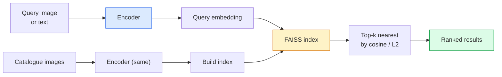

# Image Retrieval & Metric Learning

> retrieval system は embedding space 内の distance で candidates を rank します。Metric learning は、その distance が意図した意味を持つように space を形作る discipline です。

**種別:** 構築
**言語:** Python
**前提条件:** Phase 4 Lesson 14 (ViT), Phase 4 Lesson 18 (CLIP)
**所要時間:** 約45分

## Learning Objectives

- triplet、contrastive、proxy-based metric learning losses を説明し、dataset に適したものを選ぶ
- L2-normalisation と cosine similarity を正しく実装し、「same item」と「same class」retrieval の違いを audit する
- FAISS index を構築し、text と image で query し、held-out query set の recall@K を報告する
- DINOv2、CLIP、SigLIP を off-the-shelf embedding backbones として使い、それぞれが勝つ場面を知る

## 問題

Retrieval は production vision の至る所にあります。duplicate detection、reverse image search、visual search ("find similar products")、face re-identification、surveillance 向け person re-ID、e-commerce 向け instance-level matching。product question は常に同じです。「この query image が与えられたら、catalogue を rank せよ」。

system 全体を形作る設計判断は2つです。vectors を生成する model である embedding。scale して nearest neighbours を見つける index。2026 年にはどちらも commodity です (embedding は DINOv2、index は FAISS)。そのため基準は上がります。難しい部分は、application において *何を similar と見なすか* を定義し、その定義に distances が合うよう embedding space を形作ることです。

その shaping が metric learning です。小さいですが leverage の高い discipline です。

## The Concept

### Retrieval at a glance



### The four loss families

| Loss | Requires | Pros | Cons |
|------|----------|------|------|
| **Contrastive** | (anchor, positive) + negatives | 単純で、任意の pair label で機能する | 多数の negatives がないと収束が遅い |
| **Triplet** | (anchor, positive, negative) | 直感的で、margin を直接制御できる | Hard-triplet mining が高価 |
| **NT-Xent / InfoNCE** | Pairs + batch-mined negatives | large batches に scale する | big batch または momentum queue が必要 |
| **Proxy-based (ProxyNCA)** | Class labels only | 高速で安定し、mining 不要 | small datasets では proxies に overfit し得る |

ほとんどの production use cases では pretrained backbone から始め、off-the-shelf embeddings が test set で不足する場合にのみ metric-learning fine-tune を追加します。

### Triplet loss formally

```
L = max(0, ||f(a) - f(p)||^2 - ||f(a) - f(n)||^2 + margin)
```

anchor `a` を positive `p` に近づけ、negative `n` から遠ざけます。`margin` が gap を保証します。3-image structure は任意の similarity ordering に一般化できます。

Mining が重要です。easy triplets (`n` がすでに `a` から遠い) は zero loss です。network に教えるのは hard triplets だけです。Semi-hard mining (`n` は `p` より遠いが margin 内) は 2016 年の FaceNet recipe であり、今でも主流です。

### Cosine similarity vs L2

2つの metrics、2つの conventions があります。

- **Cosine**: vectors 間の角度。L2-normalised embeddings が必要です。
- **L2**: Euclidean distance。raw または normalised embeddings で機能しますが、通常は L2-normalised + squared L2 と組み合わせます。

現代的な nets のほとんどでは、この2つは等価です。`||a - b||^2 = 2 - 2 cos(a, b)` は `||a|| = ||b|| = 1` のとき成り立ちます。embedding training と一致する convention を選んでください。混ぜると「nearest」の意味が静かに変わります。

### Recall@K

標準的な retrieval metric です。

```
recall@K = fraction of queries where at least one correct match is in the top K results
```

recall@1、@5、@10 を並べて報告します。recall@10 が 0.95 を超え、recall@1 が 0.5 未満なら、embedding space は正しい構造を持っていますが ranking が noisy です。longer fine-tunes または re-ranking step を試してください。

duplicate detection では、false positive がすべて user-visible mistake になるため precision@K の方が重要です。visual search では recall@K が product signal です。

### FAISS in one paragraph

Facebook AI Similarity Search。nearest-neighbour search の de-facto library です。3つの index choices があります。

- `IndexFlatIP` / `IndexFlatL2` — brute force、exact、training 不要。~1M vectors まで使う。
- `IndexIVFFlat` — K 個の cells に分割し、最も近い少数の cells だけを search する。approximate、高速、training data が必要。
- `IndexHNSW` — graph-based。many queries で最速だが index size が大きい。

100k vectors では cosine similarity 上の `IndexFlatIP` で十分なことが多いです。10M では `IndexIVFFlat`。100M+ では product quantisation (`IndexIVFPQ`) と組み合わせます。

### Instance-level vs category-level retrieval

同じ名前でも2つの大きく異なる問題です。

- **Category-level** — 「catalogue 内の cats を見つける」。Class-conditional similarity。off-the-shelf CLIP / DINOv2 embeddings がよく機能します。
- **Instance-level** — 「catalogue 内の *この exact product* を見つける」。同じ class の visually similar objects を fine-grained に識別する必要があります。off-the-shelf embeddings は不足しやすく、metric learning による fine-tuning が重要です。

model を選ぶ前に、どちらを解いているか必ず確認してください。

## 実装

### Step 1: Triplet loss

```python
import torch
import torch.nn.functional as F

def triplet_loss(anchor, positive, negative, margin=0.2):
    d_ap = F.pairwise_distance(anchor, positive, p=2)
    d_an = F.pairwise_distance(anchor, negative, p=2)
    return F.relu(d_ap - d_an + margin).mean()
```

1行です。L2-normalised または raw embeddings のどちらでも機能します。

### Step 2: Semi-hard mining

embeddings と labels の batch が与えられたら、各 anchor に対して最も hard な semi-hard negative を見つけます。

```python
def semi_hard_negatives(emb, labels, margin=0.2):
    dist = torch.cdist(emb, emb)
    same_class = labels[:, None] == labels[None, :]
    diff_class = ~same_class
    N = emb.size(0)

    positives = dist.clone()
    positives[~same_class] = float("-inf")
    positives.fill_diagonal_(float("-inf"))
    pos_idx = positives.argmax(dim=1)

    semi_hard = dist.clone()
    semi_hard[same_class] = float("inf")
    d_ap = dist[torch.arange(N), pos_idx].unsqueeze(1)
    semi_hard[dist <= d_ap] = float("inf")
    neg_idx = semi_hard.argmin(dim=1)

    fallback_mask = semi_hard[torch.arange(N), neg_idx] == float("inf")
    if fallback_mask.any():
        hardest = dist.clone()
        hardest[same_class] = float("inf")
        neg_idx = torch.where(fallback_mask, hardest.argmin(dim=1), neg_idx)
    return pos_idx, neg_idx
```

各 anchor は in-class の hardest positive と、positive より遠いが margin 内にある semi-hard negative を得ます。

### Step 3: Recall@K

```python
def recall_at_k(query_emb, gallery_emb, query_labels, gallery_labels, k=1):
    sim = query_emb @ gallery_emb.T
    _, top_k = sim.topk(k, dim=-1)
    matches = (gallery_labels[top_k] == query_labels[:, None]).any(dim=-1)
    return matches.float().mean().item()
```

L2-normalised embeddings 上の inner product による top-k は cosine による top-k と等価です。少なくとも1つの correct neighbour を持つ queries の平均割合を報告します。

### Step 4: Putting it together

```python
import torch
import torch.nn as nn
from torch.optim import Adam

class Encoder(nn.Module):
    def __init__(self, in_dim=128, emb_dim=64):
        super().__init__()
        self.net = nn.Sequential(
            nn.Linear(in_dim, 128), nn.ReLU(),
            nn.Linear(128, emb_dim),
        )

    def forward(self, x):
        return F.normalize(self.net(x), dim=-1)

torch.manual_seed(0)
num_classes = 6
protos = F.normalize(torch.randn(num_classes, 128), dim=-1)

def sample_batch(bs=32):
    labels = torch.randint(0, num_classes, (bs,))
    x = protos[labels] + 0.15 * torch.randn(bs, 128)
    return x, labels

enc = Encoder()
opt = Adam(enc.parameters(), lr=3e-3)

for step in range(200):
    x, y = sample_batch(32)
    emb = enc(x)
    pos_idx, neg_idx = semi_hard_negatives(emb, y)
    loss = triplet_loss(emb, emb[pos_idx], emb[neg_idx])
    opt.zero_grad(); loss.backward(); opt.step()
```

数百 steps 後には、embedding clusters が class ごとに1つ形成されます。

## Use It

2026 年の production stacks:

- **DINOv2 + FAISS** — general-purpose visual retrieval。off-the-shelf で機能する。
- **CLIP + FAISS** — queries が text の場合。
- **Fine-tuned DINOv2 + FAISS** — instance-level retrieval、face re-ID、fashion、e-commerce。
- **Milvus / Weaviate / Qdrant** — FAISS または HNSW の managed vector DB wrappers。

SOTA instance retrieval の recipe は、DINOv2 backbone、embedding head を追加、instance-labelled pairs 上で triplet または InfoNCE loss により fine-tune、FAISS に index です。

## Ship It

この lesson は次を生成します。

- `outputs/prompt-retrieval-loss-picker.md` — retrieval problem に対して triplet / InfoNCE / ProxyNCA を選ぶ prompt。
- `outputs/skill-recall-at-k-runner.md` — train/val/gallery splits と適切な data contract を持つ recall@K evaluation harness を書く skill。

## Exercises

1. **(Easy)** 上の toy example を実行してください。training 前後の embeddings を PCA で plot し、6つの clusters が形成される様子を確認してください。
2. **(Medium)** ProxyNCA loss implementation を追加してください。class ごとに1つの learned "proxy" を置き、cosine similarity 上の standard cross-entropy を使います。toy data で triplet loss と convergence speed を比較してください。
3. **(Hard)** 1,000 枚の ImageNet validation images を取り、HuggingFace 経由の DINOv2 で embed し、FAISS flat index を構築し、同じ images を queries とする場合 (1.0 になるはず) と ImageNet labels を ground truth とする held-out split の場合について recall@{1, 5, 10} を報告してください。

## Key Terms

| Term | What people say | What it actually means |
|------|----------------|----------------------|
| Metric learning | 「Shape the space」 | encoder の output space における distances が target similarity を反映するよう学習すること |
| Triplet loss | 「Pull and push」 | L = max(0, d(a, p) - d(a, n) + margin)。canonical metric-learning loss |
| Semi-hard mining | 「Useful negatives」 | positive より anchor から遠いが margin 内にある negatives。経験的に最も informative |
| Proxy-based loss | 「Class prototypes」 | class ごとに1つの learned proxy。similarity-to-proxies 上の cross-entropy。pair mining は不要 |
| Recall@K | 「Top-K hit rate」 | top K 内に少なくとも1つ correct result がある queries の割合 |
| Instance retrieval | 「Find this exact thing」 | fine-grained matching。off-the-shelf features は通常不足する |
| FAISS | 「The NN library」 | Facebook の nearest-neighbour library。exact と approximate indexes をサポートする |
| HNSW | 「Graph index」 | Hierarchical navigable small world。小さな memory overhead で高速な approximate NN |

## 参考文献

- [FaceNet: A Unified Embedding for Face Recognition (Schroff et al., 2015)](https://arxiv.org/abs/1503.03832) — triplet loss / semi-hard mining paper
- [In Defense of the Triplet Loss for Person Re-Identification (Hermans et al., 2017)](https://arxiv.org/abs/1703.07737) — triplet fine-tuning の practical guide
- [FAISS documentation](https://github.com/facebookresearch/faiss/wiki) — every index, every trade-off
- [SMoT: Metric Learning Taxonomy (Kim et al., 2021)](https://arxiv.org/abs/2010.06927) — modern losses とその connections の survey
