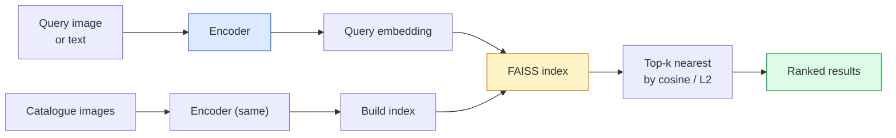

# Görüntü Alma ve Metrik Öğrenme

> Bir geri alma sistemi, adayları embedding alanındaki mesafeye göre sıralar. Metrik öğrenme, mesafelerin istediğiniz anlamına gelmesi için o alanı şekillendirme disiplinidir.

**Tür:** Yapım
**Diller:** Python
**Önkoşullar:** Aşama 4 Ders 14 (ViT), Aşama 4 Ders 18 (CLIP)
**Süre:** ~45 dakika

## Öğrenme Hedefleri

- Üçlü, karşılaştırmalı ve proxy tabanlı metrik öğrenme kayıplarını açıklayın ve belirli bir dataset için doğru olanı seçin
- L2 normalizasyonunu ve kosinüs benzerliğini doğru şekilde uygulayın ve "aynı öğe" ile "aynı sınıf" alımı arasındaki farkı denetleyin
- Bir FAISS dizini oluşturun, bunu metin ve görüntüye göre sorgulayın ve uzun süren bir sorgu kümesi için geri çağırma@K'yi raporlayın
- DINOv2, CLIP ve SigLIP'i kullanıma hazır embedding omurgaları olarak kullanın ve her birinin ne zaman kazanacağını bilin

## Sorun

Erişim, üretim vizyonunun her yerindedir: kopya tespiti, tersine görsel arama, görsel arama ("benzer ürünleri bulma"), yüzün yeniden tanımlanması, gözetim için kişinin yeniden kimliği, e-ticaret için örnek düzeyinde eşleştirme. Ürün sorusu her zaman aynıdır: "Bu sorgu görseline göre kataloğumu sıralayın."

İki tasarım kararı tüm sistemi şekillendirir. embedding — vektörleri hangi model üretir? Endeks — en yakın komşuların geniş ölçekte nasıl bulunacağı. Her ikisi de 2026'da emtiadır (embedding için DINOv2, indeks için FAISS), bu da çıtayı yükseltir: Zor kısım, uygulamanız için *neyin benzer sayıldığını* tanımlamak, ardından embedding alanını mesafeler eşleşecek şekilde şekillendirmektir.

Bu şekillendirme metrik öğrenmedir. Küçük ama etkisi yüksek bir disiplindir.

## Konsept

### Bir bakışta erişim



### Dört kayıp ailesi

| Kayıp | Gerektirir | Artıları | Eksileri |
|------|----------|------|------|
| **Karşılaştırmalı** | (çapa, pozitif) + negatifler | Basittir, herhangi bir etiket çiftiyle çalışır | Çok fazla olumsuzluk olmadan yakınsama yavaş |
| **Üçlü** | (çapa, pozitif, negatif) | Sezgisel; doğrudan marj kontrolü | Sabit üçlü madencilik pahalıdır |
| **NT-Xent / InfoNCE** | Çiftler + toplu olarak çıkarılan negatifler | Büyük partilere ölçeklenir | Büyük parti veya momentum kuyruğuna ihtiyaç var |
| **Proxy tabanlı (ProxyNCA)** | Yalnızca sınıf etiketleri | Hızlı, istikrarlı, madencilik yok | Küçük dataset'lerdeki proxy'lere fazla uyum sağlayabilir |

Çoğu üretim kullanım durumu için, önceden eğitilmiş bir omurgayla başlayın ve yalnızca kullanıma hazır embedding'lerin test setinizde düşük performans göstermesi durumunda bir metrik öğrenme ince ayarı ekleyin.

### Üçlü kayıp resmi olarak

```
L = max(0, ||f(a) - f(p)||^2 - ||f(a) - f(n)||^2 + margin)
```

Boşluk sağlayan bir `margin` ile `a` çapasını pozitif `p`'nin yakınına çekin, negatif `n`'den uzağa itin. Üç görüntülü yapı herhangi bir benzerlik sıralamasına genellenir.

Madencilik önemlidir: kolay üçüzler (`n` zaten `a`'den uzaktadır) sıfır kayba katkıda bulunur; yalnızca sabit üçlüler ağa öğretir. Yarı sert madencilik (`n`, `p`'den daha ileride ancak marj dahilinde) 2016 FaceNet tarifidir ve hala hakimdir.

### L2'ye karşı kosinüs benzerliği

İki ölçüm, iki kural:

- **Kosinüs**: vektörler arasındaki açı. L2-normalize edilmiş embedding'ler gerektirir.
- **L2**: Öklid mesafesi. Ham veya normalleştirilmiş embedding'ler üzerinde çalışır, ancak genellikle L2-normalleştirilmiş + kare L2 ile eşleştirilir.

Çoğu modern ağ için ikisi eşdeğerdir: `||a - b||^2 = 2 - 2 cos(a, b)`, `||a|| = ||b|| = 1`. embedding eğitiminize uygun düzeni seçin; bunları sessizce karıştırmak "en yakın"ın anlamını değiştirir.

### Geri Çağırma@K

Standart alma metriği:

```
recall@K = fraction of queries where at least one correct match is in the top K results
```

Geri çağırma@1, @5, @10'u yan yana bildirin. Geri çağırma@10'un 0,95'in üzerinde olması ve geri çağırma@1'in 0,5'in altında olması, embedding alanının doğru yapıya sahip olduğu ancak sıralamanın gürültülü olduğu anlamına gelir; daha uzun ince ayarlar yapmayı veya yeniden sıralama adımını deneyin.

Tekrar tespiti için, her hatalı pozitif kullanıcı tarafından görülebilen bir hata olduğundan, Precision@K daha önemlidir. Görsel arama için, geri çağırma@K ürün sinyalidir.

### FAISS tek paragrafta

Facebook AI Benzerlik Araması. En yakın komşu araması için fiili kütüphane. Üç endeks seçeneği:

- `IndexFlatIP` / `IndexFlatL2` — kaba kuvvet, kesin, eğitim yok. ~1 milyona kadar vektör kullanın.
- `IndexIVFFlat` — K hücrelerine bölün, yalnızca en yakın birkaç hücreyi arayın. Yaklaşık, hızlı, eğitim verilerine ihtiyaç var.
- `IndexHNSW` — grafik tabanlı, birçok sorgu için en hızlı, büyük dizin boyutu.

100k vektörler için muhtemelen kosinüs benzerliğinde `IndexFlatIP`'yi istersiniz. 10 milyon için `IndexIVFFlat`'yi istiyorsunuz. 100M+ için ürün nicemleme (`IndexIVFPQ`) ile birleştirilmiştir.

### Örnek düzeyinde ve kategori düzeyinde alma karşılaştırması

Aynı isimde iki farklı problem:

- **Kategori düzeyinde** — "kataloğumda kedileri bul." Sınıf koşullu benzerlik; kullanıma hazır CLIP / DINOv2 embedding'ler iyi çalışıyor.
- **Örnek düzeyi** — "kataloğumda *tam olarak bu ürünü* bul." Aynı sınıftaki görsel olarak benzer nesneler arasında ince taneli ayrım yapılması gerekir; kullanıma hazır embedding'ler düşük performans gösteriyor; Metrik öğrenmeyle ilgili fine-tuning önemlidir.

Bir model seçmeden önce daima hangisini çözdüğünüzü sorun.

## İnşa Et

### Adım 1: Üçlü kayıp

```python
import torch
import torch.nn.functional as F

def triplet_loss(anchor, positive, negative, margin=0.2):
    d_ap = F.pairwise_distance(anchor, positive, p=2)
    d_an = F.pairwise_distance(anchor, negative, p=2)
    return F.relu(d_ap - d_an + margin).mean()
```

Bir satır. L2-normalize edilmiş veya ham embedding'ler üzerinde çalışır.

### Adım 2: Yarı sert madencilik

Bir grup embedding ve etiket verildiğinde, her bir bağlantı için en sert yarı sert negatifi bulun.

```python
def semi_hard_negatives(emb, labels, margin=0.2):
    dist = torch.cdist(emb, emb)
    same_class = labels[:, None] == labels[None, :]
    diff_class = ~same_class
    N = emb.size(0)

    positives = dist.clone()
    positives[~same_class] = float("-inf")
    positives.fill_diagonal_(float("-inf"))
    pos_idx = positives.argmax(dim=1)

    semi_hard = dist.clone()
    semi_hard[same_class] = float("inf")
    d_ap = dist[torch.arange(N), pos_idx].unsqueeze(1)
    semi_hard[dist <= d_ap] = float("inf")
    neg_idx = semi_hard.argmin(dim=1)

    fallback_mask = semi_hard[torch.arange(N), neg_idx] == float("inf")
    if fallback_mask.any():
        hardest = dist.clone()
        hardest[same_class] = float("inf")
        neg_idx = torch.where(fallback_mask, hardest.argmin(dim=1), neg_idx)
    return pos_idx, neg_idx
```

Her çapa, sınıftaki en sert pozitifi ve pozitifin ötesinde ancak marj dahilinde yarı sert bir negatifi alır.

### 3. Adım: Geri Çağırma@K

```python
def recall_at_k(query_emb, gallery_emb, query_labels, gallery_labels, k=1):
    sim = query_emb @ gallery_emb.T
    _, top_k = sim.topk(k, dim=-1)
    matches = (gallery_labels[top_k] == query_labels[:, None]).any(dim=-1)
    return matches.float().mean().item()
```

L2-normalize edilmiş embedding'lerde iç çarpıma göre üst k, kosinüse göre üst k'ye eşittir. En az bir doğru komşuyla yapılan sorguların ortalama oranını bildirin.

### Adım 4: Bir araya getirme

```python
import torch
import torch.nn as nn
from torch.optim import Adam

class Encoder(nn.Module):
    def __init__(self, in_dim=128, emb_dim=64):
        super().__init__()
        self.net = nn.Sequential(
            nn.Linear(in_dim, 128), nn.ReLU(),
            nn.Linear(128, emb_dim),
        )

    def forward(self, x):
        return F.normalize(self.net(x), dim=-1)

torch.manual_seed(0)
num_classes = 6
protos = F.normalize(torch.randn(num_classes, 128), dim=-1)

def sample_batch(bs=32):
    labels = torch.randint(0, num_classes, (bs,))
    x = protos[labels] + 0.15 * torch.randn(bs, 128)
    return x, labels

enc = Encoder()
opt = Adam(enc.parameters(), lr=3e-3)

for step in range(200):
    x, y = sample_batch(32)
    emb = enc(x)
    pos_idx, neg_idx = semi_hard_negatives(emb, y)
    loss = triplet_loss(emb, emb[pos_idx], emb[neg_idx])
    opt.zero_grad(); loss.backward(); opt.step()
```

Birkaç yüz adımdan sonra embedding kümeleri sınıf başına bir küme oluşturur.

## Kullan onu

2026'daki üretim yığınları:

- **DINOv2 + FAISS** — genel amaçlı görsel erişim. Kullanıma hazır çalışır.
- **CLIP + FAISS** — sorgular metin olduğunda.
- **İnce ayarlı DINOv2 + FAISS** — örnek düzeyinde erişim, yüz yeniden kimliği, moda, e-ticaret.
- **Milvus / Weaviate / Qdrant** — FAISS veya HNSW etrafında yönetilen vektör veritabanı sarmalayıcıları.

SOTA örneğinin alınması için tarif şu şekildedir: DINOv2 omurgası, bir embedding kafası ekleyin, örnek etiketli çiftlerde üçlü veya InfoNCE kaybıyla ince ayar yapın, FAISS'ta dizinleyin.

## Gönderin

Bu ders şunları üretir:

- `outputs/prompt-retrieval-loss-picker.md` — belirli bir geri alma sorunu için üçlü / InfoNCE / ProxyNCA'yı seçen bir prompt.
- `outputs/skill-recall-at-k-runner.md` — recall@K için tren/val/galeri bölümleri ve uygun veri sözleşmesiyle temiz bir değerlendirme sistemi yazan bir beceri.

## Egzersizler

1. **(Kolay)** Yukarıdaki oyuncak örneğini çalıştırın. Altı kümenin formunu görmek için embedding'leri eğitimden önce ve sonra PCA ile çizin.
2. **(Orta)** Bir ProxyNCA kaybı uygulaması ekleyin: sınıf başına bir öğrenilmiş "proxy", kosinüs benzerliğine ilişkin standart çapraz entropi. Oyuncak verilerindeki yakınsama hızı ile üçlü kaybı karşılaştırın.
3. **(Zor)** 1.000 ImageNet doğrulama görüntüsü alın, HuggingFace aracılığıyla DINOv2'ye yerleştirin, bir FAISS düz dizini oluşturun ve sorgularla aynı görüntülere (1,0 olmalıdır) ve temel gerçek olarak ImageNet etiketleriyle uzatılmış bir bölünmeye karşı geri çağırma@{1, 5, 10}'yi raporlayın.

## Anahtar Terimler

| Dönem | İnsanlar ne diyor | Aslında ne anlama geliyor |
|------|----------------|----------------------|
| Metrik öğrenme | "Alanı şekillendirin" | Kodlayıcıyı, çıkış alanındaki mesafelerin hedef benzerliğini yansıtacak şekilde eğitilmesi |
| Üçlü kayıp | "Çek ve it" | L = maks(0, d(a, p) - d(a, n) + kenar boşluğu); kanonik metrik öğrenme kaybı |
| Yarı sert madencilik | "Yararlı negatifler" | Negatifler çapadan pozitife göre daha uzakta ancak marj dahilinde; ampirik olarak en bilgilendirici |
| Proxy tabanlı kayıp | "Sınıf prototipleri" | Sınıf başına bir öğrenilmiş vekil; vekillere benzerlik üzerinden çapraz entropi; çift ​​madencilik yok |
| Geri Çağırma@K | "En yüksek K isabet oranı" | En üstte en az bir doğru sonucu olan sorguların oranı K |
| Örnek alma | "Tam olarak bu şeyi bulun" | İnce taneli eşleştirme; kullanıma hazır özellikler genellikle düşük performans gösteriyor |
| FAISS | "NN kütüphanesi" | Facebook'un en yakın komşu kütüphanesi; kesin ve yaklaşık indeksleri destekler |
| HNSW | "Grafik dizini" | Hiyerarşik gezilebilir küçük dünya; küçük bellek yüküyle hızlı yaklaşık NN |

## Daha Fazla Okuma

- [FaceNet: Yüz Tanıma için Birleşik Embedding (Schroff ve diğerleri, 2015)](https://arxiv.org/abs/1503.03832) — üçlü kayıp / yarı sert madencilik kağıdı
- [Kişinin Yeniden Tanımlanması için Üçlü Kaybın Savunmasında (Hermans ve diğerleri, 2017)](https://arxiv.org/abs/1703.07737) — üçlü fine-tuning için pratik kılavuz
- [FAISS belgeleri](https://github.com/facebookresearch/faiss/wiki) — her endeks, her takas
- [SMoT: Metrik Öğrenme Taksonomisi (Kim ve diğerleri, 2021)](https://arxiv.org/abs/2010.06927) — modern kayıplar ve bunların bağlantılarının incelenmesi
