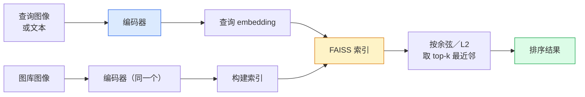

# 图像检索与度量学习（Image Retrieval & Metric Learning）

> 译注：本文译自同目录 [`en.md`](./en.md)。术语遵循仓根 [TRANSLATION_GUIDE.md](../../../../TRANSLATION_GUIDE.md)。

> 检索系统按 embedding（向量表示）空间里的距离对候选项排序。度量学习就是塑造这个空间，让距离真的代表你想要的含义。

**Type:** Build
**Languages:** Python
**Prerequisites:** Phase 4 Lesson 14 (ViT), Phase 4 Lesson 18 (CLIP)
**Time:** ~45 minutes

## 学习目标（Learning Objectives）

- 解释 triplet、contrastive、proxy-based 这几类度量学习损失，并能针对给定数据集挑出合适的那一种
- 正确实现 L2 归一化和余弦相似度，并审视「同一物品」与「同一类别」检索之间的差别
- 构建一个 FAISS 索引，分别用文本和图像查询，对一批留出的查询集报告 recall@K
- 把 DINOv2、CLIP、SigLIP 当作开箱即用的 embedding 主干，并知道每一个在什么场景下胜出

## 问题（The Problem）

检索在生产视觉里无处不在：去重、以图搜图、视觉搜索（「找相似商品」）、人脸再识别（face re-identification）、用于监控的 person re-ID、电商的实例级匹配。产品问题永远是同一个：「给定这张查询图，对我的目录排序」。

两个设计决策决定整个系统。一是 embedding —— 用什么模型生成向量；二是索引 —— 怎样在大规模下找最近邻。在 2026 年这两件事都已商品化（embedding 用 DINOv2，索引用 FAISS），这反而抬高了门槛：真正难的是为你的应用定义*什么算相似*，再把 embedding 空间塑造成距离与之吻合。

那种塑造就是度量学习。它是个小而高杠杆的学问。

## 概念（The Concept）

### 检索一图速览（Retrieval at a glance）



### 四大损失家族（The four loss families）

| Loss | 需要什么 | 优点 | 缺点 |
|------|----------|------|------|
| **Contrastive** | (anchor, positive) + 若干 negatives | 简单，对任何成对标签都适用 | 没有大量 negatives 时收敛慢 |
| **Triplet** | (anchor, positive, negative) | 直观；能直接控制 margin | hard-triplet 挖掘开销大 |
| **NT-Xent / InfoNCE** | 成对样本 + 在 batch 内挖掘 negatives | 能扩展到大 batch | 需要大 batch 或动量队列 |
| **Proxy-based (ProxyNCA)** | 仅类别标签 | 快、稳定、不用挖掘 | 小数据集上容易对 proxy 过拟合 |

对大多数生产场景，先用预训练主干，只有当开箱即用的 embedding 在你的测试集上表现不够时，才再加一个度量学习的微调。

### Triplet loss 形式化（Triplet loss formally）

```
L = max(0, ||f(a) - f(p)||^2 - ||f(a) - f(n)||^2 + margin)
```

把 anchor `a` 拉近正样本 `p`，把它推离负样本 `n`，用一个 `margin` 保证间隔。这种三图结构可以推广到任意相似度排序。

挖掘很重要：简单的 triplet（`n` 已经远离 `a`）贡献为零损失；只有 hard triplet 才教得动网络。Semi-hard 挖掘（`n` 比 `p` 更远但仍在 margin 内）是 2016 年 FaceNet 的配方，至今仍占主导。

### 余弦相似度 vs L2（Cosine similarity vs L2）

两种度量、两种约定：

- **Cosine**：向量间夹角。要求 embedding 经过 L2 归一化。
- **L2**：欧氏距离。可作用于原始或归一化的 embedding，但通常配合 L2 归一化 + 平方 L2 使用。

对大多数现代网络来说两者等价：当 `||a|| = ||b|| = 1` 时，`||a - b||^2 = 2 - 2 cos(a, b)`。挑一个和你 embedding 训练一致的约定；混用会悄悄改变「最近」的含义。

### Recall@K

检索的标准指标：

```
recall@K = fraction of queries where at least one correct match is in the top K results
```

把 recall@1、@5、@10 并排报告。recall@10 高于 0.95 而 recall@1 低于 0.5，说明 embedding 空间结构是对的，但排序有噪声 —— 试试更长的微调或加一个重排序步骤。

对去重而言 precision@K 更重要，因为每一个误报都是用户可见的失误。对视觉搜索，recall@K 才是产品信号。

### 一段话讲完 FAISS（FAISS in one paragraph）

Facebook AI Similarity Search。最近邻搜索的事实标准库。三种索引选择：

- `IndexFlatIP` / `IndexFlatL2` —— 暴力、精确、不用训练。最多用到 ~1M 向量。
- `IndexIVFFlat` —— 划分为 K 个 cell，只搜最近的几个 cell。近似、快、需要训练数据。
- `IndexHNSW` —— 基于图，多查询时最快，索引体积大。

对 10 万向量你大概想用 `IndexFlatIP` 配余弦相似度。1000 万就用 `IndexIVFFlat`。1 亿以上配合乘积量化（`IndexIVFPQ`）。

### 实例级 vs 类别级检索（Instance-level vs category-level retrieval）

同名却完全不同的两个问题：

- **类别级（Category-level）** —— 「在我的目录里找猫」。条件于类别的相似度；开箱即用的 CLIP / DINOv2 embedding 就能干得不错。
- **实例级（Instance-level）** —— 「在我的目录里找*这一件*商品」。需要在同类视觉相似物体之间做细粒度区分；开箱即用的 embedding 表现不足；用度量学习微调才有意义。

挑模型前先问清楚自己解决的是哪一个。

## 动手实现（Build It）

### 第 1 步：Triplet loss

```python
import torch
import torch.nn.functional as F

def triplet_loss(anchor, positive, negative, margin=0.2):
    d_ap = F.pairwise_distance(anchor, positive, p=2)
    d_an = F.pairwise_distance(anchor, negative, p=2)
    return F.relu(d_ap - d_an + margin).mean()
```

一行就够。L2 归一化和原始 embedding 都能用。

### 第 2 步：Semi-hard 挖掘（Semi-hard mining）

给定一个 batch 的 embedding 和标签，为每个 anchor 找出最难的 semi-hard 负样本。

```python
def semi_hard_negatives(emb, labels, margin=0.2):
    dist = torch.cdist(emb, emb)
    same_class = labels[:, None] == labels[None, :]
    diff_class = ~same_class
    N = emb.size(0)

    positives = dist.clone()
    positives[~same_class] = float("-inf")
    positives.fill_diagonal_(float("-inf"))
    pos_idx = positives.argmax(dim=1)

    semi_hard = dist.clone()
    semi_hard[same_class] = float("inf")
    d_ap = dist[torch.arange(N), pos_idx].unsqueeze(1)
    semi_hard[dist <= d_ap] = float("inf")
    neg_idx = semi_hard.argmin(dim=1)

    fallback_mask = semi_hard[torch.arange(N), neg_idx] == float("inf")
    if fallback_mask.any():
        hardest = dist.clone()
        hardest[same_class] = float("inf")
        neg_idx = torch.where(fallback_mask, hardest.argmin(dim=1), neg_idx)
    return pos_idx, neg_idx
```

每个 anchor 拿到同类内最难的正样本，以及一个比正样本更远但仍在 margin 内的 semi-hard 负样本。

### 第 3 步：Recall@K

```python
def recall_at_k(query_emb, gallery_emb, query_labels, gallery_labels, k=1):
    sim = query_emb @ gallery_emb.T
    _, top_k = sim.topk(k, dim=-1)
    matches = (gallery_labels[top_k] == query_labels[:, None]).any(dim=-1)
    return matches.float().mean().item()
```

在 L2 归一化 embedding 上按内积取 top-k，等价于按余弦取 top-k。报告至少有一个正确邻居的查询比例的均值。

### 第 4 步：把它串起来（Putting it together）

```python
import torch
import torch.nn as nn
from torch.optim import Adam

class Encoder(nn.Module):
    def __init__(self, in_dim=128, emb_dim=64):
        super().__init__()
        self.net = nn.Sequential(
            nn.Linear(in_dim, 128), nn.ReLU(),
            nn.Linear(128, emb_dim),
        )

    def forward(self, x):
        return F.normalize(self.net(x), dim=-1)

torch.manual_seed(0)
num_classes = 6
protos = F.normalize(torch.randn(num_classes, 128), dim=-1)

def sample_batch(bs=32):
    labels = torch.randint(0, num_classes, (bs,))
    x = protos[labels] + 0.15 * torch.randn(bs, 128)
    return x, labels

enc = Encoder()
opt = Adam(enc.parameters(), lr=3e-3)

for step in range(200):
    x, y = sample_batch(32)
    emb = enc(x)
    pos_idx, neg_idx = semi_hard_negatives(emb, y)
    loss = triplet_loss(emb, emb[pos_idx], emb[neg_idx])
    opt.zero_grad(); loss.backward(); opt.step()
```

跑几百步后，embedding 会按类形成一个聚类。

## 用起来（Use It）

2026 年的生产栈：

- **DINOv2 + FAISS** —— 通用视觉检索。开箱即用。
- **CLIP + FAISS** —— 查询是文本时用。
- **微调过的 DINOv2 + FAISS** —— 实例级检索、人脸 re-ID、时尚、电商。
- **Milvus / Weaviate / Qdrant** —— 包在 FAISS 或 HNSW 之上的托管向量数据库。

要做 SOTA 的实例检索，配方是：DINOv2 主干，加一个 embedding head，在带实例标签的成对数据上用 triplet 或 InfoNCE 损失微调，最后在 FAISS 里建索引。

## 上线部署（Ship It）

本课产出：

- `outputs/prompt-retrieval-loss-picker.md` —— 一个 prompt，针对给定的检索问题挑出 triplet / InfoNCE / ProxyNCA。
- `outputs/skill-recall-at-k-runner.md` —— 一个 skill，可以写出一份干净的 recall@K 评估骨架，包含 train/val/gallery 划分和恰当的数据契约。

## 练习（Exercises）

1. **（简单）** 跑上面那个 toy 例子。在训练前后用 PCA 把 embedding 画出来，观察六个聚类是怎么形成的。
2. **（中等）** 加一个 ProxyNCA 损失实现：每类一个学习得到的「proxy」，在余弦相似度上做标准的交叉熵。在 toy 数据上比较它与 triplet loss 的收敛速度。
3. **（困难）** 取 1,000 张 ImageNet 验证集图，用 HuggingFace 的 DINOv2 做 embedding，构建一个 FAISS flat 索引，分别报告 recall@{1, 5, 10}：以这些图自身作为查询（应当为 1.0），以及对一批留出的、用 ImageNet 标签作为 ground truth 的样本。

## 关键术语（Key Terms）

| Term | 大家怎么说 | 实际含义 |
|------|----------------|----------------------|
| Metric learning（度量学习） | 「塑造空间」 | 训练一个 encoder，让它输出空间里的距离反映目标相似度 |
| Triplet loss | 「拉近推远」 | L = max(0, d(a, p) - d(a, n) + margin)；度量学习的标志性损失 |
| Semi-hard mining | 「有用的负样本」 | 比正样本更远但仍在 margin 内的负样本；经验上信息量最高 |
| Proxy-based loss | 「类原型」 | 每类一个学习得到的 proxy；在「与 proxy 的相似度」上做交叉熵；不用挖掘成对样本 |
| Recall@K | 「Top-K 命中率」 | top K 中至少有一个正确结果的查询占比 |
| Instance retrieval（实例检索） | 「找这件确切的东西」 | 细粒度匹配；开箱即用的特征通常表现不足 |
| FAISS | 「那个 NN 库」 | Facebook 的最近邻库；支持精确和近似索引 |
| HNSW | 「图索引」 | Hierarchical navigable small world；内存开销小、近似 NN 很快 |

## 延伸阅读（Further Reading）

- [FaceNet: A Unified Embedding for Face Recognition (Schroff et al., 2015)](https://arxiv.org/abs/1503.03832) —— triplet loss / semi-hard 挖掘的原论文
- [In Defense of the Triplet Loss for Person Re-Identification (Hermans et al., 2017)](https://arxiv.org/abs/1703.07737) —— triplet 微调实操指南
- [FAISS documentation](https://github.com/facebookresearch/faiss/wiki) —— 每种索引、每种取舍
- [SMoT: Metric Learning Taxonomy (Kim et al., 2021)](https://arxiv.org/abs/2010.06927) —— 现代损失及其相互关系的综述
