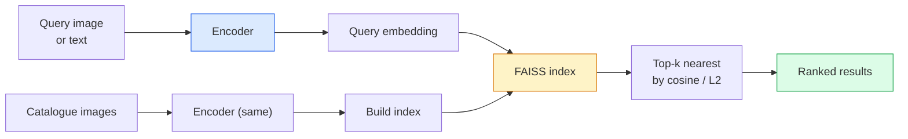

# 图像检索和度量学习

> 检索系统根据嵌入空间中的距离对候选者进行排名。指标学习是塑造空间的学科，以便距离意味着您想要的。

** 类型：** 构建
** 语言：** Python
** 先决条件：** 第4阶段第14课（ViT）、第4阶段第18课（CLIP）
** 时间：** ~45分钟

## 学习目标

- 解释三重、对比和基于代理的指标学习损失，并为给定数据集选择合适的
- Implement L2-normalisation and cosine similarity correctly and audit the difference between "same item" and "same class" retrieval
- 构建FAISS索引，通过文本和图像进行查询，并报告保留的查询集的recall@K
- 使用DINOv2、CLIP和SigLIP作为现成的嵌入主干，并了解它们何时获胜

## The Problem

检索在生产愿景中无处不在：重复检测、反向图像搜索、视觉搜索（“查找类似产品”）、面部重新识别、监控人员重新ID、电子商务的实例级匹配。产品问题始终相同：“给定此查询图像，对我的目录进行排名。"

两个设计决策塑造了整个系统。嵌入-什么模型产生向量。索引-如何在规模上找到最近的邻居。两者都是2026年的商品（DINOv 2用于嵌入，FAISS用于索引），这提高了标准：困难的部分是为您的应用程序定义 * 什么是相似的 *，然后塑造嵌入空间，以便距离匹配。

这种塑造就是指标学习。这是一个规模虽小但杠杆率高的学科。

## 概念

### 检索概览



### 四个损失家庭

| Loss | 需要 | 优点 | 缺点 |
|------|----------|------|------|
| ** 对比 ** | （锚，积极）+消极 | 简单，适用于任何配对标签 | 收敛缓慢，没有太多负面 |
| ** 三重 ** | （锚、正、负） | 直观;直接保证金控制 | 硬三重组采矿成本高昂 |
| **NT-Xent / InfoNCE** | Pairs + batch-mined negatives | 规模大批量 | 需要大批量或动量排队 |
| ** 基于代理（ProxyNCA）** | Class labels only | 快速、稳定、无需采矿 | 可以过度适合小数据集上的代理 |

对于大多数生产用例，请从预先训练的主干开始，只有在现成的嵌入在您的测试集中表现不佳时才添加指标学习微调。

### 三重正式失利

```
L = max(0, ||f(a) - f(p)||^2 - ||f(a) - f(n)||^2 + margin)
```

将锚点“a”拉近正“p”，将其推离负“n”，并留有确保间隙的“余量”。三图像结构推广到任何相似性排序。

采矿很重要：简单的三胞胎（' n '已经远离' a '）贡献零损失;只有硬的三胞胎才教网络。半硬采矿（' n '比' p '更远，但在利润范围内）是2016年FaceNet的食谱，并且仍然占主导地位。

### Cosine相似性与L2

两种指标，两种惯例：

- **Cosine**：两个方向之间的角度。需要L2规范化嵌入。
- **L2**：欧几里得距离。适用于原始或规范化嵌入，但通常与L2-规范化+平方L2配对。

对于大多数现代网来说，两者是等效的：'|| a - B|| ' 2 = 2 - 2 cos（a，b）'当'||一|| = ||B|| = 1 '。选择与您的嵌入训练相匹配的约定;将它们混合起来，默默地改变“最近”的含义。

### 召回@K

标准检索指标：

```
recall@K = fraction of queries where at least one correct match is in the top K results
```

并排报告回顾@1、@5、@10。recall@10高于0.95而recall@1低于0.5意味着嵌入空间具有正确的结构，但排名有噪音-尝试更长的微调或重新排名步骤。

对于重复检测，精度@K更重要，因为每个假阳性都是用户可见的错误。对于视觉搜索来说，召回@K是产品信号。

### 一段中的FAISS

Facebook人工智能相似性搜索。用于最近邻搜索的事实上的图书馆。三个指数选择：

- `IndexFlatIP` / `IndexFlatL2` — brute force, exact, no training. Use up to ~1M vectors.
- “IndexIVF Flat”-划分为K个细胞，仅搜索最近的少数细胞。大约、快速、需要训练数据。
- ' IndexHNSW '-基于图形，对许多查询最快，索引大小大。

对于10万个向量，你可能需要在余弦相似度上使用“IndexFlatIP”。对于10M，您需要“IndexIVFFlat”。对于100 M+，结合产品量化（“IndexIVFPQ”）。

### Instance-level vs category-level retrieval

两个同名完全不同的问题：

- ** 类别级 ** -“在我的目录中找到猫。“类条件相似性;现成的CLIP /DINOv 2嵌入效果良好。
- ** 实例级 ** -“在我的目录中找到 * 这个确切的产品 *。“需要对同类视觉相似的对象进行细粒度的区分;现成的嵌入表现不佳;使用指标学习进行微调很重要。

在选择模型之前，请务必询问您正在解决哪一个问题。

## 建设党

### 第1步：三重损失

```python
import torch
import torch.nn.functional as F

def triplet_loss(anchor, positive, negative, margin=0.2):
    d_ap = F.pairwise_distance(anchor, positive, p=2)
    d_an = F.pairwise_distance(anchor, negative, p=2)
    return F.relu(d_ap - d_an + margin).mean()
```

一行。适用于L2规范化或原始嵌入。

### 第2步：半硬采矿

给定一批嵌入和标签，为每个锚找到最难的半硬底片。

```python
def semi_hard_negatives(emb, labels, margin=0.2):
    dist = torch.cdist(emb, emb)
    same_class = labels[:, None] == labels[None, :]
    diff_class = ~same_class
    N = emb.size(0)

    positives = dist.clone()
    positives[~same_class] = float("-inf")
    positives.fill_diagonal_(float("-inf"))
    pos_idx = positives.argmax(dim=1)

    semi_hard = dist.clone()
    semi_hard[same_class] = float("inf")
    d_ap = dist[torch.arange(N), pos_idx].unsqueeze(1)
    semi_hard[dist <= d_ap] = float("inf")
    neg_idx = semi_hard.argmin(dim=1)

    fallback_mask = semi_hard[torch.arange(N), neg_idx] == float("inf")
    if fallback_mask.any():
        hardest = dist.clone()
        hardest[same_class] = float("inf")
        neg_idx = torch.where(fallback_mask, hardest.argmin(dim=1), neg_idx)
    return pos_idx, neg_idx
```

每个主播在课堂上都会得到最难的积极评价和比积极评价更远但在幅度内的半硬负面评价。

### 第3步：回忆@K

```python
def recall_at_k(query_emb, gallery_emb, query_labels, gallery_labels, k=1):
    sim = query_emb @ gallery_emb.T
    _, top_k = sim.topk(k, dim=-1)
    matches = (gallery_labels[top_k] == query_labels[:, None]).any(dim=-1)
    return matches.float().mean().item()
```

Top-k by inner product on L2-normalised embeddings equals top-k by cosine. Report the mean proportion of queries with at least one correct neighbour.

### 步骤4：把它们放在一起

```python
import torch
import torch.nn as nn
from torch.optim import Adam

class Encoder(nn.Module):
    def __init__(self, in_dim=128, emb_dim=64):
        super().__init__()
        self.net = nn.Sequential(
            nn.Linear(in_dim, 128), nn.ReLU(),
            nn.Linear(128, emb_dim),
        )

    def forward(self, x):
        return F.normalize(self.net(x), dim=-1)

torch.manual_seed(0)
num_classes = 6
protos = F.normalize(torch.randn(num_classes, 128), dim=-1)

def sample_batch(bs=32):
    labels = torch.randint(0, num_classes, (bs,))
    x = protos[labels] + 0.15 * torch.randn(bs, 128)
    return x, labels

enc = Encoder()
opt = Adam(enc.parameters(), lr=3e-3)

for step in range(200):
    x, y = sample_batch(32)
    emb = enc(x)
    pos_idx, neg_idx = semi_hard_negatives(emb, y)
    loss = triplet_loss(emb, emb[pos_idx], emb[neg_idx])
    opt.zero_grad(); loss.backward(); opt.step()
```

经过几百步后，嵌入集群形成每个类一个集群。

## Use It

2026年生产堆栈：

- ** DINOv 2 + FAISS** -通用视觉检索。现成的工作。
- **CLIP + FAISS** -当查询为文本时。
- ** 微调DINOv 2 + FAISS** -实例级检索、人脸重新ID、时尚、电子商务。
- **Milvus / Weaviate / Qdrant** -围绕FAISS或HNSW的托管载体DB包装器。

对于SOTA实例检索，秘诀是：DINOv2主干，添加嵌入头，在实例标记的对上使用三重组或InfoNSO损失进行微调，在FAISS中索引。

## 把它运

本课产生：

- '输出/prompt-retrieval-loss-picker.md '-一个提示，为给定的检索问题选择三体/InfoNSO/ ProxyNCA。
- '输出/skill-recall-at-k-runner.md '-一种技能，可以为recall@K编写干净的评估工具，具有train/val/gallery拆分和适当的数据合同。

## 演习

1. **（简单）** 运行上面的玩具示例。在训练前后使用PCA绘制嵌入，以查看六个集群的形成。
2. **（中）** 添加ProxyNCA损失实现：每个类一个学习的“代理”，基于cos相似性的标准交叉信息。比较玩具数据的收敛速度与三重损失。
3. **(Hard)** Take 1,000 ImageNet validation images, embed with DINOv2 via HuggingFace, build a FAISS flat index, and report recall@{1, 5, 10} against the same images as queries (should be 1.0) and against a held-out split with ImageNet labels as ground truth.

## 关键术语

| Term | 别人怎么说 | What it actually means |
|------|----------------|----------------------|
| 度量学习 | “塑造空间” | 训练编码器，使其输出空间中的距离反映目标相似性 |
| 三重损失 | “拉和推” | L = max（0，d（a，p）- d（a，n）+余量）;典型指标学习损失 |
| 半硬开采 | "Useful negatives" | 消极因素比积极因素离锚点更远，但在幅度内;经验上信息量最大 |
| 基于代理的损失 | “班级原型” | 每个类一个学习的代理;与代理相似性的交叉熵;没有配对挖掘 |
| 召回@K | “Top-K点击率” | 在前K个查询中至少有一个正确结果的查询比例 |
| 实例检索 | "Find this exact thing" | 细粒度匹配;现成功能通常表现不佳 |
| FAISS | "The NN library" | Facebook的最近邻居库;支持精确和大约的索引 |
| HNSW | “图表索引” | 分层可导航的小世界;快速逼近神经网络，内存占用较小 |

## 进一步阅读

- [FaceNet: A Unified Embedding for Face Recognition (Schroff et al., 2015)](https://arxiv.org/abs/1503.03832) — the triplet loss / semi-hard mining paper
- [In为人员重新识别的三重损失辩护（Hermans等人，2017）]（https：//arxiv.org/ab/1703.07737）-三重微调实用指南
- [FAISS文档]（https：//github.com/facebookresearch/faiss/wiki）-每个指数，每个权衡
- [SMoT：指标学习分类学（Kim等人，2021）]（https：//arxiv.org/ab/2010.06927）-现代损失及其联系调查
