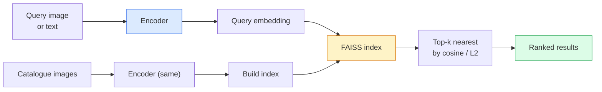

# 20 · 图像检索与度量学习

> 检索系统按嵌入空间中的距离对候选项排序。度量学习（metric learning）就是塑造这个空间、让距离表达出你想要的含义的学问。

**类型：** 实践
**语言：** Python
**前置：** 第 4 阶段第 14 课（ViT），第 4 阶段第 18 课（CLIP）
**时长：** 约 45 分钟

## 学习目标

- 解释三元组（triplet）、对比（contrastive）以及基于代理（proxy-based）的度量学习损失，并为给定数据集选出合适的那一种
- 正确实现 L2 归一化与余弦相似度，并审视「同一物体」与「同一类别」检索之间的差异
- 构建 FAISS 索引，按文本和按图像查询，并对一个留出查询集报告 recall@K
- 把 DINOv2、CLIP 和 SigLIP 当作开箱即用的嵌入骨干网络使用，并知道各自的优势场景

## 问题所在

检索在生产环境的视觉系统中无处不在：去重检测、反向图像搜索、视觉搜索（「找出相似商品」）、人脸重识别（re-identification）、用于监控的行人重识别（re-ID）、面向电商的实例级匹配。产品层面的问题始终如一：「给定这张查询图像，对我的目录进行排序。」

两项设计决策塑造了整个系统。其一是嵌入（embedding）——由哪个模型产出向量。其二是索引（index）——如何在规模化场景下找到最近邻。到 2026 年这两者都已成为通用部件（嵌入用 DINOv2，索引用 FAISS），这反而抬高了门槛：真正困难的是为你的应用定义「什么才算相似」，然后塑造嵌入空间，使距离与之匹配。

那种塑造就是度量学习。它是一门小而高杠杆的学问。

## 核心概念

### 检索速览



### 四大损失家族

| 损失 | 需要 | 优点 | 缺点 |
|------|----------|------|------|
| **对比损失（Contrastive）** | （锚点，正样本）+ 负样本 | 简单，可用于任何成对标签 | 没有大量负样本时收敛慢 |
| **三元组损失（Triplet）** | （锚点，正样本，负样本） | 直观；可直接控制间隔 | 难三元组挖掘代价高 |
| **NT-Xent / InfoNCE** | 成对样本 + 批内挖掘的负样本 | 可扩展到大批量 | 需要大批量或动量队列 |
| **基于代理（ProxyNCA）** | 仅需类别标签 | 快速、稳定、无需挖掘 | 在小数据集上可能对代理过拟合 |

对于大多数生产用例，先从预训练骨干网络起步，只有当开箱即用的嵌入在你的测试集上表现不佳时，才追加度量学习微调。

### 三元组损失的形式化定义

```
L = max(0, ||f(a) - f(p)||^2 - ||f(a) - f(n)||^2 + margin)
```

把锚点 `a` 拉近正样本 `p`，把它推离负样本 `n`，并用一个 `margin` 来保证两者之间存在间隔。这种三图结构可推广到任意相似度排序。

挖掘很关键：简单三元组（`n` 本就远离 `a`）贡献的损失为零；只有难三元组才能教会网络。半难挖掘（semi-hard mining，即 `n` 比 `p` 远但仍在 margin 之内）是 2016 年 FaceNet 的配方，至今仍占主导地位。

### 余弦相似度 vs L2

两种度量，两套约定：

- **余弦（Cosine）**：向量之间的夹角。需要 L2 归一化的嵌入。
- **L2**：欧几里得距离。既可作用于原始嵌入也可作用于归一化嵌入，但通常与 L2 归一化 + 平方 L2 配套使用。

对大多数现代网络而言，两者等价：当 `||a|| = ||b|| = 1` 时，`||a - b||^2 = 2 - 2 cos(a, b)`。选用与你的嵌入训练相匹配的约定；二者混用会悄无声息地改变「最近」的含义。

### Recall@K

标准的检索指标：

```
recall@K = fraction of queries where at least one correct match is in the top K results
```

把 recall@1、@5、@10 并排报告。recall@10 高于 0.95 而 recall@1 低于 0.5，意味着嵌入空间结构正确但排序有噪声——可尝试更长的微调或加一个重排序（re-ranking）步骤。

对于去重检测，precision@K 更重要，因为每一个假阳性都是用户可见的错误。对于视觉搜索，recall@K 才是产品信号。

### 一段话讲清 FAISS

Facebook AI Similarity Search（脸书 AI 相似度搜索）。最近邻搜索事实上的标准库。三种索引选择：

- `IndexFlatIP` / `IndexFlatL2` —— 暴力、精确、无需训练。适用于至多约 100 万向量。
- `IndexIVFFlat` —— 划分为 K 个单元格，只搜索最近的少数几个单元格。近似、快速、需要训练数据。
- `IndexHNSW` —— 基于图，在大量查询下最快，但索引体积大。

对于 10 万向量，你大概会想用基于余弦相似度的 `IndexFlatIP`。对于 1000 万向量，你会想用 `IndexIVFFlat`。对于 1 亿以上则结合乘积量化（`IndexIVFPQ`）。

### 实例级 vs 类别级检索

两个名字相近却截然不同的问题：

- **类别级（Category-level）** —— 「在我的目录里找出猫。」按类别条件化的相似度；开箱即用的 CLIP / DINOv2 嵌入即可胜任。
- **实例级（Instance-level）** —— 「在我的目录里找出*正是这一件商品*。」需要在同类视觉相似物体之间做细粒度区分；开箱即用的嵌入表现不佳；用度量学习微调至关重要。

在选型之前，永远先问清楚你要解决的是哪一个。

## 动手构建

### 第 1 步：三元组损失

```python
import torch
import torch.nn.functional as F

def triplet_loss(anchor, positive, negative, margin=0.2):
    d_ap = F.pairwise_distance(anchor, positive, p=2)
    d_an = F.pairwise_distance(anchor, negative, p=2)
    return F.relu(d_ap - d_an + margin).mean()
```

一行代码。对 L2 归一化或原始嵌入都适用。

### 第 2 步：半难挖掘

给定一个批次的嵌入和标签，为每个锚点找出最难的半难负样本。

```python
def semi_hard_negatives(emb, labels, margin=0.2):
    dist = torch.cdist(emb, emb)
    same_class = labels[:, None] == labels[None, :]
    diff_class = ~same_class
    N = emb.size(0)

    positives = dist.clone()
    positives[~same_class] = float("-inf")
    positives.fill_diagonal_(float("-inf"))
    pos_idx = positives.argmax(dim=1)

    semi_hard = dist.clone()
    semi_hard[same_class] = float("inf")
    d_ap = dist[torch.arange(N), pos_idx].unsqueeze(1)
    semi_hard[dist <= d_ap] = float("inf")
    neg_idx = semi_hard.argmin(dim=1)

    fallback_mask = semi_hard[torch.arange(N), neg_idx] == float("inf")
    if fallback_mask.any():
        hardest = dist.clone()
        hardest[same_class] = float("inf")
        neg_idx = torch.where(fallback_mask, hardest.argmin(dim=1), neg_idx)
    return pos_idx, neg_idx
```

每个锚点会拿到同类中最难的正样本，以及一个比正样本更远但仍在 margin 之内的半难负样本。

### 第 3 步：Recall@K

```python
def recall_at_k(query_emb, gallery_emb, query_labels, gallery_labels, k=1):
    sim = query_emb @ gallery_emb.T
    _, top_k = sim.topk(k, dim=-1)
    matches = (gallery_labels[top_k] == query_labels[:, None]).any(dim=-1)
    return matches.float().mean().item()
```

在 L2 归一化的嵌入上按内积取 top-k，等价于按余弦取 top-k。报告至少含一个正确邻居的查询所占的平均比例。

### 第 4 步：组装起来

```python
import torch
import torch.nn as nn
from torch.optim import Adam

class Encoder(nn.Module):
    def __init__(self, in_dim=128, emb_dim=64):
        super().__init__()
        self.net = nn.Sequential(
            nn.Linear(in_dim, 128), nn.ReLU(),
            nn.Linear(128, emb_dim),
        )

    def forward(self, x):
        return F.normalize(self.net(x), dim=-1)

torch.manual_seed(0)
num_classes = 6
protos = F.normalize(torch.randn(num_classes, 128), dim=-1)

def sample_batch(bs=32):
    labels = torch.randint(0, num_classes, (bs,))
    x = protos[labels] + 0.15 * torch.randn(bs, 128)
    return x, labels

enc = Encoder()
opt = Adam(enc.parameters(), lr=3e-3)

for step in range(200):
    x, y = sample_batch(32)
    emb = enc(x)
    pos_idx, neg_idx = semi_hard_negatives(emb, y)
    loss = triplet_loss(emb, emb[pos_idx], emb[neg_idx])
    opt.zero_grad(); loss.backward(); opt.step()
```

几百步之后，嵌入聚类会形成每个类别一个簇。

## 投入使用

2026 年的生产技术栈：

- **DINOv2 + FAISS** —— 通用视觉检索。开箱即用。
- **CLIP + FAISS** —— 当查询是文本时。
- **微调后的 DINOv2 + FAISS** —— 实例级检索、人脸重识别、时尚、电商。
- **Milvus / Weaviate / Qdrant** —— 围绕 FAISS 或 HNSW 的托管式向量数据库封装。

对于业界领先（SOTA）的实例检索，配方是：以 DINOv2 为骨干，加上一个嵌入头，在实例标注的成对样本上用三元组或 InfoNCE 损失微调，并在 FAISS 中建立索引。

## 交付成果

本课产出：

- `outputs/prompt-retrieval-loss-picker.md` —— 一段提示词，为给定的检索问题挑选 triplet / InfoNCE / ProxyNCA。
- `outputs/skill-recall-at-k-runner.md` —— 一个技能，编写一套干净的 recall@K 评估框架，包含 train/val/gallery 划分与规范的数据契约。

## 练习

1. **（简单）** 运行上面的玩具示例。用 PCA 在训练前后绘制嵌入，观察六个簇的形成过程。
2. **（中等）** 加入一个 ProxyNCA 损失实现：每个类别学习一个「代理」，在余弦相似度上使用标准交叉熵。在玩具数据上比较其与三元组损失的收敛速度。
3. **（困难）** 取 1000 张 ImageNet 验证集图像，通过 HuggingFace 用 DINOv2 做嵌入，构建一个 FAISS flat 索引，并报告 recall@{1, 5, 10}：以这些图像自身作为查询（应为 1.0），以及以一个带 ImageNet 标签作为真值的留出划分作为查询。

## 关键术语

| 术语 | 人们怎么说 | 实际含义 |
|------|----------------|----------------------|
| 度量学习（Metric learning） | 「塑造空间」 | 训练一个编码器，使其输出空间中的距离反映目标相似度 |
| 三元组损失（Triplet loss） | 「拉与推」 | L = max(0, d(a, p) - d(a, n) + margin)；度量学习的经典损失 |
| 半难挖掘（Semi-hard mining） | 「有用的负样本」 | 比正样本更远离锚点但仍在 margin 之内的负样本；经验上信息量最大 |
| 基于代理的损失（Proxy-based loss） | 「类别原型」 | 每个类别学习一个代理；对「与各代理的相似度」做交叉熵；无需成对挖掘 |
| Recall@K | 「Top-K 命中率」 | 在前 K 个结果中至少含一个正确结果的查询所占比例 |
| 实例检索（Instance retrieval） | 「找出正是这个东西」 | 细粒度匹配；开箱即用的特征通常表现不佳 |
| FAISS | 「那个最近邻库」 | 脸书的最近邻库；支持精确与近似索引 |
| HNSW | 「图索引」 | 分层可导航小世界（Hierarchical navigable small world）；快速近似最近邻，内存开销小 |

## 延伸阅读

- [FaceNet: A Unified Embedding for Face Recognition (Schroff et al., 2015)](https://arxiv.org/abs/1503.03832) —— 三元组损失 / 半难挖掘的开山论文
- [In Defense of the Triplet Loss for Person Re-Identification (Hermans et al., 2017)](https://arxiv.org/abs/1703.07737) —— 三元组微调的实战指南
- [FAISS documentation](https://github.com/facebookresearch/faiss/wiki) —— 每种索引、每个权衡
- [SMoT: Metric Learning Taxonomy (Kim et al., 2021)](https://arxiv.org/abs/2010.06927) —— 现代损失及其相互关系的综述
