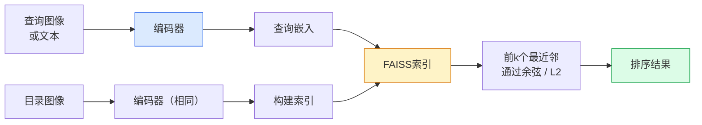

# 图像检索与度量学习

> 检索系统根据嵌入空间中的距离对候选结果进行排序。度量学习则是塑造这一空间，使距离符合你所期望的含义。

**类型：** 构建（Build）
**语言：** Python
**先修知识：** 阶段4第14课（ViT），阶段4第18课（CLIP）
**时间：** 约45分钟

## 学习目标

- 解释三元组损失（Triplet Loss）、对比损失（Contrastive Loss）和基于代理的度量学习损失（Proxy-based Metric Learning Loss），并为给定数据集选择合适的方法
- 正确实现L2归一化（L2-normalisation）和余弦相似度（Cosine Similarity），并区分"相同物品"与"相同类别"检索的差异
- 构建FAISS索引，通过文本和图像进行查询，并报告在留出查询集上的召回率@K（Recall@K）
- 使用DINOv2、CLIP和SigLIP作为现成的嵌入骨干网络，并了解各自在何种场景下表现最佳

## 问题

检索在生产视觉应用中无处不在：重复检测、以图搜图、视觉搜索（"查找相似产品"）、人脸重识别、监控场景中的人物重识别、电商中的实例级匹配。产品层面的问题始终如一："给定这张查询图像，对我的目录进行排序。"

两个设计决策决定了整个系统。嵌入（Embedding）——哪个模型产生向量。索引（Index）——如何在大规模场景下找到最近邻。这两者在2026年都已商品化（DINOv2用于嵌入，FAISS用于索引），这提高了门槛：难点在于为你的应用定义*什么算作相似*，然后塑造嵌入空间使距离与之匹配。

这种塑造就是度量学习。这是一个虽小但杠杆率极高的学科。

## 概念

### 检索概览



### 四种损失函数家族

| 损失函数 | 所需数据 | 优点 | 缺点 |
|------|----------|------|------|
| **对比损失（Contrastive）** | (锚点，正样本) + 负样本 | 简单，适用于任何成对标签 | 负样本不足时收敛慢 |
| **三元组损失（Triplet）** | (锚点，正样本，负样本) | 直观；直接控制间隔 | 难三元组挖掘成本高 |
| **NT-Xent / InfoNCE** | 成对数据 + 批次内挖掘的负样本 | 可扩展至大批量 | 需要大批量或动量队列 |
| **基于代理的损失（ProxyNCA）** | 仅类别标签 | 快速、稳定、无需挖掘 | 小数据集上可能过拟合于代理 |

对于大多数生产用例，从一个预训练的骨干网络开始，只有在现成嵌入在测试集上表现不佳时，才添加度量学习微调。

### 三元组损失的正式定义

```
L = max(0, ||f(a) - f(p)||^2 - ||f(a) - f(n)||^2 + margin)
```

将锚点 `a` 拉近正样本 `p`，推离负样本 `n`，通过一个 `margin`（间隔）确保差距。这种三张图片的结构可推广到任何相似性排序。

挖掘很重要：简单三元组（`n` 已经远离 `a`）贡献零损失；只有难三元组才能训练网络。半难挖掘（`n` 比 `p` 远但仍在间隔内）是2016年FaceNet的方法，至今仍占主导地位。

### 余弦相似度 vs L2距离

两种度量，两种约定：

- **余弦**：向量之间的角度。需要对嵌入进行L2归一化。
- **L2**：欧几里得距离。适用于原始或归一化的嵌入，但通常与L2归一化后的平方L2配对使用。

对于大多数现代网络，两者等价：当 `||a|| = ||b|| = 1` 时，`||a - b||^2 = 2 - 2 cos(a, b)`。选择与你的嵌入训练相匹配的约定；混用会悄然改变"最近邻"的含义。

### 召回率@K

标准的检索指标：

```
召回率@K = 查询中至少有一个正确匹配出现在前K个结果中的比例
```

同时报告召回率@1、@5、@10。如果召回率@10高于0.95但召回率@1低于0.5，意味着嵌入空间结构正确但排序嘈杂——尝试更长时间的微调或重新排序步骤。

对于重复检测，精确率@K（Precision@K）更为重要，因为每个误报都是用户可见的错误。对于视觉搜索，召回率@K则是产品信号。

### FAISS 一句话总结

Facebook AI相似性搜索。事实上的最近邻搜索库。三种索引选择：

- `IndexFlatIP` / `IndexFlatL2` —— 暴力搜索，精确，无需训练。适用于最多约100万个向量。
- `IndexIVFFlat` —— 划分为K个单元，仅搜索最近的几个单元。近似，快速，需要训练数据。
- `IndexHNSW` —— 基于图结构，对于多次查询最快，索引体积较大。

对于10万个向量，你可能想要基于余弦相似度的 `IndexFlatIP`。对于1000万个向量，你想要 `IndexIVFFlat`。对于1亿以上向量，结合乘积量化（`IndexIVFPQ`）。

### 实例级 vs 类别级检索

两个截然不同的问题，名字却相同：

- **类别级** —— "在我的目录中找猫。" 类别条件相似性；现成的CLIP / DINOv2嵌入效果良好。
- **实例级** —— "在我的目录中找到*这个确切的产品*。" 需要在同类视觉相似对象之间进行细粒度区分；现成嵌入效果不佳；需要用度量学习微调。

在选择模型之前，务必弄清楚你正在解决哪一个问题。

## 动手构建

### 步骤1：三元组损失

```python
import torch
import torch.nn.functional as F

def triplet_loss(anchor, positive, negative, margin=0.2):
    d_ap = F.pairwise_distance(anchor, positive, p=2)
    d_an = F.pairwise_distance(anchor, negative, p=2)
    return F.relu(d_ap - d_an + margin).mean()
```

一行代码。适用于L2归一化或原始嵌入。

### 步骤2：半难挖掘

给定一批嵌入和标签，为每个锚点找到最难的半难负样本。

```python
def semi_hard_negatives(emb, labels, margin=0.2):
    dist = torch.cdist(emb, emb)
    same_class = labels[:, None] == labels[None, :]
    diff_class = ~same_class
    N = emb.size(0)

    positives = dist.clone()
    positives[~same_class] = float("-inf")
    positives.fill_diagonal_(float("-inf"))
    pos_idx = positives.argmax(dim=1)

    semi_hard = dist.clone()
    semi_hard[same_class] = float("inf")
    d_ap = dist[torch.arange(N), pos_idx].unsqueeze(1)
    semi_hard[dist <= d_ap] = float("inf")
    neg_idx = semi_hard.argmin(dim=1)

    fallback_mask = semi_hard[torch.arange(N), neg_idx] == float("inf")
    if fallback_mask.any():
        hardest = dist.clone()
        hardest[same_class] = float("inf")
        neg_idx = torch.where(fallback_mask, hardest.argmin(dim=1), neg_idx)
    return pos_idx, neg_idx
```

每个锚点获得类别内最难的难正样本，以及一个比正样本远但在间隔内的半难负样本。

### 步骤3：召回率@K

```python
def recall_at_k(query_emb, gallery_emb, query_labels, gallery_labels, k=1):
    sim = query_emb @ gallery_emb.T
    _, top_k = sim.topk(k, dim=-1)
    matches = (gallery_labels[top_k] == query_labels[:, None]).any(dim=-1)
    return matches.float().mean().item()
```

在L2归一化嵌入上通过内积得到的前k个结果，等同于余弦相似度的前k个结果。报告至少有一个正确邻居的查询的平均比例。

### 步骤4：整合在一起

```python
import torch
import torch.nn as nn
from torch.optim import Adam

class Encoder(nn.Module):
    def __init__(self, in_dim=128, emb_dim=64):
        super().__init__()
        self.net = nn.Sequential(
            nn.Linear(in_dim, 128), nn.ReLU(),
            nn.Linear(128, emb_dim),
        )

    def forward(self, x):
        return F.normalize(self.net(x), dim=-1)

torch.manual_seed(0)
num_classes = 6
protos = F.normalize(torch.randn(num_classes, 128), dim=-1)

def sample_batch(bs=32):
    labels = torch.randint(0, num_classes, (bs,))
    x = protos[labels] + 0.15 * torch.randn(bs, 128)
    return x, labels

enc = Encoder()
opt = Adam(enc.parameters(), lr=3e-3)

for step in range(200):
    x, y = sample_batch(32)
    emb = enc(x)
    pos_idx, neg_idx = semi_hard_negatives(emb, y)
    loss = triplet_loss(emb, emb[pos_idx], emb[neg_idx])
    opt.zero_grad(); loss.backward(); opt.step()
```

几百步之后，嵌入簇将为每个类别形成一个簇。

## 实际使用

2026年的生产堆栈：

- **DINOv2 + FAISS** —— 通用视觉检索。开箱即用。
- **CLIP + FAISS** —— 当查询是文本时。
- **微调后的DINOv2 + FAISS** —— 实例级检索、人脸重识别、时尚、电商。
- **Milvus / Weaviate / Qdrant** —— 围绕FAISS或HNSW的托管向量数据库封装。

对于最先进的实例检索，配方是：DINOv2骨干网络，添加一个嵌入头，在实例标注的成对数据上使用三元组损失或InfoNCE损失进行微调，在FAISS中建立索引。

## 交付成果

本课程产出：

- `outputs/prompt-retrieval-loss-picker.md` —— 一个提示词，用于为给定的检索问题选择三元组/InfoNCE/ProxyNCA。
- `outputs/skill-recall-at-k-runner.md` —— 一项技能，编写一个干净的召回率@K评估工具，包含训练/验证/图库划分和正确的数据合约。

## 练习

1. **（简单）** 运行上述玩具示例。在训练前后使用PCA绘制嵌入图，观察六个簇的形成。
2. **（中等）** 添加一个ProxyNCA损失实现：每个类别一个学习到的"代理"，在余弦相似度上使用标准交叉熵。在玩具数据上对比三元组损失的收敛速度。
3. **（困难）** 取1000张ImageNet验证图像，通过HuggingFace使用DINOv2嵌入，构建FAISS平面索引，针对相同图像作为查询报告召回率@{1, 5, 10}（应为1.0），以及针对一个留出分割（使用ImageNet标签作为真实标签）报告结果。

## 关键术语

| 术语 | 人们说的意思 | 实际含义 |
|------|----------------|----------------------|
| 度量学习（Metric Learning） | "塑造空间" | 训练编码器，使其输出空间中的距离反映目标相似性 |
| 三元组损失（Triplet Loss） | "拉近推远" | L = max(0, d(a, p) - d(a, n) + margin)；标准的度量学习损失 |
| 半难挖掘（Semi-hard Mining） | "有用的负样本" | 距离锚点比正样本远但仍在间隔内的负样本；实验上信息量最大 |
| 基于代理的损失（Proxy-based Loss） | "类别原型" | 每个类别一个学习到的代理；基于与代理相似度的交叉熵；无需成对挖掘 |
| 召回率@K（Recall@K） | "前K命中率" | 查询中至少有一个正确结果出现在前K个中的比例 |
| 实例检索（Instance Retrieval） | "找到这个确切的东西" | 细粒度匹配；现成的特征通常表现不佳 |
| FAISS | "最近邻库" | Facebook的最近邻库；支持精确和近似索引 |
| HNSW | "图索引" | 分层可导航小世界；快速近似最近邻，内存开销小 |

## 延伸阅读

- [FaceNet: A Unified Embedding for Face Recognition (Schroff et al., 2015)](https://arxiv.org/abs/1503.03832) —— 三元组损失/半难挖掘论文
- [In Defense of the Triplet Loss for Person Re-Identification (Hermans et al., 2017)](https://arxiv.org/abs/1703.07737) —— 三元组微调实践指南
- [FAISS documentation](https://github.com/facebookresearch/faiss/wiki) —— 每一种索引，每一种权衡
- [SMoT: Metric Learning Taxonomy (Kim et al., 2021)](https://arxiv.org/abs/2010.06927) —— 现代损失函数及其联系的综述