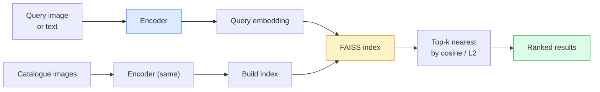

# 图像检索与度量学习

> 检索系统根据嵌入空间中的距离对候选对象进行排序。度量学习是塑造该空间以使距离符合你期望的学科。

**类型：** 构建
**语言：** Python
**前置条件：** 阶段 4 第 14 课（ViT），阶段 4 第 18 课（CLIP）
**时间：** ~45 分钟

## 学习目标

- 解释三元组、对比和基于代理的度量学习损失，并为给定数据集选择正确的损失函数
- 正确实现 L2 归一化和余弦相似度，并审查"同个项目"和"同类"检索之间的区别
- 构建 FAISS 索引，通过文本和图像查询，并为保留的查询集报告 recall@K
- 使用 DINOv2、CLIP 和 SigLIP 作为现成的嵌入骨干，并知道每种在何时胜出

## 问题

检索在生产视觉中无处不在：重复检测、反向图像搜索、视觉搜索（"查找相似产品"）、人脸再识别、监控中的人物重识别、电商中的实例级匹配。产品问题总是相同的："给定这个查询图像，对我的目录进行排序。"

两个设计决策塑造了整个系统。嵌入——什么模型产生向量。索引——如何大规模查找最近邻。两者在 2026 年都是商品化的（DINOv2 用于嵌入，FAISS 用于索引），这提高了标准：困难部分是对你的应用定义*什么算作相似*，然后塑造嵌入空间使距离与之匹配。

这种塑造就是度量学习。这是一个虽小但高杠杆的学科。

## 概念

### 检索概览


```mermaid
flowchart LR
    Q["Query image<br/>or text"] --> ENC["Encoder"]
    ENC --> EMB["Query embedding"]
    EMB --> IDX["FAISS index"]
    CAT["Catalogue images"] --> ENC2["Encoder (same)"] --> IDX_BUILD["Build index"]
    IDX_BUILD --> IDX
    IDX --> RANK["Top-k nearest<br/>by cosine / L2"]
    RANK --> OUT["Ranked results"]

    style ENC fill:#dbeafe,stroke:#2563eb
    style IDX fill:#fef3c7,stroke:#d97706
    style OUT fill:#dcfce7,stroke:#16a34a
```

### 四种损失函数家族

| 损失 | 需要 | 优点 | 缺点 |
|------|----------|------|------|
| **对比损失** | (anchor, positive) + negatives | 简单，适用于任何成对标签 | 没有大量负样本时收敛慢 |
| **三元组损失** | (anchor, positive, negative) | 直观；直接控制间隔 | 难例挖掘成本高 |
| **NT-Xent / InfoNCE** | 成对 + 批次内挖掘的负样本 | 可扩展到大批量 | 需要大批量或动量队列 |
| **基于代理的损失（ProxyNCA）** | 仅类别标签 | 快速、稳定、无需挖掘 | 在小型数据集上可能对代理过拟合 |

对于大多数生产用例，从预训练骨干开始，仅在现成嵌入在你的测试集上表现不佳时才添加度量学习微调。

### 三元组损失的正式形式

```
L = max(0, ||f(a) - f(p)||^2 - ||f(a) - f(n)||^2 + margin)
```

将 anchor `a` 拉近 positive `p`，推离 negative `n`，并使用 `margin` 确保存在间隔。三图像结构可泛化到任何相似性排序。

挖掘很重要：简单三元组（`n` 已远离 `a`）贡献零损失；只有难三元组教会网络。半难挖掘（`n` 比 `p` 远但在 margin 内）是 2016 年 FaceNet 的配方，至今仍占主导地位。

### 余弦相似度 vs L2

两个指标，两种约定：

- **余弦**：向量间的角度。需要 L2 归一化的嵌入。
- **L2**：欧几里得距离。适用于原始或归一化的嵌入，但通常与 L2 归一化 + 平方 L2 配对使用。

对于大多数现代网络，两者等价：当 `||a|| = ||b|| = 1` 时，`||a - b||^2 = 2 - 2 cos(a, b)`。选择与你的嵌入训练匹配的约定；混用会无声地改变"最近"的含义。

### Recall@K

标准检索指标：

```
recall@K = 在 top K 结果中至少有一个正确匹配的查询比例
```

并排报告 recall@1、@5、@10。recall@10 高于 0.95 而 recall@1 低于 0.5 意味着嵌入空间有正确的结构但排序有噪声——尝试更长的微调或重排序步骤。

对于重复检测，precision@K 更重要，因为每个误报都是用户可见的错误。对于视觉搜索，recall@K 是产品信号。

### FAISS（一句话概括）

Facebook AI 相似度搜索。近邻搜索的事实标准库。三种索引选择：

- `IndexFlatIP` / `IndexFlatL2`——暴力搜索，精确，无需训练。最多约 100 万向量使用。
- `IndexIVFFlat`——划分为 K 个细胞，仅搜索最近的几个细胞。近似，快速，需要训练数据。
- `IndexHNSW`——基于图的，对多查询最快，索引尺寸大。

对于 10 万向量，你可能想要基于余弦相似度的 `IndexFlatIP`。对于 1000 万，使用 `IndexIVFFlat`。对于 1 亿以上，结合乘积量化（`IndexIVFPQ`）。

### 实例级 vs 类别级检索

两个截然不同的问题有着相同的名字：

- **类别级**——"在我的目录中查找猫。"类条件相似度；现成的 CLIP / DINOv2 嵌入效果良好。
- **实例级**——"在我的目录中查找*这个确切的产品*。"需要同类中视觉相似对象之间的细粒度区分；现成嵌入表现不佳；度量学习微调很重要。

在选择模型之前，始终确认你解决的是哪一个问题。

## 构建

### 步骤 1：三元组损失

```python
import torch
import torch.nn.functional as F

def triplet_loss(anchor, positive, negative, margin=0.2):
    d_ap = F.pairwise_distance(anchor, positive, p=2)
    d_an = F.pairwise_distance(anchor, negative, p=2)
    return F.relu(d_ap - d_an + margin).mean()
```

一行代码。适用于 L2 归一化或原始嵌入。

### 步骤 2：半难挖掘

给定一批嵌入和标签，为每个 anchor 找到最难的半难负样本。

```python
def semi_hard_negatives(emb, labels, margin=0.2):
    dist = torch.cdist(emb, emb)
    same_class = labels[:, None] == labels[None, :]
    diff_class = ~same_class
    N = emb.size(0)

    positives = dist.clone()
    positives[~same_class] = float("-inf")
    positives.fill_diagonal_(float("-inf"))
    pos_idx = positives.argmax(dim=1)

    semi_hard = dist.clone()
    semi_hard[same_class] = float("inf")
    d_ap = dist[torch.arange(N), pos_idx].unsqueeze(1)
    semi_hard[dist <= d_ap] = float("inf")
    neg_idx = semi_hard.argmin(dim=1)

    fallback_mask = semi_hard[torch.arange(N), neg_idx] == float("inf")
    if fallback_mask.any():
        hardest = dist.clone()
        hardest[same_class] = float("inf")
        neg_idx = torch.where(fallback_mask, hardest.argmin(dim=1), neg_idx)
    return pos_idx, neg_idx
```

每个 anchor 得到类别内最难的 positive 和比 positive 远但在 margin 内的半难 negative。

### 步骤 3：Recall@K

```python
def recall_at_k(query_emb, gallery_emb, query_labels, gallery_labels, k=1):
    sim = query_emb @ gallery_emb.T
    _, top_k = sim.topk(k, dim=-1)
    matches = (gallery_labels[top_k] == query_labels[:, None]).any(dim=-1)
    return matches.float().mean().item()
```

在 L2 归一化嵌入上通过内积的 top-k 等价于通过余弦的 top-k。报告至少有一个正确邻居的查询的平均比例。

### 步骤 4：整合在一起

```python
import torch
import torch.nn as nn
from torch.optim import Adam

class Encoder(nn.Module):
    def __init__(self, in_dim=128, emb_dim=64):
        super().__init__()
        self.net = nn.Sequential(
            nn.Linear(in_dim, 128), nn.ReLU(),
            nn.Linear(128, emb_dim),
        )

    def forward(self, x):
        return F.normalize(self.net(x), dim=-1)

torch.manual_seed(0)
num_classes = 6
protos = F.normalize(torch.randn(num_classes, 128), dim=-1)

def sample_batch(bs=32):
    labels = torch.randint(0, num_classes, (bs,))
    x = protos[labels] + 0.15 * torch.randn(bs, 128)
    return x, labels

enc = Encoder()
opt = Adam(enc.parameters(), lr=3e-3)

for step in range(200):
    x, y = sample_batch(32)
    emb = enc(x)
    pos_idx, neg_idx = semi_hard_negatives(emb, y)
    loss = triplet_loss(emb, emb[pos_idx], emb[neg_idx])
    opt.zero_grad(); loss.backward(); opt.step()
```

几百步后，嵌入形成每个类别一个簇。

## 使用

2026 年的生产堆栈：

- **DINOv2 + FAISS**——通用视觉检索。开箱即用。
- **CLIP + FAISS**——当查询是文本时。
- **微调后的 DINOv2 + FAISS**——实例级检索、人脸重识别、时尚、电商。
- **Milvus / Weaviate / Qdrant**——围绕 FAISS 或 HNSW 的托管向量数据库封装。

对于 SOTA 实例检索，配方是：DINOv2 骨干，添加嵌入头，在实例标注的对上用三元组或 InfoNCE 损失微调，在 FAISS 中建立索引。

## 交付

本课产出：

- `outputs/prompt-retrieval-loss-picker.md`——一个 prompt，为给定的检索问题选择三元组 / InfoNCE / ProxyNCA。
- `outputs/skill-recall-at-k-runner.md`——一个技能，编写带有 train/val/gallery 分割和正确数据契约的干净 recall@K 评估工具。

## 练习

1. **（简单）** 运行上述玩具示例。用 PCA 绘制训练前后的嵌入，观察六个簇的形成。
2. **（中等）** 添加 ProxyNCA 损失实现：每个类别一个学习到的"代理"，在余弦相似度上进行标准交叉熵。在玩具数据上与三元组损失比较收敛速度。
3. **（困难）** 取 1000 张 ImageNet 验证图像，通过 HuggingFace 用 DINOv2 嵌入，构建 FAISS flat index，报告与相同图像作为查询（应为 1.0）的 recall@{1, 5, 10}，以及以 ImageNet 标签为真实标注的保留分割上的 recall。

## 关键术语

| 术语 | 人们说的 | 实际含义 |
|------|----------------|----------------------|
| 度量学习 | "塑造空间" | 训练编码器，使其输出空间中的距离反映目标相似性 |
| 三元组损失 | "拉和推" | L = max(0, d(a, p) - d(a, n) + margin)；规范的度量学习损失 |
| 半难挖掘 | "有用的负样本" | 比 anchor 到 positive 的距离远但在 margin 内的负样本；经验上最有信息量 |
| 基于代理的损失 | "类原型" | 每类一个学习到的代理；到代理的相似度上的交叉熵；无需成对挖掘 |
| Recall@K | "Top-K 命中率" | 在 top K 中至少有一个正确结果的查询比例 |
| 实例检索 | "找到这个确切的东西" | 细粒度匹配；现成特征通常表现不佳 |
| FAISS | "NN 库" | Facebook 的最近邻库；支持精确和近似索引 |
| HNSW | "图索引" | 分层可导航小世界；快速近似 NN，内存开销小 |

## 延伸阅读

- [FaceNet：人脸识别的统一嵌入（Schroff 等人, 2015）](https://arxiv.org/abs/1503.03832)——三元组损失 / 半难挖掘论文
- [为行人重识别辩护三元组损失（Hermans 等人, 2017）](https://arxiv.org/abs/1703.07737)——三元组微调实用指南
- [FAISS 文档](https://github.com/facebookresearch/faiss/wiki)——每个索引，每个权衡
- [SMoT：度量学习分类法（Kim 等人, 2021）](https://arxiv.org/abs/2010.06927)——现代损失及其联系的综述
