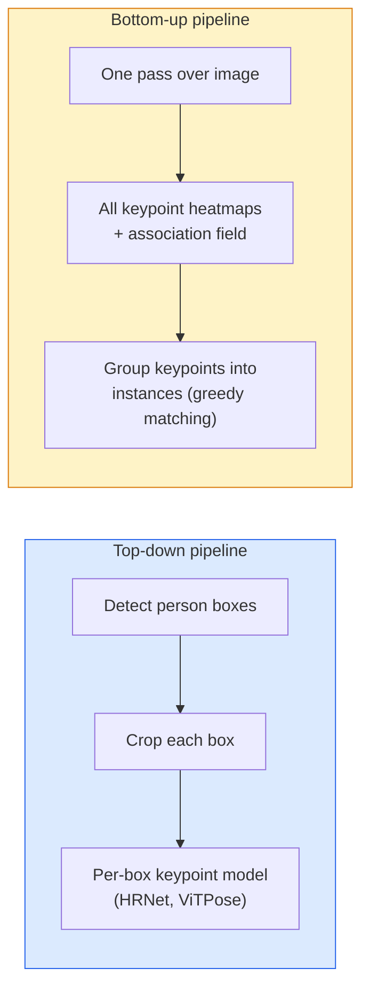

# Keypoint Detection & Pose Estimation

> 姿勢とは、順序付き keypoint の集合である。keypoint detector は heatmap regressor であり、それ以外はほぼ帳簿付けである。

**種別:** 構築
**言語:** Python
**前提条件:** Phase 4 Lesson 06 (Detection), Phase 4 Lesson 07 (U-Net)
**所要時間:** 約45分

## 学習目標

- top-down と bottom-up の pose estimation を区別し、それぞれがいつ使われるかを説明する
- K 個の keypoint に対して、keypoint ごとに Gaussian target を持つ heatmap を回帰し、推論時に keypoint 座標を取り出す
- Part Affinity Fields (PAFs) と、bottom-up pipeline が keypoint を instance に対応付ける方法を説明する
- 本番の keypoint estimation に MediaPipe Pose または MMPose を使い、その出力形式を理解する

## 問題

Keypoint タスクはさまざまな名前の下に隠れている。human pose (17 個の body joints)、face landmarks (68 または 478 点)、hand (21 点)、animal pose、robotic object pose、medical anatomy landmarks などだ。どれも同じ構造を共有している。object 上の K 個の離散点を検出し、その `(x, y)` 座標を出力する。

Pose estimation は motion capture、fitness apps、sports analytics、gesture control、animation、AR try-on、robotic grasping の基盤である。2D の場合は成熟している。3D pose、つまり単一カメラから world coordinates の joint positions を推定する問題は、現在も研究の最前線にある。

エンジニアリング上の問いはスケールである。1 枚画像・1 人の pose は 20ms の問題だ。群衆内の multi-person pose を 30 fps で処理する問題は、必要な architecture が異なる別物である。

## コンセプト

### Top-down vs bottom-up



- **Top-down** — 先に person を検出し、その後で各 crop に対して person ごとの keypoint model を走らせる。精度は最も高いが、人数に対して線形にスケールする。
- **Bottom-up** — 1 回の forward pass で全 keypoint と association field を予測し、それらを group 化する。群衆サイズに関係なく一定時間で処理できる。

Top-down (HRNet, ViTPose) は精度のリーダーであり、bottom-up (OpenPose, HigherHRNet) は混雑シーンでの throughput のリーダーである。

### Heatmap regression

`(x, y)` を直接回帰する代わりに、true location を中心とする Gaussian blob を持つ keypoint ごとの `H x W` heatmap を予測する。

```
target[k, y, x] = exp(-((x - cx_k)^2 + (y - cy_k)^2) / (2 sigma^2))
```

推論時には、各 heatmap の argmax が予測 keypoint location になる。

Heatmap が direct regression よりうまく機能する理由は、network の空間構造、つまり conv feature map が空間出力と自然に対応するためである。Gaussian target も regularise として働く。小さな localisation error は小さな loss になり、ゼロにはならない。

### Sub-pixel localisation

Argmax は整数座標を返す。sub-pixel precision が必要な場合は、argmax とその近傍に parabola を fit するか、よく知られた offset `(dx, dy) = 0.25 * (heatmap[y, x+1] - heatmap[y, x-1], ...)` の方向を使って refine する。

### Part Affinity Fields (PAFs)

OpenPose が bottom-up association に使った工夫である。接続された keypoint の各ペア、たとえば left shoulder から left elbow に対して、一方から他方を指す unit vector を encode する 2-channel field を予測する。shoulder と elbow を対応付けるには、候補ペアを結ぶ線に沿って PAF を積分する。積分値が最も高いペアが match される。

```
For each connection (limb):
  PAF channels: 2 (unit vector x, y)
  Line integral: sum over sample points of (PAF . line_direction)
  Higher integral = stronger match
```

洗練されており、person ごとの crop なしで任意の群衆サイズへスケールする。

### COCO keypoints

標準的な body-pose dataset である。1 人あたり 17 keypoints を持ち、metrics として PCK (Percentage of Correct Keypoints) と OKS (Object Keypoint Similarity) を使う。OKS は keypoint における IoU 類似物であり、COCO mAP@OKS が報告する指標である。

### 2D vs 3D

- **2D pose** — image coordinates。本番品質で解かれている (MediaPipe, HRNet, ViTPose)。
- **3D pose** — world / camera coordinates。まだ活発な研究領域である。一般的な approach:
  - 小さな MLP で 2D predictions を 3D に lift する (VideoPose3D)。
  - image から直接 3D regression する (PyMAF, MHFormer)。
  - ground truth のために multi-view setups (CMU Panoptic) を使う。

## 実装

### Step 1: Gaussian heatmap target

```python
import numpy as np
import torch

def gaussian_heatmap(size, cx, cy, sigma=2.0):
    yy, xx = np.meshgrid(np.arange(size), np.arange(size), indexing="ij")
    return np.exp(-((xx - cx) ** 2 + (yy - cy) ** 2) / (2 * sigma ** 2)).astype(np.float32)

hm = gaussian_heatmap(64, 32, 32, sigma=2.0)
print(f"peak: {hm.max():.3f} at ({hm.argmax() % 64}, {hm.argmax() // 64})")
```

channel axis に沿って keypoint ごとの heatmap を stack すると、完全な target tensor になる。

### Step 2: tiny keypoint head

K 個の heatmap channel を出力する U-Net-style model。

```python
import torch.nn as nn
import torch.nn.functional as F

class TinyKeypointNet(nn.Module):
    def __init__(self, num_keypoints=4, base=16):
        super().__init__()
        self.down1 = nn.Sequential(nn.Conv2d(3, base, 3, 2, 1), nn.ReLU(inplace=True))
        self.down2 = nn.Sequential(nn.Conv2d(base, base * 2, 3, 2, 1), nn.ReLU(inplace=True))
        self.mid = nn.Sequential(nn.Conv2d(base * 2, base * 2, 3, 1, 1), nn.ReLU(inplace=True))
        self.up1 = nn.ConvTranspose2d(base * 2, base, 2, 2)
        self.up2 = nn.ConvTranspose2d(base, num_keypoints, 2, 2)

    def forward(self, x):
        h1 = self.down1(x)
        h2 = self.down2(h1)
        h3 = self.mid(h2)
        u1 = self.up1(h3)
        return self.up2(u1)
```

Input は `(N, 3, H, W)`、output は `(N, K, H, W)`。Loss は Gaussian targets に対する per-pixel MSE である。

### Step 3: inference — keypoint coordinates の抽出

```python
def heatmap_to_coords(heatmaps):
    """
    heatmaps: (N, K, H, W)
    returns:  (N, K, 2) float coordinates in image pixels
    """
    N, K, H, W = heatmaps.shape
    hm = heatmaps.reshape(N, K, -1)
    idx = hm.argmax(dim=-1)
    ys = (idx // W).float()
    xs = (idx % W).float()
    return torch.stack([xs, ys], dim=-1)

coords = heatmap_to_coords(torch.randn(2, 4, 32, 32))
print(f"coords: {coords.shape}")  # (2, 4, 2)
```

推論時は 1 行で済む。sub-pixel refinement には、argmax の周辺を interpolate する。

### Step 4: synthetic keypoint dataset

単純に、白い canvas に 4 点を描き、それらを予測するように学習する。

```python
def make_synthetic_sample(size=64):
    img = np.ones((3, size, size), dtype=np.float32)
    rng = np.random.default_rng()
    kps = rng.integers(8, size - 8, size=(4, 2))
    for cx, cy in kps:
        img[:, cy - 2:cy + 2, cx - 2:cx + 2] = 0.0
    hms = np.stack([gaussian_heatmap(size, cx, cy) for cx, cy in kps])
    return img, hms, kps
```

小さな model でも 1 分で学習できるほど簡単である。

### Step 5: training

```python
model = TinyKeypointNet(num_keypoints=4)
opt = torch.optim.Adam(model.parameters(), lr=3e-3)

for step in range(200):
    batch = [make_synthetic_sample() for _ in range(16)]
    imgs = torch.from_numpy(np.stack([b[0] for b in batch]))
    hms = torch.from_numpy(np.stack([b[1] for b in batch]))
    pred = model(imgs)
    # Upsample pred to full resolution
    pred = F.interpolate(pred, size=hms.shape[-2:], mode="bilinear", align_corners=False)
    loss = F.mse_loss(pred, hms)
    opt.zero_grad(); loss.backward(); opt.step()
```

## 使い方

- **MediaPipe Pose** — Google の本番 pose estimator。WebGL と mobile runtime を同梱し、10ms 未満の latency を実現する。
- **MMPose** (OpenMMLab) — 包括的な研究 codebase。pretrained weights 付きのあらゆる SOTA architecture がある。
- **YOLOv8-pose** — 1 回の forward pass で最速の real-time multi-person pose を実現する。
- **transformers HumanDPT / PoseAnything** — open-vocabulary pose、つまり任意 object・任意 keypoint set に向けた新しい vision-language approach。

## 成果物

この lesson は次を生成する:

- `outputs/prompt-pose-stack-picker.md` — latency、crowd size、2D vs 3D の必要性に応じて MediaPipe / YOLOv8-pose / HRNet / ViTPose を選ぶ prompt。
- `outputs/skill-heatmap-to-coords.md` — すべての本番 pose model が使う sub-pixel heatmap-to-coordinate routine を書く skill。

## 演習

1. **(Easy)** synthetic 4-point dataset で tiny keypoint model を学習する。200 steps 後に predicted keypoints と true keypoints の mean L2 error を報告する。
2. **(Medium)** sub-pixel refinement を追加する。argmax position が与えられたら、近傍 pixel から x と y 方向に 1D parabola を fit する。integer argmax に対する accuracy gain を報告する。
3. **(Hard)** 各画像に 4-keypoint pattern の 2 instances が表示される 2-person synthetic dataset を構築する。どの keypoint がどの instance に属するかを予測する PAFs 付き bottom-up pipeline を学習し、OKS を評価する。

## 重要用語

| 用語 | よく言われる表現 | 実際の意味 |
|------|----------------|----------------------|
| Keypoint | "A landmark" | object 上の特定の順序付き点 (joint, corner, feature) |
| Pose | "The skeleton" | 1 つの instance に属する keypoints の順序付き集合 |
| Top-down | "Detect then pose" | 2 段階 pipeline: person detector + crop ごとの keypoint model。精度が最も高い |
| Bottom-up | "Pose first, group later" | 1 pass の全 keypoint prediction + grouping。crowd size に対して一定時間 |
| Heatmap | "Gaussian target" | true location に peak を持つ keypoint ごとの H x W tensor。推奨される regression target |
| PAF | "Part Affinity Field" | limb direction を encode する 2-channel unit vector field。keypoint を instance に group 化するために使う |
| OKS | "Keypoint IoU" | Object Keypoint Similarity。pose 用の COCO metric |
| HRNet | "High-Resolution Net" | 支配的な top-down keypoint architecture。全体を通じて high-res features を保持する |

## 参考資料

- [OpenPose (Cao et al., 2017)](https://arxiv.org/abs/1812.08008) — PAFs を使う bottom-up。今でも approach の最良の解説
- [HRNet (Sun et al., 2019)](https://arxiv.org/abs/1902.09212) — top-down の reference architecture
- [ViTPose (Xu et al., 2022)](https://arxiv.org/abs/2204.12484) — pose backbone としての plain ViT。多くの benchmark で現在の SOTA
- [MediaPipe Pose](https://developers.google.com/mediapipe/solutions/vision/pose_landmarker) — 本番 real-time pose。2026 年に最も高速に deploy されている stack
