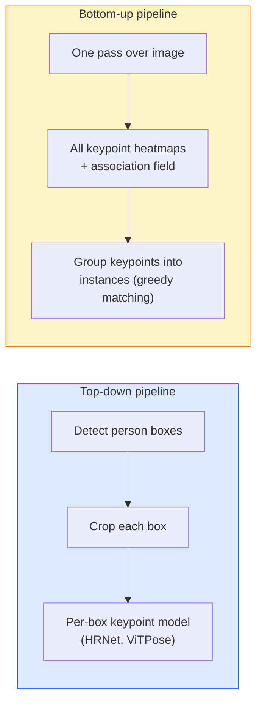

# Anahtar Nokta Tespiti ve Poz Tahmini

> Poz, sıralı anahtar noktaların bir kümesidir. Anahtar nokta dedektörü bir ısı haritası regresörüdür. Geriye kalan her şey muhasebedir.

**Tür:** Yapım
**Diller:** Python
**Önkoşullar:** Aşama 4 Ders 06 (Algılama), Aşama 4 Ders 07 (U-Net)
**Süre:** ~45 dakika

## Öğrenme Hedefleri

- Yukarıdan aşağıya ve aşağıdan yukarıya poz tahminini ve her birinin kullanıldığı durumu ayırt edin
- Anahtar nokta başına Gauss hedefiyle K anahtar noktası için ısı haritalarını gerileyin ve inference'de anahtar nokta koordinatlarını çıkarın
- Parça Yakınlık Alanlarını (PAF'ler) ve aşağıdan yukarıya ardışık düzenlerin önemli noktaları örneklerle nasıl ilişkilendirdiğini açıklayın
- Üretim anahtar noktası tahmini için MediaPipe Pose veya MMPose kullanın ve çıktı formatlarını anlayın

## Sorun

Anahtar nokta görevleri pek çok isim altında gizlenir: insan pozu (17 vücut eklemi), yüz yer işaretleri (68 veya 478 puan), el (21 puan), hayvan pozu, robotik nesne pozu, tıbbi anatomi yer işaretleri. Her biri aynı yapıyı paylaşır: bir nesne üzerindeki K ayrı noktayı tespit eder ve bunların (x, y) koordinatlarını çıkarır.

Poz tahmini, hareket yakalama, fitness uygulamaları, spor analitiği, hareket kontrolü, animasyon, AR denemesi ve robotik kavramanın temelidir. 2 boyutlu durum olgunlaşmış durumda; 3 boyutlu poz (tek bir kameradan dünya koordinatlarındaki ortak konumların tahmin edilmesi) mevcut araştırma alanıdır.

Mühendislik sorusu ölçektir. Tek görüntülü, tek kişilik poz 20 ms'lik bir sorundur. Kalabalıkta 30 fps'de çok kişili poz vermek, farklı mimarilerde farklı bir sorundur.

## Konsept

### Yukarıdan aşağıya ve aşağıdan yukarıya



- **Yukarıdan aşağıya** — önce insanları tespit edin, ardından her üründe kişi başına bir temel nokta modeli çalıştırın. En yüksek doğruluk; kişi sayısıyla doğrusal olarak ölçeklenir.
- **Aşağıdan yukarıya** — bir ileri geçiş tüm önemli noktaları ve bir ilişkilendirme alanını tahmin eder; onları gruplandırın. Kalabalık boyutundan bağımsız olarak sabit süre.

Yukarıdan aşağıya (HRNet, ViTPose) doğruluk lideridir; aşağıdan yukarıya (OpenPose, HigherHRNet) kalabalık sahneler için üretim lideridir.

### Isı haritası regresyonu

`(x, y)`'yi doğrudan gerilemek yerine, gerçek konumda ortalanmış bir Gauss blobuyla anahtar nokta başına bir `H x W` ısı haritası tahmin edin.

```
target[k, y, x] = exp(-((x - cx_k)^2 + (y - cy_k)^2) / (2 sigma^2))
```

inference'de her ısı haritasının argmax değeri, tahmin edilen anahtar nokta konumudur.

Isı haritaları neden doğrudan regresyondan daha iyi çalışır: ağın mekansal yapısı (dönüşüm özellik haritası) doğal olarak mekansal çıktıyla hizalanır. Gauss hedefleri de düzenli hale gelir; küçük bir yerelleştirme hatası, sıfır değil, küçük bir kayıp üretir.

### Alt piksel yerelleştirmesi

Argmax tamsayı koordinatları verir. Alt piksel hassasiyeti için argmax'a ve komşularına bir parabol yerleştirerek hassaslaştırın veya iyi bilinen `(dx, dy) = 0.25 * (heatmap[y, x+1] - heatmap[y, x-1], ...)` uzaklık yönünü kullanın.

### Parça İlgi Alanları (PAF'ler)

OpenPose'un aşağıdan yukarıya ilişkilendirme numarası. Her bağlı anahtar nokta çifti için (e.g. sol omuzdan sol dirseğe), birinden diğerine işaret eden birim vektörü kodlayan 2 kanallı bir alan tahmin edin. Bir omuzu dirseğiyle ilişkilendirmek için PAF'ı aday çiftleri birleştiren çizgi boyunca entegre edin; en yüksek integrale sahip çift eşleştirilir.

```
For each connection (limb):
  PAF channels: 2 (unit vector x, y)
  Line integral: sum over sample points of (PAF . line_direction)
  Higher integral = stronger match
```

Zariftir ve kişi başına ürün eklemeden keyfi kalabalık boyutlarına ölçeklenir.

### COCO'nun önemli noktaları

Standart vücut duruşu dataset: Kişi başına 17 anahtar nokta, metrik olarak PCK (Doğru Anahtar Noktaların Yüzdesi) ve OKS (Nesne Anahtar Noktası Benzerliği). OKS, IoU'nun temel analogudur ve COCO mAP@OKS'nin rapor ettiği şeydir.

### 2D ve 3D

- **2D poz** — görüntü koordinatları; üretim kalitesinde çözülür (MediaPipe, HRNet, ViTPose).
- **3D poz** — dünya/kamera koordinatları; hala aktif araştırma. Ortak yaklaşımlar:
  - Küçük bir MLP (VideoPose3D) ile 2D tahminlerini 3D'ye yükseltin.
  - Görüntüden doğrudan 3D regresyon (PyMAF, MHFormer).
  - Temel gerçekler için çoklu görünüm kurulumları (CMU Panoptic).

## İnşa Et

### Adım 1: Gauss ısı haritası hedefi

```python
import numpy as np
import torch

def gaussian_heatmap(size, cx, cy, sigma=2.0):
    yy, xx = np.meshgrid(np.arange(size), np.arange(size), indexing="ij")
    return np.exp(-((xx - cx) ** 2 + (yy - cy) ** 2) / (2 * sigma ** 2)).astype(np.float32)

hm = gaussian_heatmap(64, 32, 32, sigma=2.0)
print(f"peak: {hm.max():.3f} at ({hm.argmax() % 64}, {hm.argmax() // 64})")
```

Bir kanal ekseni boyunca yığılmış anahtar nokta başına ısı haritaları, tam hedef tensörü verir.

### Adım 2: Küçük anahtar nokta başı

K ısı haritası kanalı çıkışı sağlayan U-Net tarzı bir model.

```python
import torch.nn as nn
import torch.nn.functional as F

class TinyKeypointNet(nn.Module):
    def __init__(self, num_keypoints=4, base=16):
        super().__init__()
        self.down1 = nn.Sequential(nn.Conv2d(3, base, 3, 2, 1), nn.ReLU(inplace=True))
        self.down2 = nn.Sequential(nn.Conv2d(base, base * 2, 3, 2, 1), nn.ReLU(inplace=True))
        self.mid = nn.Sequential(nn.Conv2d(base * 2, base * 2, 3, 1, 1), nn.ReLU(inplace=True))
        self.up1 = nn.ConvTranspose2d(base * 2, base, 2, 2)
        self.up2 = nn.ConvTranspose2d(base, num_keypoints, 2, 2)

    def forward(self, x):
        h1 = self.down1(x)
        h2 = self.down2(h1)
        h3 = self.mid(h2)
        u1 = self.up1(h3)
        return self.up2(u1)
```

`(N, 3, H, W)` girişi, `(N, K, H, W)` çıkışı. Kayıp, Gauss hedeflerine karşı piksel başına MSE'dir.

### Adım 3: Inference — anahtar nokta koordinatlarını çıkarın

```python
def heatmap_to_coords(heatmaps):
    """
    heatmaps: (N, K, H, W)
    returns:  (N, K, 2) float coordinates in image pixels
    """
    N, K, H, W = heatmaps.shape
    hm = heatmaps.reshape(N, K, -1)
    idx = hm.argmax(dim=-1)
    ys = (idx // W).float()
    xs = (idx % W).float()
    return torch.stack([xs, ys], dim=-1)

coords = heatmap_to_coords(torch.randn(2, 4, 32, 32))
print(f"coords: {coords.shape}")  # (2, 4, 2)
```

inference'de bir satır. Alt piksel iyileştirmesi için argmax etrafında enterpolasyon yapın.

### Adım 4: Sentetik anahtar nokta dataset

Basit: Beyaz bir tuval üzerine dört nokta çizin ve bunları tahmin etmeyi öğrenin.

```python
def make_synthetic_sample(size=64):
    img = np.ones((3, size, size), dtype=np.float32)
    rng = np.random.default_rng()
    kps = rng.integers(8, size - 8, size=(4, 2))
    for cx, cy in kps:
        img[:, cy - 2:cy + 2, cx - 2:cx + 2] = 0.0
    hms = np.stack([gaussian_heatmap(size, cx, cy) for cx, cy in kps])
    return img, hms, kps
```

Küçük bir modelin bir dakika içinde öğrenmesi yeterince kolaydır.

### Adım 5: Eğitim

```python
model = TinyKeypointNet(num_keypoints=4)
opt = torch.optim.Adam(model.parameters(), lr=3e-3)

for step in range(200):
    batch = [make_synthetic_sample() for _ in range(16)]
    imgs = torch.from_numpy(np.stack([b[0] for b in batch]))
    hms = torch.from_numpy(np.stack([b[1] for b in batch]))
    pred = model(imgs)
    # Upsample pred to full resolution
    pred = F.interpolate(pred, size=hms.shape[-2:], mode="bilinear", align_corners=False)
    loss = F.mse_loss(pred, hms)
    opt.zero_grad(); loss.backward(); opt.step()
```

## Kullan onu

- **MediaPipe Pose** — Google'ın üretim poz tahmincisi; WebGL + mobil çalışma sürelerini 10 ms'nin altında gecikmeyle sunar.
- **MMPose** (OpenMMLab) — kapsamlı araştırma kod tabanı; önceden eğitilmiş ağırlıklara sahip her SOTA mimarisi.
- **YOLOv8-pose** — tek bir ileri geçişle en hızlı gerçek zamanlı çok kişili poz.
- **transformers HumanDPT / PoseAnything** — açık kelime dağarcığı pozu (herhangi bir nesne, herhangi bir anahtar nokta kümesi) için daha yeni görüş dili yaklaşımları.

## Gönderin

Bu ders şunları üretir:

- `outputs/prompt-pose-stack-picker.md` — gecikme süresi, kalabalık boyutu ve 2D ile 3D ihtiyacına göre MediaPipe / YOLOv8-pose / HRNet / ViTPose'u seçen bir prompt.
- `outputs/skill-heatmap-to-coords.md` — her üretim poz modeli tarafından kullanılan alt piksel ısı haritasını koordinat rutinine yazan bir beceri.

## Egzersizler

1. **(Kolay)** Küçük anahtar nokta modelini sentetik 4 noktalı dataset üzerinde eğitin. 200 adımdan sonra tahmin edilen ve gerçek anahtar noktalar arasındaki ortalama L2 hatasını raporlayın.
2. **(Orta)** Alt piksel iyileştirmesi ekleyin: argmax konumu göz önüne alındığında, komşu piksellerden x ve y boyunca 1 boyutlu bir parabol yerleştirin. Tamsayı argmax'a karşı doğruluk kazancını bildirin.
3. **(Zor)** Her görüntünün 4 anahtar noktalı desenin iki örneğini gösterdiği 2 kişilik sentetik bir dataset oluşturun. Hangi anahtar noktanın hangi örneğe ait olduğunu tahmin eden PAF'larla aşağıdan yukarıya bir ardışık düzen eğitin ve OKS'yi değerlendirin.

## Anahtar Terimler

| Dönem | İnsanlar ne diyor | Aslında ne anlama geliyor |
|------|----------------|----------------------|
| Anahtar Nokta | "Bir dönüm noktası" | Bir nesne üzerinde belirli bir sıralı nokta (bağlantı noktası, köşe, özellik) |
| Poz | "İskelet" | Bir örneğe ait sıralı bir dizi anahtar nokta |
| Yukarıdan aşağıya | "Algıla ve poz ver" | İki aşamalı işlem hattı: kişi dedektörü + ürün başına temel nokta modeli; en yüksek doğruluk |
| Aşağıdan yukarıya | "Önce poz ver, sonra grupla" | Tek geçişli tüm anahtar nokta tahmini + gruplandırma; kalabalık boyutunda sabit süre |
| Isı Haritası | "Gauss hedefi" | Gerçek konumda tepe noktasına sahip anahtar nokta başına Y x G tensörü; tercih edilen regresyon hedefi |
| PAF | "Parça Yakınlık Alanı" | Uzuv yönlerini kodlayan 2 kanallı birim vektör alanı; önemli noktaları örnekler halinde gruplamak için kullanılır |
| OK | "Anahtar Noktası IoU" | Nesne Anahtar Noktası Benzerliği; poz için COCO ölçüsü |
| HRNet | "Yüksek Çözünürlüklü Net" | Baskın yukarıdan aşağıya anahtar nokta mimarisi; yüksek çözünürlüklü özellikleri baştan sona korur |

## Daha Fazla Okuma

- [OpenPose (Cao ve diğerleri, 2017)](https://arxiv.org/abs/1812.08008) — PAF'larla aşağıdan yukarıya; yaklaşımın hâlâ en iyi yazısı
- [HRNet (Sun ve diğerleri, 2019)](https://arxiv.org/abs/1902.09212) — yukarıdan aşağıya referans mimarisi
- [ViTPose (Xu ve diğerleri, 2022)](https://arxiv.org/abs/2204.12484) — poz omurgası olarak düz ViT; birçok benchmark'de mevcut SOTA
- [MediaPipe Pose](https://developers.google.com/mediapipe/solutions/vision/pose_landmarker) — gerçek zamanlı üretim pozu; 2026'nın en hızlı dağıtılan yığını
