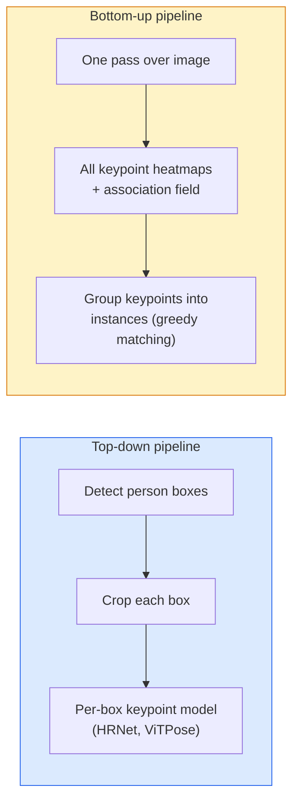

# 关键点检测和姿态估计

> 姿势是一组有序的关键点。关键点检测器是热图回归器。其他一切都是簿记。

** 类型：** 构建
** 语言：** Python
** 先决条件：** 第4阶段第06课（检测）、第4阶段第07课（U-Net）
** 时间：** ~45分钟

## Learning Objectives

- 区分自上而下和自下而上的姿态估计和状态，
- 具有每个关键点高斯目标的K个关键点的回归热图并在推断时提取关键点坐标
- 解释零件关联字段（PFA）以及自下而上管道如何将关键点关联到实例
- 使用MediaPipe Pose或MMPose进行生产关键点估计并了解其输出格式

## 问题

关键点任务隐藏在许多名称下：人体姿势（17个身体关节）、面部地标（68或478个点）、手（21个点）、动物姿势、机器人物体姿势、医学解剖地标。它们中的每个都共享相同的结构：检测对象上的K个离散点并输出它们的（x，y）坐标。

姿势估计是运动捕捉、健身应用程序、运动分析、姿势控制、动画、AR试穿和机器人抓取的基础。2D案例已经成熟; 3D姿态（从单个摄像机估计世界坐标中的关节位置）是当前的研究前沿。

工程问题是规模。单图像、单人姿势是一个20 ms的问题。在人群中以30帧/秒的速度摆出多人姿势对于不同的架构来说是不同的问题。

## 概念

### 自上而下vs自下而上



- ** 自上而下 ** -首先检测人员，然后对每个作物运行每人关键点模型。最高的准确性;与人数呈线性关系。
- ** 自下而上 ** -一次向前传递预测所有关键点加上关联字段;将它们分组。无论人群规模如何，时间都是恒定的。

自上而下（HRNet、ViTPose）是准确性的领导者;自下而上（OpenPose、HigherHRNet）是拥挤场景的吞吐量领导者。

### 热图回归

不要直接回归“（x，y）”，而是用以真实位置为中心的高斯斑点预测每个关键点的“H x W”热图。

```
target[k, y, x] = exp(-((x - cx_k)^2 + (y - cy_k)^2) / (2 sigma^2))
```

推断，每个热图的argmax是预测的关键点位置。

为什么热图比直接回归效果更好：网络的空间结构（conv特征图）与空间输出自然对齐。高斯目标也会规则化--小的定位误差会产生小的损失，而不是零。

### 亚像素定位

Argmax给出了整个坐标。对于亚像素精度，通过将一个曲线与argmax及其邻居进行微调，或使用众所周知的偏差'（Dx，dy）= 0.25 *（热图[y，x+1] -热图[y，x-1]，.）'方向

### 部分亲和力字段（PFA）

OpenPose的自下而上关联技巧。对于每对连接的关键点（例如左肩到左肘），预测一个2通道字段，该字段对从一个关键点指向另一个关键点的单位载体进行编码。要将肩部与肘部关联起来，请沿着连接候选对的线对PFA进行积分;积分最高的对进行匹配。

```
For each connection (limb):
  PAF channels: 2 (unit vector x, y)
  Line integral: sum over sample points of (PAF . line_direction)
  Higher integral = stronger match
```

优雅且可扩展至任意人群规模，无需人均作物。

### COCO要点

标准身体姿势数据集：每人17个关键点，PCK（正确关键点百分比）和OKS（对象关键点相似性）作为指标。OKS是IoU的关键点模拟物，也是COCO mAP@OKS所报道的内容。

### 2D vs 3D

- **2D姿势 ** -图像坐标;以生产质量解决（MediaPipe、HRNet、ViTPose）。
- **3D姿势 ** -世界/相机坐标;仍在积极研究。常见方法：
  - 使用小型MLP（VideoPose3D）将2D预测提升到3D。
  - 从图像直接3D回归（PyAPM、MHFormer）。
  - 多视图设置（CMU Panoptic）用于地面真相。

## 建设党

### 第1步：高斯热图目标

```python
import numpy as np
import torch

def gaussian_heatmap(size, cx, cy, sigma=2.0):
    yy, xx = np.meshgrid(np.arange(size), np.arange(size), indexing="ij")
    return np.exp(-((xx - cx) ** 2 + (yy - cy) ** 2) / (2 * sigma ** 2)).astype(np.float32)

hm = gaussian_heatmap(64, 32, 32, sigma=2.0)
print(f"peak: {hm.max():.3f} at ({hm.argmax() % 64}, {hm.argmax() // 64})")
```

沿着通道轴堆叠的每个关键点热图给出完整的目标张量。

### 2.微型关键点头

一个U-Net风格的模型，输出K个热图通道。

```python
import torch.nn as nn
import torch.nn.functional as F

class TinyKeypointNet(nn.Module):
    def __init__(self, num_keypoints=4, base=16):
        super().__init__()
        self.down1 = nn.Sequential(nn.Conv2d(3, base, 3, 2, 1), nn.ReLU(inplace=True))
        self.down2 = nn.Sequential(nn.Conv2d(base, base * 2, 3, 2, 1), nn.ReLU(inplace=True))
        self.mid = nn.Sequential(nn.Conv2d(base * 2, base * 2, 3, 1, 1), nn.ReLU(inplace=True))
        self.up1 = nn.ConvTranspose2d(base * 2, base, 2, 2)
        self.up2 = nn.ConvTranspose2d(base, num_keypoints, 2, 2)

    def forward(self, x):
        h1 = self.down1(x)
        h2 = self.down2(h1)
        h3 = self.mid(h2)
        u1 = self.up1(h3)
        return self.up2(u1)
```

输入'（N，3，H，W）'，输出'（N，K，H，W）'。损失是针对高斯目标的每像素均方差。

### 第3步：推理-提取关键点坐标

```python
def heatmap_to_coords(heatmaps):
    """
    heatmaps: (N, K, H, W)
    returns:  (N, K, 2) float coordinates in image pixels
    """
    N, K, H, W = heatmaps.shape
    hm = heatmaps.reshape(N, K, -1)
    idx = hm.argmax(dim=-1)
    ys = (idx // W).float()
    xs = (idx % W).float()
    return torch.stack([xs, ys], dim=-1)

coords = heatmap_to_coords(torch.randn(2, 4, 32, 32))
print(f"coords: {coords.shape}")  # (2, 4, 2)
```

一条推论线。对于子像素细化，在argmax周围插值。

### 第4步：合成关键点数据集

简单：在白色画布上画四个点并学习预测它们。

```python
def make_synthetic_sample(size=64):
    img = np.ones((3, size, size), dtype=np.float32)
    rng = np.random.default_rng()
    kps = rng.integers(8, size - 8, size=(4, 2))
    for cx, cy in kps:
        img[:, cy - 2:cy + 2, cx - 2:cx + 2] = 0.0
    hms = np.stack([gaussian_heatmap(size, cx, cy) for cx, cy in kps])
    return img, hms, kps
```

对于一个小模型来说，只需一分钟就能学会。

### 第5步：培训

```python
model = TinyKeypointNet(num_keypoints=4)
opt = torch.optim.Adam(model.parameters(), lr=3e-3)

for step in range(200):
    batch = [make_synthetic_sample() for _ in range(16)]
    imgs = torch.from_numpy(np.stack([b[0] for b in batch]))
    hms = torch.from_numpy(np.stack([b[1] for b in batch]))
    pred = model(imgs)
    # Upsample pred to full resolution
    pred = F.interpolate(pred, size=hms.shape[-2:], mode="bilinear", align_corners=False)
    loss = F.mse_loss(pred, hms)
    opt.zero_grad(); loss.backward(); opt.step()
```

## 使用它

- **MediaPipe Pose** - Google的生产姿态估计器;交付的WebGL +移动运行时延迟低于10 ms。
- **MMPose**（OpenMMLab）-全面的研究代码库;每个SOTA架构都有预训练的权重。
- **YOLOv8-pose** — fastest real-time multi-person pose with a single forward pass.
- **Transformers HumanDPT / PoseAnything** -开放词汇姿势的较新视觉语言方法（任何对象、任何关键点集）。

## 把它运

本课产生：

- `outputs/prompt-pose-stack-picker.md` — a prompt that picks MediaPipe / YOLOv8-pose / HRNet / ViTPose given latency, crowd size, and 2D vs 3D need.
- '输出/skill-heatmap-to-coords.md '-一种编写每个产品姿势模型使用的子像素热图到坐标例程的技能。

## 演习

1. **（简单）** 在合成4点数据集上训练微小关键点模型。200步后报告预测关键点和真实关键点之间的平均L2误差。
2. **（中）** 添加子像素细化：给定argmax位置，从邻近像素沿着x和y绘制1D parabolar。报告准确性增加与integer argmax的关系。
3. **（困难）** 构建2人合成数据集，其中每张图像显示4关键点模式的两个实例。使用PFA训练自下而上的管道，预测哪个关键点属于哪个实例，并评估OKS。

## 关键术语

| Term | 别人怎么说 | 它实际上意味着什么 |
|------|----------------|----------------------|
| Keypoint | “地标” | 对象（关节、角点、特征）上的特定有序点 |
| 构成 | “骨架” | 属于一个实例的有序关键点集 |
| Top-down | “检测然后摆姿势” | 两级管道：人员检测器+每作物关键点模型;最高准确性 |
| 底向上 | “先摆姿势，后组” | 单次全关键点预测+分组;人群规模恒定时间 |
| 热图 | “高斯目标” | 每个关键点的H x W张量，峰值位于真实位置;首选回归目标 |
| PAF | “部分亲和力场” | 2-通道单位向码域编码肢体方向;用于将关键点分组到实例中 |
| OKs | “关键点IoU” | 对象关键点相似性;姿势的COCO指标 |
| HRNet | “高分辨率网络” | 占主导地位的自上而下关键点架构;始终保留高分辨率功能 |

## 进一步阅读

- [OpenPose（Cao等人，2017）]（https：//arxiv.org/abs/1812.08008）-自底向上的PAF;仍然是该方法的最佳总结
- [HRNet（Sun等人，2019）]（https：//arxiv.org/abs/1902.09212）-自上而下的参考架构
- [ViTPose（Xu等人，2022）]（https：//arxiv.org/ab/2204.12484）-普通ViT作为姿势支柱;当前许多基准测试上的SOTA
- [MediaPipe Pose]（https：//developers.google.com/mediapipe/solutions/vision/pose_landmarker）-生产实时姿势; 2026年部署最快的堆栈
