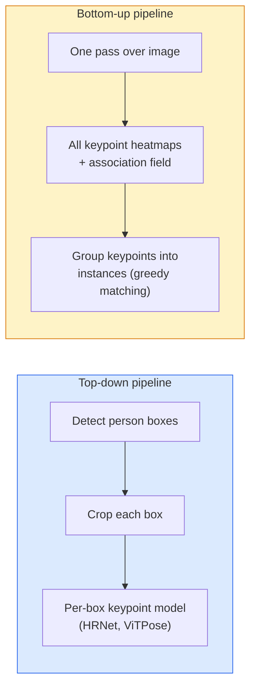

# 21 · 关键点检测与姿态估计

> 姿态是一组有序的关键点。关键点检测器就是一个热图回归器。其余的一切都只是记账工作。

**类型：** 实战构建（Build）
**语言：** Python
**前置：** 第 4 阶段第 06 课（目标检测），第 4 阶段第 07 课（U-Net）
**时长：** 约 45 分钟

## 学习目标

- 区分自顶向下（top-down）与自底向上（bottom-up）两种姿态估计方法，并说明各自的适用场景
- 为 K 个关键点回归热图（heatmap），采用「每个关键点一个高斯分布」的目标，并在推理时提取关键点坐标
- 解释部位亲和场（Part Affinity Fields, PAFs），以及自底向上流水线如何将关键点关联到各个实例
- 使用 MediaPipe Pose 或 MMPose 进行生产级关键点估计，并理解它们的输出格式

## 问题所在

关键点任务隐藏在许多名目之下：人体姿态（17 个身体关节）、人脸关键点（68 或 478 个点）、手部（21 个点）、动物姿态、机器人物体姿态、医学解剖标志点。它们全都共享同一种结构：在物体上检测 K 个离散点，并输出它们的 (x, y) 坐标。

姿态估计是动作捕捉、健身应用、运动分析、手势控制、动画、AR 试穿以及机器人抓取的基础。二维（2D）情形已经成熟；三维（3D）姿态（从单个相机估计世界坐标系下的关节位置）则是当前研究的前沿。

工程层面的关键问题是规模。单张图像、单人姿态是一个 20ms 级别的问题。而在 30 fps 下处理人群中的多人姿态，则是一个完全不同的问题，需要不同的架构。

## 核心概念

### 自顶向下 vs 自底向上



- **自顶向下** —— 先检测出人，再对每个裁剪框运行一个针对单人的关键点模型。精度最高；耗时随人数线性增长。
- **自底向上** —— 一次前向传播预测出所有关键点以及一个关联场（association field），然后再分组。耗时恒定，与人群规模无关。

自顶向下方法（HRNet、ViTPose）是精度的领跑者；自底向上方法（OpenPose、HigherHRNet）则是拥挤场景下吞吐量的领跑者。

### 热图回归

与其直接回归 `(x, y)`，不如为每个关键点预测一张 `H x W` 的热图，热图上以真实位置为中心放置一个高斯斑点（Gaussian blob）。

```
target[k, y, x] = exp(-((x - cx_k)^2 + (y - cy_k)^2) / (2 sigma^2))
```

推理时，每张热图的 argmax 即为预测的关键点位置。

为什么热图比直接回归效果更好：网络的空间结构（卷积特征图）天然地与空间输出对齐。高斯目标还起到了正则化作用 —— 微小的定位误差只会产生微小的损失，而不是为零。

### 亚像素定位

argmax 给出的是整数坐标。若要获得亚像素精度，可以对 argmax 及其相邻点拟合一条抛物线来进行细化，或者使用众所周知的偏移方向 `(dx, dy) = 0.25 * (heatmap[y, x+1] - heatmap[y, x-1], ...)`。

### 部位亲和场（PAFs）

这是 OpenPose 用于自底向上关联的技巧。对于每一对相连的关键点（例如左肩到左肘），预测一个 2 通道的场，该场编码了从一个点指向另一个点的单位向量。要将某个肩部与其对应的肘部关联起来，就沿着连接候选点对的连线对 PAF 做积分；积分值最高的那一对即被匹配。

```
For each connection (limb):
  PAF channels: 2 (unit vector x, y)
  Line integral: sum over sample points of (PAF . line_direction)
  Higher integral = stronger match
```

优雅，且能扩展到任意规模的人群，而无需为每个人单独裁剪。

### COCO 关键点

标准的人体姿态数据集：每人 17 个关键点，以 PCK（正确关键点百分比，Percentage of Correct Keypoints）和 OKS（物体关键点相似度，Object Keypoint Similarity）作为指标。OKS 是关键点领域对 IoU 的类比，也正是 COCO mAP@OKS 所报告的内容。

### 2D vs 3D

- **2D 姿态** —— 图像坐标；已达到生产质量（MediaPipe、HRNet、ViTPose）。
- **3D 姿态** —— 世界 / 相机坐标；仍是活跃的研究方向。常见做法：
  - 用一个小型 MLP 将 2D 预测「抬升」到 3D（VideoPose3D）。
  - 从图像直接回归 3D（PyMAF、MHFormer）。
  - 多视角配置（CMU Panoptic）以获取真值标注。

## 动手构建

### 第 1 步：高斯热图目标

```python
import numpy as np
import torch

def gaussian_heatmap(size, cx, cy, sigma=2.0):
    yy, xx = np.meshgrid(np.arange(size), np.arange(size), indexing="ij")
    return np.exp(-((xx - cx) ** 2 + (yy - cy) ** 2) / (2 * sigma ** 2)).astype(np.float32)

hm = gaussian_heatmap(64, 32, 32, sigma=2.0)
print(f"peak: {hm.max():.3f} at ({hm.argmax() % 64}, {hm.argmax() // 64})")
```

将每个关键点的热图沿通道轴堆叠起来，就得到完整的目标张量。

### 第 2 步：微型关键点头

一个 U-Net 风格的模型，输出 K 个热图通道。

```python
import torch.nn as nn
import torch.nn.functional as F

class TinyKeypointNet(nn.Module):
    def __init__(self, num_keypoints=4, base=16):
        super().__init__()
        self.down1 = nn.Sequential(nn.Conv2d(3, base, 3, 2, 1), nn.ReLU(inplace=True))
        self.down2 = nn.Sequential(nn.Conv2d(base, base * 2, 3, 2, 1), nn.ReLU(inplace=True))
        self.mid = nn.Sequential(nn.Conv2d(base * 2, base * 2, 3, 1, 1), nn.ReLU(inplace=True))
        self.up1 = nn.ConvTranspose2d(base * 2, base, 2, 2)
        self.up2 = nn.ConvTranspose2d(base, num_keypoints, 2, 2)

    def forward(self, x):
        h1 = self.down1(x)
        h2 = self.down2(h1)
        h3 = self.mid(h2)
        u1 = self.up1(h3)
        return self.up2(u1)
```

输入 `(N, 3, H, W)`，输出 `(N, K, H, W)`。损失为对高斯目标的逐像素 MSE。

### 第 3 步：推理 —— 提取关键点坐标

```python
def heatmap_to_coords(heatmaps):
    """
    heatmaps: (N, K, H, W)
    returns:  (N, K, 2) 以图像像素为单位的浮点坐标
    """
    N, K, H, W = heatmaps.shape
    hm = heatmaps.reshape(N, K, -1)
    idx = hm.argmax(dim=-1)
    ys = (idx // W).float()
    xs = (idx % W).float()
    return torch.stack([xs, ys], dim=-1)

coords = heatmap_to_coords(torch.randn(2, 4, 32, 32))
print(f"coords: {coords.shape}")  # (2, 4, 2)
```

推理只需一行。若要做亚像素细化，则在 argmax 周围进行插值。

### 第 4 步：合成关键点数据集

很简单：在白色画布上画四个点，然后学会预测它们。

```python
def make_synthetic_sample(size=64):
    img = np.ones((3, size, size), dtype=np.float32)
    rng = np.random.default_rng()
    kps = rng.integers(8, size - 8, size=(4, 2))
    for cx, cy in kps:
        img[:, cy - 2:cy + 2, cx - 2:cx + 2] = 0.0
    hms = np.stack([gaussian_heatmap(size, cx, cy) for cx, cy in kps])
    return img, hms, kps
```

足够简单，微型模型一分钟内就能学会。

### 第 5 步：训练

```python
model = TinyKeypointNet(num_keypoints=4)
opt = torch.optim.Adam(model.parameters(), lr=3e-3)

for step in range(200):
    batch = [make_synthetic_sample() for _ in range(16)]
    imgs = torch.from_numpy(np.stack([b[0] for b in batch]))
    hms = torch.from_numpy(np.stack([b[1] for b in batch]))
    pred = model(imgs)
    # 将 pred 上采样到完整分辨率
    pred = F.interpolate(pred, size=hms.shape[-2:], mode="bilinear", align_corners=False)
    loss = F.mse_loss(pred, hms)
    opt.zero_grad(); loss.backward(); opt.step()
```

## 实战应用

- **MediaPipe Pose** —— Google 的生产级姿态估计器；提供 WebGL 与移动端运行时，延迟低于 10ms。
- **MMPose**（OpenMMLab）—— 全面的研究代码库；涵盖每一种 SOTA 架构并附带预训练权重。
- **YOLOv8-pose** —— 最快的实时多人姿态估计，单次前向传播即可完成。
- **transformers HumanDPT / PoseAnything** —— 更新的视觉-语言方法，用于开放词汇姿态估计（任意物体、任意关键点集合）。

## 交付成果

本课产出：

- `outputs/prompt-pose-stack-picker.md` —— 一个提示词，给定延迟、人群规模以及 2D 还是 3D 的需求，从中挑选 MediaPipe / YOLOv8-pose / HRNet / ViTPose。
- `outputs/skill-heatmap-to-coords.md` —— 一个技能，用于编写每个生产级姿态模型都会用到的亚像素「热图到坐标」例程。

## 练习

1. **（简单）** 在合成的 4 点数据集上训练这个微型关键点模型。报告训练 200 步后预测关键点与真实关键点之间的平均 L2 误差。
2. **（中等）** 加入亚像素细化：给定 argmax 位置，沿 x 和 y 方向用相邻像素拟合一条一维抛物线。报告相对于整数 argmax 的精度提升。
3. **（困难）** 构建一个 2 人合成数据集，每张图像中都出现两个 4 关键点模式的实例。训练一个带 PAFs 的自底向上流水线，预测每个关键点属于哪个实例，并评估 OKS。

## 关键术语

| 术语 | 人们口中的说法 | 实际含义 |
|------|----------------|----------------------|
| Keypoint（关键点） | "一个标志点" | 物体上某个特定的有序点（关节、角点、特征点） |
| Pose（姿态） | "骨架" | 属于同一个实例的一组有序关键点 |
| Top-down（自顶向下） | "先检测再估姿态" | 两阶段流水线：人体检测器 + 针对每个裁剪框的关键点模型；精度最高 |
| Bottom-up（自底向上） | "先估姿态，后分组" | 单次预测所有关键点 + 分组；耗时恒定，与人群规模无关 |
| Heatmap（热图） | "高斯目标" | 每个关键点对应一张 H x W 张量，峰值位于真实位置；首选的回归目标 |
| PAF | "部位亲和场" | 编码肢体方向的 2 通道单位向量场；用于将关键点分组成实例 |
| OKS | "关键点 IoU" | 物体关键点相似度；COCO 用于姿态评估的指标 |
| HRNet | "高分辨率网络" | 占主导地位的自顶向下关键点架构；全程保持高分辨率特征 |

## 延伸阅读

- [OpenPose (Cao et al., 2017)](https://arxiv.org/abs/1812.08008) —— 基于 PAFs 的自底向上方法；至今仍是对该方法最好的论述
- [HRNet (Sun et al., 2019)](https://arxiv.org/abs/1902.09212) —— 自顶向下的参考架构
- [ViTPose (Xu et al., 2022)](https://arxiv.org/abs/2204.12484) —— 以朴素 ViT 作为姿态主干网络；在许多基准上是当前 SOTA
- [MediaPipe Pose](https://developers.google.com/mediapipe/solutions/vision/pose_landmarker) —— 生产级实时姿态估计；2026 年部署最快的技术栈
