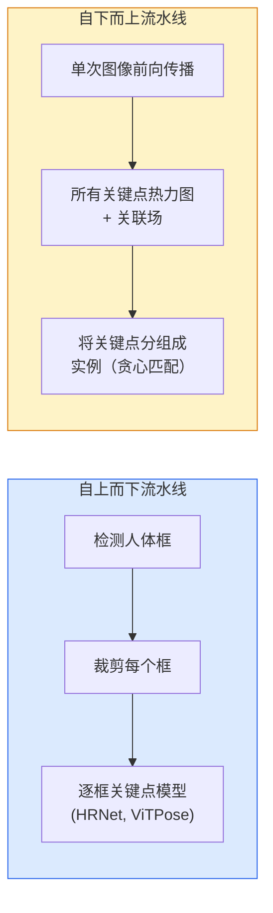

# 关键点检测与姿态估计

> 姿态（Pose）是一组有序的关键点（Keypoints）。关键点检测器本质上是热力图（Heatmap）回归器，其余都是辅助性工作。

**类型：** 构建  
**语言：** Python  
**前置知识：** 第四阶段第六课（检测），第四阶段第七课（U-Net）  
**时间：** 约45分钟

## 学习目标

- 区分自上而下（Top-down）和自下而上（Bottom-up）姿态估计，并说明各自的适用场景  
- 为K个关键点回归热力图，每个关键点对应一个高斯（Gaussian）目标，并在推理时提取关键点坐标  
- 解释部分亲和场（Part Affinity Fields, PAFs）以及自下而上流水线如何将关键点关联成实例  
- 使用MediaPipe Pose或MMPose进行生产级关键点估计，并理解其输出格式

## 问题

关键点任务有多种名称：人体姿态（17个身体关节点）、面部特征点（68或478个点）、手部（21个点）、动物姿态、机器人物体姿态、医学解剖标志点。它们都共享相同的结构：检测物体上的K个离散点，并输出它们的(x, y)坐标。

姿态估计是动作捕捉、健身应用、体育分析、手势控制、动画、AR试穿和机器人抓取的基础。2D姿态估计已成熟；3D姿态（从单个相机估计世界坐标中的关节点位置）是当前的研究前沿。

工程问题在于规模。单图单人姿态是一个20ms的问题。在30fps下的人群多人体姿态则是一个完全不同的问题，需要不同的架构。

## 概念

### 自上而下 vs 自下而上



- **自上而下（Top-down）** — 先检测人，然后在每个裁剪区域上运行逐人关键点模型。精度最高；计算量随人数线性增长。
- **自下而上（Bottom-up）** — 一次前向传播预测所有关键点及关联场；然后分组。计算时间与人群规模无关。

自上而下（HRNet, ViTPose）是精度领先者；自下而上（OpenPose, HigherHRNet）是密集场景的吞吐量领先者。

### 热力图回归

不直接回归(x, y)，而是为每个关键点预测一个H×W的热力图，图中以真实位置为中心放置一个高斯（Gaussian）斑点。

```
target[k, y, x] = exp(-((x - cx_k)^2 + (y - cy_k)^2) / (2 * sigma^2))
```

推理时，每张热力图的argmax即为预测的关键点位置。

为什么热力图比直接回归更好：网络的空间结构（卷积特征图）自然地与空间输出对齐。高斯目标还具有正则化作用——小的定位误差只会产生小损失，而不是零损失。

### 亚像素定位

Argmax给出整数坐标。为获得亚像素精度，可通过拟合argmax及其相邻点的抛物线进行细化，或使用众所周知的偏移方向 (dx, dy) = 0.25 * (heatmap[y, x+1] - heatmap[y, x-1], ...)。

### 部分亲和场（PAFs）

OpenPose用于自下而上关联的技巧。对于每对相连的关键点（例如左肩到左肘），预测一个2通道的场，该场编码从一个关键点指向另一个关键点的单位向量。为将肩部与肘部关联起来，沿着连接候选对的直线积分PAF；积分最高的候选对即为匹配。

```
对于每个连接（肢体）：
  PAF通道：2（单位向量x, y）
  直线积分：采样点上的 (PAF . 直线方向) 之和
  积分越高 = 匹配越强
```

优雅且可扩展到任意人群规模，无需逐人裁剪。

### COCO关键点

标准的人体姿态数据集：每人17个关键点，评估指标为正确关键点百分比（PCK）和物体关键点相似度（OKS）。OKS是关键点的IoU类似物，也是COCO mAP@OKS报告的内容。

### 2D vs 3D

- **2D姿态** — 图像坐标；已实现生产级质量（MediaPipe, HRNet, ViTPose）。
- **3D姿态** — 世界/相机坐标；仍处于活跃研究中。常见方法：
  - 使用小型MLP将2D预测提升到3D（VideoPose3D）。
  - 从图像直接回归3D（PyMAF, MHFormer）。
  - 多视角设置（CMU Panoptic）用于获取真值。

## 构建

### 第一步：高斯热力图目标

```python
import numpy as np
import torch

def gaussian_heatmap(size, cx, cy, sigma=2.0):
    yy, xx = np.meshgrid(np.arange(size), np.arange(size), indexing="ij")
    return np.exp(-((xx - cx) ** 2 + (yy - cy) ** 2) / (2 * sigma ** 2)).astype(np.float32)

hm = gaussian_heatmap(64, 32, 32, sigma=2.0)
print(f"峰值: {hm.max():.3f} 位置: ({hm.argmax() % 64}, {hm.argmax() // 64})")
```

每个关键点的热力图沿通道轴堆叠，构成完整的目标张量。

### 第二步：微型关键点头

一个U-Net风格的模型，输出K个热力图通道。

```python
import torch.nn as nn
import torch.nn.functional as F

class TinyKeypointNet(nn.Module):
    def __init__(self, num_keypoints=4, base=16):
        super().__init__()
        self.down1 = nn.Sequential(nn.Conv2d(3, base, 3, 2, 1), nn.ReLU(inplace=True))
        self.down2 = nn.Sequential(nn.Conv2d(base, base * 2, 3, 2, 1), nn.ReLU(inplace=True))
        self.mid = nn.Sequential(nn.Conv2d(base * 2, base * 2, 3, 1, 1), nn.ReLU(inplace=True))
        self.up1 = nn.ConvTranspose2d(base * 2, base, 2, 2)
        self.up2 = nn.ConvTranspose2d(base, num_keypoints, 2, 2)

    def forward(self, x):
        h1 = self.down1(x)
        h2 = self.down2(h1)
        h3 = self.mid(h2)
        u1 = self.up1(h3)
        return self.up2(u1)
```

输入 `(N, 3, H, W)`，输出 `(N, K, H, W)`。损失为逐像素MSE（均方误差），与高斯目标计算。

### 第三步：推理——提取关键点坐标

```python
def heatmap_to_coords(heatmaps):
    """
    heatmaps: (N, K, H, W)
    returns:  (N, K, 2) 浮点坐标, 单位为图像像素
    """
    N, K, H, W = heatmaps.shape
    hm = heatmaps.reshape(N, K, -1)
    idx = hm.argmax(dim=-1)
    ys = (idx // W).float()
    xs = (idx % W).float()
    return torch.stack([xs, ys], dim=-1)

coords = heatmap_to_coords(torch.randn(2, 4, 32, 32))
print(f"坐标形状: {coords.shape}")  # (2, 4, 2)
```

推理时只需一行。如需亚像素细化，可在argmax周围插值。

### 第四步：合成关键点数据集

简单做法：在白色画布上绘制四个点，并学习预测它们。

```python
def make_synthetic_sample(size=64):
    img = np.ones((3, size, size), dtype=np.float32)
    rng = np.random.default_rng()
    kps = rng.integers(8, size - 8, size=(4, 2))
    for cx, cy in kps:
        img[:, cy - 2:cy + 2, cx - 2:cx + 2] = 0.0
    hms = np.stack([gaussian_heatmap(size, cx, cy) for cx, cy in kps])
    return img, hms, kps
```

足够简单，小型模型可在一分钟内学会。

### 第五步：训练

```python
model = TinyKeypointNet(num_keypoints=4)
opt = torch.optim.Adam(model.parameters(), lr=3e-3)

for step in range(200):
    batch = [make_synthetic_sample() for _ in range(16)]
    imgs = torch.from_numpy(np.stack([b[0] for b in batch]))
    hms = torch.from_numpy(np.stack([b[1] for b in batch]))
    pred = model(imgs)
    # 将pred上采样到完整分辨率
    pred = F.interpolate(pred, size=hms.shape[-2:], mode="bilinear", align_corners=False)
    loss = F.mse_loss(pred, hms)
    opt.zero_grad(); loss.backward(); opt.step()
```

## 使用

- **MediaPipe Pose** — 谷歌的生产级姿态估计器；提供WebGL + 移动端运行时，延迟低于10ms。
- **MMPose**（OpenMMLab） — 全面的研究代码库；包含所有SOTA架构及预训练权重。
- **YOLOv8-pose** — 最快的实时多人体姿态估计，单次前向传播即可。
- **transformers HumanDPT / PoseAnything** — 较新的视觉-语言方法，用于开放词汇姿态（任意物体，任意关键点集）。

## 交付

本课程产出：

- `outputs/prompt-pose-stack-picker.md` — 一个提示，根据延迟、人群规模、2D/3D需求，选择MediaPipe / YOLOv8-pose / HRNet / ViTPose。
- `outputs/skill-heatmap-to-coords.md` — 一个技能，编写用于所有生产级姿态模型的亚像素热力图转坐标例程。

## 练习

1. **(简单)** 在合成的4点数据集上训练微型关键点模型。报告200步后预测与真值关键点的平均L2误差。
2. **(中等)** 添加亚像素细化：在argmax位置，从相邻像素沿x和y方向拟合一维抛物线。报告与整数argmax相比的精度提升。
3. **(困难)** 构建一个2人合成数据集，每张图像显示两个4关键点模式的实例。训练一个包含PAF的自下而上流水线，预测每个关键点属于哪个实例，并评估OKS。

## 关键术语

| 术语 | 人们常说的 | 实际含义 |
|------|------------|----------|
| 关键点 | "一个特征点" | 物体上的一个特定有序点（关节点、角点、特征点） |
| 姿态 | "骨架" | 属于一个实例的一组有序关键点 |
| 自上而下 | "先检测再姿态" | 两阶段流水线：人体检测器 + 逐裁剪区域关键点模型；精度最高 |
| 自下而上 | "先姿态后分组" | 单次全关键点预测 + 分组；计算时间与人群规模无关 |
| 热力图 | "高斯目标" | 每个关键点一个H×W的张量，峰值位于真实位置；是首选的回归目标 |
| PAF | "部分亲和场" | 2通道单位向量场，编码肢体方向；用于将关键点分组为实例 |
| OKS | "关键点IoU" | 物体关键点相似度；COCO姿态评估指标 |
| HRNet | "高分辨率网络" | 主导的自上而下关键点架构；全程保持高分辨率特征 |

## 扩展阅读

- [OpenPose (Cao et al., 2017)](https://arxiv.org/abs/1812.08008) — 使用PAF的自下而上方法；仍是该方法的最佳阐述。
- [HRNet (Sun et al., 2019)](https://arxiv.org/abs/1902.09212) — 自上而下的参考架构。
- [ViTPose (Xu et al., 2022)](https://arxiv.org/abs/2204.12484) — 纯ViT作为姿态主干网络；当前许多基准的SOTA。
- [MediaPipe Pose](https://developers.google.com/mediapipe/solutions/vision/pose_landmarker) — 生产级实时姿态；2026年最快的已部署方案。